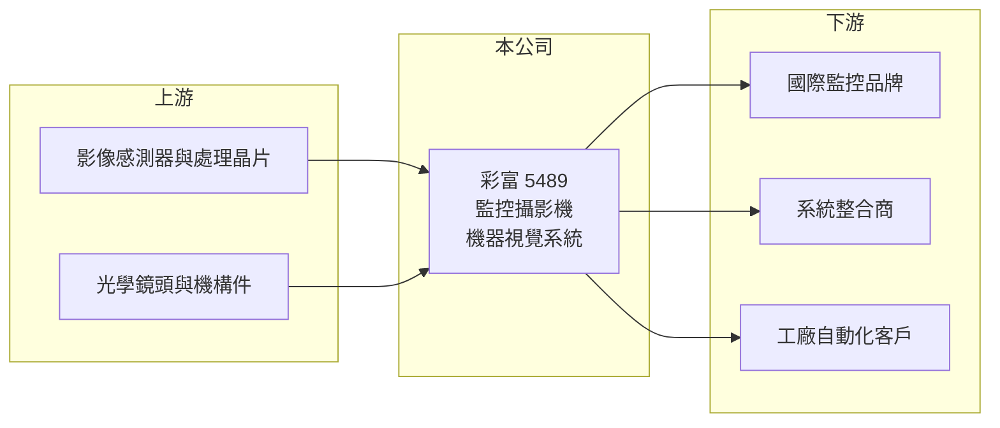

# 5489 彩富

> 上櫃｜[[產業索引-其他電子業|其他電子業]]｜上市（櫃）日期 2001/03/12

# 第一章：企業模式與商業藍圖

> [!info] 撰寫說明
> 精簡版，由 Claude 依公開資料整理，架構比照 [[2330台積電]]，資料截至 2026-10-07。來源：nStock 彩富公司簡介與財務摘要、winvest 營收快訊。公開資料有限，產品與客戶結構未逐條比對原始文件。#待校對

彩富電子是安全監控與[[機器視覺]]系統的設計製造商，2026 年營收維持兩位數年增。

- **核心業務：** 安全監控及機器視覺系統之設計、裝配、製造、買賣及修護，主要產品推估為監控攝影機（含[[IP攝影機]]）與工業用影像設備。
- **營收結構：** 本次未查到監控與機器視覺的營收比重，2025 年全年營收 16.88 億元。
- **營運據點：** 公司 1991 年 7 月成立，掛牌約 25 年，生產據點明細本次未查到。
- **長期方向：** 監控設備走向網路化與影像分析，機器視覺則受惠工廠自動化，兩者都是彩富可延伸的方向（推估）。

# 第二章：護城河深度與競爭優勢

彩富的優勢在影像產品的設計與製造經驗，但市場價格競爭激烈。

- **競爭優勢：** 監控設備須通過各國安規與資安要求，長期合作的品牌客戶轉換成本較高；彩富以 [[ODM]] 模式為品牌客戶設計製造（推估）。
- **主要對手：** 台灣監控同業如 3454晶睿、[[3356奇偶]]、[[8072陞泰]]，以及中國海康威視、大華等大廠。
- **觀察重點：** 2026 年 5 至 8 月營收年增率維持在 14% 至 18%，觀察成長是否來自非中國供應鏈需求的轉單。

# 第三章：財務體質與盈利規模

資料日期：2026-10-07，以下數字是撰寫當時的快照；最新月營收、毛利率、累計 EPS 由自動排程寫在本筆記的屬性欄位（月營收、毛利率、累計EPS 等）。#待校對

彩富營收穩定成長，毛利率約三成，並長期維持配息。

- **營收規模：** 2026 年 8 月營收 1.68 億元，年增 17.54%；1 至 8 月累計 12.57 億元，2025 年全年 16.88 億元。
- **獲利：** 2026 年第二季 EPS 0.45 元，[[毛利率]] 30.06%、[[營業利益率]] 8.9%；2025 年全年 EPS 2.01 元。
- **財務特色：** 資本額 10.27 億元，近五年平均現金股利 1.38 元、平均[[殖利率]] 3.36%。

# 第四章：總體風險與地緣政治

彩富的風險來自產業價格競爭與客戶集中。

- **產業週期：** 監控設備需求跟隨商用與公共建設投資，景氣轉弱時專案延後，品牌客戶會調整庫存。
- **營運風險：** ODM 業務營收常集中在少數品牌客戶，單一客戶轉單影響大（推估）。
- **其他風險：** 各國對中國監控設備的禁用規定可能帶來轉單機會，但法規變動也增加認證成本；匯率波動影響外銷毛利。

# 專有名詞解析

## 應用

- **[[IP攝影機]]**：透過網路傳輸影像的監控攝影機，可直接接上網路交換器，不必經過類比線路與錄影主機。
- **[[機器視覺]]**：以相機與影像演算法讓機器辨識物體與檢測瑕疵，廣泛用於工廠自動化與檢測設備。

## 金融

- **[[殖利率]]**：每年現金股利除以股價，用來衡量配息報酬。

## 產業

- **[[ODM]]**：原廠委託設計製造，代工廠除了生產也負責產品設計，品牌商只提出規格，廣達、緯穎屬此類。

# 核心供應鏈

- 上游：影像感測器、影像處理晶片、光學鏡頭與機構件供應商（推估）
- 下游／客戶：國際監控品牌、安控系統整合商、工廠自動化客戶（推估）
- 同業：3454晶睿、[[3356奇偶]]、[[8072陞泰]]

## 最新新聞
<!-- news:start -->
<!-- news:end -->

## 相關連結
- [公開資訊觀測站](https://mopsov.twse.com.tw/mops/web/t05st03?step=1&firstin=1&co_id=5489)
- [Goodinfo](https://goodinfo.tw/tw/StockDetail.asp?STOCK_ID=5489)
- [Yahoo 股市](https://tw.stock.yahoo.com/quote/5489)
- [鉅亨網新聞](https://www.cnyes.com/twstock/5489/news)
