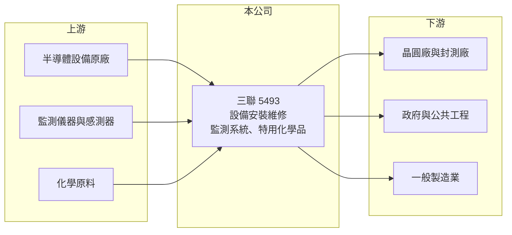

# 5493 三聯

> 上櫃｜[[產業索引-其他電子業|其他電子業]]｜上市（櫃）日期 2001/05/03

# 第一章：企業模式與商業藍圖

> [!info] 撰寫說明
> 精簡版，由 Claude 依公開資料整理，架構比照 [[2330台積電]]，資料截至 2026-10-07。來源：nStock 三聯公司簡介與財務摘要、winvest 營收快訊。公開資料有限，業務比重未查到。#待校對

三聯科技業務橫跨半導體整廠設備安裝、工廠自動化與環境監測，2026 年營收隨半導體擴廠明顯成長。

- **核心業務：** 營業項目包括半導體整廠設備安裝、買賣及維修，工廠自動化與環保設備，遙測、電力、海象與氣象監測系統，土木工程安全監測，以及特用化學品。
- **營收結構：** 本次未查到各業務營收比重，從營收隨晶圓廠擴產成長推估，半導體相關業務是主要動能。
- **營運據點：** 公司 1967 年 2 月成立，是歷史悠久的工程與設備公司，據點明細本次未查到。
- **長期方向：** 半導體設備裝機與[[廠務工程]]需求延續，搭配既有的監測系統業務分散景氣風險（推估）。

# 第二章：護城河深度與競爭優勢

三聯的優勢在跨領域的工程經驗與長期累積的客戶關係。

- **競爭優勢：** 半導體設備安裝需要熟悉機台規格與晶圓廠作業規範，具實績的團隊不易被取代（推估）。
- **主要對手：** 半導體設備安裝與廠務同業如 [[3583辛耘]]、[[6196帆宣]]，監測系統則面對國內外儀器商。
- **觀察重點：** 2026 年 8 月營收年增 44.53%，觀察高成長能否在晶圓廠擴產高峰後延續。

# 第三章：財務體質與盈利規模

資料日期：2026-10-07，以下數字是撰寫當時的快照；最新月營收、毛利率、累計 EPS 由自動排程寫在本筆記的屬性欄位（月營收、毛利率、累計EPS 等）。#待校對

三聯營收規模成長，但毛利率偏低，屬於工程與代理型的獲利結構。

- **營收規模：** 2026 年 8 月營收 6.51 億元，月增 18.82%、年增 44.53%；1 至 8 月累計 42.85 億元，年增 21.51%。
- **獲利：** 2026 年上半年 EPS 2.76 元，年增 12.78%，其中第二季 1.5 元；第二季[[毛利率]] 12.2%、[[營業利益率]] 7.12%。
- **財務特色：** 第二季淨利率 8.3% 高於營業利益率，代表有一部分獲利來自[[業外收益]]；2025 年配發現金股利 2.7 元。

# 第四章：總體風險與地緣政治

三聯的風險在半導體資本支出循環與工程執行。

- **產業週期：** 設備安裝營收跟隨晶圓廠建廠與擴產節奏，客戶[[CapEx]] 下修時營收可能快速回落。
- **營運風險：** 工程與裝機業務若人力吃緊或工期延誤，毛利率容易受壓。
- **其他風險：** 監測系統多承接政府與公共工程標案，預算與法規變動會影響接案量。

# 專有名詞解析

## 金融

- **[[業外收益]]**：本業以外的收入，例如投資收益、匯兌利益、處分資產利益，持續性通常低於本業。
- **[[CapEx]]**：資本支出，企業購買廠房、設備等長期資產的支出。

## 產業

- **[[廠務工程]]**：晶圓廠與工廠的水、氣、化學品供應及排放等基礎設施工程。

# 核心供應鏈

- 上游：半導體設備原廠、監測儀器與感測器供應商、化學原料商（推估）
- 下游／客戶：晶圓廠與封測廠、政府與公共工程單位、一般製造業（推估）
- 同業：[[3583辛耘]]、[[6196帆宣]]

## 最新新聞
<!-- news:start -->
<!-- news:end -->

## 相關連結
- [公開資訊觀測站](https://mopsov.twse.com.tw/mops/web/t05st03?step=1&firstin=1&co_id=5493)
- [Goodinfo](https://goodinfo.tw/tw/StockDetail.asp?STOCK_ID=5493)
- [Yahoo 股市](https://tw.stock.yahoo.com/quote/5493)
- [鉅亨網新聞](https://www.cnyes.com/twstock/5493/news)
