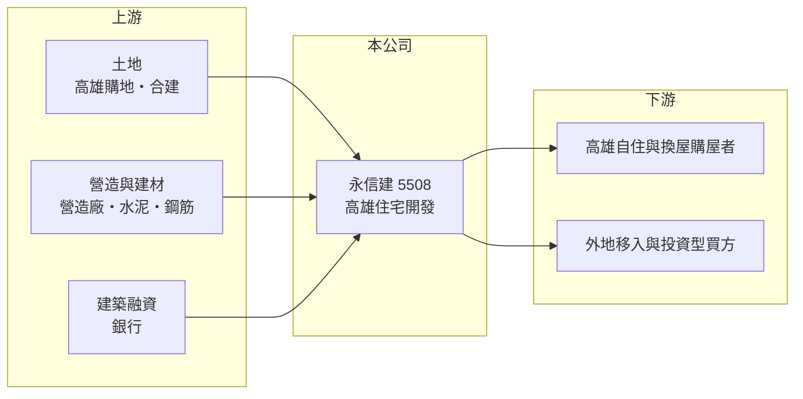

# 5508 永信建

> 上櫃｜[[產業索引-建材營造業|建材營造業]]｜上市（櫃）日期 1998/05/13

# 第一章：企業模式與商業藍圖

> [!info] 撰寫說明
> 本文由 Claude 依公開資料整理，架構比照 [[2330台積電]] 的四章研究，資料截至 2026-10-08。財務數字來源：MoneyDJ 理財網年度財務比率與損益表（2025 年為合併報表、之前為個別報表）、櫃買中心開放資料（基本資料、2026 年第二季財報、本益比殖利率）；業務描述參考 Yahoo 股市、聯合新聞網、旺得富（中時）的新聞標題。公開資料有限，個別建案內容未逐案查證。#待校對

在評估一家建商的長期價值時，第一步是看懂它的獲利率為什麼能高於同業。本章針對永信建設開發（股票代號：5508，以下簡稱永信建）的商業模式進行定性分析，說明一家高雄建商如何在 2021 至 2024 年交出四成以上的營業利益率，以及這種高獲利能否延續。

## 一、核心定位：高雄的高毛利住宅建商

永信建成立於 1987 年，1998 年在櫃買中心掛牌，總部位於高雄市六合路，董事長兼總經理為陳俊銘，實收資本額約 21.7 億元。公司以高雄地區的住宅開發與銷售為主，在高雄建商中以高毛利與高配息聞名。

* **獲利率遠高於同業：** 2021 至 2024 年[[毛利率]]在 43% 至 51% 之間，營業利益率在 37% 至 46% 之間，2024 年 EPS 達 16.03 元。多數建商的毛利率在兩到三成，永信建的獲利率幾乎是同業的兩倍。
* **營收在交屋時認列：** 和所有建商一樣，永信建採[[建案交屋]]認列營收。2024 年營收約 100 億元，2025 年降到約 25.3 億元，依新聞標題，第七波[[信用管制]]對營運造成影響。

## 二、資本轉化邏輯：早期低價取得土地、在房價上漲後交屋

* **土地成本是毛利的來源：** 建商的毛利率主要取決於土地取得成本與交屋時的售價。高雄房價在 2020 年後大幅上漲，若土地是在上漲前取得，交屋時的毛利率就會明顯高於市場平均。永信建的高毛利，很大部分可歸因於這種時間差（推估）。
* **高配息政策：** 依新聞標題，2024 年 EPS 16.03 元、配息 14.5 元，配息率超過九成。公司傾向把交屋獲利大部分發還股東，而不是大量保留盈餘擴張。

## 三、長期方向：在土地成本上升後維持獲利

永信建的長期課題是：當早期低成本土地逐步消化後，新取得的土地成本已反映高雄近年的漲幅，未來建案的毛利率能否維持在過去的水準。2025 年毛利率約 44%、2026 年上半年約 39%，仍明顯高於同業，但已低於 2022 年的 51% 高峰。

# 第二章：護城河深度與競爭優勢

護城河是企業抵禦競爭、長期維持超額利潤的機制。本章分析永信建在高雄市場的競爭優勢、主要對手，以及高獲利能守住多少。

## 一、永信建護城河的核心組成要素

* **1. 選地與購地時機：** 高毛利的核心是在對的時間、以對的價格買進土地。公司長期在高雄經營，對各區發展與土地行情有深入掌握。
* **2. 在地品牌與口碑：** 高雄購屋者對在地老牌建商的信任度高，品牌口碑有助於預售去化與售價。
* **3. 費用控制：** 毛利率與營業利益率之間的差距只有約 5 至 10 個百分點，代表銷管費用相對營收很低，組織精簡。

## 二、主要競爭對手格局

| 對手 | 定位 | 對永信建的威脅 |
|---|---|---|
| [[2524京城]] | 高雄在地大型建商 | 在高雄精華區直接競爭 |
| [[4113聯上]] | 高雄住宅建商 | 同區域搶地搶客 |
| [[2542興富發]] | 全台大型建商，南部案量大 | 規模與融資成本優勢 |
| [[3521台鋼建設]] | 台鋼集團旗下新進建商 | 集團資源支持，未來可能加入高雄土地競爭 |

## 三、優勢轉化：哪些守得住、哪些守不住

* **守得住：** 已在手土地的成本優勢，以及精簡組織帶來的低費用率，使永信建在同樣售價下能比同業賺更多。
* **守不住：** 土地成本優勢會隨舊土地消化而消失，新土地的毛利率可能向同業靠攏。2025 年交屋量下降也顯示，高獲利不等於穩定獲利。
* **觀察重點：** 第一，新取得土地的成本與推案毛利率；第二，[[已售未入帳]]金額與交屋節奏；第三，高配息政策能否在交屋淡年維持。

# 第三章：財務體質與盈利規模

資料日期：2026-10-08。數字取自 MoneyDJ 理財網年度財務資料與櫃買中心開放資料，表格是撰寫當時的快照；最新月營收、毛利率、累計 EPS 由自動排程寫在本筆記的屬性欄位（月營收、毛利率、累計EPS 等）。#待校對

財務報表是檢驗護城河是否真實存在的最終標準。本章用五年的三率、ROE、股利與資本報酬，檢視永信建的獲利品質。

## 一、獲利能力的基石：三率

| 年度 | 營收（新台幣） | [[毛利率]] | [[營業利益率]] | EPS（元） | [[ROE]] |
|---|---|---|---|---|---|
| 2021 | 60.4 億 | 42.8% | 37.2% | 8.90 | 35.9% |
| 2022 | 41.3 億 | 51.3% | 45.7% | 7.05 | 26.0% |
| 2023 | 82.3 億 | 46.6% | 41.5% | 12.55 | 42.2% |
| 2024 | 100.4 億 | 48.1% | 43.4% | 16.03 | 45.6% |
| 2025 | 25.3 億 | 44.0% | 34.3% | 3.07 | 9.64% |

資料來源：MoneyDJ 理財網年度損益表與財務比率；2025 年為合併報表，2024 年以前為個別報表，比較時需留意口徑差異。2026 年上半年（櫃買中心資料）營收約 17.3 億元、毛利率約 39.3%、營業利益率約 30.3%、EPS 1.75 元。

2021 至 2024 年是永信建的黃金期，四年 EPS 合計約 44.5 元，ROE 平均約 37%，在台灣建商中屬於頂尖水準。2025 年交屋量下降，營收年減約 75%，ROE 降到 9.6%。往前看 2018 至 2020 年，毛利率約 28% 至 35%、EPS 2 至 3.7 元，代表 2021 年後的高獲利與高雄房價上漲週期高度相關。

## 二、營建業指標：推案量、已售未入帳與存貨

公司未公開完整的推案量與[[已售未入帳]]金額（未查得）。2026 年第二季底總資產約 193 億元，流動資產約 192 億元，主要是土地與在建房地；負債約 138 億元，負債比率約 72%，高於 2024 年底的 53%，推估與新購土地及在建工程的融資增加有關。

## 三、[[ROE]] 與股利

2021 至 2025 年平均 ROE 約 31.9%（推算）。股利政策是永信建最鮮明的特色：依新聞標題，2024 年度配息 14.5 元、配息率超過九成；依櫃買中心資料，最近一次現金股利約每股 2.78 元，相對 2025 年 EPS 3.07 元，配發率也約九成（推算）。高配發率代表股東能分享交屋獲利，但股利金額會隨交屋量大幅波動。

## 四、[[ROIC]] 與 [[WACC]]：價值創造利差

**ROIC 推算：** 2025 年營業利益約 8.69 億元，稅後約 6.95 億元。官方資料只揭露負債總計約 138 億元，假設其中六成為有息負債約 82.8 億元（推估），加上股東權益約 54.6 億元，投入資本約 137 億元，ROIC 約 5.1%（推算）；以 2021 至 2025 年平均營業利益約 25.5 億元計算，ROIC 約 14.9%（推算）。

**WACC 推算：** 台灣 10 年期公債殖利率取 1.75%、市場風險溢酬 6%、β 取營建同業常見值 0.9（未查得公司實際 β），股東權益成本約 7.2%。負債成本假設 3%，稅率 20%，稅後約 2.4%。權益約占投入資本 40%，WACC 約 4.3%（推算）。

**結論：** 以五年平均來看，永信建的 ROIC 約為 WACC 的三倍以上，是少數長期明顯創造價值的建商。即使在 2025 年交屋淡年，ROIC 仍略高於 WACC。未來能否延續，取決於新土地的成本能否維持毛利率優勢。

# 第四章：總體風險與地緣政治

任何企業都無法脫離宏觀環境獨立存在。本章分析永信建長期必須面對的房市週期、政策與營運風險。

## 一、產業週期與政策風險

* **高雄房價週期：** 永信建的高毛利與高雄房價上漲高度相關。若高雄房價進入盤整或修正，新建案的售價與毛利率都可能下滑。
* **[[信用管制]]：** 依新聞標題，第七波信用管制已對永信建的營運造成影響。管制同時限制買方貸款與建商融資，延長去化時間。
* **稅制：** 房地合一稅、囤房稅與預售屋轉售限制，會壓抑投資型買盤。

## 二、營運環境的隱性風險

* **土地成本上升：** 高雄土地價格近年大漲，加上外地與集團型建商進入，新土地的取得成本可能大幅提高。
* **營造成本：** 缺工與建材價格上漲，會壓縮已預售建案的毛利。
* **交屋集中：** 獲利集中在交屋年度，2025 年 EPS 由 16 元降到 3 元，顯示獲利波動很大。

## 三、財務風險

* **負債比率上升：** 負債比率由 2024 年的 53% 升到 2026 年第二季的約 72%，代表公司正在加碼土地與工程，房市轉冷時的壓力會增加。
* **高配息與資本需求的平衡：** 高配發率限制了保留盈餘，未來擴大推案時更依賴銀行融資。

# 專有名詞解析

## 金融

- **[[信用管制]]**：央行限制購屋與建商貸款成數的政策，會影響房市成交與建商資金。
- **[[ROIC]]**：投入資本報酬率，稅後營業利益除以股東權益加有息負債，衡量本業運用資本的效率。
- **[[WACC]]**：加權平均資金成本，股東與債權人要求報酬率的加權平均，是 ROIC 要超越的門檻。

## 產業

- **[[建案交屋]]**：建商在房屋完工並交付買方時才認列營收，因此營建公司的營收常集中在交屋年度。
- **[[已售未入帳]]**：已經賣出、但尚未完工交屋而未認列營收的建案金額，是建商未來營收的主要能見度指標。

# 核心供應鏈

## 1. 上游：土地、營造與資金
- 土地來源：高雄購地與合建
- 營造：外部發包營造廠（合作對象未查得）；建材如 [[1101台泥]]、[[2002中鋼]]
- 資金：銀行建築融資

## 2. 中游：永信建與同業
- 高雄同業：[[2524京城]]、[[4113聯上]]、[[2542興富發]]、[[3521台鋼建設]]

## 3. 下游：客戶
- 高雄自住、換屋、外地移入與投資型購屋者

## 最新新聞
<!-- news:start -->
<!-- news:end -->

## 相關連結
- [公開資訊觀測站](https://mopsov.twse.com.tw/mops/web/t05st03?step=1&firstin=1&co_id=5508)
- [Goodinfo](https://goodinfo.tw/tw/StockDetail.asp?STOCK_ID=5508)
- [Yahoo 股市](https://tw.stock.yahoo.com/quote/5508)
- [鉅亨網新聞](https://www.cnyes.com/twstock/5508/news)
