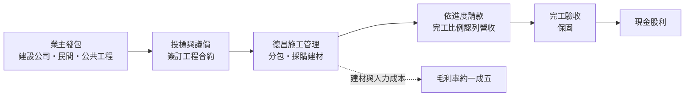
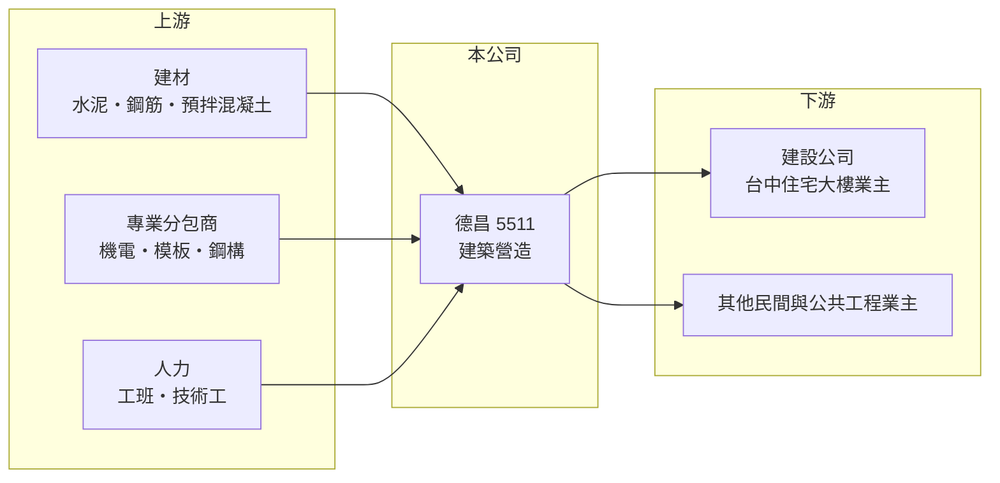

# 5511 德昌

> 上櫃｜[[產業索引-建材營造業|建材營造業]]｜上市（櫃）日期 1998/12/09

# 第一章：企業模式與商業藍圖

> [!info] 撰寫說明
> 本文由 Claude 依公開資料整理，架構比照 [[2330台積電]] 的四章研究，資料截至 2026-10-08。財務數字來源：MoneyDJ 理財網年度財務比率與損益表、櫃買中心開放資料（基本資料、2026 年第二季財報、本益比殖利率）；業務描述參考 nStock、科技新報公司資料頁、富果研究法說會頁面與營收速報的標題。公開資料有限，業主名單、在手訂單金額與工程類別比重未查得。#待校對

在評估一家公司的長期價值時，第一步是看懂它在產業鏈中扮演什麼角色。本章針對德昌營造（股票代號：5511，以下簡稱德昌）的商業模式進行定性分析。和本文涵蓋的其他建商不同，德昌的主業是營造：替業主蓋房子、收工程款，而不是自己買地賣房。

## 一、核心定位：台中的建築營造廠

德昌成立於 1986 年，1998 年在櫃買中心掛牌，總部位於台中市北區五權路，董事長為黃政勇，總經理為陳豐中，實收資本額約 13.6 億元。公司以承攬建築工程為主，業主包括建設公司的住宅大樓與其他民間或公共建築（類別比重未查得）。

* **營造與建設的差別：** 建設公司自己買地、承擔房價風險，獲利集中在交屋年度；營造廠則依合約向業主收取工程款，依施工進度以[[完工比例法]]認列營收。因此德昌的營收比建商平穩得多，2021 至 2025 年營收由 61.6 億元穩定成長到 110.8 億元。
* **毛利率較低但穩定：** 營造業的毛利率通常只有一成多，德昌 2021 至 2025 年毛利率約 13.6% 至 17.6%，遠低於建商，但年度之間的波動也小很多。

## 二、資本轉化邏輯：接案、施工、按進度收款

* **以[[在手訂單]]衡量前景：** 營造廠的未來營收取決於已簽約但尚未完工的工程金額。台中近年建案量大，住宅大樓的營造需求旺盛，是德昌營收成長的主要來源（推估）。
* **輕資本經營：** 營造廠不需要長期持有土地，2026 年第二季底總資產約 166 億元，負債約 92.8 億元，多數是應付工程款與預收款，負債比率約 51% 至 56%，明顯低於建商。

## 三、長期方向：受惠台中建設需求與規模擴大

台中是近十年全台人口與建案成長最快的都會區之一，在地營造廠的工程需求長期受惠。德昌營收在五年內接近翻倍，代表承攬規模持續擴大。長期關鍵在於能否在擴大規模的同時維持工程品質與毛利率，並在住宅建案之外累積更多元的工程類型，降低對單一市場的依賴。

# 第二章：護城河深度與競爭優勢

護城河是企業抵禦競爭、長期維持超額利潤的機制。營造業是高度競爭的產業，本章分析德昌的競爭優勢、主要對手，以及它能守住的位置。

## 一、德昌護城河的核心組成要素

* **1. 在地施工實績與業主關係：** 建設公司選擇營造廠時，最重視的是工期與品質。德昌在台中有數十年的施工實績，與在地建商建立長期合作，容易取得議價或指定承攬的機會。
* **2. 規模與財務實力：** 營收超過百億元、股東權益約 73 億元，足以提供大型工程所需的履約保證，也能在建材價格波動時承擔短期成本壓力。
* **3. 成本控管：** 營業利益率由 2021 年的 8.5% 提升到 2025 年的 13.2%，顯示規模擴大後的費用攤提與工程管理效率改善。

## 二、主要競爭對手格局

| 對手 | 定位 | 對德昌的威脅 |
|---|---|---|
| [[2597潤弘]] | 預鑄工法建築營造 | 在大型建築與廠房工程競爭 |
| [[3703欣陸]]（大陸工程） | 大型土木與建築營造 | 在大型公共與建築工程競爭 |
| [[2546根基]] | 建築營造 | 承攬住宅與商辦建築工程 |
| 台中在地營造廠 | 熟悉在地業主 | 在住宅大樓工程以價格競爭 |

## 三、優勢轉化：哪些守得住、哪些守不住

* **守得住：** 與在地建商的長期合作與施工口碑，使德昌在台中住宅大樓營造中保有穩定的案源。
* **守不住：** 營造業本質上是競標生意，毛利率天花板低；缺工與建材上漲時，固定總價合約的成本風險落在營造廠身上。
* **觀察重點：** 第一，在手訂單是否持續成長；第二，毛利率能否維持在 15% 以上；第三，台中建案量是否因房市轉冷而減少。

# 第三章：財務體質與盈利規模

資料日期：2026-10-08。數字取自 MoneyDJ 理財網年度財務資料與櫃買中心開放資料，表格是撰寫當時的快照；最新月營收、毛利率、累計 EPS 由自動排程寫在本筆記的屬性欄位（月營收、毛利率、累計EPS 等）。#待校對

財務報表是檢驗護城河是否真實存在的最終標準。本章用五年的三率、ROE、股利與資本報酬，檢視德昌的獲利品質。

## 一、獲利能力的基石：三率

| 年度 | 營收（新台幣） | [[毛利率]] | [[營業利益率]] | EPS（元） | [[ROE]] |
|---|---|---|---|---|---|
| 2021 | 61.6 億 | 13.7% | 8.52% | 4.15 | 10.0% |
| 2022 | 84.8 億 | 13.6% | 8.83% | 4.78 | 11.2% |
| 2023 | 104.6 億 | 16.5% | 12.5% | 10.14 | 20.7% |
| 2024 | 94.0 億 | 15.0% | 10.0% | 7.52 | 13.6% |
| 2025 | 110.8 億 | 17.6% | 13.2% | 10.64 | 18.0% |

資料來源：MoneyDJ 理財網年度損益表與財務比率。2026 年上半年（櫃買中心資料）營收約 53.5 億元、毛利率約 19.9%、營業利益率約 15.1%、EPS 5.53 元。

德昌是本文涵蓋的營建公司中獲利最穩定的一家：2018 至 2025 年每年都有獲利，營收只有 2020 與 2024 年下滑（分別約 2% 與 10%）。2021 至 2025 年營收年複合成長率約 15.8%（推算），毛利率與營業利益率同步提升，代表成長不是靠削價搶單。EPS 的歷年比較須留意股本可能因配股而變動。

## 二、營造業指標：在手訂單與營運資金

公司未公開完整的[[在手訂單]]金額（未查得）。2026 年第二季底流動資產約 139 億元、流動負債約 82.8 億元，流動比率約 1.7 倍，營運資金充足。保留盈餘約 56.7 億元，占股東權益的七成以上，顯示公司長期累積獲利、財務體質穩健。

## 三、[[ROE]] 與股利

2021 至 2025 年平均 ROE 約 14.7%（推算），2023 年後維持在 13% 以上。依櫃買中心資料，最近一次現金股利約每股 5.59 元，相對 2025 年 EPS 10.64 元，配發率約五成（推算），在配息與保留盈餘之間取得平衡。營造業的自由現金流與工程收款進度相關，完整的多年現金流資料未查得，但持續配息與保留盈餘增加，顯示營業現金流長期大致為正（推估）。

## 四、[[ROIC]] 與 [[WACC]]：價值創造利差

**ROIC 推算：** 2025 年營業利益約 14.6 億元，稅後約 11.7 億元。官方資料只揭露負債總計約 92.8 億元，營造廠的負債多為應付工程款與預收款，假設其中三成為有息負債約 27.8 億元（推估），加上股東權益約 73.5 億元，投入資本約 101 億元，ROIC 約 11.5%（推算）；以 2021 至 2025 年平均營業利益約 10.0 億元計算，ROIC 約 7.9%（推算）。

**WACC 推算：** 台灣 10 年期公債殖利率取 1.75%、市場風險溢酬 6%、β 取營建同業常見值 0.9（未查得公司實際 β），股東權益成本約 7.2%。負債成本假設 3%，稅率 20%，稅後約 2.4%。權益約占投入資本 73%，WACC 約 5.8%（推算）。

**結論：** 德昌的 ROIC 長期高於 WACC，2025 年利差約 6 個百分點，代表本業穩定創造價值。營造業低毛利、高周轉的特性，只要工程管理得當，資本報酬反而比高槓桿的建商穩定。

# 第四章：總體風險與地緣政治

任何企業都無法脫離宏觀環境獨立存在。本章分析德昌長期必須面對的產業週期、成本與營運風險。

## 一、產業週期與政策風險

* **建案量週期：** 德昌的工程需求很大一部分來自建設公司的推案。若房市因[[信用管制]]或景氣轉弱而推案減少，新接訂單就會下滑，通常比建商的營收下滑晚一到兩年出現。
* **公共工程預算：** 若參與公共工程，政府預算與發包節奏也會影響案源。

## 二、成本與營運風險

* **缺工與建材價格：** 營造業長期缺工，工資與鋼筋、混凝土價格上漲時，固定總價合約的成本壓力由營造廠承擔，可能使個別工程虧損。
* **工期延誤與履約爭議：** 天候、設計變更或分包商問題都可能延誤工期，衍生罰款或與業主的爭議。
* **工安與品質：** 工地安全事故或結構品質問題，會造成停工、賠償與商譽損失。

## 三、財務與其他風險

* **業主信用風險：** 若建設公司業主財務出狀況，工程款可能延遲支付或無法收回，房市轉冷時這項風險會升高。
* **區域集中：** 業務集中在台中，當地建案量的變化對營收影響大。

# 專有名詞解析

## 金融

- **[[完工比例法]]**：工程依施工進度分期認列營收與利潤的會計方法，常用於營造工程與長期合約。
- **[[信用管制]]**：央行限制購屋與建商貸款成數的政策，會影響房市成交與建商資金。
- **[[ROIC]]**：投入資本報酬率，稅後營業利益除以股東權益加有息負債，衡量本業運用資本的效率。
- **[[WACC]]**：加權平均資金成本，股東與債權人要求報酬率的加權平均，是 ROIC 要超越的門檻。

## 產業

- **[[在手訂單]]**：已簽約但尚未完工認列的工程金額，是營造廠未來營收的主要領先指標。

# 核心供應鏈

## 1. 上游：建材、分包與人力
- 建材：[[1101台泥]]、[[1102亞泥]]、[[2002中鋼]]
- 專業分包：機電、模板、鋼構等協力廠（具體名單未查得）

## 2. 中游：德昌與同業
- 營造同業：[[2597潤弘]]、[[3703欣陸]]、[[2546根基]]

## 3. 下游：業主
- 台中建設公司（業主名單未查得），例如台中同業 [[4907富宇]]、[[5206坤悅]]、[[5213亞昕]] 等在地推案建商屬於潛在業主類型

## 最新新聞
<!-- news:start -->
<!-- news:end -->

## 相關連結
- [公開資訊觀測站](https://mopsov.twse.com.tw/mops/web/t05st03?step=1&firstin=1&co_id=5511)
- [Goodinfo](https://goodinfo.tw/tw/StockDetail.asp?STOCK_ID=5511)
- [Yahoo 股市](https://tw.stock.yahoo.com/quote/5511)
- [鉅亨網新聞](https://www.cnyes.com/twstock/5511/news)
