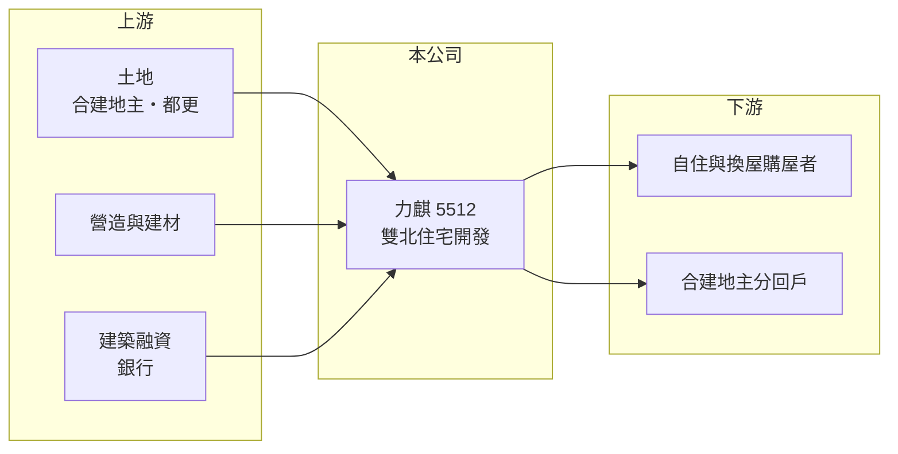

# 5512 力麒

> 上櫃｜[[產業索引-建材營造業|建材營造業]]｜上市（櫃）日期 1998/12/04

# 第一章：企業模式與商業藍圖

> [!info] 撰寫說明
> 精簡版，由 Claude 依公開資料整理，架構比照 [[2330台積電]] 的四章研究，資料截至 2026-10-08。財務數字來源：MoneyDJ 年度財務比率表、櫃買中心開放資料（2026 年第二季資產負債與綜合損益）；業務描述取自聯合報、Yahoo 股市與 CMoney 報導標題。公開資料有限，業務別營收比重與推案明細未查得。#待校對

在評估單一個股的長期投資價值時，首要步驟是拆解企業的底層獲利邏輯。本章說明力麒建設（股票代號：5512，以下簡稱力麒）作為雙北住宅開發商的商業模式與資本特性。

## 一、核心定位：深耕雙北精華區的住宅開發商

力麒成立於 1992 年，1998 年於櫃買中心掛牌，實收資本額約 76.6 億元，在上櫃建商中屬於股本較大的一家。它的本業是取得土地或與地主[[合建]]，規劃興建住宅後銷售，營收在[[建案交屋]]時才一次認列。財經媒體對力麒的描述多為「雙北精華區續推案、重質不重量」，代表公司偏好地段較好、單價較高的中小型案，而不是以大量推案衝營收。

這種定位的好處是單案毛利率較有保障，壞處是推案數少時營收容易出現空窗。力麒 2018 至 2025 年營收成長率在負 23% 到正 32% 之間大幅擺盪，正是交屋時點集中造成的結果。

## 二、土地取得：合建降低資金壓力

依聯合報報導，力麒曾簽下台北捷運雙連站附近的合建案，預計投入金額 18.72 億元。合建是地主出地、建商出資興建，完工後依比例分配房屋，建商不必一次付出高額土地款，資金壓力較小，但需要與地主長期協調。對力麒這類以都會精華區為主的建商來說，合建與[[都更]]是取得市中心土地的主要途徑，因為台北市幾乎沒有大面積的空地可以直接購買。

## 三、集團結構：非控制權益占比高

依 2026 年第二季資料，力麒合併權益約 185.7 億元，其中歸屬母公司約 134.7 億元，代表有相當比例的子公司由其他股東共同持有。2015 年 CMoney 報導曾提到力麒的汙水處理事業商機，顯示集團內除了住宅開發，也有其他事業體（現況與營收占比未查得）。讀者評估力麒時，應注意合併報表中的資產與負債有一部分屬於非全資子公司，母公司股東實際分到的獲利會少於合併數字。

# 第二章：護城河深度與競爭優勢

「護城河」指企業抵禦競爭、維持超額利潤的保護機制。建設業進入門檻不高，本章說明力麒在雙北市場能依靠的優勢與限制。

## 一、護城河的組成

力麒的優勢主要來自長期經營雙北所累積的地主關係與土地資訊。雙北精華區的土地多半要透過合建、都更或私下洽購取得，與地主長期往來、交屋紀錄良好的建商較容易獲得合作機會。其次是產品定位，精華區中高價住宅的買方以自住與換屋為主，對價格的敏感度低於首購族，景氣轉弱時跌價壓力相對有限。

不過這些優勢並不獨特，雙北有大量同業爭取同一批土地與客群，力麒的規模也不足以形成成本優勢，因此只能算是很窄的護城河。

## 二、主要競爭對手

| 對手 | 定位 | 對力麒的威脅 |
|---|---|---|
| [[2501國建]] | 全台品牌建商，雙北推案多 | 品牌與資金規模較大 |
| [[2520冠德]] | 雙北為主，含都更與捷運聯開 | 爭取同一批都更與合建地主 |
| [[5534長虹]] | 雙北中高價住宅 | 客群高度重疊 |
| [[2542興富發]] | 全台推案量最大的建商之一 | 以量與價格策略搶客 |

## 三、守得住／守不住／觀察重點

守得住的是精華區土地本身的稀缺性，以及合建模式下較低的土地成本。守不住的是房市總量與政策，央行[[信用管制]]會同時打擊投資客與換屋族。長期觀察重點是力麒能否把龐大股本轉化為穩定的獲利，過去八年 ROE 多低於 2%，資本效率是最大的問題。

# 第三章：財務體質與盈利規模

資料日期：2026-10-08。數字取自 MoneyDJ 年度財務比率表與櫃買中心開放資料，表格是撰寫當時的快照；最新月營收、毛利率、累計 EPS 由自動排程寫在本筆記的屬性欄位（月營收、毛利率、累計EPS 等）。#待校對

財務報表是檢驗護城河是否真實存在的最終標準。本章用五年的三率、ROE 與資本報酬，檢視力麒的獲利品質。

## 一、多年度經營績效

| 年度 | 營收（新台幣） | [[毛利率]] | [[營業利益率]] | EPS（元） | [[ROE]] |
|---|---|---|---|---|---|
| 2021 | 未查得 | 19.92% | 16.90% | 0.42 | 1.03% |
| 2022 | 未查得 | 11.34% | 3.06% | 0.06 | -0.75% |
| 2023 | 未查得 | 15.32% | 7.91% | 0.33 | 0.93% |
| 2024 | 未查得 | 17.41% | 7.56% | 0.17 | 0.38% |
| 2025 | 未查得 | 21.27% | 12.99% | 0.16 | 1.63% |

力麒的營業利益率多數年度在 3% 至 17% 之間，本業並非虧損，但 EPS 長期不到 0.5 元、ROE 五年平均僅約 0.6%（推算）。原因在於業外：2026 年上半年營收 29.6 億元、營業利益 5.12 億元，但業外收支為負 1.40 億元，歸屬母公司淨利只剩 0.46 億元，EPS 0.06 元。業外負數推估主要來自建築融資的利息費用，加上非控制權益分走部分獲利，使本業利潤很難傳到母公司股東手上。每股淨值長期停在 17 至 18.5 元，代表八年來幾乎沒有累積股東價值。

## 二、營建業指標：存貨與負債

2026 年第二季總資產 460.6 億元，其中流動資產 290.7 億元，建商的流動資產多數是土地、在建工程與待售房屋。總負債 274.9 億元，負債比率約 60%，與 MoneyDJ 歷年 55% 至 59% 一致。已售未入帳金額與推案量本次未查得。股利方面，櫃買中心資料顯示最近一次現金股利為每股 0.1 元，配發能力有限。

## 三、[[ROIC]] 與 [[WACC]]：價值創造利差

**ROIC 推算：** 以 2026 年上半年營業利益 5.12 億元年化約 10.2 億元，稅後約 8.2 億元。合併權益 185.7 億元，總負債 274.9 億元，假設六成為有息負債約 164.9 億元（推估），投入資本約 350.6 億元，ROIC 約 2.3%（推算）。

**WACC 推算：** 假設台灣 10 年期公債殖利率 1.75%、市場風險溢酬 6%、β 取營建同業常見值 0.9，股東權益成本約 7.2%；負債成本 3%、稅後 2.4%，權益占投入資本約 53%，WACC 約 4.9%（推算）。

**結論：** 力麒的 ROIC 明顯低於 WACC，代表以目前的資本規模，本業報酬還不足以支付資金成本，長期是在消耗而非創造股東價值。股價淨值比約 0.42 倍（櫃買中心 2026 年 10 月資料），市場也以大幅折價反映這個問題。要扭轉，需要提高推案周轉、降低利息負擔，或處分低效率資產。

# 第四章：總體風險與地緣政治

任何企業都無法脫離宏觀環境獨立存在。本章分析力麒長期必須面對的房市週期與財務風險。

## 一、產業週期

房地產是長週期產業，景氣循環往往長達 7 至 10 年，受利率、所得與政策共同影響。力麒集中於雙北，雖然精華區需求較具韌性，但雙北也是政策打房與信用管制最直接的區域，成交量萎縮時去化速度會明顯放慢。

## 二、財務與利率風險

力麒負債比率長期接近六成，業外利息負擔已經吃掉大部分本業利潤。若利率上升或銀行收緊建築融資成數，獲利會被進一步壓縮；反之若能加快交屋還款，降低負債，對 EPS 的改善會很明顯。

## 三、營運與治理風險

合建與都更案需要整合眾多地主，時程常比預期更長，資金會被長期占用。合併報表中非控制權益比重高，子公司的經營與股利政策會影響母公司股東的實際報酬，這部分的資訊揭露有限，是投資人需要留意的地方。

# 專有名詞解析

## 金融

- **[[信用管制]]**：央行限制購屋與建商貸款成數的政策，會影響房市成交與建商資金。
- **[[ROIC]]**：投入資本報酬率，稅後營業利益除以股東權益加有息負債，衡量本業運用資本的效率。
- **[[WACC]]**：加權平均資金成本，股東與債權人要求報酬率的加權平均，是 ROIC 要超越的門檻。

## 產業

- **[[建案交屋]]**：建商在房屋完工並交付買方時才認列營收，因此營建公司的營收常集中在交屋年度。
- **[[合建]]**：地主提供土地、建商負責出資興建，完工後雙方依約定比例分配房屋或銷售收入的開發模式。
- **[[都更]]**：都市更新，由地主與建商合作把老舊建物改建，地主依權利價值分回房地或收益。

# 核心供應鏈

- 上游：合建地主與都更地主、營造廠與建材商如 [[1101台泥]]、銀行建築融資
- 下游／客戶：雙北自住與換屋購屋者、合建地主
- 同業：[[2501國建]]、[[2520冠德]]、[[5534長虹]]、[[2542興富發]]

## 最新新聞
<!-- news:start（自動產生，請勿手動編輯此範圍） -->
- 2026-10-05 🏛️ 重訊 17:11｜公告本公司董事會通過公司遷址案｜[觀測站](https://mops.twse.com.tw/mops/#/web/t05st01)
- 2026-10-05 🏛️ 重訊 17:11｜公告本公司處分不動產予關係人｜[觀測站](https://mops.twse.com.tw/mops/#/web/t05st01)
- 2026-10-05 🏛️ 重訊 17:11｜公告本公司變更向關係人取得使用權資產｜[觀測站](https://mops.twse.com.tw/mops/#/web/t05st01)

完整紀錄：[[5512力麒 新聞]]
<!-- news:end -->

## 相關連結
- [公開資訊觀測站](https://mopsov.twse.com.tw/mops/web/t05st03?step=1&firstin=1&co_id=5512)
- [Goodinfo](https://goodinfo.tw/tw/StockDetail.asp?STOCK_ID=5512)
- [Yahoo 股市](https://tw.stock.yahoo.com/quote/5512)
- [鉅亨網新聞](https://www.cnyes.com/twstock/5512/news)
