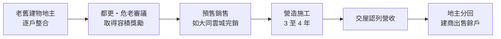
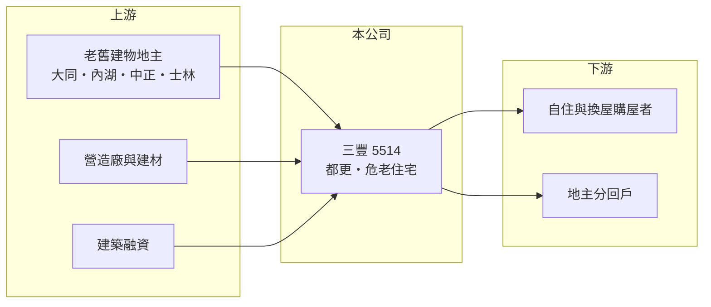

# 5514 三豐

> 上櫃｜[[產業索引-建材營造業|建材營造業]]｜上市（櫃）日期 1998/12/29

# 第一章：企業模式與商業藍圖

> [!info] 撰寫說明
> 精簡版，由 Claude 依公開資料整理，架構比照 [[2330台積電]] 的四章研究，資料截至 2026-10-08。財務數字來源：MoneyDJ 年度財務比率表、富果研究 2025 年 11 月法說會整理、櫃買中心開放資料（2026 年第二季）；產業描述為整理性內容，尚未逐條比對原始文件。#待校對

在評估單一個股的長期投資價值時，首要步驟是拆解企業的底層獲利邏輯。本章說明三豐建設（股票代號：5514，以下簡稱三豐）如何以台北市大同區的[[都更]]與[[危老重建]]為核心，建立一家區域型小型建商。

## 一、核心定位：聚焦大同區的老屋重建專家

三豐成立於 1988 年，1998 年於櫃買中心掛牌，實收資本額約 23.6 億元，法人董事為東台開發。它的業務是興建與銷售住宅大樓，長期深耕大台北，近年明確聚焦在都更與危老重建。依富果整理的 2025 年第三季法說會資料，公司存貨約 85% 位於大同區、10% 在內湖、5% 在中正區，集中度非常高。

選擇老屋重建而不是公開標售土地，背後有清楚的商業邏輯。大型建商習慣在公開市場以高價競標大面積土地，三豐規模小、資金有限，正面競爭不利；改走都更危老路線，則是靠與地主逐戶整合取得土地，雖然耗時，但土地成本較低，也避開了與大建商的直接價格競爭。

## 二、推案結構：分期完工、營收跳躍

三豐 2025 年第三季時有 8 個在建個案，分布在內湖、大同、中正與士林，預計 2025 年底至 2029 年陸續完工，其中大同區「雲城」已經完銷；另有 6 個未來推案全部位於大同區，合計推案量預估超過 153 億元，約為公司股本的六倍以上。

[[建案交屋]]才認列營收的特性，使三豐的營收呈現強烈跳躍：2021、2022 與 2025 年幾乎沒有建案入帳，營收只有租金收入；2026 年上半年因新案交屋，營收回到 6.74 億元、EPS 0.27 元。公司以分期完工的方式安排個案，就是希望把未來幾年的交屋分散，降低營收斷層。

## 三、長期方向：把大同區做成品牌

三豐未來 5 年的成長幾乎全部押在大同區。大同區是台北市老屋比例最高的區域之一，重建需求龐大，若三豐能把「雲邸」「雲城」「雲都」等系列建成區域品牌，就能在後續的地主整合中取得信任優勢。這也是一種集中風險，一旦大同區房價或去化不如預期，公司缺乏其他區域分散。

# 第二章：護城河深度與競爭優勢

「護城河」指企業抵禦競爭、維持超額利潤的保護機制。本章說明三豐在小型建商中能靠什麼維持競爭力。

## 一、護城河的組成

三豐的優勢來自區域深耕。都更與危老案需要長時間與地主溝通、處理產權與容積規劃，在同一區域累積多個成功案例的建商，最容易讓下一批地主願意簽約。這種關係型的優勢無法靠資金快速複製，是小型建商少數能建立的護城河。

第二個優勢是土地成本。透過整合老屋取得的土地，成本通常低於公開標售，在房價持平時仍能保有合理毛利。不過三豐歷年毛利率波動大，2024 年 23.8%、2020 年 39.1%，代表個案條件差異大，優勢並不穩定。

## 二、主要競爭對手

| 對手 | 定位 | 對三豐的威脅 |
|---|---|---|
| [[2520冠德]] | 雙北都更與大型住宅 | 資金與品牌較強，可承接大型都更 |
| [[5534長虹]] | 雙北中高價住宅 | 客群重疊 |
| 地方型都更建商 | 專做單一區域危老 | 爭取同一批小基地 |

## 三、守得住／守不住／觀察重點

守得住的是大同區的地主關係與已取得的開發權；守不住的是整體房市與營建成本。長期觀察重點是 153 億元未來推案能否如期取得建照並開賣，以及在建個案的交屋節奏能否讓營收不再出現整年空窗。

# 第三章：財務體質與盈利規模

資料日期：2026-10-08。數字取自 MoneyDJ 年度財務比率表、富果研究法說會整理與櫃買中心開放資料，表格是撰寫當時的快照；最新月營收、毛利率、累計 EPS 由自動排程寫在本筆記的屬性欄位（月營收、毛利率、累計EPS 等）。#待校對

財務報表是檢驗護城河是否真實存在的最終標準。本章用五年的三率、ROE 與資本報酬檢視三豐的獲利品質。

## 一、多年度經營績效

| 年度 | 營收（新台幣） | [[毛利率]] | [[營業利益率]] | EPS（元） | [[ROE]] |
|---|---|---|---|---|---|
| 2021 | 不足 0.1 億（推算） | 67.38% | -786.51% | -0.04 | -0.26% |
| 2022 | 不足 0.1 億（推算） | 75.13% | -757.79% | -0.07 | -0.50% |
| 2023 | 約 5.2 億（推算） | 20.38% | 7.03% | 0.14 | 1.03% |
| 2024 | 約 7.4 億（推算） | 23.76% | 13.95% | 0.39 | 2.83% |
| 2025 | 約 0.07 億（推算） | 72.15% | -1080.43% | -0.13 | -0.96% |

營收由 MoneyDJ 每股營業額乘以目前股數推算，股本過去曾因股票股利變動，數字僅供量級參考。沒有建案入帳的年度，營收只剩租金，毛利率雖高但金額極小，營業利益率因此出現負數百個百分點的失真，閱讀時應以有交屋的年度為準。2021 至 2025 年平均 ROE 約 0.4%（推算），2019 年交屋大年 ROE 曾達 14.1%，顯示獲利完全取決於交屋時點。

## 二、營建業指標：推案量與存貨

2025 年第三季存貨 42.13 億元，占總資產 65%，其中在建工程 38.27 億元，代表公司資本大多壓在興建中的建案上。未來推案量超過 153 億元，在建 8 案將在 2025 至 2029 年完工，若順利交屋，未來幾年的營收規模可望明顯高於過去。2026 年第二季總負債 39.4 億元，負債比率約 54%。股利方面，2015 至 2024 年合計配發 5.15 元，其中現金 2.15 元、股票 3.0 元，配息不穩定。

## 三、[[ROIC]] 與 [[WACC]]：價值創造利差

**ROIC 推算：** 以有交屋的 2024 年計算，營業利益約 1.03 億元（7.4 億 × 13.95%），稅後約 0.83 億元。2026 年第二季股東權益 34.2 億元、總負債 39.4 億元，假設六成為有息負債約 23.7 億元（推估），投入資本約 57.9 億元，ROIC 約 1.4%（推算）；2021 至 2025 年平均營業利益接近零，五年平均 ROIC 約 0%（推算）。

**WACC 推算：** 假設台灣 10 年期公債殖利率 1.75%、市場風險溢酬 6%、β 取營建同業常見值 0.9，股東權益成本約 7.2%；負債成本 3%、稅後 2.4%，權益占投入資本約 59%，WACC 約 5.2%（推算）。

**結論：** 過去五年三豐的 ROIC 遠低於 WACC，尚未創造價值。這主要是因為大量資本投入在建工程、尚未交屋。若 153 億元推案與在建案能在 2026 至 2029 年陸續以合理毛利入帳，ROIC 才有機會接近或超過資金成本。

# 第四章：總體風險與地緣政治

任何企業都無法脫離宏觀環境獨立存在。本章分析三豐長期必須面對的產業與營運風險。

## 一、產業週期與政策

房市週期長，央行[[信用管制]]使投資買盤退場，對以預售為主的建案去化有直接影響。台北市房價高，若利率上升或所得成長停滯，換屋需求也會降溫。

## 二、區域集中與執行風險

三豐的存貨與推案高度集中於大同區，區域房價或去化一旦轉弱，公司沒有其他市場可以分散。都更與危老案涉及多數地主，只要少數地主不同意或產權爭議，整個案子就可能延後數年，資本也會被長期占用。

## 三、成本風險

營建工料與人工長期上漲，對預售後才施工的建案影響最大，因為售價已經鎖定，成本上升只能由建商吸收。小型建商議價能力較弱，對營造成本的控制力也有限。

# 專有名詞解析

## 金融

- **[[信用管制]]**：央行限制購屋與建商貸款成數的政策，會影響房市成交與建商資金。
- **[[ROIC]]**：投入資本報酬率，稅後營業利益除以股東權益加有息負債，衡量本業運用資本的效率。
- **[[WACC]]**：加權平均資金成本，股東與債權人要求報酬率的加權平均，是 ROIC 要超越的門檻。

## 產業

- **[[都更]]**：都市更新，由地主與建商合作把老舊建物改建，地主依權利價值分回房地或收益。
- **[[危老重建]]**：依都市危險及老舊建築物加速重建條例，以容積獎勵與簡化程序推動老舊建物重建。
- **[[建案交屋]]**：建商在房屋完工並交付買方時才認列營收，因此營建公司的營收常集中在交屋年度。

# 核心供應鏈

- 上游：大同區等老舊建物地主、營造廠與建材商、銀行建築融資
- 下游／客戶：台北自住與換屋購屋者、都更地主
- 同業：[[2520冠德]]、[[5534長虹]]、地方型都更建商

## 最新新聞
<!-- news:start -->
<!-- news:end -->

## 相關連結
- [公開資訊觀測站](https://mopsov.twse.com.tw/mops/web/t05st03?step=1&firstin=1&co_id=5514)
- [Goodinfo](https://goodinfo.tw/tw/StockDetail.asp?STOCK_ID=5514)
- [Yahoo 股市](https://tw.stock.yahoo.com/quote/5514)
- [鉅亨網新聞](https://www.cnyes.com/twstock/5514/news)
