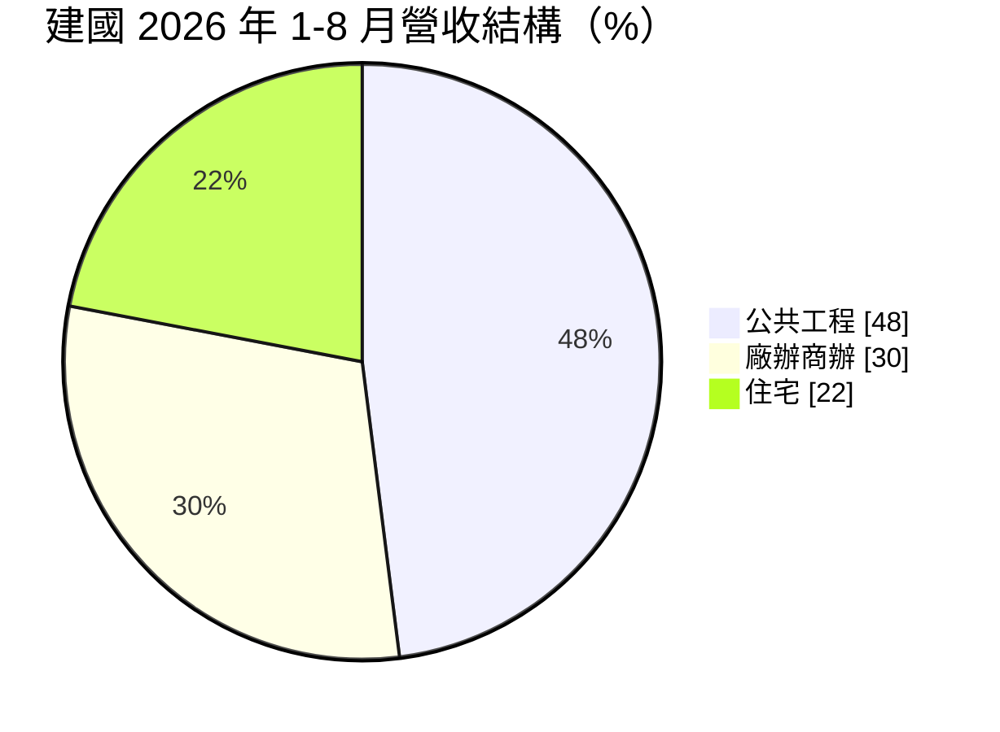
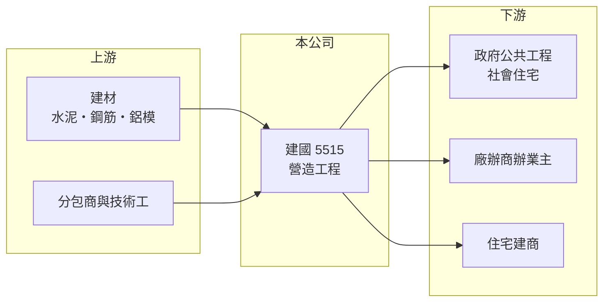

# 5515 建國

> 上市｜[[產業索引-建材營造業|建材營造業]]｜上市（櫃）日期 2003/10/06

# 第一章：企業模式與商業藍圖

> [!info] 撰寫說明
> 精簡版，由 Claude 依公開資料整理，架構比照 [[2330台積電]] 的四章研究，資料截至 2026-10-08。財務數字來源：MoneyDJ 年度財務比率表、富果研究 2026 年 9 月法說會整理、證交所開放資料（2026 年第二季、股利）；產業描述為整理性內容，尚未逐條比對原始文件。#待校對

在評估單一個股的長期投資價值時，首要步驟是拆解企業的底層獲利邏輯。本章說明建國工程（股票代號：5515，以下簡稱建國）如何以公共工程與[[社會住宅]]為主軸，成為營收規模約 70 億元的綜合營造廠。

## 一、核心定位：以公共工程為主的甲級營造廠

建國成立於 1960 年，2003 年上市，實收資本額約 20.2 億元。營造廠的商業模式是「接案施工、依工程進度認列營收」，和建商要等交屋才一次認列不同，因此營收較平穩，但毛利率也較低。建國的業務分成三塊，依 2026 年 1 至 8 月營收，公共工程占 48%、廠辦商辦占 30%、住宅占 22%，公司表示這個比例與過去年度相近。

以公共工程為主的意義在於案源來自政府預算，不像民間住宅那樣直接受房市景氣影響。近年政府大量推動社會住宅，建國承攬了多件統包案，2026 年 7 月取得的臺北市福興社會住宅二區統包工程，合約金額就高達 143 億元，約為公司兩年的營收。

## 二、[[在手訂單]]：未來數年的營收能見度

截至 2026 年 8 月底，建國有 19 個在建工程，總承攬金額 829 億元，尚未認列的合約收入約 590 億元，其中公共工程約占六成、廠辦商辦約三成、住宅約一成；部分案件的收入認列會延續到 2032 年。以 2025 年約 71 億元的營收計算，未認列合約約等於 8 年的營收，在營造業屬於很高的能見度。

## 三、長期方向：衝規模與工法升級

經營層在 2026 年法說會提出長期年營收 1,000 億元的目標，並據此規劃人力與設備；這個目標約是目前規模的 14 倍，應視為方向而非短期預測。實際做法是持續爭取大型社會住宅與大型商辦綜合開發案，並導入鋁模工法、數位化管理與自動化製圖，以有限人力承接更多工程。公司也在評估投資預售屋建案，若付諸實行，代表建國可能從單純營造延伸到開發。

# 第二章：護城河深度與競爭優勢

「護城河」指企業抵禦競爭、維持超額利潤的保護機制。營造業價格競爭激烈，本章說明建國靠什麼取得大型標案。

## 一、護城河的組成

第一是承攬能量與資格。大型社會住宅統包案動輒上百億元，業主會檢視營造廠的實績、資本與財務能力，公司表示單一承攬案金額上限約為淨值的 20 倍，能參與這個量級的營造廠並不多。第二是工法與成本控制，鋁模可重複使用、施工速度快，有助在固定總價合約中守住毛利。第三是公共工程的物價調整機制，可部分轉嫁工料上漲，使建國的毛利率從過去的 12% 至 15% 提升到近期的 18% 至 20%。

## 二、主要競爭對手

| 對手 | 定位 | 對建國的威脅 |
|---|---|---|
| [[2546根基]] | 冠德集團營造，科技廠房與軌道 | 在大型公共與民間案直接競爭 |
| [[2597潤弘]] | 預鑄工法，科技廠辦為主 | 爭取廠辦與商辦案 |
| [[5521工信]] | 公共工程與民間建築 | 搶同一批政府標案 |
| [[5516雙喜]] | 社會住宅與公共工程 | 在社宅統包案競爭 |

## 三、守得住／守不住／觀察重點

守得住的是大型社宅的施工實績與龐大的在手訂單；守不住的是政府政策方向，社宅案量取決於中央與地方預算。長期觀察重點是新接案的毛利率能否維持在 18% 以上，以及從 2023 年 9.3% 回升的毛利率是結構性改善還是短期物調紅利。

# 第三章：財務體質與盈利規模

資料日期：2026-10-08。數字取自 MoneyDJ 年度財務比率表、富果研究法說會整理與證交所開放資料，表格是撰寫當時的快照；最新月營收、毛利率、累計 EPS 由自動排程寫在本筆記的屬性欄位（月營收、毛利率、累計EPS 等）。#待校對

財務報表是檢驗護城河是否真實存在的最終標準。本章用五年的三率、ROE 與資本報酬檢視建國的獲利品質。

## 一、多年度經營績效

| 年度 | 營收（新台幣） | [[毛利率]] | [[營業利益率]] | EPS（元） | [[ROE]] |
|---|---|---|---|---|---|
| 2021 | 約 53 億（推算） | 11.72% | 5.37% | 1.57 | 8.87% |
| 2022 | 約 51 億（推算） | 10.83% | 5.03% | 0.72 | 3.90% |
| 2023 | 約 42 億（推算） | 9.30% | 1.37% | 1.34 | 7.06% |
| 2024 | 約 61 億（推算） | 12.97% | 6.40% | 2.91 | 13.93% |
| 2025 | 約 71 億（推算） | 16.65% | 10.29% | 4.48 | 17.74% |

營收以 MoneyDJ 每股營業額乘以目前股數，再依各年營收成長率回推。2021 至 2025 年營收年複合成長率約 7%（推算），平均 ROE 約 10.3%（推算），而且呈現逐年上升的趨勢。2026 年上半年營收 40.2 億元、毛利率 19.4%、營業利益率 12.6%，EPS 6.08 元，但其中業外收支達 9.02 億元，超過營業利益的 5.05 億元，屬於一次性成分較高的收益，評估本業時應以營業利益為準。股利方面，2025 年度配發現金股利 3.3 元，以當年 EPS 4.48 元計算配發率約 74%（推算）。

## 二、營造業指標：在手訂單與未認列營收

未認列合約收入 590 億元約為年營收的 8 倍，2026 年 1 至 8 月新承攬 151 億元，絕大部分來自福興社宅二區。營造廠的工程款多為按進度請款、業主預付，負債中有很大比例是合約負債與應付工程款，2026 年第二季總負債 69.8 億元、股東權益 58.5 億元。

## 三、[[ROIC]] 與 [[WACC]]：價值創造利差

**ROIC 推算：** 2025 年營業利益約 7.3 億元（71 億 × 10.29%），稅後約 5.8 億元。2026 年第二季股東權益 58.5 億元，負債多為合約負債與應付工程款，假設有息負債約占 15% 即 10.5 億元（推估），投入資本約 68.9 億元，ROIC 約 8.5%（推算）；以五年平均營業利益計算約 4.0%（推算）。

**WACC 推算：** 假設台灣 10 年期公債殖利率 1.75%、市場風險溢酬 6%、β 取營建同業常見值 0.9，股東權益成本約 7.2%；負債成本 3%、稅後 2.4%，權益占投入資本約 85%，WACC 約 6.4%（推算）。

**結論：** 建國在 2024、2025 年的 ROIC 已高於 WACC，開始創造價值，但五年平均仍低於資金成本。關鍵在毛利率能否守在近期水準：營造業的利差很薄，毛利率只要回到 10% 左右，ROIC 就會再度跌破 WACC。

# 第四章：總體風險與地緣政治

任何企業都無法脫離宏觀環境獨立存在。本章分析建國長期必須面對的產業週期與營運風險。

## 一、政策與產業週期

建國近半營收來自公共工程，案源取決於政府預算與社宅政策；政策轉向或預算縮減時，新接案會明顯減少。民間住宅案受房地產景氣與[[信用管制]]影響，法說會也提到住宅案量正在減少。

## 二、成本與人力風險

營造合約多為固定總價，物價調整機制只能部分轉嫁工資與建材上漲。缺工是長期結構問題，若無法靠工法與自動化提升效率，毛利率會被壓縮。

## 三、集中度與執行風險

福興社宅二區一案就占新承攬的九成以上，單一大型案的進度延誤、設計變更或與業主的計價爭議，都可能影響多年獲利。長期營收千億的目標若帶來過度擴張，也可能出現接案品質下滑的風險。

# 專有名詞解析

## 金融

- **[[信用管制]]**：央行限制購屋與建商貸款成數的政策，會影響房市成交與建商資金。
- **[[ROIC]]**：投入資本報酬率，稅後營業利益除以股東權益加有息負債，衡量本業運用資本的效率。
- **[[WACC]]**：加權平均資金成本，股東與債權人要求報酬率的加權平均，是 ROIC 要超越的門檻。

## 產業

- **[[社會住宅]]**：由政府興建或包租、以低於市價出租給弱勢與青年的住宅，近年是公共工程的重要案源。
- **[[在手訂單]]**：已簽約但尚未完工認列營收的工程金額，可用來預估未來營收。

# 核心供應鏈

- 上游：水泥與鋼材供應商如 [[1101台泥]]、[[2002中鋼]]，以及各類分包商
- 下游／客戶：臺北市等地方政府（社會住宅）、商辦與廠辦業主、民間建商
- 同業：[[2546根基]]、[[2597潤弘]]、[[5521工信]]、[[5516雙喜]]

## 最新新聞
<!-- news:start -->
<!-- news:end -->

## 相關連結
- [公開資訊觀測站](https://mopsov.twse.com.tw/mops/web/t05st03?step=1&firstin=1&co_id=5515)
- [Goodinfo](https://goodinfo.tw/tw/StockDetail.asp?STOCK_ID=5515)
- [Yahoo 股市](https://tw.stock.yahoo.com/quote/5515)
- [鉅亨網新聞](https://www.cnyes.com/twstock/5515/news)
