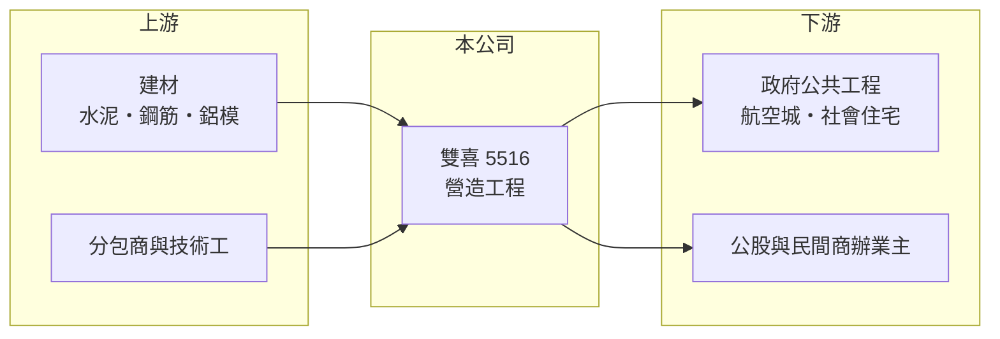

# 5516 雙喜

> 上櫃｜[[產業索引-建材營造業|建材營造業]]｜上市（櫃）日期 1999/03/23

# 第一章：企業模式與商業藍圖

> [!info] 撰寫說明
> 精簡版，由 Claude 依公開資料整理，架構比照 [[2330台積電]] 的四章研究，資料截至 2026-10-08。財務數字來源：MoneyDJ 年度財務比率表、富果研究 2025 年 12 月法說會整理、櫃買中心開放資料（2026 年第二季）；產業描述為整理性內容，尚未逐條比對原始文件。業務別營收比重未查得。#待校對

在評估單一個股的長期投資價值時，首要步驟是拆解企業的底層獲利邏輯。本章說明雙喜營造（股票代號：5516，以下簡稱雙喜）作為中型甲級營造廠的商業模式，以及它為何在 2023 至 2024 年出現大幅虧損。

## 一、核心定位：以公共工程與社宅為主的甲級營造廠

雙喜的公司登記成立日為 1982 年，依富果整理的法說會資料，其營造事業沿革可追溯至 1956 年；1999 年於櫃買中心掛牌，實收資本額約 5.15 億元，在上櫃營造股中規模偏小。業務核心是大型公共工程、[[社會住宅]]、商辦大樓與高科技廠房，涵蓋土木與建築工程。

營造廠依工程進度認列營收，營收規模大致取決於手上有多少在建工程。雙喜的營收約在 20 億至 28 億元之間（推算），但股本只有約 5 億元，代表每 1 元股本要支撐約 4 元以上的年營收，財務槓桿很高，獲利與虧損都會被放大反映在 EPS 上。

## 二、在建工程：公共工程與社宅統包

依 2025 年 12 月法說會，雙喜在建工程契約總金額約 170 億元，約為年營收的 8 倍（推算），主要案件包括：

- 桃園航空城計畫區段徵收工程 A3 分標，約 52 億元。
- 新竹市「中雅安居」與「建功安居」社會住宅統包工程，合計超過 71 億元。
- 彰化銀行建成大樓新建工程，約 33.9 億元。

已完工的廣慈博愛園區 C 標曾獲公共工程金質獎優等。這份名單顯示雙喜的案源以政府與公股機構為主，民間住宅比重不高。

## 三、長期方向：航空城、科技廠房與都更

公司列出五個長期方向：參與桃園航空城相關開發、爭取全球供應鏈重組帶來的高科技廠房需求、參與水環境與綠能建設、投入[[都更]]與[[危老重建]]，以及把 ESG 納入營運。技術上導入鋁模板工法，鋁模可重複使用的次數約為木模板的 30 倍，有助在缺工環境中提高效率。

# 第二章：護城河深度與競爭優勢

「護城河」指企業抵禦競爭、維持超額利潤的保護機制。本章說明雙喜在營造業中的競爭位置，以及 2023 至 2024 年虧損暴露出的弱點。

## 一、護城河的組成

雙喜的優勢是長期累積的公共工程實績與甲級營造資格。政府大型標案會審查過去的施工紀錄與獎項，金質獎等實績有助於取得投標資格與評選分數。社宅統包案需要同時負責設計與施工，能承接的廠商也較少。

但這個護城河很淺。公共工程多以價格與評選決標，同業眾多，2023 與 2024 年雙喜的毛利率分別為負 5.2% 與負 3.8%，代表部分工程的實際成本超過合約金額，顯示在原物料與人工上漲期間，固定總價合約對中型營造廠的衝擊非常大。

## 二、主要競爭對手

| 對手 | 定位 | 對雙喜的威脅 |
|---|---|---|
| [[5515建國]] | 社宅與公共工程為主 | 在社宅統包案直接競爭，規模較大 |
| [[5521工信]] | 公共工程與民間建築 | 爭取同一批政府標案 |
| [[2546根基]] | 科技廠房與軌道工程 | 在科技廠房案具實績優勢 |
| [[2597潤弘]] | 預鑄工法 | 在廠辦與高毛利民間案競爭 |

## 三、守得住／守不住／觀察重點

守得住的是公共工程資格與在手合約；守不住的是成本，2023 至 2024 年的虧損吃掉了大半股東權益。長期觀察重點是新接案的毛利率能否穩定為正，以及股東權益能否重建到足以支撐大型標案的水準。

# 第三章：財務體質與盈利規模

資料日期：2026-10-08。數字取自 MoneyDJ 年度財務比率表、富果研究法說會整理與櫃買中心開放資料，表格是撰寫當時的快照；最新月營收、毛利率、累計 EPS 由自動排程寫在本筆記的屬性欄位（月營收、毛利率、累計EPS 等）。#待校對

財務報表是檢驗護城河是否真實存在的最終標準。本章用五年的三率、ROE 與資本報酬檢視雙喜的獲利品質。

## 一、多年度經營績效

| 年度 | 營收（新台幣） | [[毛利率]] | [[營業利益率]] | EPS（元） | [[ROE]] |
|---|---|---|---|---|---|
| 2021 | 約 23 億（推算） | 10.28% | 8.08% | 2.91 | 18.10% |
| 2022 | 約 24 億（推算） | 10.10% | 8.20% | 2.83 | 16.62% |
| 2023 | 約 28 億（推算） | -5.19% | -6.67% | -3.75 | -25.78% |
| 2024 | 約 20 億（推算） | -3.80% | -6.47% | -3.61 | -35.10% |
| 2025 | 約 22 億（推算） | 5.09% | 3.05% | 0.16 | 1.94% |

營收以 MoneyDJ 每股營業額乘以目前股數，再依各年營收成長率回推，僅供量級參考。2021 至 2022 年雙喜的 ROE 接近兩成，但 2023 至 2024 年連續大虧，五年平均 ROE 約負 4.8%（推算）。每股淨值從 2022 年的 18.25 元降到 2025 年的 8.56 元，負債比率從 73% 升到 86%。2026 年上半年營收 12.4 億元、EPS 0.47 元，已回到獲利，但每股淨值約 9.02 元，財務體質仍薄。股利方面，2023 年配發現金 0.2 元與股票 0.3 元，2024 年因虧損未配發。

## 二、營造業指標：在建合約與財務結構

在建契約約 170 億元，能見度約數年。但 2026 年第二季股東權益僅 4.65 億元、總負債 27.1 億元，流動負債 26.3 億元幾乎等於流動資產 27.5 億元。公司在法說會表示大型公共工程前期成本高、付款條件與一般產業不同，資金調度是雙喜最需要注意的地方。

## 三、[[ROIC]] 與 [[WACC]]：價值創造利差

**ROIC 推算：** 2025 年營業利益約 0.66 億元（21.8 億 × 3.05%），稅後約 0.53 億元。股東權益 4.65 億元，總負債 27.1 億元，多為合約負債與應付工程款，假設有息負債約三成即 8.1 億元（推估），投入資本約 12.8 億元，ROIC 約 4.2%（推算）；五年平均約 1.7%（推算）。

**WACC 推算：** 假設台灣 10 年期公債殖利率 1.75%、市場風險溢酬 6%、β 取營建同業常見值 0.9，股東權益成本約 7.2%；負債成本 3%、稅後 2.4%，權益占投入資本約 36%，WACC 約 4.1%（推算）。雙喜槓桿極高，實際 β 與股東要求報酬應高於假設，WACC 可能被低估。

**結論：** 2025 年 ROIC 勉強與 WACC 持平，五年平均則低於資金成本，2023 至 2024 年的虧損代表過去幾年整體上是在毀損價值。雙喜的長期價值取決於能否穩定接到正毛利的工程，並逐步修復資本結構。

# 第四章：總體風險與地緣政治

任何企業都無法脫離宏觀環境獨立存在。本章分析雙喜長期必須面對的產業與財務風險。

## 一、政策與產業週期

雙喜高度依賴政府標案與社宅政策，預算縮減或政策轉向會直接影響案源。民間建築受房市與企業投資景氣影響，科技廠房案則集中在少數大型營造廠手中，雙喜要切入需要時間累積實績。

## 二、成本與合約風險

2023 至 2024 年的虧損已證明，固定總價合約在工料上漲時可能讓工程變成負毛利。缺工與營建物價若再度上升，而物價調整條款不足以轉嫁，雙喜仍可能再出現虧損。

## 三、財務風險

股東權益薄、負債比率超過八成，是雙喜最大的結構性風險。若單一大型工程延誤或出現計價爭議，可能需要增資或舉債因應，對既有股東造成稀釋。

# 專有名詞解析

## 金融

- **[[ROIC]]**：投入資本報酬率，稅後營業利益除以股東權益加有息負債，衡量本業運用資本的效率。
- **[[WACC]]**：加權平均資金成本，股東與債權人要求報酬率的加權平均，是 ROIC 要超越的門檻。

## 產業

- **[[社會住宅]]**：由政府興建或包租、以低於市價出租給弱勢與青年的住宅，近年是公共工程的重要案源。
- **[[都更]]**：都市更新，由地主與建商合作把老舊建物改建，地主依權利價值分回房地或收益。
- **[[危老重建]]**：依都市危險及老舊建築物加速重建條例，以容積獎勵與簡化程序推動老舊建物重建。

# 核心供應鏈

- 上游：水泥與鋼材供應商如 [[1101台泥]]、[[2002中鋼]]，以及各類分包商
- 下游／客戶：桃園市政府（航空城）、新竹市政府（社會住宅）、彰化銀行等業主
- 同業：[[5515建國]]、[[5521工信]]、[[2546根基]]、[[2597潤弘]]

## 最新新聞
<!-- news:start -->
<!-- news:end -->

## 相關連結
- [公開資訊觀測站](https://mopsov.twse.com.tw/mops/web/t05st03?step=1&firstin=1&co_id=5516)
- [Goodinfo](https://goodinfo.tw/tw/StockDetail.asp?STOCK_ID=5516)
- [Yahoo 股市](https://tw.stock.yahoo.com/quote/5516)
- [鉅亨網新聞](https://www.cnyes.com/twstock/5516/news)
