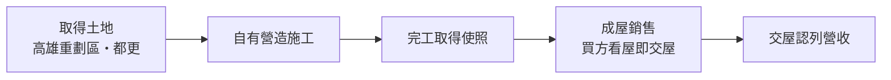
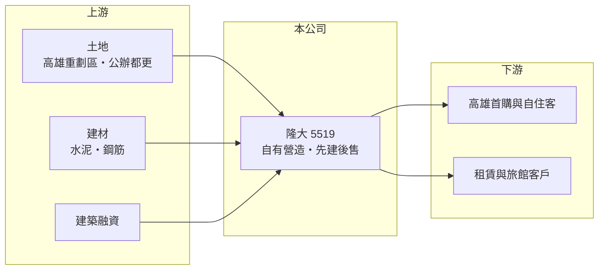

# 5519 隆大

> 上市｜[[產業索引-建材營造業|建材營造業]]｜上市（櫃）日期 2014/02/10

# 第一章：企業模式與商業藍圖

> [!info] 撰寫說明
> 精簡版，由 Claude 依公開資料整理，架構比照 [[2330台積電]] 的四章研究，資料截至 2026-10-08。財務數字來源：MoneyDJ 年度財務比率表、富果研究 2026 年 6 月法說會整理、證交所開放資料（2026 年第二季、股利）；產業描述為整理性內容，尚未逐條比對原始文件。#待校對

在評估單一個股的長期投資價值時，首要步驟是拆解企業的底層獲利邏輯。本章說明隆大營建（股票代號：5519，以下簡稱隆大）如何以「營造加建設」的一條龍模式，成為高雄主要的在地建商之一。

## 一、核心定位：高雄在地的營建一條龍

隆大成立於 1982 年，2014 年上市，實收資本額約 23.0 億元。公司分為營造與建設兩大事業體，業務包括不動產開發、建築工程承攬、不動產租賃與旅館經營，推案幾乎全部集中在高雄，代表品牌為「鳳凰」系列。自己擁有營造體系的意義在於能直接掌握施工成本與品質，不必把營造利潤讓給外部營造廠，這也是隆大毛利率能長期維持在 25% 至 33% 的重要原因。

產品定位以首購與自住客群為主，分布在小港、楠梓、橋頭、燕巢、岡山、鳳山等區域，與高雄近年的半導體聚落（橋頭科學園區、楠梓產業園區）及捷運路網高度重疊。

## 二、先建後售：用資本換取價格彈性

隆大的新建案全面採[[先建後售]]，也就是房子蓋好後才開賣，和多數建商以[[預售屋]]先收訂金的做法不同。依 2026 年 6 月法說會，興建中的 6 個個案共 776 戶、總銷約 149 億元，預計 2027 至 2030 年陸續完工；已完工待售的成屋總銷約 122 億元，至 2026 年 5 月底尚有 57.5 億元待售。

先建後售的好處是買方看得到實品、交屋快，建商可以依完工時的市況訂價，不會因為預售時鎖定價格而承擔工料上漲；代價是興建期間的資金全部由公司負擔，負債比率因此長期維持在 52% 至 59%。

## 三、長期方向：公辦都更與日本旅館

隆大在 2026 年取得高雄苓雅區五權段公辦[[都更]]的最優實施者資格，基地約 1,044 坪、總投資額約 55.67 億元，預計 2027 年底或 2028 年初動工、2033 年完工，是公司長期的成長來源。此外隆大在日本持有山梨縣與京都的兩間旅館，採委外經營，屬於分散資產的小規模布局。

# 第二章：護城河深度與競爭優勢

「護城河」指企業抵禦競爭、維持超額利潤的保護機制。本章說明隆大在高雄市場的優勢與限制。

## 一、護城河的組成

第一是營建一條龍帶來的成本優勢。自有營造體系讓隆大在工料上漲時仍能控制成本，並掌握工期，這在缺工嚴重的南部特別重要。第二是先建後售累積的品牌信任，買方能看到成屋品質，降低交屋糾紛，對首購族的吸引力較大。第三是對高雄土地與重劃區的熟悉度，長期深耕讓公司能較早掌握產業園區周邊的開發機會。

## 二、主要競爭對手

| 對手 | 定位 | 對隆大的威脅 |
|---|---|---|
| [[2542興富發]] | 全台大型建商，高雄推案量大 | 以大量推案與價格策略搶首購客 |
| [[5522遠雄]] | 全台品牌建商，近年南部推案多 | 在高雄大型案直接競爭 |
| 高雄在地建商 | 深耕單一行政區 | 土地資訊與價格靈活 |

## 三、守得住／守不住／觀察重點

守得住的是成本控制與成屋品牌；守不住的是高雄的整體供給，近年半導體帶動外地建商大舉南下推案，供給增加會壓縮去化速度。長期觀察重點是 57.5 億元待售成屋的去化速度，以及苓雅都更案能否如期動工。

# 第三章：財務體質與盈利規模

資料日期：2026-10-08。數字取自 MoneyDJ 年度財務比率表、富果研究法說會整理與證交所開放資料，表格是撰寫當時的快照；最新月營收、毛利率、累計 EPS 由自動排程寫在本筆記的屬性欄位（月營收、毛利率、累計EPS 等）。#待校對

財務報表是檢驗護城河是否真實存在的最終標準。本章用五年的三率、ROE 與資本報酬檢視隆大的獲利品質。

## 一、多年度經營績效

| 年度 | 營收（新台幣） | [[毛利率]] | [[營業利益率]] | EPS（元） | [[ROE]] |
|---|---|---|---|---|---|
| 2021 | 約 47 億（推算） | 22.85% | 15.57% | 2.73 | 13.34% |
| 2022 | 約 47 億（推算） | 30.68% | 22.11% | 4.13 | 18.75% |
| 2023 | 約 44 億（推算） | 31.78% | 22.09% | 3.69 | 15.43% |
| 2024 | 約 63 億（推算） | 24.85% | 17.46% | 3.90 | 15.28% |
| 2025 | 54.52 億 | 33.10% | 24.61% | 4.96 | 18.12% |

2025 年營收取自富果整理，其他年度依 MoneyDJ 營收成長率回推；MoneyDJ 註明 2019 至 2022 年為個別報表數字。隆大是少數 ROE 長期穩定的建商，2021 至 2025 年平均約 16.2%（推算），2018 年以來每年 EPS 都在 2 元以上，代表先建後售加自有營造的模式能持續獲利。2021 至 2025 年營收年複合成長率約 4%（推算）。2026 年上半年營收 11.3 億元、毛利率 30.2%、EPS 0.76 元，營收明顯低於前一年，主因是處於新案完工前的空窗。

## 二、營建業指標：成屋、在建與股利

隆大不做預售，因此沒有一般建商的「已售未入帳」，取而代之的是待售成屋 57.5 億元與在建總銷 149 億元。2026 年第二季流動資產 131.1 億元，占總資產 138.3 億元的 95%，幾乎全部是土地、在建工程與成屋。股利方面，2025 年度配發現金股利 3.3 元與股票股利 0.5 元，以 EPS 4.96 元計算現金配發率約 67%（推算），配息穩定度屬中上。

## 三、[[ROIC]] 與 [[WACC]]：價值創造利差

**ROIC 推算：** 2025 年營業利益約 13.4 億元（54.52 億 × 24.61%），稅後約 10.7 億元。2026 年第二季股東權益 56.7 億元、總負債 81.5 億元，假設六成為有息負債約 48.9 億元（推估），投入資本約 105.7 億元，ROIC 約 10.2%（推算）；以五年平均營業利益計算約 7.8%（推算）。

**WACC 推算：** 假設台灣 10 年期公債殖利率 1.75%、市場風險溢酬 6%、β 取營建同業常見值 0.9，股東權益成本約 7.2%；負債成本 3%、稅後 2.4%，權益占投入資本約 54%，WACC 約 5.0%（推算）。

**結論：** 隆大的 ROIC 長期高於 WACC，五年平均仍有約 3 個百分點的利差，是少數真正創造價值的中型建商。超額報酬主要來自自有營造省下的成本與先建後售的定價彈性，只要高雄房市沒有長期供過於求，這個模式可望延續。

# 第四章：總體風險與地緣政治

任何企業都無法脫離宏觀環境獨立存在。本章分析隆大長期必須面對的房市週期與營運風險。

## 一、產業週期與區域集中

隆大的業務幾乎全在高雄，區域景氣是最大的單一風險。高雄近年受惠半導體投資與捷運建設，但需求能否支撐大量新供給仍待觀察；若產業投資放緩，外地建商的供給可能造成價格競爭。

## 二、先建後售的資金風險

先建後售需要公司先投入全部興建成本，經營層在 2026 年法說會也提到央行房市政策影響消費者信心，成屋去化較慢。若去化長期不如預期，存貨會壓住資金，利息負擔與機會成本上升，ROIC 會被拉低。

## 三、成本與政策

[[信用管制]]、房地合一稅與貸款成數限制會影響首購與換屋需求。營建工料與人工長期上漲，雖然自有營造能緩衝，但無法完全避免。都更案時程長、牽涉地主眾多，進度延誤的機率不低。

# 專有名詞解析

## 金融

- **[[信用管制]]**：央行限制購屋與建商貸款成數的政策，會影響房市成交與建商資金。
- **[[ROIC]]**：投入資本報酬率，稅後營業利益除以股東權益加有息負債，衡量本業運用資本的效率。
- **[[WACC]]**：加權平均資金成本，股東與債權人要求報酬率的加權平均，是 ROIC 要超越的門檻。

## 產業

- **[[先建後售]]**：建商先蓋好房子、完工後才開始銷售的模式，買方看得到實品，但建商需自行負擔全部興建資金。
- **[[預售屋]]**：房屋在興建完成前就先銷售，買方分期繳款，建商可藉此降低資金與銷售風險。
- **[[都更]]**：都市更新，由地主與建商合作把老舊建物改建，地主依權利價值分回房地或收益。

# 核心供應鏈

- 上游：高雄重劃區土地與公辦都更、水泥與鋼材供應商如 [[1101台泥]]、[[2002中鋼]]、銀行建築融資
- 下游／客戶：高雄首購與自住購屋者、租賃與日本旅館住客
- 同業：[[2542興富發]]、[[5522遠雄]]、高雄在地建商

## 最新新聞
<!-- news:start -->
<!-- news:end -->

## 相關連結
- [公開資訊觀測站](https://mopsov.twse.com.tw/mops/web/t05st03?step=1&firstin=1&co_id=5519)
- [Goodinfo](https://goodinfo.tw/tw/StockDetail.asp?STOCK_ID=5519)
- [Yahoo 股市](https://tw.stock.yahoo.com/quote/5519)
- [鉅亨網新聞](https://www.cnyes.com/twstock/5519/news)
