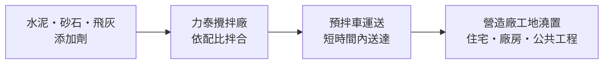
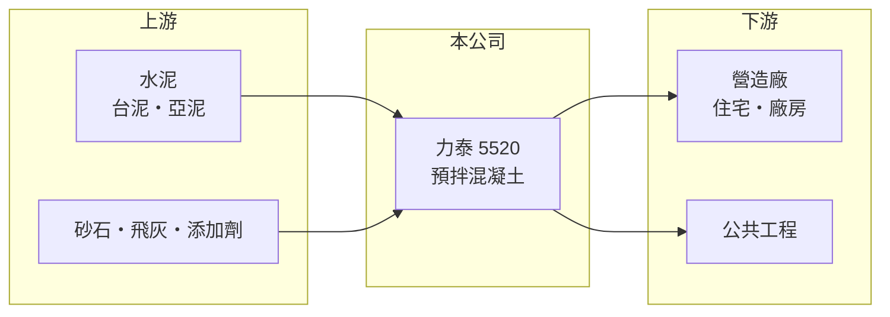

# 5520 力泰

> 上櫃｜[[產業索引-建材營造業|建材營造業]]｜上市（櫃）日期 1999/10/27

# 第一章：企業模式與商業藍圖

> [!info] 撰寫說明
> 精簡版，由 Claude 依公開資料整理，架構比照 [[2330台積電]] 的四章研究，資料截至 2026-10-08。財務數字來源：MoneyDJ 年度財務比率表、nstock 公司概況頁、櫃買中心開放資料（2026 年第二季）；產業描述為整理性內容，尚未逐條比對原始文件。公開資料有限，廠區分布、客戶結構與產品別營收比重未查得。#待校對

在評估單一個股的長期投資價值時，首要步驟是拆解企業的底層獲利邏輯。本章說明力泰建設企業（股票代號：5520，以下簡稱力泰）如何以[[預拌混凝土]]這項看似平凡的建材，建立 ROE 長期接近兩成的穩定事業。

## 一、核心定位：專注預拌混凝土的地區型建材商

力泰成立於 1976 年，1999 年於櫃買中心掛牌，實收資本額約 6.0 億元。雖然公司名稱有「建設」兩字，但依 nstock 整理的公司資料，主要營業項目是預拌混凝土的產銷。預拌混凝土是把水泥、砂石、水與添加劑在攪拌廠依配比混合，再以預拌車送到工地澆置，是所有建築與土木工程都需要的基礎材料。

這項產品有一個關鍵特性：混凝土拌好後必須在短時間內送達並澆置，否則會開始凝固，因此每座攪拌廠只能服務周邊有限半徑內的工地。這使預拌混凝土成為高度在地化的生意，競爭範圍是「同一區域內的幾座攪拌廠」，而不是全國或全球市場。

## 二、商業模式：以量取勝、成本轉嫁

預拌混凝土的毛利來自售價與水泥、砂石成本之間的價差，加上攪拌廠與車隊的使用效率。力泰的營收從 2018 年約 18 億元（推算）成長到 2025 年的 41.86 億元，而毛利率從 2018 年的 4.2% 提升到 2025 年的 22.4%，代表這段期間公司在漲價或成本控制上取得明顯進展；推估與營建需求旺盛時預拌業者議價力提升有關。

## 三、長期方向：跟著營建需求成長

力泰的成長幾乎完全取決於所在區域的營建量。住宅、科技廠房與公共工程都需要大量混凝土，只要營造活動維持，攪拌廠的產能利用率就能保持在高檔。由於混凝土無法遠距運輸，若要擴大市場，就必須在新區域設廠或併購既有攪拌廠，這也是觀察公司長期策略的主要指標（具體擴廠計畫本次未查得）。

# 第二章：護城河深度與競爭優勢

「護城河」指企業抵禦競爭、維持超額利潤的保護機制。本章說明力泰在預拌混凝土這個在地化市場中的優勢。

## 一、護城河的組成

預拌混凝土的護城河是「區位」。攪拌廠需要合法的工業用地、環評與營運許可，在都會區周邊取得新廠址越來越困難，既有廠商因此享有地理上的保護。同一區域內通常只有少數幾家業者，價格競爭有限度。其次是規模與車隊密度，攪拌廠與預拌車越多，越能同時供應大型工程並降低單位運輸成本。力泰 ROE 連續多年在 17% 至 21%，說明這個在地優勢確實存在。

## 二、主要競爭對手

| 對手 | 定位 | 對力泰的威脅 |
|---|---|---|
| [[2504國產]] | 全台規模最大的預拌混凝土業者之一 | 規模與據點較多，可承接大型工程 |
| [[1101台泥]] | 水泥龍頭，旗下有預拌業務 | 握有上游水泥，具成本優勢 |
| [[1102亞泥]] | 水泥大廠，旗下有預拌業務 | 同上 |
| 地區型預拌廠 | 單一或少數攪拌廠 | 在小型工地以價格競爭 |

## 三、守得住／守不住／觀察重點

守得住的是攪拌廠區位與在地客戶關係；守不住的是營建景氣與上游水泥、砂石價格，力泰本身不生產水泥，上游漲價只能靠調整售價轉嫁。長期觀察重點是毛利率能否守在 20% 左右，以及營建量放緩時營收的抗跌程度。

# 第三章：財務體質與盈利規模

資料日期：2026-10-08。數字取自 MoneyDJ 年度財務比率表、nstock 公司概況頁與櫃買中心開放資料，表格是撰寫當時的快照；最新月營收、毛利率、累計 EPS 由自動排程寫在本筆記的屬性欄位（月營收、毛利率、累計EPS 等）。#待校對

財務報表是檢驗護城河是否真實存在的最終標準。本章用五年的三率、ROE 與資本報酬檢視力泰的獲利品質。

## 一、多年度經營績效

| 年度 | 營收（新台幣） | [[毛利率]] | [[營業利益率]] | EPS（元） | [[ROE]] |
|---|---|---|---|---|---|
| 2021 | 約 28 億（推算） | 20.30% | 15.34% | 5.56 | 16.91% |
| 2022 | 約 34 億（推算） | 18.34% | 13.58% | 5.96 | 17.44% |
| 2023 | 約 38 億（推算） | 19.13% | 14.81% | 7.81 | 20.34% |
| 2024 | 約 41 億（推算） | 21.06% | 15.60% | 8.99 | 20.66% |
| 2025 | 41.86 億 | 22.43% | 17.22% | 9.97 | 20.22% |

2025 年營收取自 nstock，其他年度依 MoneyDJ 營收成長率回推。力泰是這批營建股中獲利最穩定的一家：2021 至 2025 年營收年複合成長率約 11%（推算），EPS 每年成長，平均 ROE 約 19.1%（推算），負債比率長期只有 27% 至 31%。2026 年上半年營收 19.3 億元、EPS 5.14 元，毛利率約 24%。

## 二、資本結構與股利

2026 年第二季總資產 47.5 億元、總負債 12.9 億元，負債多為應付帳款等營運負債，幾乎不靠借款經營。預拌混凝土不需要像建商一樣囤地，資本主要投在攪拌廠與車隊，因此能把大部分獲利發放給股東：2025 年度現金股利 7 元，配發率約 70%（推算）；2024 年度 5.5 元，配發率 61%；nstock 統計近五年平均現金股利 4.99 元，股利長期穩定。自由現金流推估多數年度為正（依低負債與高配息推估，未查得現金流量表）。

## 三、[[ROIC]] 與 [[WACC]]：價值創造利差

**ROIC 推算：** 2025 年營業利益約 7.2 億元（41.86 億 × 17.22%），稅後約 5.8 億元。2026 年第二季權益總額 34.6 億元、總負債 12.9 億元，假設有息負債約一成即 1.3 億元（推估），投入資本約 35.9 億元，ROIC 約 16%（推算）；以五年平均營業利益計算約 12.5%（推算）。

**WACC 推算：** 假設台灣 10 年期公債殖利率 1.75%、市場風險溢酬 6%、β 取建材同業常見值 0.9，股東權益成本約 7.2%；負債成本 3%、稅後 2.4%，權益占投入資本約 96%，WACC 約 7.0%（推算）。

**結論：** 力泰的 ROIC 長期高出 WACC 約 5 至 9 個百分點，明確在創造價值。超額報酬來自攪拌廠的區位保護與低資本需求的營運模式，只要所在區域營建需求不大幅萎縮，這種結構可望延續。

# 第四章：總體風險與地緣政治

任何企業都無法脫離宏觀環境獨立存在。本章分析力泰長期必須面對的產業週期與營運風險。

## 一、產業週期

預拌混凝土的需求直接跟著營建業走，房市、公共工程與企業建廠任何一項轉弱，出貨量都會下降。2018 至 2019 年力泰毛利率只有 4% 至 9%，就是營建需求與價格低迷時的樣貌，說明目前的高毛利並非永久不變。

## 二、原物料與成本風險

水泥、砂石、飛灰與柴油都是主要成本。台灣砂石供應受河川疏濬與進口政策影響，價格波動大；水泥價格則受碳費與環保政策推升。若成本上漲而營建需求同時轉弱，售價轉嫁會變得困難。

## 三、法規與環境風險

攪拌廠涉及粉塵、噪音、廢水與交通安全，環保法規趨嚴或地方居民抗爭，可能限制既有廠的營運或擴廠。混凝土品質若出現問題（例如氯離子含量），也會造成重大的商譽與賠償風險。

# 專有名詞解析

## 金融

- **[[毛利率]]**：營業毛利占營收的比率，反映產品售價扣除直接成本後的獲利空間。
- **[[ROIC]]**：投入資本報酬率，稅後營業利益除以股東權益加有息負債，衡量本業運用資本的效率。
- **[[WACC]]**：加權平均資金成本，股東與債權人要求報酬率的加權平均，是 ROIC 要超越的門檻。

## 產業

- **[[預拌混凝土]]**：在攪拌廠依配比把水泥、砂石與水拌合後以預拌車送到工地的混凝土，必須在短時間內澆置，因此屬於在地化產業。

# 核心供應鏈

- 上游：水泥供應商如 [[1101台泥]]、[[1102亞泥]]，砂石、飛灰與添加劑供應商
- 下游／客戶：營造廠與建商的住宅、廠房工地，以及公共工程
- 同業：[[2504國產]]、[[1101台泥]]、[[1102亞泥]]、地區型預拌廠

## 最新新聞
<!-- news:start -->
<!-- news:end -->

## 相關連結
- [公開資訊觀測站](https://mopsov.twse.com.tw/mops/web/t05st03?step=1&firstin=1&co_id=5520)
- [Goodinfo](https://goodinfo.tw/tw/StockDetail.asp?STOCK_ID=5520)
- [Yahoo 股市](https://tw.stock.yahoo.com/quote/5520)
- [鉅亨網新聞](https://www.cnyes.com/twstock/5520/news)
