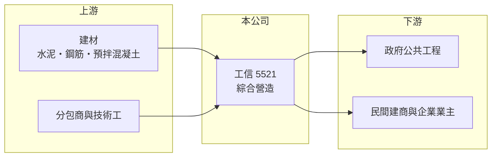

# 5521 工信

> 上市｜[[產業索引-建材營造業|建材營造業]]｜上市（櫃）日期 2012/12/18

# 第一章：企業模式與商業藍圖

> [!info] 撰寫說明
> 精簡版，由 Claude 依公開資料整理，架構比照 [[2330台積電]] 的四章研究，資料截至 2026-10-08。財務數字來源：MoneyDJ 年度財務比率表、證交所開放資料（2026 年第二季、股利）；業務描述取自 Yahoo 股市與工商時報報導標題。公開資料有限，業務別營收比重、在手訂單金額與代表工程未查得。#待校對

在評估單一個股的長期投資價值時，首要步驟是拆解企業的底層獲利邏輯。本章說明工信工程（股票代號：5521，以下簡稱工信）這家歷史悠久的營造廠，如何在營收快速成長的同時面對毛利率偏薄的問題。

## 一、核心定位：老牌甲級綜合營造廠

工信成立於 1947 年，是台灣歷史最久的營造廠之一，2012 年上市，實收資本額約 49.2 億元。營造廠的商業模式是向業主承攬工程、依施工進度認列營收，主要成本是分包、材料與人工。和建商相比，營造廠不需要囤積大量土地，但每一件工程的毛利率通常只有個位數到一成出頭，獲利高度取決於成本控制與合約條件。

工信的業務涵蓋公共工程與民間建築（推估，業務別比重未查得），[[在手訂單]]金額本次也未查得。營收從 2021 年約 36 億元（推算）成長到 2025 年約 90 億元（推算），四年成長約 2.5 倍，代表公司在這段營建熱潮中大量承接新案。

## 二、獲利結構：營收成長快，但利潤很薄

工信 2021 至 2025 年的毛利率在 4.3% 至 8.5% 之間，營業利益率在負 1% 到 2.7% 之間，扣除管理費用後幾乎所剩無幾。財經媒體曾以「疫後工案毛利倍增」「高毛利新案挹注」描述工信近期的變化，意思是 2020 至 2022 年疫情與原物料大漲期間簽下的低毛利舊案逐步完工，新接的案件定價較能反映成本，毛利率因此回升；2026 年上半年毛利率 8.5%、營業利益率 4.9%，已高於過去五年任何一年。

## 三、長期方向：從衝量轉向提升利潤

2020 年工信毛利率曾達 26.4%、EPS 2.26 元，明顯異於其他年度，推估與該年有高毛利的自有開發或特殊工程認列有關（未查得原因）。除了這一年，工信的 EPS 長期在 0.5 元以下。長期來看，工信的課題不是營收規模，而是能否把近百億元的年營收轉化為合理的利潤。

# 第二章：護城河深度與競爭優勢

「護城河」指企業抵禦競爭、維持超額利潤的保護機制。營造業同質性高，本章說明工信的優勢與限制。

## 一、護城河的組成

工信的優勢主要是將近 80 年的施工實績與甲級營造資格。大型公共工程與民間大樓的業主重視營造廠的履約紀錄與財務能力，歷史悠久、實收資本額近 50 億元的工信能參與較大型的標案。不過營造業的價格競爭非常激烈，過去五年的毛利率顯示工信的議價能力有限，護城河很淺。

## 二、主要競爭對手

| 對手 | 定位 | 對工信的威脅 |
|---|---|---|
| [[5515建國]] | 社宅與公共工程為主 | 搶同一批政府標案，近年毛利率較高 |
| [[2546根基]] | 科技廠房與軌道工程 | 在大型民間案具優勢 |
| [[2597潤弘]] | 預鑄工法，科技廠辦 | 以工法差異取得高毛利案 |
| [[5516雙喜]] | 公共工程與社宅 | 在中型標案競爭 |

## 三、守得住／守不住／觀察重點

守得住的是施工資格與承攬規模；守不住的是工料成本與合約定價。長期觀察重點是 2026 年回升的毛利率能否延續，以及營收成長是否伴隨新接案的選擇性提高，而不只是衝量。

# 第三章：財務體質與盈利規模

資料日期：2026-10-08。數字取自 MoneyDJ 年度財務比率表與證交所開放資料，表格是撰寫當時的快照；最新月營收、毛利率、累計 EPS 由自動排程寫在本筆記的屬性欄位（月營收、毛利率、累計EPS 等）。#待校對

財務報表是檢驗護城河是否真實存在的最終標準。本章用五年的三率、ROE 與資本報酬檢視工信的獲利品質。

## 一、多年度經營績效

| 年度 | 營收（新台幣） | [[毛利率]] | [[營業利益率]] | EPS（元） | [[ROE]] |
|---|---|---|---|---|---|
| 2021 | 約 36 億（推算） | 8.54% | 1.96% | 0.07 | 0.63% |
| 2022 | 約 46 億（推算） | 4.75% | 0.65% | 0.02 | 0.20% |
| 2023 | 約 54 億（推算） | 5.94% | 0.84% | 0.14 | 1.26% |
| 2024 | 約 71 億（推算） | 4.33% | -1.03% | 0.02 | 0.18% |
| 2025 | 約 90 億（推算） | 6.72% | 2.74% | 0.52 | 4.61% |

營收以 MoneyDJ 每股營業額乘以目前股數，再依各年營收成長率回推。2021 至 2025 年營收年複合成長率約 26%（推算），但平均 ROE 只有約 1.4%（推算），營收成長沒有轉化為股東報酬。2026 年上半年營收 54.2 億元、EPS 0.58 元，已超過 2025 年全年，是近年獲利最好的半年。股利方面，2025 年度現金股利 0.15 元，配息能力有限。

## 二、營造業指標：財務結構

2026 年第二季總資產 131.5 億元、總負債 73.1 億元，負債比率約 56%，與 MoneyDJ 2024 至 2025 年的 55% 至 59% 相近；2022 年時只有 28%，負債比率上升主要來自工程規模擴大後的合約負債與應付工程款（推估）。每股淨值長期在 10.7 至 11.9 元之間，接近面額，代表過去多年幾乎沒有累積保留盈餘。

## 三、[[ROIC]] 與 [[WACC]]：價值創造利差

**ROIC 推算：** 2025 年營業利益約 2.5 億元（90 億 × 2.74%），稅後約 2.0 億元。2026 年第二季股東權益 58.4 億元、總負債 73.1 億元，假設有息負債約三成即 21.9 億元（推估），投入資本約 80.4 億元，ROIC 約 2.5%（推算）；五年平均約 0.6%（推算）。若以 2026 年上半年營業利益 2.67 億元年化，ROIC 約 5.3%（推算）。

**WACC 推算：** 假設台灣 10 年期公債殖利率 1.75%、市場風險溢酬 6%、β 取營建同業常見值 0.9，股東權益成本約 7.2%；負債成本 3%、稅後 2.4%，權益占投入資本約 73%，WACC 約 5.9%（推算）。

**結論：** 工信過去五年的 ROIC 明顯低於 WACC，長期並未創造價值。2026 年上半年的獲利改善讓利差縮小，但要持續高於資金成本，營業利益率需要穩定在 5% 以上，這對營造業來說並不容易。

# 第四章：總體風險與地緣政治

任何企業都無法脫離宏觀環境獨立存在。本章分析工信長期必須面對的產業週期與營運風險。

## 一、產業週期

營造業需求來自房市、政府公共建設與企業資本支出三個週期。工信營收快速成長的這幾年正逢營建熱潮，一旦房市受[[信用管制]]持續降溫或公共預算縮減，新接案量與價格都可能下滑。

## 二、成本與合約風險

固定總價合約讓營造廠承擔工期中的物價上漲風險，2022 至 2024 年工信的低毛利就是例證。缺工、工資上漲與建材價格波動是長期結構問題，若物價調整條款不足，毛利率可能再度被壓縮。

## 三、規模擴張的執行風險

營收在四年內成長 2.5 倍，代表同時施工的案件與人力大幅增加。工地管理、品質與安全若跟不上規模，可能出現工期延誤、罰款或職安事故，進一步侵蝕本就微薄的利潤。

# 專有名詞解析

## 金融

- **[[營業利益率]]**：營業利益占營收的比率，反映扣除營業費用後本業的獲利能力。
- **[[信用管制]]**：央行限制購屋與建商貸款成數的政策，會影響房市成交與建商資金。
- **[[ROIC]]**：投入資本報酬率，稅後營業利益除以股東權益加有息負債，衡量本業運用資本的效率。
- **[[WACC]]**：加權平均資金成本，股東與債權人要求報酬率的加權平均，是 ROIC 要超越的門檻。

## 產業

- **[[在手訂單]]**：已簽約但尚未完工認列營收的工程金額，可用來預估未來營收。

# 核心供應鏈

- 上游：水泥、鋼材與預拌混凝土供應商如 [[1101台泥]]、[[2002中鋼]]、[[2504國產]]，以及各類分包商
- 下游／客戶：政府機關、民間建商與企業業主（具體客戶未查得）
- 同業：[[5515建國]]、[[2546根基]]、[[2597潤弘]]、[[5516雙喜]]

## 最新新聞
<!-- news:start -->
<!-- news:end -->

## 相關連結
- [公開資訊觀測站](https://mopsov.twse.com.tw/mops/web/t05st03?step=1&firstin=1&co_id=5521)
- [Goodinfo](https://goodinfo.tw/tw/StockDetail.asp?STOCK_ID=5521)
- [Yahoo 股市](https://tw.stock.yahoo.com/quote/5521)
- [鉅亨網新聞](https://www.cnyes.com/twstock/5521/news)
