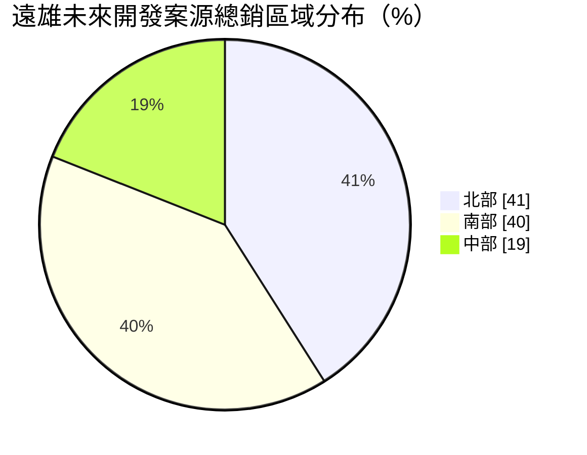
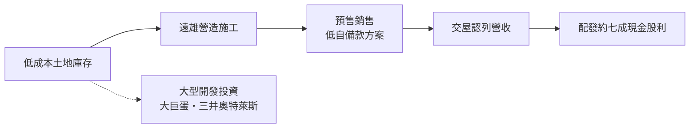
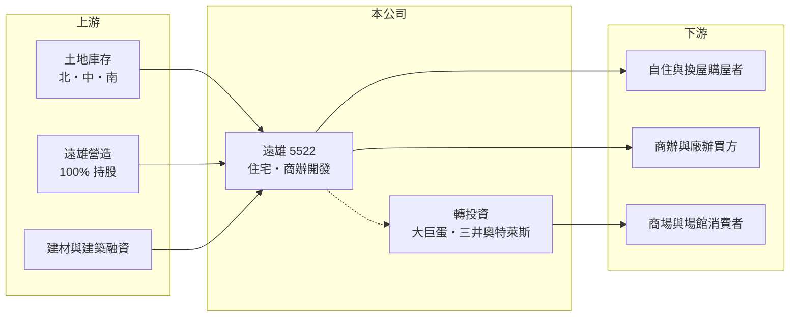

# 5522 遠雄

> 上市｜[[產業索引-建材營造業|建材營造業]]｜上市（櫃）日期 2007/08/06

# 第一章：企業模式與商業藍圖

> [!info] 撰寫說明
> 精簡版，由 Claude 依公開資料整理，架構比照 [[2330台積電]] 的四章研究，資料截至 2026-10-08。財務數字來源：MoneyDJ 年度財務比率表、富果研究 2026 年 9 月法說會整理、證交所開放資料（2026 年第二季、股利）；產業描述為整理性內容，尚未逐條比對原始文件。#待校對

在評估單一個股的長期投資價值時，首要步驟是拆解企業的底層獲利邏輯。本章說明遠雄建設（股票代號：5522，以下簡稱遠雄）如何以垂直整合與大規模土地庫存，成為台灣市值名列前茅的建設開發商。

## 一、核心定位：垂直整合的全台大型建商

遠雄成立於 1978 年，2007 年上市，實收資本額約 78.2 億元，現任董事長為趙文嘉。核心業務是住宅與商辦大樓的投資興建與銷售，營收在[[建案交屋]]時認列。遠雄透過 100% 持股的遠雄營造負責施工，並與關係企業遠雄房地產合作銷售與售後服務，從土地、營造、銷售到物業管理形成垂直整合。

垂直整合的意義在於成本與品質的掌控。營造利潤留在集團內，工期與用料也由自己決定，這是遠雄毛利率長期維持在 30% 至 35% 的原因之一，明顯高於多數需要外包營造的中小型建商。

## 二、案源結構：全台布局、南北並重

依 2026 年 9 月法說會，遠雄 2026 年以後的未來開發案源總銷約 3,094 億元，區域分布如下：

南部占比高達四成，反映遠雄近年積極布局高雄與台南等半導體帶動的區域；2027 年預計推出 5 案、總銷 720 億元，包括桃園 A7 與高雄鼓山兩個 200 億元級大案，以及約 50 億元的泰山廠辦案。已售未認列營收接近 800 億元，約為 2025 年營收的 2.5 倍（推算），代表未來兩到三年的營收能見度高。

## 三、資本轉化邏輯與長期布局

除了住宅本業，遠雄持有臺北大巨蛋綜合持股 28%，以及與日本三井不動產合資的桃園三新奧特萊斯 30%。大巨蛋園區百貨已開幕、飯店預計 2026 年開業，公司預期 2029 年達到損益平衡；奧特萊斯則提供穩定現金流。這些長期持有型資產的回收期很長，但能為公司帶來住宅週期以外的收入來源。產品上，遠雄以綠能、智慧與性能建築為核心，近十年有超過 30 件建案取得綠建築標章。

# 第二章：護城河深度與競爭優勢

「護城河」指企業抵禦競爭、維持超額利潤的保護機制。本章分析遠雄在高度分散的建設業中，靠什麼維持較高的毛利率。

## 一、遠雄護城河的核心組成要素

第一是低成本的土地庫存。遠雄長期累積大量早年取得的土地，帳面成本遠低於現在的市價，這是毛利率高於同業的最大來源，也是新進者無法複製的優勢。第二是垂直整合帶來的成本控制與交屋穩定度。第三是規模經濟與品牌，全台同時推案讓遠雄能分散單一區域的景氣風險，品牌知名度也有助於在中南部新市場打開銷售。

## 二、主要競爭對手

| 對手 | 定位 | 對遠雄的威脅 |
|---|---|---|
| [[2542興富發]] | 全台推案量最大的建商之一 | 在首購與中價位市場以量與價格競爭 |
| [[2501國建]] | 全台品牌建商，與三井合作 | 在大型開發與品牌客群競爭 |
| [[2520冠德]] | 雙北為主，含捷運聯開 | 在北部大型案競爭 |
| [[5519隆大]] | 高雄在地建商 | 在高雄自住市場競爭 |

## 三、守得住／守不住／觀察重點

守得住的是低成本土地帶來的毛利優勢與垂直整合；守不住的是區域景氣，2026 年法說會提到雙北銷售較佳（如「明月」銷售率超過七成），台中「遠雄峯上」銷售率約 15%，中南部去化明顯較慢。長期觀察重點是 3,094 億元案源中的南部大案去化，以及大巨蛋能否如期達到損益平衡。

# 第三章：財務體質與盈利規模

資料日期：2026-10-08。數字取自 MoneyDJ 年度財務比率表、富果研究法說會整理與證交所開放資料，表格是撰寫當時的快照；最新月營收、毛利率、累計 EPS 由自動排程寫在本筆記的屬性欄位（月營收、毛利率、累計EPS 等）。#待校對

財務報表是檢驗護城河是否真實存在的最終標準。本章用五年的三率、ROE、營建業指標與資本報酬檢視遠雄的獲利品質。

## 一、多年度經營績效

| 年度 | 營收（新台幣） | [[毛利率]] | [[營業利益率]] | EPS（元） | [[ROE]] |
|---|---|---|---|---|---|
| 2021 | 約 331 億（推算） | 33.69% | 24.68% | 7.78 | 14.13% |
| 2022 | 約 266 億（推算） | 34.76% | 26.09% | 7.04 | 12.35% |
| 2023 | 約 219 億（推算） | 30.10% | 21.51% | 4.76 | 8.24% |
| 2024 | 約 224 億（推算） | 31.64% | 21.59% | 4.32 | 7.35% |
| 2025 | 約 312 億（推算） | 34.15% | 24.76% | 7.45 | 12.03% |

營收以 MoneyDJ 每股營業額乘以目前股數，再依營收成長率回推。遠雄的毛利率五年都在 30% 以上，營業利益率 21% 至 26%，在大型建商中屬於高水準；2021 至 2025 年平均 ROE 約 10.8%（推算），2018 年以來每年都有獲利。2026 年上半年營收 85.3 億元、毛利率 35.5%、EPS 1.99 元。

## 二、營建業指標：已售未入帳、存貨與股利

已售未認列營收近 800 億元、線上銷售中未售金額約 960 億元。2026 年 6 月底存貨 808.6 億元，占總資產 1,090 億元的 74%；總負債 613.3 億元，負債比率約 56%，流動比率 172%。股利政策明確：公司表示未來現金股利配發率維持七成左右，並採每年兩次分配；2025 年度現金股利 5.5 元，以 EPS 7.45 元計算配發率約 74%（推算），2026 年上半年另配發 1.0 元。

## 三、[[ROIC]] 與 [[WACC]]：價值創造利差

**ROIC 推算：** 2025 年營業利益約 77.2 億元（312 億 × 24.76%），稅後約 61.7 億元。2026 年第二季股東權益 476.7 億元、總負債 613.3 億元，假設六成為有息負債約 368 億元（推估），投入資本約 845 億元，ROIC 約 7.3%（推算）；以五年平均營業利益計算約 6.1%（推算）。

**WACC 推算：** 假設台灣 10 年期公債殖利率 1.75%、市場風險溢酬 6%、β 取營建同業常見值 0.9，股東權益成本約 7.2%；負債成本 3%、稅後 2.4%，權益占投入資本約 56%，WACC 約 5.1%（推算）。

**結論：** 遠雄的 ROIC 長期略高於 WACC，五年平均利差約 1 個百分點，屬於溫和創造價值。高毛利主要來自早年取得的低成本土地，隨著舊土地用完、新土地以市價取得，毛利率可能逐步向同業靠攏；大巨蛋等長期投資回收慢，也會拉低整體資本報酬。

# 第四章：總體風險與地緣政治

任何企業都無法脫離宏觀環境獨立存在。本章分析遠雄長期必須面對的房市週期、政策與投資風險。

## 一、產業週期與政策

房地產景氣循環長，央行[[信用管制]]與金融緊縮直接影響購屋貸款，法說會提到中南部受金融緊縮影響、銷售速度放緩。公司對 2027 年房市抱持「審慎樂觀」，2026 年選舉後的政策走向也是變數。

## 二、存貨與資本密集

存貨占總資產 74%，代表遠雄的資本大多壓在土地與在建工程上。若房市長期量縮，去化速度變慢，資本報酬率會被拉低，利息負擔也會增加。3,094 億元的龐大案源是成長潛力，也是需要長期資金支撐的負擔。

## 三、大型投資風險

大巨蛋全區營運後折舊增加，公司預期 2029 年才達損益平衡。這類大型公共建設 BOT 案牽涉政府監督、營運與公共安全議題，過去也曾引發爭議，對品牌與財務都有潛在影響。

# 專有名詞解析

## 金融

- **[[信用管制]]**：央行限制購屋與建商貸款成數的政策，會影響房市成交與建商資金。
- **[[ROIC]]**：投入資本報酬率，稅後營業利益除以股東權益加有息負債，衡量本業運用資本的效率。
- **[[WACC]]**：加權平均資金成本，股東與債權人要求報酬率的加權平均，是 ROIC 要超越的門檻。

## 產業

- **[[建案交屋]]**：建商在房屋完工並交付買方時才認列營收，因此營建公司的營收常集中在交屋年度。
- **[[已售未入帳]]**：已經賣出、但尚未完工交屋而未認列營收的建案金額，是建商未來營收的主要能見度指標。

# 核心供應鏈

- 上游：自有土地庫存、遠雄營造、水泥與鋼材供應商如 [[1101台泥]]、[[2002中鋼]]、銀行建築融資
- 下游／客戶：全台自住與換屋購屋者、商辦與廠辦買方、大巨蛋與奧特萊斯消費者
- 同業：[[2542興富發]]、[[2501國建]]、[[2520冠德]]、[[5519隆大]]

## 最新新聞
<!-- news:start（自動產生，請勿手動編輯此範圍） -->
- 2026-10-08 📰 媒體 19:51｜營收速報 - 遠雄(5522)9月營收49.95億元年增率高達262.47％｜[鉅亨網](https://news.cnyes.com/news/id/6625892)

完整紀錄：[[5522遠雄 新聞]]
<!-- news:end -->

## 相關連結
- [公開資訊觀測站](https://mopsov.twse.com.tw/mops/web/t05st03?step=1&firstin=1&co_id=5522)
- [Goodinfo](https://goodinfo.tw/tw/StockDetail.asp?STOCK_ID=5522)
- [Yahoo 股市](https://tw.stock.yahoo.com/quote/5522)
- [鉅亨網新聞](https://www.cnyes.com/twstock/5522/news)
