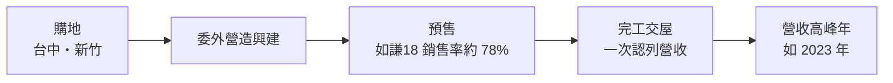
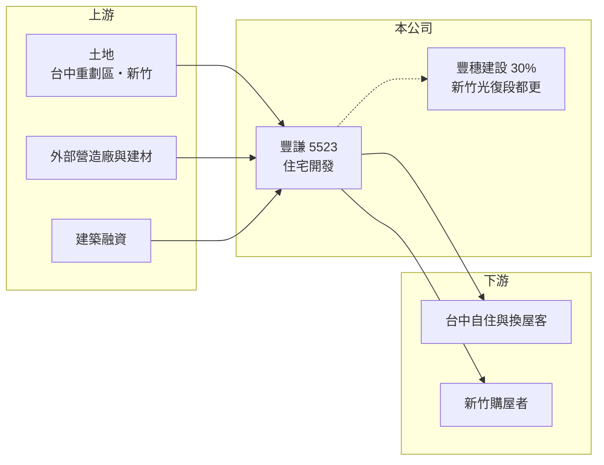

# 5523 豐謙

> 上櫃｜[[產業索引-建材營造業|建材營造業]]｜上市（櫃）日期 1999/12/27

# 第一章：企業模式與商業藍圖

> [!info] 撰寫說明
> 精簡版，由 Claude 依公開資料整理，架構比照 [[2330台積電]] 的四章研究，資料截至 2026-10-08。財務數字來源：MoneyDJ 年度財務比率表、富果研究 2025 年 11 月法說會整理、櫃買中心開放資料（2026 年第二季）；產業描述為整理性內容，尚未逐條比對原始文件。#待校對

在評估單一個股的長期投資價值時，首要步驟是拆解企業的底層獲利邏輯。本章說明豐謙建設（股票代號：5523，以下簡稱豐謙）這家以台中為主、兼做新竹的中型建商，如何在「一年大賺、一年空窗」的節奏中經營。

## 一、核心定位：委外營造的區域型住宅建商

豐謙成立於 1984 年，1999 年於櫃買中心掛牌，實收資本額約 15.5 億元。它的商業模式是購地後委託營造廠興建住宅大樓並銷售，推案集中在台中，並延伸到新竹、桃園等北部地區。豐謙沒有自己的營造體系，好處是組織精簡、固定成本低，壞處是營造利潤要讓給外部廠商，成本控制力也較弱。

產品定位以自住與換屋客群為主，興建中的三案都在台中重劃區或成熟生活圈，坪數多在 36 至 47 坪，屬於家庭換屋的主力產品。

## 二、推案節奏：營收高度集中在交屋年

豐謙每次只有少數幾個個案在進行，營收因為[[建案交屋]]才認列而呈現劇烈跳動。2023 年新竹「VITA」（總銷 21.9 億元）與台中「森立方」（16.9 億元）同時完工交屋，營收衝到 33.31 億元、EPS 3.73 元；2024 年只剩 5.12 億元，2025 年前三季幾乎沒有建案入帳，EPS 為負。

依 2025 年 11 月法說會，興建中三案合計總銷約 88 億元：台中東區「謙18」約 30 億元、14 期重劃區「HOME+」約 28 億元，預計 2026 年完工；單元五「植得」約 30 億元，預計 2027 年完工。這三案的總銷約為 2023 年高峰營收的 2.6 倍，若順利交屋，2026 至 2027 年將是豐謙的另一個收成期。

## 三、長期方向：新竹光復段公辦都更

豐謙持有豐穗建設 30% 股權（與大美建設合資），參與新竹光復段公辦[[都更]]案，基地約 10,460 坪、總投資約 280 億元，預計 2030 年完工。這個案子的規模遠大於豐謙過去任何一案，若成功，可擴大公司規模並分散台中的區域風險。公司另持有嘉義縣約 1.87 萬坪的旅館用地，目前沒有開發計畫。

# 第二章：護城河深度與競爭優勢

「護城河」指企業抵禦競爭、維持超額利潤的保護機制。本章說明豐謙在台中市場的競爭位置。

## 一、護城河的組成

豐謙的優勢在於產品定位清楚與區域經驗。長期在台中推出自住型產品，對各重劃區的客群與價格帶較熟悉，能較精準地規劃坪數與總價。毛利率在有交屋的年度多落在 22% 至 30%，代表選地與定價能力尚可。但豐謙沒有自有營造、規模也小，難以在成本或品牌上建立明顯優勢，護城河很窄。

## 二、主要競爭對手

| 對手 | 定位 | 對豐謙的威脅 |
|---|---|---|
| [[5525順天]] | 台中核心重劃區建商 | 在 14 期、南屯等區域客群重疊 |
| [[2542興富發]] | 全台大型建商，台中推案量大 | 以量與價格搶客 |
| [[5522遠雄]] | 全台品牌建商 | 在台中大型案競爭 |
| 台中在地建商 | 深耕單一重劃區 | 土地與價格靈活 |

## 三、守得住／守不住／觀察重點

守得住的是自住型產品的定位；守不住的是台中的供給量，台中是近年推案量最大的城市之一，競爭激烈。長期觀察重點是謙18、HOME+ 能否在 2026 年如期交屋，以及新竹光復段都更案的進度。

# 第三章：財務體質與盈利規模

資料日期：2026-10-08。數字取自 MoneyDJ 年度財務比率表、富果研究法說會整理與櫃買中心開放資料，表格是撰寫當時的快照；最新月營收、毛利率、累計 EPS 由自動排程寫在本筆記的屬性欄位（月營收、毛利率、累計EPS 等）。#待校對

財務報表是檢驗護城河是否真實存在的最終標準。本章用五年的三率、ROE 與資本報酬檢視豐謙的獲利品質。

## 一、多年度經營績效

| 年度 | 營收（新台幣） | [[毛利率]] | [[營業利益率]] | EPS（元） | [[ROE]] |
|---|---|---|---|---|---|
| 2021 | 約 31 億（推算） | 28.62% | 22.58% | 5.91 | 46.21% |
| 2022 | 2.17 億 | 30.23% | 8.00% | 3.03 | 17.19% |
| 2023 | 33.31 億 | 22.64% | 17.35% | 3.73 | 19.27% |
| 2024 | 5.12 億 | 28.48% | 16.78% | 0.55 | 2.73% |
| 2025 | 約 0.05 億（推算） | 75.57% | -455.64% | -0.09 | -0.47% |

2022 至 2024 年營收取自富果整理，2021 年依 MoneyDJ 營收成長率回推，2025 年依每股營業額推算。2022 年營收只有 2.17 億元，EPS 卻有 3.03 元，推估有建案以外的處分或業外收益（原因未查得）。2021 至 2025 年平均 ROE 約 17%（推算），但幾乎全部來自 2021 至 2023 年，沒有交屋的年度 ROE 接近零。2026 年上半年營收僅 0.02 億元、EPS 負 0.07 元。

## 二、營建業指標：在建總銷與股利

在建三案總銷約 88 億元，謙18 銷售率約 78%。2025 年 9 月底流動比率 230%、速動比率 15%，代表流動資產幾乎全是土地與在建工程；2026 年第二季總資產 58.4 億元、總負債 30.0 億元，負債比率約 51%。股利隨交屋年度起伏：2023 年度現金股利 1.5 元（配發率 40%），2024 年度 0.5 元（配發率 91%）。

## 三、[[ROIC]] 與 [[WACC]]：價值創造利差

**ROIC 推算：** 由於營收高度集中，以 2021 至 2025 年平均營業利益約 2.7 億元計算，稅後約 2.2 億元。2026 年第二季股東權益 28.4 億元、總負債 30.0 億元，假設六成為有息負債約 18.0 億元（推估），投入資本約 46.4 億元，五年平均 ROIC 約 4.7%（推算）。

**WACC 推算：** 假設台灣 10 年期公債殖利率 1.75%、市場風險溢酬 6%、β 取營建同業常見值 0.9，股東權益成本約 7.2%；負債成本 3%、稅後 2.4%，權益占投入資本約 61%，WACC 約 5.3%（推算）。

**結論：** 拉長五年看，豐謙的 ROIC 略低於 WACC，大致只賺回資金成本。若 88 億元在建案能以過去 22% 至 30% 的毛利率入帳，2026 至 2027 年的報酬率會明顯改善；長期能否創造價值，取決於能否縮短交屋空窗、讓資本周轉更順暢。

# 第四章：總體風險與地緣政治

任何企業都無法脫離宏觀環境獨立存在。本章分析豐謙長期必須面對的房市週期與營運風險。

## 一、產業週期與政策

[[信用管制]]使投資客進場意願下降、交易量萎縮，是公司法說會點名的主要風險。台中近年供給量大，若需求轉弱，重劃區新案的去化與價格都會受壓。

## 二、營收集中風險

豐謙同時進行的案子很少，營收高度依賴謙18、HOME+ 等少數個案的完工與交屋進度。只要一案的工程或交屋延後，整年的營收與獲利就可能大幅落空。

## 三、成本與轉投資風險

委外營造讓豐謙在工料上漲時議價力較弱。新竹光復段都更案投資規模達 280 億元，雖然豐謙只持股 30%，但時程長、牽涉公部門與地主，若進度延誤或成本超支，可能需要額外投入資金。

# 專有名詞解析

## 金融

- **[[信用管制]]**：央行限制購屋與建商貸款成數的政策，會影響房市成交與建商資金。
- **[[ROIC]]**：投入資本報酬率，稅後營業利益除以股東權益加有息負債，衡量本業運用資本的效率。
- **[[WACC]]**：加權平均資金成本，股東與債權人要求報酬率的加權平均，是 ROIC 要超越的門檻。

## 產業

- **[[建案交屋]]**：建商在房屋完工並交付買方時才認列營收，因此營建公司的營收常集中在交屋年度。
- **[[都更]]**：都市更新，由地主與建商合作把老舊建物改建，地主依權利價值分回房地或收益。

# 核心供應鏈

- 上游：台中與新竹土地、外部營造廠、建材商如 [[1101台泥]]、銀行建築融資
- 下游／客戶：台中與新竹的自住與換屋購屋者
- 同業：[[5525順天]]、[[2542興富發]]、[[5522遠雄]]、台中在地建商

## 最新新聞
<!-- news:start -->
<!-- news:end -->

## 相關連結
- [公開資訊觀測站](https://mopsov.twse.com.tw/mops/web/t05st03?step=1&firstin=1&co_id=5523)
- [Goodinfo](https://goodinfo.tw/tw/StockDetail.asp?STOCK_ID=5523)
- [Yahoo 股市](https://tw.stock.yahoo.com/quote/5523)
- [鉅亨網新聞](https://www.cnyes.com/twstock/5523/news)
