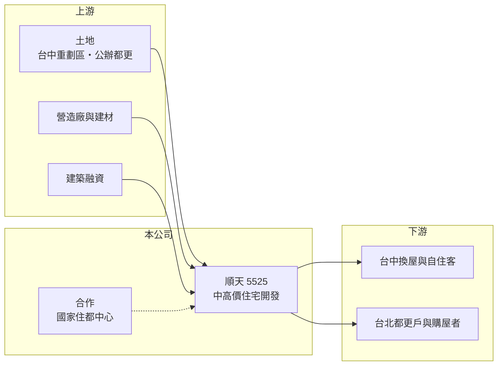

# 5525 順天

> 上市｜[[產業索引-建材營造業|建材營造業]]｜上市（櫃）日期 2004/11/26

# 第一章：企業模式與商業藍圖

> [!info] 撰寫說明
> 精簡版，由 Claude 依公開資料整理，架構比照 [[2330台積電]] 的四章研究，資料截至 2026-10-08。財務數字來源：MoneyDJ 年度財務比率表、聯合新聞網 2025 年 12 月報導、證交所開放資料（2026 年第二季、股利）；產業描述為整理性內容，尚未逐條比對原始文件。#待校對

在評估單一個股的長期投資價值時，首要步驟是拆解企業的底層獲利邏輯。本章說明順天建設（股票代號：5525，以下簡稱順天）如何以台中核心重劃區為主場，並逐步把觸角延伸到台北市的[[都更]]案。

## 一、核心定位：台中重劃區的中高價住宅建商

順天成立於 1987 年，2004 年上市，實收資本額約 31.8 億元。它的本業是購地興建住宅後銷售，推案集中在台中的南屯、北屯 14 期重劃區與太平等區域。南屯、14 期屬於台中房價較高的成熟或新興重劃區，順天在此推出的產品以中高價自住與換屋客為主，例如 2025 年推出的南屯「MR.L」，實價登錄每坪均價約 78 萬元、最高約 88 萬元。

法人分析認為，集中於核心重劃區與成熟生活圈有助降低銷售風險，高端產品的價格帶也較明確，受首購限縮政策的影響較小。這是順天的主要策略：不追求全台布局，而是在少數高價區域做出辨識度。

## 二、推案與完工節奏

順天的營收依[[建案交屋]]認列，因此年度之間波動很大。依聯合新聞網報導：

- 2025 年完工：南屯「ONE 33」、太平「順天緮華」A 區與 C 區，總銷合計 94.6 億元，交屋集中在 2025 年第四季末至 2026 年上半年。
- 2026 年完工：太平「順天緮華 B 區」、「順天蘊華」，總銷合計 48.1 億元。
- 未來三年約有 200 億元案量陸續完工入帳。
- 2026 年起的推案量合計逾 150 億元，包括北屯 14 期兩案與台北信義區兒福中心 A1 都更案。

這個節奏解釋了為何 2025 年營收大減、2026 年上半年營收又大幅跳升到 38.8 億元，EPS 2.33 元。

## 三、長期方向：穩健拓展北部

順天與國家住宅及都市更新中心合作的台北信義區兒福中心 A1 都更案，預計 2030 年完工，是公司跨出台中的重要一步。公辦都更由公部門主導整合，建商以實施者身分投入資金與興建，土地取得風險較低，但利潤也受合約限制。這類案子能讓順天累積台北市的實績與品牌，降低對台中單一市場的依賴。

# 第二章：護城河深度與競爭優勢

「護城河」指企業抵禦競爭、維持超額利潤的保護機制。本章說明順天在台中高價住宅市場的優勢。

## 一、護城河的組成

順天的優勢來自地段與產品定位。在台中核心重劃區取得土地需要長期關係與資金，順天累積多個個案後，在南屯、14 期已建立一定的品牌辨識度，中高價客群對品牌的重視高於首購族，較能支撐售價。毛利率在有交屋的年度多落在 23% 至 39%，顯示定價能力尚可。不過台中建商眾多，這個優勢仍屬窄護城河。

## 二、主要競爭對手

| 對手 | 定位 | 對順天的威脅 |
|---|---|---|
| [[5523豐謙]] | 台中自住型住宅 | 在重劃區客群重疊 |
| [[2542興富發]] | 全台大型建商，台中推案量大 | 以量與價格搶客 |
| [[5522遠雄]] | 全台品牌建商 | 在台中大型案競爭 |
| 台中在地品牌建商 | 深耕七期、單元區等 | 在高價產品直接競爭 |

## 三、守得住／守不住／觀察重點

守得住的是核心地段與中高價客群；守不住的是台中整體供給與政策，公司也表示政策面是房市最大變數。長期觀察重點是 200 億元完工案的交屋與收款進度、北屯 14 期新案的去化，以及信義區都更案的推進。

# 第三章：財務體質與盈利規模

資料日期：2026-10-08。數字取自 MoneyDJ 年度財務比率表、聯合新聞網報導與證交所開放資料，表格是撰寫當時的快照；最新月營收、毛利率、累計 EPS 由自動排程寫在本筆記的屬性欄位（月營收、毛利率、累計EPS 等）。#待校對

財務報表是檢驗護城河是否真實存在的最終標準。本章用五年的三率、ROE 與資本報酬檢視順天的獲利品質。

## 一、多年度經營績效

| 年度 | 營收（新台幣） | [[毛利率]] | [[營業利益率]] | EPS（元） | [[ROE]] |
|---|---|---|---|---|---|
| 2021 | 約 8 億（推算） | 28.50% | -9.06% | -0.20 | -1.27% |
| 2022 | 約 56 億（推算） | 22.87% | 13.71% | 2.39 | 14.26% |
| 2023 | 約 52 億（推算） | 27.28% | 17.54% | 2.50 | 13.60% |
| 2024 | 約 47 億（推算） | 26.92% | 16.05% | 2.06 | 11.27% |
| 2025 | 約 24 億（推算） | 39.11% | 20.89% | 1.40 | 7.81% |

營收以 MoneyDJ 每股營業額乘以目前股數，再依各年營收成長率回推，僅供量級參考。2021 至 2025 年平均 ROE 約 9.1%（推算），扣除 2021 年的交屋空窗，2022 至 2024 年 ROE 穩定在 11% 至 14%。2026 年上半年營收 38.8 億元、毛利率 33.8%、營業利益率 26.1%，獲利結構良好。

## 二、營建業指標：完工案量、負債與股利

未來三年約 200 億元完工入帳，約為 2022 年高峰營收的 3.6 倍（推算），營收能見度高。2026 年第二季總資產 191.8 億元、總負債 132.5 億元，負債比率約 69%，MoneyDJ 歷年資料也在 62% 至 77% 之間，槓桿高於多數建商，主要是土地與在建工程的建築融資。股利方面，2025 年度現金股利 1.2 元，以 EPS 1.40 元計算配發率約 86%（推算）。

## 三、[[ROIC]] 與 [[WACC]]：價值創造利差

**ROIC 推算：** 2021 至 2025 年平均營業利益約 5.7 億元，稅後約 4.6 億元。2026 年第二季權益總額 59.4 億元、總負債 132.5 億元，假設六成為有息負債約 79.5 億元（推估），投入資本約 138.9 億元，五年平均 ROIC 約 3.3%（推算）；2025 年單年約 2.9%（推算）。若以 2026 年上半年營業利益 10.1 億元年化，ROIC 約 11.7%（推算），但這是交屋高峰，不宜視為常態。

**WACC 推算：** 假設台灣 10 年期公債殖利率 1.75%、市場風險溢酬 6%、β 取營建同業常見值 0.9，股東權益成本約 7.2%；負債成本 3%、稅後 2.4%，權益占投入資本約 43%，WACC 約 4.4%（推算）。順天槓桿較高，實際 WACC 可能高於推算值。

**結論：** 五年平均 ROIC 略低於 WACC，代表過去整體只勉強打平資金成本；2026 年起大量完工入帳，若能維持三成以上的毛利率，ROIC 可望明顯高於 WACC。長期能否持續創造價值，取決於交屋高峰之後的推案能否無縫接上。

# 第四章：總體風險與地緣政治

任何企業都無法脫離宏觀環境獨立存在。本章分析順天長期必須面對的房市週期與財務風險。

## 一、產業週期與政策

公司預期房市「量穩價平」，並把政策視為最大變數。[[信用管制]]、房地合一稅與預售屋管制都會影響中高價換屋客的購買力與意願。台中近年推案量大，供給壓力是長期隱憂。

## 二、財務槓桿風險

負債比率接近七成，建築融資的利率與成數變化會直接影響財務成本。若完工案交屋收款不如預期，或銀行收緊建融，資金調度壓力會升高。

## 三、區域集中與都更執行

營收主要來自台中，區域景氣轉弱時缺乏分散。台北信義區都更案涉及公部門與時程管理，若延誤會影響北部布局的進度與資金回收。

# 專有名詞解析

## 金融

- **[[信用管制]]**：央行限制購屋與建商貸款成數的政策，會影響房市成交與建商資金。
- **[[ROIC]]**：投入資本報酬率，稅後營業利益除以股東權益加有息負債，衡量本業運用資本的效率。
- **[[WACC]]**：加權平均資金成本，股東與債權人要求報酬率的加權平均，是 ROIC 要超越的門檻。

## 產業

- **[[建案交屋]]**：建商在房屋完工並交付買方時才認列營收，因此營建公司的營收常集中在交屋年度。
- **[[都更]]**：都市更新，由地主與建商合作把老舊建物改建，地主依權利價值分回房地或收益。

# 核心供應鏈

- 上游：台中重劃區土地、國家住宅及都市更新中心（公辦都更）、營造廠與建材商如 [[1101台泥]]、銀行建築融資
- 下游／客戶：台中中高價自住與換屋購屋者、台北信義區都更案購屋者
- 同業：[[5523豐謙]]、[[2542興富發]]、[[5522遠雄]]、台中在地品牌建商

## 最新新聞
<!-- news:start（自動產生，請勿手動編輯此範圍） -->
- 2026-10-08 📰 媒體 19:51｜營收速報 - 順天(5525)9月營收3.05億元年增率高達906.5％｜[鉅亨網](https://news.cnyes.com/news/id/6625893)

完整紀錄：[[5525順天 新聞]]
<!-- news:end -->

## 相關連結
- [公開資訊觀測站](https://mopsov.twse.com.tw/mops/web/t05st03?step=1&firstin=1&co_id=5525)
- [Goodinfo](https://goodinfo.tw/tw/StockDetail.asp?STOCK_ID=5525)
- [Yahoo 股市](https://tw.stock.yahoo.com/quote/5525)
- [鉅亨網新聞](https://www.cnyes.com/twstock/5525/news)
