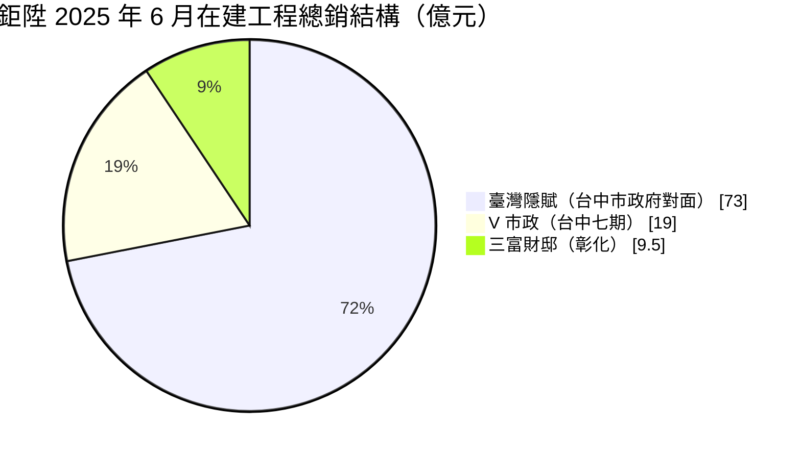
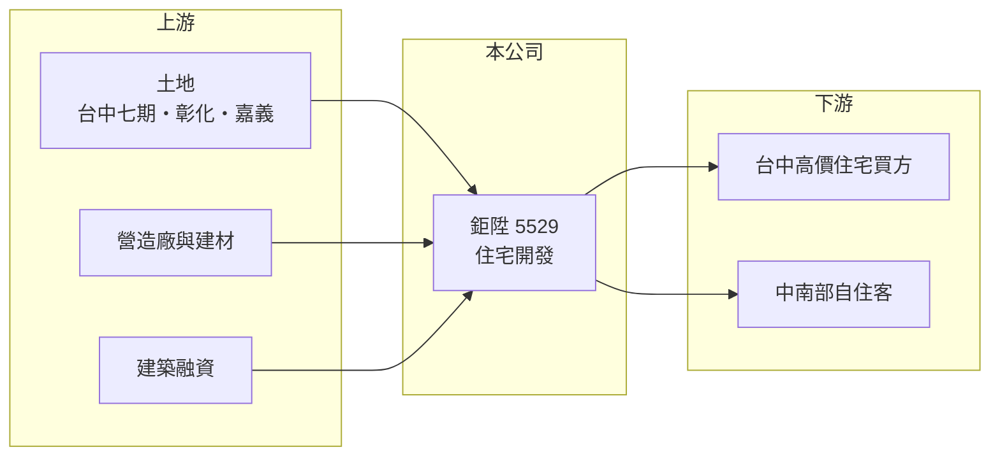

# 5529 鉅陞

> 上櫃｜[[產業索引-建材營造業|建材營造業]]｜上市（櫃）日期 1996/01/12

# 第一章：企業模式與商業藍圖

> [!info] 撰寫說明
> 精簡版，由 Claude 依公開資料整理，架構比照 [[2330台積電]] 的四章研究，資料截至 2026-10-08。財務數字來源：MoneyDJ 年度財務比率表、富果研究 2025 年 6 月法說會整理、櫃買中心開放資料（2026 年第二季）；產業描述為整理性內容，尚未逐條比對原始文件。公司沿革與轉型過程未查得。#待校對

在評估單一個股的長期投資價值時，首要步驟是拆解企業的底層獲利邏輯。本章說明鉅陞（股票代號：5529）如何從連續多年虧損，靠台中市政路兩個大案走向轉虧為盈。

## 一、核心定位：以台中為中心的住宅開發商

鉅陞成立於 1970 年，1996 年於櫃買中心掛牌，實收資本額約 10.6 億元。依 2025 年 6 月法說會，公司專注不動產開發與銷售，以台中為中心並逐步拓展到彰化、嘉義等中南部城市，選地偏好生活機能完善、交通便利的區域。營收在[[建案交屋]]時認列，因此在沒有新案完工的年份，營收幾乎歸零。

鉅陞 2018 至 2024 年連續七年虧損，每股淨值一度只剩 6 至 7 元。2025 年台中「V 市政」交屋後，全年 EPS 2.01 元，正式轉虧為盈，公司稱是兌現三年前的承諾。這段歷程說明小型建商的命運高度取決於少數個案能否順利完工交屋。

## 二、推案結構：一個大案決定數年營收

依法說會，鉅陞在建工程總銷約 101.5 億元：

其中「臺灣隱賦」總銷 73 億元，約為公司股本的 7 倍，預計 2026 年第二季取得使照、第三季交屋；「V 市政」19 億元已於 2025 年底起交屋；彰化「三富財邸」9.5 億元預計 2028 年第一季交屋。另規劃彰化平和段（約 13.5 億元）與嘉義後莊段（約 12 億元）新案，合計約 25.5 億元。這種結構代表鉅陞 2026 年的獲利會高度集中在臺灣隱賦一案，之後則要靠中南部新案接續。

## 三、長期方向：服務差異化與中南部擴張

鉅陞以「有感建築」為品牌主軸，自 V 市政起導入第三方驗屋（7 大類 48 項檢測、由專業技師簽證），並提供交屋後一年免費社區代管。對中小型建商而言，交屋品質與售後服務是建立口碑的少數途徑。未來在彰化與嘉義推案，則是把台中累積的經驗複製到土地成本較低的城市。

# 第二章：護城河深度與競爭優勢

「護城河」指企業抵禦競爭、維持超額利潤的保護機制。本章說明鉅陞的競爭位置與限制。

## 一、護城河的組成

鉅陞目前沒有明顯的結構性護城河。它的優勢主要是台中七期、市政府周邊等精華地段的個案，以及第三方驗屋等服務差異化。七期是台中房價最高的區域之一，地段本身支撐了售價，2025 年毛利率 33.5%。但這些優勢依附在個別土地上，下一塊地能否同樣取得、同樣賺錢，並沒有保證。

## 二、主要競爭對手

| 對手 | 定位 | 對鉅陞的威脅 |
|---|---|---|
| [[5525順天]] | 台中核心重劃區中高價住宅 | 在七期、南屯高價客群競爭 |
| [[5523豐謙]] | 台中自住型住宅 | 在重劃區客群重疊 |
| [[2542興富發]] | 全台大型建商 | 以量與價格搶客 |
| 台中豪宅建商 | 深耕七期豪宅 | 在高價產品直接競爭 |

## 三、守得住／守不住／觀察重點

守得住的是已取得的精華地段個案；守不住的是案源的連續性，鉅陞過去七年虧損正是推案斷層的結果。長期觀察重點是臺灣隱賦交屋收款是否順利，以及交屋後能否把資金投入新案，避免再度出現空窗。

# 第三章：財務體質與盈利規模

資料日期：2026-10-08。數字取自 MoneyDJ 年度財務比率表、富果研究法說會整理與櫃買中心開放資料，表格是撰寫當時的快照；最新月營收、毛利率、累計 EPS 由自動排程寫在本筆記的屬性欄位（月營收、毛利率、累計EPS 等）。#待校對

財務報表是檢驗護城河是否真實存在的最終標準。本章用五年的三率、ROE 與資本報酬檢視鉅陞的獲利品質。

## 一、多年度經營績效

| 年度 | 營收（新台幣） | [[毛利率]] | [[營業利益率]] | EPS（元） | [[ROE]] |
|---|---|---|---|---|---|
| 2021 | 約 0.5 億（推算） | 29.36% | -180.52% | -1.03 | -15.63% |
| 2022 | 約 1.7 億（推算） | 24.58% | -40.00% | -0.71 | -9.59% |
| 2023 | 約 1.5 億（推算） | 37.91% | -50.50% | -1.15 | -9.47% |
| 2024 | 約 0.8 億（推算） | 58.43% | -95.21% | -0.94 | -7.86% |
| 2025 | 約 10 億（推算） | 33.51% | 19.27% | 2.01 | 14.85% |

營收以 MoneyDJ 每股營業額乘以目前股數，再依各年營收成長率回推，僅供量級參考。2021 至 2025 年平均 ROE 約負 5.5%（推算），只有 2025 年真正獲利。2023 年每股淨值從 7.03 元跳升到 11.56 元，推估當年曾辦理增資或其他資本變動（未查得細節）。2026 年上半年營收 5.70 億元、EPS 1.17 元，臺灣隱賦預計 2026 年第三季交屋，下半年營收可望大幅增加。

## 二、營建業指標：在建總銷與負債

在建總銷 101.5 億元約為 2025 年營收的 10 倍，未來兩年的營收能見度高，但幾乎集中在單一個案。2026 年第二季總資產 51.3 億元、總負債 35.3 億元，負債比率約 69%，流動資產 49.3 億元幾乎全是土地與在建工程。櫃買中心資料顯示最近一次股利約每股 0.39 元，是轉盈後才恢復配發。

## 三、[[ROIC]] 與 [[WACC]]：價值創造利差

**ROIC 推算：** 2025 年營業利益約 1.95 億元（10.1 億 × 19.27%），稅後約 1.56 億元。2026 年第二季股東權益 16.1 億元、總負債 35.3 億元，假設六成為有息負債約 21.2 億元（推估），投入資本約 37.2 億元，ROIC 約 4.2%（推算）；2021 至 2025 年平均營業利益為負，五年平均 ROIC 約負 0.5%（推算）。

**WACC 推算：** 假設台灣 10 年期公債殖利率 1.75%、市場風險溢酬 6%、β 取營建同業常見值 0.9，股東權益成本約 7.2%；負債成本 3%、稅後 2.4%，權益占投入資本約 43%，WACC 約 4.4%（推算）。鉅陞規模小、槓桿高，實際風險溢酬應更高。

**結論：** 長期來看鉅陞的 ROIC 低於 WACC，過去是在毀損價值；2025 年才回到與資金成本持平。臺灣隱賦交屋若順利，2026 年的 ROIC 將大幅高於 WACC，但真正的考驗是交屋後能否維持連續推案，讓高報酬不只是一次性。

# 第四章：總體風險與地緣政治

任何企業都無法脫離宏觀環境獨立存在。本章分析鉅陞長期必須面對的房市與營運風險。

## 一、政策與房市週期

公司法說會指出，政府持續的房市管制可能影響購屋者貸款核准與交屋時程。[[信用管制]]若使部分買方貸款成數不足，交屋收款可能延後，對高度依賴單一大案的鉅陞影響特別大。

## 二、個案集中風險

臺灣隱賦一案占在建總銷七成以上，若交屋出現延誤、退戶或糾紛，當年度獲利與資金回收都會受到明顯衝擊。七年虧損的歷史也說明，案源一旦中斷，小型建商很容易陷入長期虧損。

## 三、擴張與財務風險

往彰化、嘉義擴張可降低土地成本，但這些市場的房價與去化速度不如台中，產品定位需要調整。負債比率接近七成，若新案同時動工，資金需求會再度升高。

# 專有名詞解析

## 金融

- **[[信用管制]]**：央行限制購屋與建商貸款成數的政策，會影響房市成交與建商資金。
- **[[ROIC]]**：投入資本報酬率，稅後營業利益除以股東權益加有息負債，衡量本業運用資本的效率。
- **[[WACC]]**：加權平均資金成本，股東與債權人要求報酬率的加權平均，是 ROIC 要超越的門檻。

## 產業

- **[[建案交屋]]**：建商在房屋完工並交付買方時才認列營收，因此營建公司的營收常集中在交屋年度。

# 核心供應鏈

- 上游：台中、彰化、嘉義土地，營造廠與建材商如 [[1101台泥]]，銀行建築融資
- 下游／客戶：台中高價住宅買方、彰化與嘉義自住購屋者
- 同業：[[5525順天]]、[[5523豐謙]]、[[2542興富發]]、台中豪宅建商

## 最新新聞
<!-- news:start（自動產生，請勿手動編輯此範圍） -->
- 2026-10-06 📰 媒體 17:50｜營收速報 - 鉅陞(5529)9月營收28.06億元年增率高達95804.68％｜[鉅亨網](https://news.cnyes.com/news/id/6622824)

完整紀錄：[[5529鉅陞 新聞]]
<!-- news:end -->

## 相關連結
- [公開資訊觀測站](https://mopsov.twse.com.tw/mops/web/t05st03?step=1&firstin=1&co_id=5529)
- [Goodinfo](https://goodinfo.tw/tw/StockDetail.asp?STOCK_ID=5529)
- [Yahoo 股市](https://tw.stock.yahoo.com/quote/5529)
- [鉅亨網新聞](https://www.cnyes.com/twstock/5529/news)
