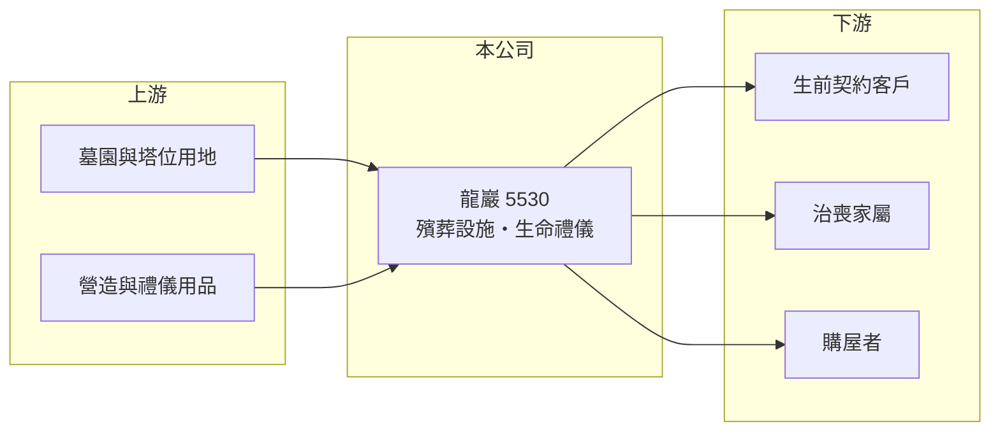

# 5530 龍巖

> 上櫃｜[[產業索引-其他業|其他業]]｜上市（櫃）日期 2000/10/04

# 第一章：企業模式與商業藍圖

> [!info] 撰寫說明
> 精簡版，由 Claude 依公開資料整理，架構比照 [[2330台積電]]，資料截至 2026-10-07。來源：nstock 公司概況頁、HiStock 個股頁、winvest 營收快訊（搜尋結果標題）。業務別營收比重與據點明細未查到。#待校對

龍巖是台灣大型殯葬服務上市櫃公司，經營墓園與納骨設施，並銷售生命禮儀服務。

- **核心業務：** 營業項目包括[[殯葬業]]設施經營（墓園、納骨塔位）、生命禮儀服務（含[[生前契約]]），以及住宅及大樓開發租售。
- **營收結構：** 業務別比重本次未查到；2025 年全年營收約 40.47 億元，塔位與墓地銷售認列時點會使月營收波動。
- **營運據點：** 以台灣為主，具體園區與據點本次未查到。
- **長期方向：** 高齡化使死亡人數長期上升，殯葬服務需求穩定；建設業務則提供額外營收來源（推估）。

# 第二章：護城河深度與競爭優勢

龍巖的護城河來自殯葬設施土地取得不易與長期累積的契約客戶。

- **競爭優勢：** 墓園與納骨設施須取得特定用地與許可，新進者難以複製；已售出的生前契約形成未來的服務量（推估）。
- **主要對手：** 國寶服務、萬安生命等殯葬業者，以及經營殯葬業務的 [[6199天品]]。
- **觀察重點：** 塔位銷售與生前契約履約認列節奏、2026 年營收衰退是否回穩，以及建設案的推出時點。

# 第三章：財務體質與盈利規模

資料日期：2026-10-07，以下數字是撰寫當時的快照；最新月營收、毛利率、累計 EPS 由自動排程寫在本筆記的屬性欄位（月營收、毛利率、累計EPS 等）。#待校對

龍巖毛利率高達六成，但 2026 年上半年營收較去年同期減少。

- **營收規模：** 2026 年 5 月營收 3.10 億元（年減 44.14%）、6 月 2.82 億元、7 月 3.46 億元、8 月 3.05 億元（年增 12.13%）；1 至 6 月累計約 20.48 億元，年減 12.16%。
- **獲利：** 2026 年第一季 EPS 0.95 元，[[毛利率]] 62.02%、營益率 28.17%；第二季 EPS 0.74 元（HiStock）。2025 年全年 EPS 2.75 元。
- **財務特色：** 資本額約 42.01 億元，股價淨值比約 0.65 倍；近五年平均現金股利約 0.24 元，配息率偏低。

# 第四章：總體風險與地緣政治

龍巖的風險多在法規、會計認列與商品銷售節奏。

- **產業週期：** 殯葬需求穩定，但塔位與墓地屬高單價商品，銷售受景氣與投資性買盤影響。
- **營運風險：** 生前契約預收款須依法交付信託，履約成本若上升會壓縮利潤；大型銷售案集中認列使單季獲利波動。
- **其他風險：** 殯葬管理條例與生前契約法規變動、宗教與喪葬習俗改變（如環保葬普及）可能降低塔位需求。

# 專有名詞解析

## 金融

- **[[毛利率]]**：營業毛利占營收的比率，反映產品售價扣除直接成本後的獲利空間。

## 產業

- **[[殯葬業]]**：提供墓園、納骨塔、禮廳與治喪服務的產業，設施用地須經政府許可。
- **[[生前契約]]**：消費者預先購買的殯葬服務契約，業者收取的預收款須依法交付信託保管。

# 核心供應鏈

- 上游：殯葬用地、營造廠與禮儀用品供應商（推估）
- 下游／客戶：生前契約購買者、治喪家屬與購屋者
- 同業：國寶服務、萬安生命、[[6199天品]]

## 最新新聞
<!-- news:start -->
<!-- news:end -->

## 相關連結
- [公開資訊觀測站](https://mopsov.twse.com.tw/mops/web/t05st03?step=1&firstin=1&co_id=5530)
- [Goodinfo](https://goodinfo.tw/tw/StockDetail.asp?STOCK_ID=5530)
- [Yahoo 股市](https://tw.stock.yahoo.com/quote/5530)
- [鉅亨網新聞](https://www.cnyes.com/twstock/5530/news)
