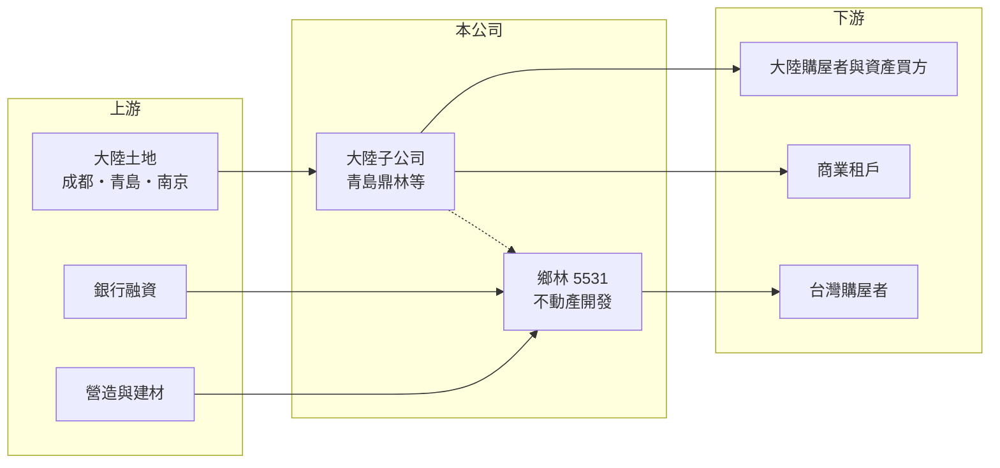

# 5531 鄉林

> 上市｜[[產業索引-建材營造業|建材營造業]]｜上市（櫃）日期 2005/01/31

# 第一章：企業模式與商業藍圖

> [!info] 撰寫說明
> 精簡版，由 Claude 依公開資料整理，架構比照 [[2330台積電]] 的四章研究，資料截至 2026-10-08。財務數字來源：MoneyDJ 年度財務比率表、工商時報 2026 年 4 月報導、證交所開放資料（2026 年第二季、股利）；大陸資產數字多為公司說法，未經查核。公開資料有限，台灣推案明細與業務別營收比重未查得。#待校對

在評估單一個股的長期投資價值時，首要步驟是拆解企業的底層獲利邏輯。本章說明鄉林建設（股票代號：5531，以下簡稱鄉林）如何從台灣建商轉為以中國大陸不動產為主要資產的開發公司，以及這種結構帶來的特殊風險。

## 一、核心定位：資產重心在中國大陸的建商

鄉林成立於 1990 年，2005 年上市，基本資料登記的實收資本額約 107.8 億元（2026 年第二季資產負債表股本約 97.8 億元，差額推估為新近的資本變動），是規模較大的上市建商。依工商時報 2026 年 4 月報導，鄉林目前的主要業務是透過子公司在中國大陸從事不動產開發與銷售，據點包括青島、南京與成都。

這種結構和多數台灣建商很不同。台灣建商的資產多是本地土地與在建工程，資金回收依賴台灣房市；鄉林則把大量資本放在大陸，獲利取決於大陸房市景氣、當地政策與資金能否匯回台灣。2026 年第二季總資產 468.1 億元中，非流動資產約 238.3 億元，比重遠高於一般建商，推估包含大陸的長期持有不動產與投資。

## 二、資產變現：青島、南京、成都三地

依公司在 2026 年 4 月的說明：

- **青島：** 子公司青島鼎林的資產出售案，交易金額約 11 億元（報導換算約新台幣 50.9 億元，推估為人民幣計價），公司預期近期認列。
- **南京：** 可售資產約新台幣 60 億元，仍在與多方洽談，公司表示在等待好價格。
- **成都「涵碧天下」：** 位於北三環附近、約 300 畝（約 6 萬坪）的七塊土地，可售面積約 105 萬平方公尺，計畫 2026 年下半年開始銷售。過去曾因機場限高與搬遷問題延宕。

公司以成都周邊新屋價格推估地上可售面積的價值約人民幣 248 億元，但這是內部推估，取決於大陸房價能否維持，投資人應保守看待。

## 三、長期方向：先變現、再開發

鄉林的長期策略可以歸納為兩步：先把青島、南京的既有資產賣掉，回收資金並改善財務；再以成都土地庫存分期開發，兼做銷售與商業收租。成敗關鍵在於大陸房市與交易對手，這些都不是公司能控制的因素。

# 第二章：護城河深度與競爭優勢

「護城河」指企業抵禦競爭、維持超額利潤的保護機制。本章說明鄉林的競爭位置與結構性限制。

## 一、護城河的組成

鄉林可能的優勢是早年在成都以低價取得的大面積土地。依公司說法，取得成本約每平方公尺人民幣 1,494 元，遠低於目前周邊地價，若能順利開發，土地成本優勢明顯。但這個優勢建立在大陸房市與當地政策上，近年大陸房地產持續調整，土地的帳面低成本不一定能轉換為實際利潤，護城河的可靠度偏低。

## 二、主要競爭對手

| 對手 | 定位 | 對鄉林的威脅 |
|---|---|---|
| 大陸本土開發商 | 在成都、南京、青島大量供給 | 以降價去化搶同一批買方 |
| [[2542興富發]] | 台灣大型建商 | 鄉林台灣業務的主要競爭者之一 |
| [[5522遠雄]] | 台灣全台品牌建商 | 同上 |

## 三、守得住／守不住／觀察重點

守得住的是已持有的大陸土地與不動產；守不住的是大陸房價與交易時程。長期觀察重點是青島出售款是否確實入帳、南京資產能否以合理價格成交，以及成都案 2026 年下半年開賣後的實際去化。

# 第三章：財務體質與盈利規模

資料日期：2026-10-08。數字取自 MoneyDJ 年度財務比率表、工商時報報導與證交所開放資料，表格是撰寫當時的快照；最新月營收、毛利率、累計 EPS 由自動排程寫在本筆記的屬性欄位（月營收、毛利率、累計EPS 等）。#待校對

財務報表是檢驗護城河是否真實存在的最終標準。本章用五年的三率、ROE 與資本報酬檢視鄉林的獲利品質。

## 一、多年度經營績效

| 年度 | 營收（新台幣） | [[毛利率]] | [[營業利益率]] | EPS（元） | [[ROE]] |
|---|---|---|---|---|---|
| 2021 | 約 35 億（推算） | 27.76% | -11.87% | -0.67 | -6.87% |
| 2022 | 約 13 億（推算） | 26.70% | -70.77% | -1.41 | -14.20% |
| 2023 | 約 38 億（推算） | 26.35% | -7.41% | -0.20 | -3.59% |
| 2024 | 約 41 億（推算） | 29.74% | 1.65% | -0.12 | -3.63% |
| 2025 | 約 11 億（推算） | 22.60% | -71.17% | -0.28 | -4.40% |

營收以 MoneyDJ 每股營業額乘以股本推算，股本可能變動，僅供量級參考。鄉林的營收依[[建案交屋]]或資產出售時點認列，波動很大；2021 至 2025 年每年都是虧損，平均 ROE 約負 6.5%（推算）。毛利率其實維持在 22% 至 30%，問題出在營業費用與財務成本：2026 年上半年營收 3.23 億元、毛利 0.53 億元，營業損失卻達 4.28 億元，靠業外收益 1.96 億元才把虧損縮小到 1.19 億元，EPS 負 0.12 元。每股淨值從 2018 年的 11.97 元降到 2025 年的 10.07 元。

## 二、營建業指標：負債與資產結構

2026 年第二季總負債 370.9 億元、權益 97.2 億元，負債比率約 79%，MoneyDJ 歷年資料也從 2021 年的 66% 一路升到 2025 年的 78%。流動負債 235.6 億元略高於流動資產 229.8 億元，短期償債壓力不小。2025 年度沒有配發股利。青島與南京的資產若能如公司所說順利變現，將是降低負債的主要來源。

## 三、[[ROIC]] 與 [[WACC]]：價值創造利差

**ROIC 推算：** 2021 至 2025 年平均營業利益約負 4.7 億元，ROIC 為負值，五年平均約負 1.2%（推算）。投入資本以 2026 年第二季權益 97.2 億元加上假設六成總負債為有息負債約 222.5 億元（推估）計算，約 319.7 億元。

**WACC 推算：** 假設台灣 10 年期公債殖利率 1.75%、市場風險溢酬 6%、β 取營建同業常見值 0.9，股東權益成本約 7.2%；負債成本 3%、稅後 2.4%，權益占投入資本約 30%，WACC 約 3.8%（推算）。鄉林負債比率高且資產集中於大陸，實際的股東要求報酬與借款利率都應高於假設，WACC 很可能被低估。

**結論：** 鄉林的 ROIC 長期為負，遠低於資金成本，過去五年是在持續毀損股東價值。[[股價淨值比]]約 0.67 倍（證交所 2026 年 10 月資料），反映市場對大陸資產價值與變現能力的懷疑。只有在青島、南京、成都的資產確實以接近帳面或更高的價格變現時，這個局面才可能改變。

# 第四章：總體風險與地緣政治

任何企業都無法脫離宏觀環境獨立存在。本章分析鄉林長期必須面對的地緣政治、大陸房市與財務風險。

## 一、地緣政治與大陸政策

資產集中在中國大陸，代表鄉林同時承擔大陸房地產調控、地方政府政策與兩岸關係的風險。資金匯出、土地使用變更與開發許可都受當地法規管轄，成都案過去因機場限高與搬遷延宕，就是政策風險的實例。人民幣匯率變動也會影響以新台幣計算的資產價值。

## 二、大陸房市週期

大陸房地產自 2021 年以來持續調整，大型開發商債務問題頻傳，市場價格與成交量都不穩定。公司以周邊新屋價格推估的成都案價值，在房價下跌時可能大幅縮水，南京資產也可能遲遲找不到合適買家。

## 三、財務與治理風險

負債比率接近八成、流動負債高於流動資產，若資產變現延遲，可能面臨再融資或增資壓力，對股東造成稀釋。公司的大陸資產數字多為自行說明，外部投資人難以獨立驗證，資訊透明度是長期需要留意的地方。

# 專有名詞解析

## 金融

- **[[股價淨值比]]**：股價除以每股淨值，低於 1 倍代表市場認為公司資產的實際價值或報酬能力低於帳面。
- **[[ROIC]]**：投入資本報酬率，稅後營業利益除以股東權益加有息負債，衡量本業運用資本的效率。
- **[[WACC]]**：加權平均資金成本，股東與債權人要求報酬率的加權平均，是 ROIC 要超越的門檻。

## 產業

- **[[建案交屋]]**：建商在房屋完工並交付買方時才認列營收，因此營建公司的營收常集中在交屋年度。

# 核心供應鏈

- 上游：成都、青島、南京土地與不動產，營造與建材商，銀行融資
- 下游／客戶：大陸購屋者與資產買方、商業租戶、台灣購屋者
- 同業：大陸本土開發商、[[2542興富發]]、[[5522遠雄]]

## 最新新聞
<!-- news:start（自動產生，請勿手動編輯此範圍） -->
- 2026-10-05 📰 媒體 19:26｜鄉林：青島與南京房產近111億元將入帳 雙北力推新案上場｜[鉅亨網](https://news.cnyes.com/news/id/6621919)

完整紀錄：[[5531鄉林 新聞]]
<!-- news:end -->

## 相關連結
- [公開資訊觀測站](https://mopsov.twse.com.tw/mops/web/t05st03?step=1&firstin=1&co_id=5531)
- [Goodinfo](https://goodinfo.tw/tw/StockDetail.asp?STOCK_ID=5531)
- [Yahoo 股市](https://tw.stock.yahoo.com/quote/5531)
- [鉅亨網新聞](https://www.cnyes.com/twstock/5531/news)
