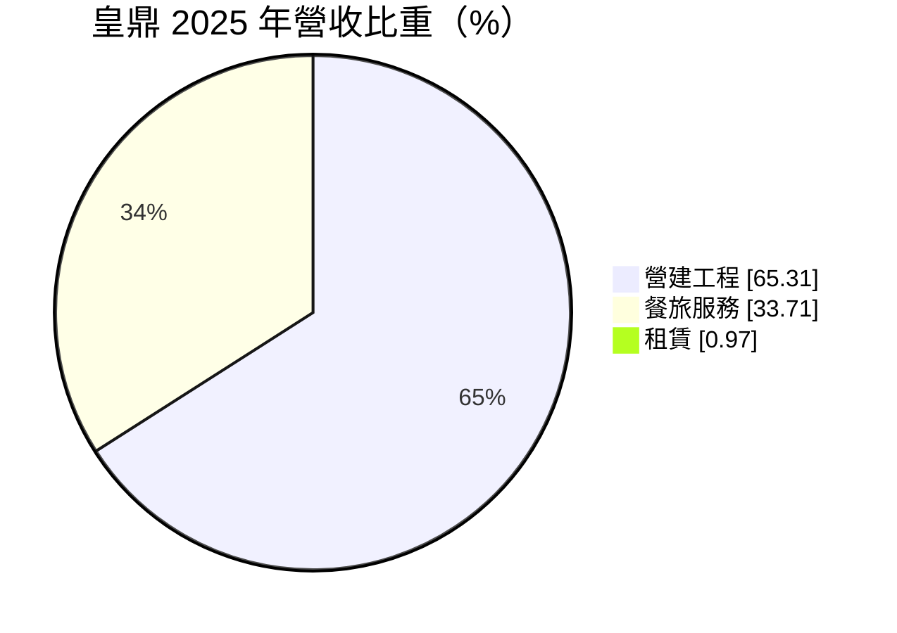
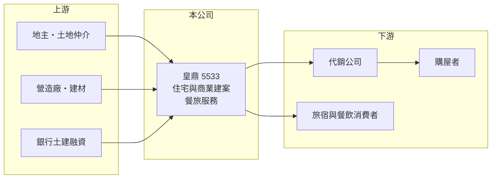

# 5533 皇鼎

> 上市｜[[產業索引-建材營造業|建材營造業]]｜上市（櫃）日期 2008/04/30

# 第一章：企業模式與商業藍圖

> [!info] 撰寫說明
> 精簡版，由 Claude 依公開資料整理，架構比照 [[2330台積電]]，資料截至 2026-10-08。來源：證交所開放資料快照（基本資料、2026 年第二季資產負債與損益、股利）、MoneyDJ 理財網財務比率年表（2021 至 2025 年）與個股基本資料（2025 年營收比重、歷年股利）。公開資料有限，個別建案、飯店名稱與土地庫存未查得；年度營收由 2025 年稅後淨利與歷年營收成長率回推，屬推算。#待校對

皇鼎建設開發成立於 1991 年 4 月，2008 年在證交所上市，是以台北為總部的中型建設公司，除了賣房子之外，還有約三分之一的營收來自餐旅服務，這讓它比單純的建商多了一塊相對穩定的收入。

- **核心業務：** 皇鼎的主業是購地、規劃興建住宅與商業大樓後對外銷售，屬於典型的「專案型」生意，一個建案從買地到交屋常需 3 至 5 年。台灣建商多以[[預售屋]]方式先賣，但要等完工交屋才入帳，也就是[[建案交屋]]時才認列營收，因此皇鼎的營收和獲利會隨交屋年度大幅起伏。
- **營收結構：** 依 MoneyDJ 的分類，2025 年營建工程占 65.31%、餐旅服務占 33.71%、租賃占 0.97%。餐旅比重這麼高，一方面是公司確實經營旅館或餐飲事業，另一方面也反映 2025 年建案交屋較少，使營建收入縮小、其他收入的比重相對放大。
- **營運據點：** 公司登記於台北市敦化南路，推案以雙北為主（推估，依公司地址），具體的建案與餐旅據點名單本次未查得。
- **長期方向：** 皇鼎長期維持低負債經營，2026 年第二季底負債只有約 23.1 億元、股東權益約 95.2 億元，保留盈餘高達 66.4 億元。這種保守的財務結構讓公司在房市低迷時不必被迫降價求售，但也代表資本運用效率偏低，未來能否把累積的資金轉成新的推案量，是長期成長的關鍵。

# 第二章：護城河深度與競爭優勢

建設業的護城河普遍很淺，皇鼎的優勢主要來自穩健的資產負債表與餐旅事業帶來的收入分散。

- **競爭優勢：** 皇鼎的負債比率從 2021 年的 36% 降到 2025 年的 18% 左右，在高槓桿的建設業中屬於非常保守的一群。低負債讓公司在利率上升或[[信用管制]]收緊時承受的壓力較小，也能在土地價格回落時有餘裕進場。餐旅與租賃收入則讓公司在建案空窗期仍有一定的營收來源。
- **主要對手：** 雙北的上市櫃建商眾多，例如 [[2545皇翔]]、[[2548華固]]、[[5534長虹]]，以及大量未上市的地方建商（推估名單）。在台北精華區，品牌、地段取得能力與資金成本是主要競爭面向。
- **觀察重點：** 皇鼎近年營收連續下滑，2025 年 EPS 只有 0.56 元，因此最重要的是觀察新推案能否接續、[[已售未入帳]]金額是否回升。另一個重點是餐旅事業的獲利能力，它若能穩定貢獻，皇鼎的獲利波動會比一般建商小。

# 第三章：財務體質與盈利規模

資料日期：2026-10-08，表格是撰寫當時的快照；最新月營收、毛利率、累計 EPS 由自動排程寫在本筆記的屬性欄位（月營收、毛利率、累計EPS 等）。#待校對

皇鼎的毛利率長期穩定在 27% 至 33% 之間，但營收從 2022 年高點一路下滑，使 EPS 與 ROE 連年走低，是「獲利品質不差、但量能不足」的典型。

| 年度 | 營收（推算） | [[毛利率]] | [[營業利益率]] | EPS（元） | [[ROE]] |
|---|---|---|---|---|---|
| 2021 | 約 37.7 億 | 28.65% | 21.05% | 3.72 | 13.47% |
| 2022 | 約 48.1 億 | 26.95% | 21.45% | 3.56 | 11.67% |
| 2023 | 約 37.6 億 | 32.71% | 26.63% | 3.12 | 9.53% |
| 2024 | 約 22.4 億 | 31.30% | 21.39% | 1.48 | 4.38% |
| 2025 | 約 11.6 億 | 29.98% | 14.05% | 0.56 | 1.64% |

- **長期指標：** 近 5 年平均 ROE 約 8.1%（推算），但呈逐年下降趨勢；2021 至 2025 年營收年複合成長率約 -25%（推算），主因是建案交屋量減少。現金股利（MoneyDJ 列示 108 至 114 年度）依序為 0.5、0.6、1.0、1.2、1.2、1.0、0.6 元，每年都有配發，2025 年度的 0.6 元已高於當年 EPS，等於動用過去累積的盈餘發放。公司章程規定現金股利不低於股利總額的 30%。
- **[[ROIC]] 與 [[WACC]]：** 2025 年營業利益約 1.64 億元（營收約 11.64 億元 × 營業利益率 14.05%），稅後約 1.31 億元；投入資本以 2026 年第二季股東權益 95.2 億元加上總負債 23.1 億元的一半（約 11.5 億元，假設一半為有息負債）計，約 106.7 億元，ROIC 約 1.2%（推算）。WACC 約 7.2%（推算：無風險利率 1.75%、市場風險溢酬 6%、β 取建設股常見值 1.0，股東權益成本約 7.75%；稅前負債成本 3%、稅率 20%；負債權重約 11%）。2025 年 ROIC 明顯低於 WACC，代表目前的資本並未創造足夠報酬；2021 至 2022 年 ROE 在 12% 至 13% 時則大致高於資金成本。
- **財務特色：** 2026 年上半年營收 7.10 億元、毛利率 28.14%、EPS 0.39 元。資產總額約 118.2 億元，負債僅約 23.1 億元，是建設股中少見的低槓桿結構，帳上資源充足但周轉速度慢。

# 第四章：總體風險與地緣政治

皇鼎的風險與一般建設公司相同，主要來自房市景氣與政策，另外還有餐旅事業特有的景氣敏感度。

- **產業週期：** 房地產週期長，從推案到交屋需要數年，推案時的房價與交屋時的市場可能完全不同。營收集中在少數建案，交屋空窗期會讓獲利大幅下滑，2024 至 2025 年就是例子。
- **營運風險：** 推案量不足是皇鼎目前最大的營運風險，若沒有新案接續，即使毛利率穩定，整體獲利也難以回升。營造成本上升與工期延誤也會壓縮建案毛利；餐旅事業則受觀光與消費景氣影響，人力成本上升也會侵蝕利潤。
- **其他風險：** 央行的[[信用管制]]、囤房稅與預售屋轉售限制等政策，會直接影響買方需求與建商融資條件；利率上升會同時提高買方的房貸負擔。

# 專有名詞解析

## 金融

- **[[信用管制]]**：央行限制購屋與建商貸款成數的政策，會影響房市成交與建商資金。
- **[[ROIC]]**：投入資本報酬率，稅後營業利益除以股東權益加有息負債，衡量本業運用資本的效率。
- **[[WACC]]**：加權平均資金成本，股東與債權人要求報酬率的加權平均，是 ROIC 要超越的門檻。

## 產業

- **[[預售屋]]**：房屋在興建完成前就先銷售，買方分期繳款，建商可藉此降低資金與銷售風險。
- **[[建案交屋]]**：建商在房屋完工並交付買方時才認列營收，因此營建公司的營收常集中在交屋年度。
- **[[已售未入帳]]**：已經賣出、但尚未完工交屋而未認列營收的建案金額，是建商未來營收的主要能見度指標。

# 核心供應鏈

- 上游：地主與土地仲介、營造廠、建材供應商與提供土建融資的銀行（名稱未查得）。
- 下游／客戶：代銷公司、購屋者，以及餐旅事業的住宿與餐飲消費者。
- 同業：雙北建商如 [[2545皇翔]]、[[2548華固]]、[[5534長虹]]（推估名單）。

## 最新新聞
<!-- news:start -->
<!-- news:end -->

## 相關連結
- [公開資訊觀測站](https://mopsov.twse.com.tw/mops/web/t05st03?step=1&firstin=1&co_id=5533)
- [Goodinfo](https://goodinfo.tw/tw/StockDetail.asp?STOCK_ID=5533)
- [Yahoo 股市](https://tw.stock.yahoo.com/quote/5533)
- [鉅亨網新聞](https://www.cnyes.com/twstock/5533/news)
