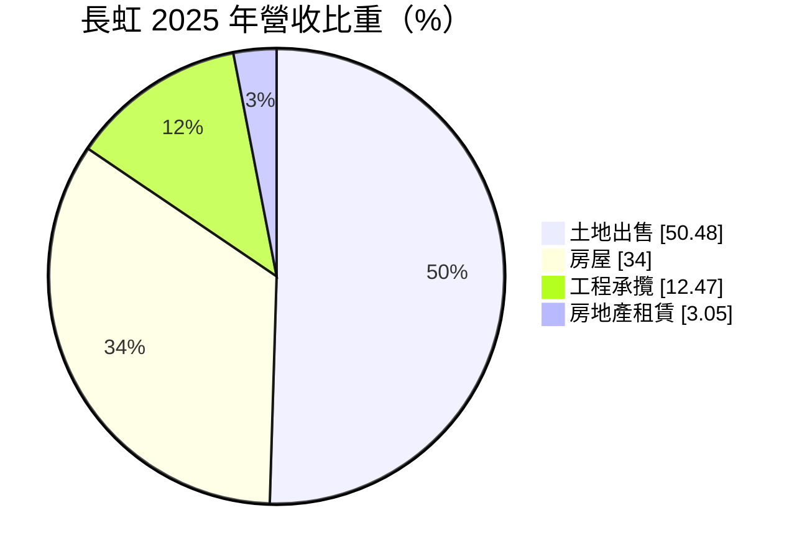
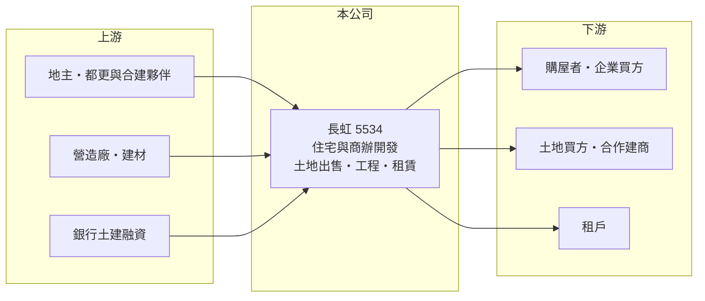

# 5534 長虹

> 上市｜[[產業索引-建材營造業|建材營造業]]｜上市（櫃）日期 2004/05/24

# 第一章：企業模式與商業藍圖

> [!info] 撰寫說明
> 精簡版，由 Claude 依公開資料整理，架構比照 [[2330台積電]]，資料截至 2026-10-08。來源：證交所開放資料快照（基本資料、2026 年第二季資產負債與損益、2025 年度股利）、MoneyDJ 理財網財務比率年表（2021 至 2025 年）與個股基本資料（2025 年營收比重、歷年股利）。公開資料有限，個別建案與土地庫存未查得；因股本有變動，年度營收金額無法可靠推算，表格只列成長率。#待校對

長虹建設成立於 1975 年 12 月，2004 年在證交所上市，是以台北為主要市場的老牌建商。它的特色是毛利率高、配息穩定，而且營收中有相當比重來自土地出售，而不只是蓋房子賣房子。

- **核心業務：** 長虹購買並整合土地，規劃興建住宅與商辦大樓後銷售，也承攬部分工程與出租不動產。建案以[[預售屋]]方式先銷售，等[[建案交屋]]才認列營收，因此年度營收與獲利會隨交屋時點起伏。
- **營收結構：** 依 MoneyDJ 的分類，2025 年土地出售占 50.48%、房屋銷售占 34.00%、工程承攬占 12.47%、房地產租賃占 3.05%。土地出售比重過半，代表公司有相當一部分獲利來自整合土地後出售或與他人合作開發，而不是全部自建自售（推估）；這種模式的入帳時點更集中、也更難預測。
- **營運據點：** 總部位於台北市中正區，推案以台北市與新北市為主（推估，依公司地址與媒體報導），具體建案名單本次未查得。
- **長期方向：** 長虹的每股淨值從 2021 年的 62.35 元穩定增加到 2025 年的 71.61 元，2026 年第二季底保留盈餘約 152.4 億元，代表公司長期把多數獲利留在公司或穩定配發，而不是大幅擴張槓桿。未來的成長取決於台北精華區土地的取得能力，以及住宅與商辦產品之間的配置。

# 第二章：護城河深度與競爭優勢

長虹的護城河來自台北土地的取得與整合經驗，以及長期穩健的財務紀律，這在建設業中已屬相對少見的優勢。

- **競爭優勢：** 台北市可開發土地稀少，能長期整合土地、處理[[都更]]或[[合建]]的建商，在取得地段上有先發優勢。長虹 2021 至 2025 年[[毛利率]]在 30% 至 44% 之間，高於一般建商常見的 20% 至 30%，顯示其土地成本或產品定價具一定優勢。
- **主要對手：** 台北的上市櫃建商包括 [[2545皇翔]]、[[2548華固]]、[[5533皇鼎]]、[[2542興富發]] 等，以及大型未上市建商（推估名單）。在台北精華區，競爭焦點是土地整合速度、品牌與資金成本。
- **觀察重點：** 由於土地出售比重高，投資人應觀察公司手上可供開發或出售的土地規模，以及[[已售未入帳]]建案的金額，兩者共同決定未來兩三年的營收能見度。商辦與住宅產品的比例調整，也會改變獲利的穩定度。

# 第三章：財務體質與盈利規模

資料日期：2026-10-08，表格是撰寫當時的快照；最新月營收、毛利率、累計 EPS 由自動排程寫在本筆記的屬性欄位（月營收、毛利率、累計EPS 等）。#待校對

長虹五年來每年都有獲利，營業利益率在 23% 至 38% 之間，屬於建設股中獲利品質較高的一群；不過 ROE 多在 7% 至 15%，資本運用效率中等。

| 年度 | 營收（年增率） | [[毛利率]] | [[營業利益率]] | EPS（元） | [[ROE]] |
|---|---|---|---|---|---|
| 2021 | 未查得（-47.3%） | 38.04% | 31.30% | 4.41 | 6.98% |
| 2022 | 未查得（+79.5%） | 43.95% | 37.85% | 9.82 | 14.95% |
| 2023 | 未查得（+12.6%） | 30.06% | 23.37% | 6.32 | 9.18% |
| 2024 | 未查得（+23.2%） | 35.90% | 28.21% | 7.85 | 13.39% |
| 2025 | 未查得（-29.7%） | 38.23% | 28.89% | 6.00 | 9.19% |

- **長期指標：** 近 5 年平均 ROE 約 10.7%（推算）。現金股利（MoneyDJ 列示 108 至 114 年度）介於每股 4.41 至 6.30 元，依證交所資料，2025 年度股東會通過每股現金股利 5.5 元，以當年 EPS 6.00 元計算，[[配息率]]約 92%。長虹長年把大部分獲利以現金發還股東，是它最受存股族重視的特色。
- **[[ROIC]] 與 [[WACC]]：** 2025 年稅後淨利 17.43 億元（證交所股利資料），依營業利益率 28.89% 與淨利率 22.91% 換算，營業利益約 21.98 億元，稅後約 17.58 億元；投入資本以 2026 年第二季股東權益 213.4 億元加上總負債 274.3 億元的一半（約 137.2 億元，假設一半為有息負債）計，約 350.5 億元，ROIC 約 5.0%（推算）。WACC 約 5.7%（推算：無風險利率 1.75%、市場風險溢酬 6%、β 取建設股常見值 1.0，股東權益成本約 7.75%；稅前負債成本 3%、稅率 20%；負債權重約 39%）。兩者大致相當，代表長虹在一般年度約略賺回資金成本，交屋大年（如 2022 年）才明顯創造超額價值；若有息負債實際低於假設，ROIC 會更高。
- **財務特色：** 2026 年上半年營收 23.21 億元、毛利率 28.46%、EPS 1.05 元。資產總額約 487.7 億元，其中流動資產（主要是土地與在建房地）約 482.5 億元；負債比率長期維持在 54% 至 57%，屬建設業中等水準。

# 第四章：總體風險與地緣政治

長虹的風險集中在台北房市與政策，以及土地出售收入的不確定性。

- **產業週期：** 房地產週期長，推案到交屋需要數年，推案時的房價與交屋時的市場可能不同。2021 年營收減少 47%、2022 年又增加 79%，顯示營收高度依賴交屋與土地交易的時點。
- **營運風險：** 土地出售屬於一次性的大額交易，入帳時點與金額難以預測，會放大年度獲利波動。推案集中在台北（推估），區域房市降溫時缺乏分散；營造成本上升與工期延誤也會壓縮毛利。
- **其他風險：** 央行[[信用管制]]、囤房稅與預售屋轉售限制等政策，會影響買方需求與建商融資條件；利率上升會同時增加買方負擔與公司的融資成本。

# 專有名詞解析

## 金融

- **[[配息率]]**：現金股利占每股盈餘的比率，用來衡量公司把多少獲利發給股東。

## 產業

- **[[預售屋]]**：房屋在興建完成前就先銷售，買方分期繳款，建商可藉此降低資金與銷售風險。
- **[[建案交屋]]**：建商在房屋完工並交付買方時才認列營收，因此營建公司的營收常集中在交屋年度。
- **[[都更]]**：都市更新，由地主與建商合作把老舊建物改建，地主依權利價值分回房地或收益。
- **[[合建]]**：地主提供土地、建商負責出資興建，完工後雙方依約定比例分配房屋或銷售收入的開發模式。
- **[[已售未入帳]]**：已經賣出、但尚未完工交屋而未認列營收的建案金額，是建商未來營收的主要能見度指標。

# 核心供應鏈

- 上游：地主與都更、合建夥伴、營造廠、建材供應商與提供土建融資的銀行（名稱未查得）。
- 下游／客戶：購屋者與企業商辦買方、土地買方，以及不動產租戶。
- 同業：台北建商如 [[2545皇翔]]、[[2548華固]]、[[5533皇鼎]]、[[2542興富發]]（推估名單）。

## 最新新聞
<!-- news:start（自動產生，請勿手動編輯此範圍） -->
- 2026-10-06 🏛️ 重訊 09:34｜補正公告本公司出售不動產予關係人｜[觀測站](https://mops.twse.com.tw/mops/#/web/t05st01)

完整紀錄：[[5534長虹 新聞]]
<!-- news:end -->

## 相關連結
- [公開資訊觀測站](https://mopsov.twse.com.tw/mops/web/t05st03?step=1&firstin=1&co_id=5534)
- [Goodinfo](https://goodinfo.tw/tw/StockDetail.asp?STOCK_ID=5534)
- [Yahoo 股市](https://tw.stock.yahoo.com/quote/5534)
- [鉅亨網新聞](https://www.cnyes.com/twstock/5534/news)
