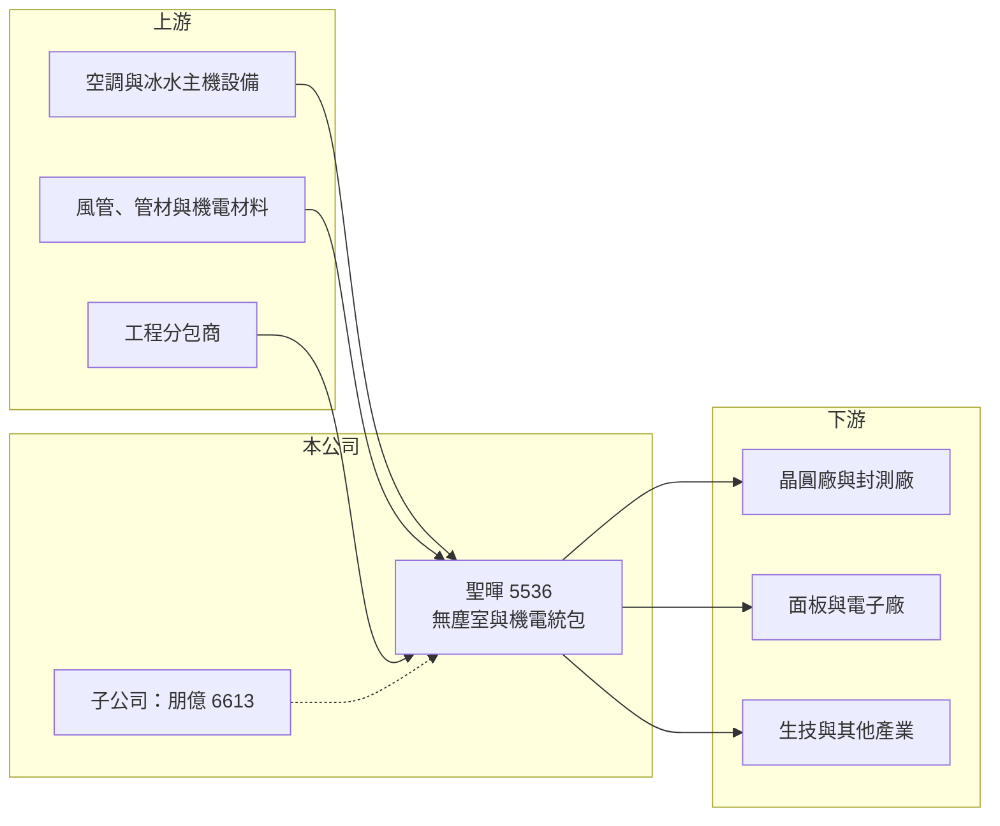

# 5536 聖暉

> 上櫃｜[[產業索引-其他電子業|其他電子業]]｜上市（櫃）日期 2010/11/10

# 第一章：企業模式與商業藍圖

> [!info] 撰寫說明
> 精簡版，由 Claude 依公開資料整理，架構比照 [[2330台積電]]，資料截至 2026-10-07。來源：nStock 聖暉公司簡介與財務摘要、科技新報月營收報導。客戶與海外據點描述為整理性內容，尚未逐條比對原始文件。#待校對

聖暉是以[[無塵室]]與空調機電為核心的[[統包工程]]公司，2026 年在半導體擴產帶動下營收與獲利同創新高。

- **核心業務：** 空氣調節、環境控制、無塵室、冰水主機、通風換氣、能源技術服務與相關機電、管線工程的設計、安裝及維護。
- **營收結構：** 本次未查到依產業或地區的營收比重；推估以半導體與電子廠的無塵室工程為主。
- **營運據點：** 1979 年成立、總部在台中，2010 年上櫃；集團在中國與東南亞設有子公司承接當地工程，並持有製程設備與化學品供應系統廠 [[6613朋億]]（推估）。
- **長期方向：** 跟隨台灣、東南亞與美國的晶圓廠、封測廠擴建承接工程，並延伸到儲能與節能服務。

# 第二章：護城河深度與競爭優勢

聖暉的護城河在於高階無塵室工程的實績與客戶信任。

- **競爭優勢：** 晶圓廠無塵室對潔淨度、溫濕度與工期要求極高，業主傾向找有實績的承包商，新進者不易切入。
- **主要對手：** [[6139亞翔]]、[[2404漢唐]]、[[6196帆宣]] 等台灣無塵室與廠務工程商，以及日本、新加坡的工程公司。
- **觀察重點：** 2026 年 8 月營收 48.79 億元、年增 44.5%，觀察後續新簽工程能否延續，以及海外專案的毛利率。

# 第三章：財務體質與盈利規模

資料日期：2026-10-07，以下數字是撰寫當時的快照；最新月營收、毛利率、累計 EPS 由自動排程寫在本筆記的屬性欄位（月營收、毛利率、累計EPS 等）。#待校對

聖暉資本額小、獲利高，EPS 與配息都是工程類股中的高水準。

- **營收規模：** 2026 年 1 至 8 月累計營收 337.49 億元，年增 26.9%；2025 年全年 414.82 億元。
- **獲利：** 2026 年第二季 EPS 10.97 元，年增 57.84%；[[毛利率]] 20.64%、[[營業利益率]] 15.89%。
- **財務特色：** 資本額僅 6.20 億元，近五年平均現金股利 14.44 元，第二季單季 [[ROE]] 8.09%。

# 第四章：總體風險與地緣政治

聖暉的風險主要來自客戶資本支出循環與工程執行。

- **產業週期：** 營收高度依賴半導體與電子業的建廠循環，客戶 [[CapEx]] 下修時新案量會明顯減少。
- **營運風險：** 工程以完工比例認列營收，若發生工期延誤、成本超支或缺工，毛利率會受壓。
- **其他風險：** 海外工程面對當地法規、勞工與匯率風險，美國與東南亞專案的成本控管是觀察點。

# 專有名詞解析

## 金融

- **[[CapEx]]**：資本支出，企業購買廠房、設備等長期資產的支出。
- **[[ROE]]**：股東權益報酬率，稅後淨利除以股東權益，衡量公司運用股東資金的獲利效率。

## 產業

- **[[無塵室]]**：控制空氣中微粒、溫濕度與壓力的密閉空間，半導體製程必須在高等級無塵室中進行。
- **[[統包工程]]**：由單一承包商負責設計、採購與施工整合的工程模式，英文常稱 EPC 或 Turnkey。

# 核心供應鏈

- 上游：空調、冰水主機與機電材料供應商，工程分包商（推估）
- 下游／客戶：半導體晶圓廠與封測廠、面板與電子廠、生技廠（推估）
- 同業：[[6139亞翔]]、[[2404漢唐]]、[[6196帆宣]]

## 供應鏈關係
- 供應給 [[2330台積電]]：無塵室與機電統包工程（台積電供應鏈 › 上游：台灣建廠、無塵室與廠務系統）

## 最新新聞
<!-- news:start（自動產生，請勿手動編輯此範圍） -->
- 2026-10-07 📰 媒體 12:43｜【12:43 即時新聞】聖暉*(5536) 股價走強站上千元，主力與法人同步加溫｜[CMoney](https://news.google.com/rss/articles/CBMiZ0FVX3lxTE1QUmVZOUVybDdseTlJLXhEdWxVcExzQXF2RUFfYVJaam1rRUZvRFRqQm5XdUh6S2dOZ2E1eTYyejRvc1VpZ050M04zTlROLS1xYVVUUlprd3k2SVVGTTdjTG52VWpCSkU?oc=5)
- 2026-10-07 📰 媒體 10:47｜聖暉*(5536) 個股概覽 ／ 個股 - 股市｜[CMoney](https://news.google.com/rss/articles/CBMiU0FVX3lxTE92RTcwTjh6dEwtZlBzbGQ5ZUtWekplRFZpaWRnanpha0M3VU1KTWpsS2l0T2t4NWp3RG54bDlqSlUxR0ZhcllOV1d5a243dXozSExj?oc=5)
- 2026-10-06 🏛️ 重訊 20:20｜依公開發行公司資金貸與及背書保證處理準則第二十五條第一項 第四款規定公告本公司及子公司背書保證事項｜[觀測站](https://mops.twse.com.tw/mops/#/web/t05st01)
- 2026-10-06 📰 媒體 13:27｜【13:24 即時新聞】聖暉*(5536)盤中續強，市場聚焦無塵室與廠務擴產動能｜[CMoney](https://news.google.com/rss/articles/CBMiZ0FVX3lxTE5PNXViLU5PQmo4Z3lWU1Q3dlJ0Ukt5TGt6Q2NwTFFmZ2V2MTZmNTNXT2hfc1FQSnhfX0NCOGEza0QtT2ZPQld6T1BIX3prQXZiMGE2VldWM2kyblJtbVVNTjg5bnk5WDg?oc=5)

完整紀錄：[[5536聖暉 新聞]]
<!-- news:end -->

## 相關連結
- [公開資訊觀測站](https://mopsov.twse.com.tw/mops/web/t05st03?step=1&firstin=1&co_id=5536)
- [Goodinfo](https://goodinfo.tw/tw/StockDetail.asp?STOCK_ID=5536)
- [Yahoo 股市](https://tw.stock.yahoo.com/quote/5536)
- [鉅亨網新聞](https://www.cnyes.com/twstock/5536/news)
