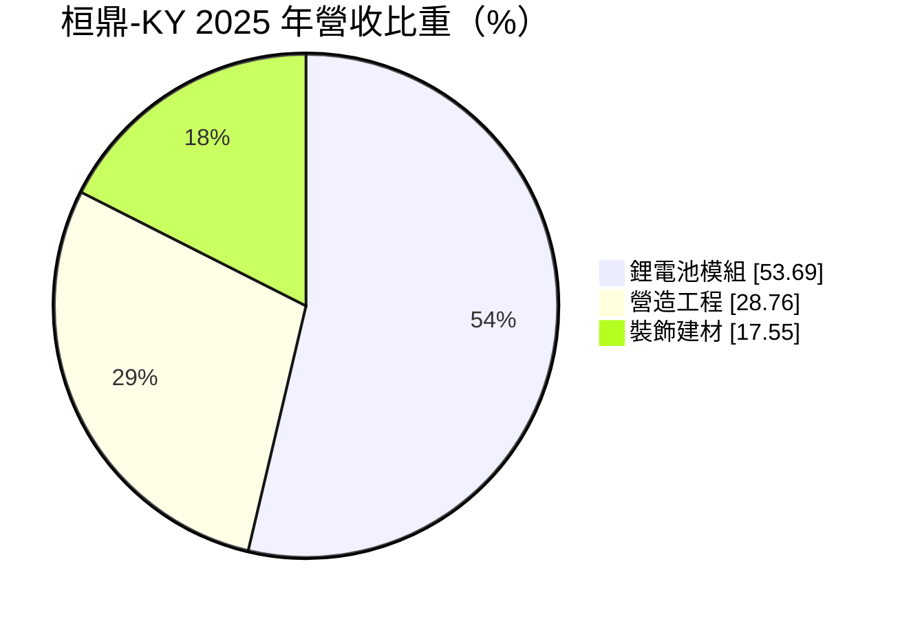
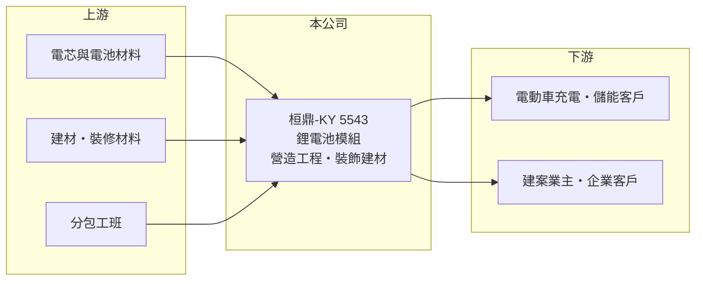

# 5543 桓鼎-KY

> 上櫃｜[[產業索引-建材營造業|建材營造業]]｜上市（櫃）日期 2016/05/09

# 第一章：企業模式與商業藍圖

> [!info] 撰寫說明
> 精簡版，由 Claude 依公開資料整理，架構比照 [[2330台積電]]，資料截至 2026-10-08。來源：櫃買中心開放資料快照（基本資料、2026 年第二季資產負債與損益）、MoneyDJ 理財網財務比率年表（2021 至 2025 年）與個股基本資料（2025 年營收比重、歷年股利）、財經媒體報導標題。公開資料有限，主要營運地區、子公司結構與客戶未查得；年度營收由 2025 年每股營業額與歷年成長率回推，屬推算。#待校對

桓鼎股份有限公司（桓鼎-KY）於 2009 年 11 月在開曼群島設立，2016 年 5 月在櫃買中心上櫃，是一家由營造、裝飾建材起家、近年把重心移到鋰電池模組的 [[KY股]]，業務組合在建材營造類股中相當特殊。

- **核心業務：** 桓鼎原本以營造工程與室內裝飾建材為主，替業主施工並供應裝修材料；近年則發展鋰電池模組業務，媒體報導的方向是電動車充電與綠能相關應用（推估，依報導標題）。三個事業的商業模式不同：營造是接案型生意、建材是產品銷售、電池模組則是製造業。
- **營收結構：** 依 MoneyDJ 的分類，2025 年鋰電池模組占 53.69%、營造工程占 28.76%、裝飾建材占 17.55%。電池模組已成為最大的收入來源，代表公司的本質正從營建業轉向能源設備製造。
- **營運據點：** 台灣聯絡地址位於新北市中和區，董事長為莊宏偉；各事業的實際生產與施工地區本次未查得。
- **長期方向：** 2026 年第二季底，桓鼎權益總額約 13.9 億元，其中歸屬母公司僅約 5.0 億元、非控制權益約 8.9 億元，同期損益中也出現約 -0.46 億元的停業單位損益。這代表主要獲利來源可能在部分持股的子公司，且公司正在處分或結束部分事業（推估），轉型的方向與成果仍需追蹤。

# 第二章：護城河深度與競爭優勢

桓鼎的三個事業都處在競爭激烈的市場，目前看不到明顯的護城河，轉型能否建立新的競爭優勢仍是開放問題。

- **競爭優勢：** 營造與裝飾建材的門檻不高，主要靠業主關係與施工品質；鋰電池模組則要靠電芯取得、模組設計與客戶認證。桓鼎跨足兩種產業，好處是能提供從建物到儲能設備的整合服務（推估），缺點是規模在各領域都不大，2023 至 2025 年營業利益率皆為負值，顯示目前尚未形成成本或技術優勢。
- **主要對手：** 營造與裝修領域面對大量中小型營造廠；電池模組領域的台灣同業包括 [[6121新普]]、[[3211順達]] 等規模大得多的電池模組廠（推估名單）。
- **觀察重點：** 觀察電池模組業務能否轉為穩定獲利，以及非控制權益與停業單位的處理結果；若母公司能分配到的獲利持續偏低，即使合併營收成長，股東實際得到的價值也有限。

# 第三章：財務體質與盈利規模

資料日期：2026-10-08，表格是撰寫當時的快照；最新月營收、毛利率、累計 EPS 由自動排程寫在本筆記的屬性欄位（月營收、毛利率、累計EPS 等）。#待校對

桓鼎的營收規模大致維持在 27 億至 36 億元，但毛利率從 2021 年的 20.9% 降到 14% 左右，2022 至 2025 年連續四年 EPS 為負，每股淨值從 21.72 元降到 8.81 元。

| 年度 | 營收（推算） | [[毛利率]] | [[營業利益率]] | EPS（元） | [[ROE]] |
|---|---|---|---|---|---|
| 2021 | 約 27.2 億 | 20.86% | 8.75% | 3.26 | 14.21% |
| 2022 | 約 35.6 億 | 13.04% | 1.03% | -1.63 | 1.59% |
| 2023 | 約 32.7 億 | 11.75% | -2.10% | -2.57 | -9.13% |
| 2024 | 約 34.0 億 | 14.56% | -3.79% | -5.67 | -16.79% |
| 2025 | 約 30.4 億 | 14.30% | -0.62% | -2.52 | -8.69% |

- **長期指標：** 近 5 年平均 ROE 約 -3.8%（推算）；2021 至 2025 年營收年複合成長率約 2.8%（推算）。2022 年合併稅後淨利率為正、EPS 卻為負，代表獲利主要歸屬於子公司的少數股東，母公司股東反而虧損。現金股利（MoneyDJ 列示 108 至 114 年度）依序為 0.80、0.96、2.00、0.76、0.09、0、0 元，近兩年停發。
- **[[ROIC]] 與 [[WACC]]：** 2025 年營業利益約 -0.19 億元（營收約 30.4 億元 × 營業利益率 -0.62%），稅後約 -0.15 億元；投入資本以 2026 年第二季權益總額 13.9 億元加上總負債 19.0 億元的一半（約 9.5 億元，假設一半為有息負債）計，約 23.4 億元，ROIC 約 -0.6%（推算）。WACC 約 5.6%（推算：無風險利率 1.75%、市場風險溢酬 6%、β 取 1.0 並註明實際風險可能更高，股東權益成本約 7.75%；稅前負債成本 3%、稅率 20%；負債權重約 41%）。ROIC 連續數年低於 WACC，代表公司近年在侵蝕股東價值。
- **財務特色：** 2026 年上半年營收 15.92 億元、毛利率約 14.5%，本業營業利益僅 0.40 億元，但業外收入 1.18 億元使 EPS 達 1.62 元，獲利品質偏弱。負債比率長期在 64% 至 71%，2026 年第二季底保留盈餘約 -2.9 億元。

# 第四章：總體風險與地緣政治

桓鼎的風險同時來自營建業的景氣循環與電池產業的價格競爭，加上轉型期的財務壓力。

- **產業週期：** 營造與裝修需求隨房地產與企業資本支出起伏；鋰電池模組則受電芯價格與電動車、儲能需求影響，兩個週期疊加，使營收與毛利波動更難預測。
- **營運風險：** 本業連年虧損、累積虧損與每股淨值下滑，會限制公司的融資能力與配息能力。獲利倚賴子公司與業外收入，非控制權益比重高，母公司股東能分到的利益有限；停業單位的處理也可能帶來一次性損失。
- **其他風險：** 作為 [[KY股]]，資訊揭露與跨境監理較本國公司複雜；電池模組涉及原物料（鋰、鈷等）價格與匯率變動，海外營運也可能面臨當地法規與政策風險。

# 專有名詞解析

## 金融

- **[[KY股]]**：在海外註冊、來台上市櫃的公司，代號名稱後加註 KY。
- **[[非控制權益]]**：合併報表中子公司不屬於母公司的股權部分，比重高代表有相當獲利或資產屬於其他股東。
- **[[停業單位]]**：公司已處分或計畫處分的事業部門，其損益在報表中與持續營業部門分開列示。
- **[[ROIC]]**：投入資本報酬率，稅後營業利益除以股東權益加有息負債，衡量本業運用資本的效率。
- **[[WACC]]**：加權平均資金成本，股東與債權人要求報酬率的加權平均，是 ROIC 要超越的門檻。

## 產業

- **[[鋰電池]]**：以鋰離子在正負極間移動儲存電能的電池，能量密度高於鉛酸電池，逐漸取代 UPS 用鉛酸電池。

# 核心供應鏈

- 上游：電芯與電池材料供應商、建材與裝修材料供應商、分包工班（名稱未查得）。
- 下游／客戶：電動車充電與儲能應用客戶、建案業主與企業客戶（名稱未查得）。
- 同業：電池模組廠 [[6121新普]]、[[3211順達]]（推估名單，規模差距大）；營造與裝修為眾多中小型業者。

## 最新新聞
<!-- news:start（自動產生，請勿手動編輯此範圍） -->
- 2026-10-06 🏛️ 重訊 23:03｜公告本公司變更上櫃承諾事項｜[觀測站](https://mops.twse.com.tw/mops/#/web/t05st01)

完整紀錄：[[5543桓鼎-KY 新聞]]
<!-- news:end -->

## 相關連結
- [公開資訊觀測站](https://mopsov.twse.com.tw/mops/web/t05st03?step=1&firstin=1&co_id=5543)
- [Goodinfo](https://goodinfo.tw/tw/StockDetail.asp?STOCK_ID=5543)
- [Yahoo 股市](https://tw.stock.yahoo.com/quote/5543)
- [鉅亨網新聞](https://www.cnyes.com/twstock/5543/news)
