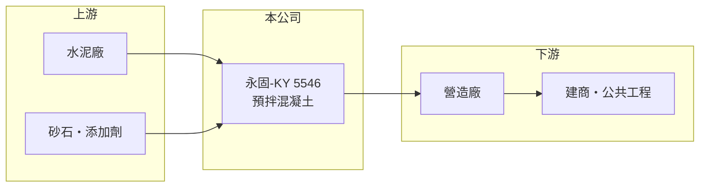

# 5546 永固-KY

> 上市｜[[產業索引-建材營造業|建材營造業]]｜上市（櫃）日期 2020/05/20

# 第一章：企業模式與商業藍圖

> [!info] 撰寫說明
> 精簡版，由 Claude 依公開資料整理，架構比照 [[2330台積電]]，資料截至 2026-10-08。來源：證交所開放資料快照（基本資料、2026 年第二季資產負債與損益、營益分析、2025 年度股利）、MoneyDJ 理財網財務比率年表（2021 至 2025 年）與個股基本資料（2025 年營收比重、歷年股利）。公開資料有限，混凝土廠的所在國家與地區、廠數與客戶未查得；年度營收由 2025 年每股營業額與歷年成長率回推，屬推算。#待校對

永固集團（永固-KY）於 2016 年 5 月在開曼群島設立，2020 年 5 月在證交所上市，是幾乎只做[[預拌混凝土]]的 [[KY股]]。混凝土是營建業最基礎的材料，永固的營收與獲利因此直接跟著所在市場的營建景氣起伏。

- **核心業務：** 永固在攪拌廠把水泥、砂石、水與添加劑依配比拌好，再以攪拌車運到工地。預拌混凝土必須在數小時內澆置，運送半徑有限，因此這是一門高度在地化、以廠區周邊工地為客戶的生意。
- **營收結構：** 依 MoneyDJ 的分類，2025 年混凝土占 96.69%、其他占 3.31%，業務非常集中。
- **營運據點：** 台灣聯絡處位於台北市松山區，董事長為簡國釧；實際混凝土廠所在的國家與地區本次未查得。2026 年上半年其他綜合損益約 0.99 億元，推估主要來自海外子公司的外幣換算，代表營運主體在台灣以外（推估）。
- **長期方向：** 營收從 2021 年約 59 億元連續四年下滑到 2025 年約 19.5 億元，顯示所在市場的營建需求明顯萎縮，或公司主動縮減業務（推估）。未來能否穩住營收規模、恢復正毛利結構，是公司存續與轉型的核心問題。

# 第二章：護城河深度與競爭優勢

預拌混凝土的護城河來自地理位置：在某個區域擁有攪拌廠與砂石來源的業者，競爭對手很難遠距離搶單，但這種優勢在需求萎縮時也幫不上忙。

- **競爭優勢：** 混凝土運送半徑有限，在地廠區、車隊與穩定的砂石供應是主要的進入門檻。若永固在所在區域有足夠的市占與廠區密度，就能在報價上有一定話語權；但 2021 至 2025 年[[毛利率]]只有 7% 至 14%，代表定價力有限，成本轉嫁能力偏弱。
- **主要對手：** 所在區域的地方混凝土業者（名稱未查得）；台灣同類型的上市公司有 [[1101台泥]]、[[1102亞泥]] 旗下的混凝土事業與 [[2504國產]]，可作為商業模式的對照。
- **觀察重點：** 觀察營收下滑是否止穩、毛利率能否回到 10% 以上，以及公司是否調整廠區、轉型或處分資產。2025 年度以資本公積配發每股 1 元現金，代表股利來源已不是當年獲利，配息能否延續值得注意。

# 第三章：財務體質與盈利規模

資料日期：2026-10-08，表格是撰寫當時的快照；最新月營收、毛利率、累計 EPS 由自動排程寫在本筆記的屬性欄位（月營收、毛利率、累計EPS 等）。#待校對

永固的財務數據呈現典型的「量縮價弱」：營收連年下滑，毛利率低且不穩，2023 與 2025 年都出現明顯虧損。

| 年度 | 營收（推算） | [[毛利率]] | [[營業利益率]] | EPS（元） | [[ROE]] |
|---|---|---|---|---|---|
| 2021 | 約 59.1 億 | 10.89% | 5.49% | 3.18 | 7.28% |
| 2022 | 約 44.4 億 | 10.14% | 2.63% | 0.66 | 1.96% |
| 2023 | 約 38.1 億 | 9.17% | -10.93% | -4.58 | -14.85% |
| 2024 | 約 28.2 億 | 14.03% | 3.36% | 0.17 | -0.63% |
| 2025 | 約 19.5 億 | 6.88% | -5.21% | -2.13 | -9.83% |

- **長期指標：** 近 5 年平均 ROE 約 -3.2%（推算）；2021 至 2025 年營收年複合成長率約 -24%（推算）。每股淨值從 38.08 元降到 22.65 元。現金股利（MoneyDJ 列示 108 至 114 年度）依序為 4.00、5.83、5.00、1.50、2.00、2.00、1.00 元；依證交所資料，2025 年度稅後淨損約 1.75 億元，每股 1 元的現金來自資本公積而非盈餘。
- **[[ROIC]] 與 [[WACC]]：** 2025 年營業利益約 -1.02 億元（營收約 19.5 億元 × 營業利益率 -5.21%），稅後約 -0.81 億元；投入資本以 2026 年第二季權益總額 18.5 億元加上總負債 25.9 億元的一半（約 13.0 億元，假設一半為有息負債）計，約 31.4 億元，ROIC 約 -2.6%（推算）。WACC 約 5.5%（推算：無風險利率 1.75%、市場風險溢酬 6%、β 取建材業常見值 1.0，股東權益成本約 7.75%；稅前負債成本 3%、稅率 20%；負債權重約 41%）。ROIC 低於 WACC 且為負值，代表近年資本未能創造價值。
- **財務特色：** 2026 年上半年營收 5.57 億元、毛利率 6.68%、營業利益率 -5.92%、EPS -0.66 元。負債比率長期在 56% 至 63%，2026 年第二季底保留盈餘僅約 1.5 億元，配息與財務彈性都已縮小。

# 第四章：總體風險與地緣政治

永固的風險集中在單一產品、單一區域的營建需求，以及低毛利下的成本壓力。

- **產業週期：** 混凝土需求跟著房地產開工與公共建設走，所在市場的營建景氣一旦轉弱，攪拌廠的產能利用率與報價會同時下滑，2021 年以來的營收萎縮就是例證。
- **營運風險：** 水泥與砂石是主要成本，原料價格上漲時若無法轉嫁，毛利率會被壓縮；營收縮小時，廠區、車隊與人員等固定成本會讓虧損擴大，形成典型的負向[[營運槓桿]]。
- **其他風險：** 作為海外營運的 [[KY股]]，面臨匯率換算、當地政策（房地產調控、環保與砂石開採限制）與資訊揭露不足的風險；持續以資本公積配息，也可能削弱資本結構。

# 專有名詞解析

## 金融

- **[[KY股]]**：在海外註冊、來台上市櫃的公司，代號名稱後加註 KY。
- **[[營運槓桿]]**：固定成本占比高時，營收小幅變動就會造成獲利大幅變動的效果。
- **[[ROIC]]**：投入資本報酬率，稅後營業利益除以股東權益加有息負債，衡量本業運用資本的效率。
- **[[WACC]]**：加權平均資金成本，股東與債權人要求報酬率的加權平均，是 ROIC 要超越的門檻。

## 產業

- **[[預拌混凝土]]**：在工廠依比例拌好水泥、砂石與水，再以攪拌車運到工地的混凝土，是水泥最主要的下游產品。

# 核心供應鏈

- 上游：水泥廠、砂石與混凝土添加劑供應商（名稱未查得）。
- 下游／客戶：營造廠、建商與公共工程業主（名稱未查得）。
- 同業：商業模式對照 [[1101台泥]]、[[1102亞泥]]、[[2504國產]]；所在區域的地方混凝土業者。

## 最新新聞
<!-- news:start -->
<!-- news:end -->

## 相關連結
- [公開資訊觀測站](https://mopsov.twse.com.tw/mops/web/t05st03?step=1&firstin=1&co_id=5546)
- [Goodinfo](https://goodinfo.tw/tw/StockDetail.asp?STOCK_ID=5546)
- [Yahoo 股市](https://tw.stock.yahoo.com/quote/5546)
- [鉅亨網新聞](https://www.cnyes.com/twstock/5546/news)
