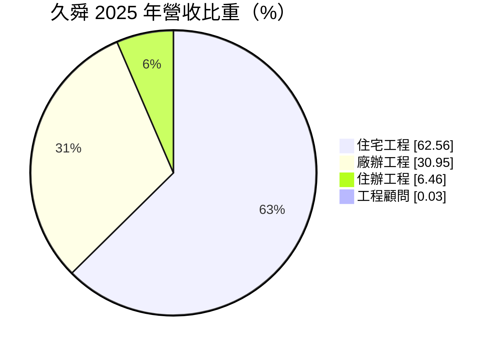
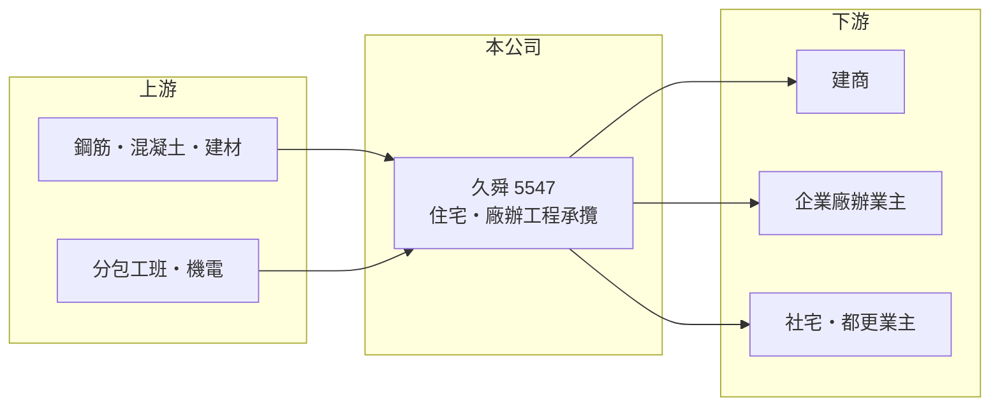

# 5547 久舜

> 上櫃｜[[產業索引-建材營造業|建材營造業]]｜上市（櫃）日期 2026/02/03

# 第一章：企業模式與商業藍圖

> [!info] 撰寫說明
> 精簡版，由 Claude 依公開資料整理，架構比照 [[2330台積電]]，資料截至 2026-10-08。來源：櫃買中心開放資料快照（基本資料、2026 年第二季資產負債與損益）、MoneyDJ 理財網財務比率年表（2021 至 2025 年，個別財報數字）與個股基本資料（2025 年營收比重、歷年股利）、優分析與工商時報的上櫃報導標題。公開資料有限，主要業主與[[在手訂單]]金額未查得；公司在 2026 年上櫃前後股本有變動，年度營收金額無法可靠推算，表格只列成長率。#待校對

久舜營造成立於 1993 年 9 月，2026 年 2 月在櫃買中心上櫃，是以住宅與廠辦大樓為主的民間營造廠。營造廠不買地、不賣房，而是替建商與企業業主把建築蓋出來，賺的是施工管理的利潤。

- **核心業務：** 久舜承攬建築工程，從結構、機電整合到完工交付，按工程進度向業主請款並認列營收。營造業的毛利率通常只有個位數到十出頭，獲利靠的是工程管理、成本控制與接案量，而不是單一案件的高利潤。
- **營收結構：** 依 MoneyDJ 的分類，2025 年住宅工程占 62.56%、廠辦工程占 30.95%、住辦工程占 6.46%、工程顧問服務占 0.03%。上櫃時的媒體報導以「社宅、都更、廠辦」作為成長方向，代表公司希望在民間住宅之外，增加[[社會住宅]]、[[都更]]與產業廠辦等案源（依 2026 年上櫃報導標題）。
- **營運據點：** 公司登記於台北市內湖區，董事長為林世貞；施工區域以北台灣為主（推估，依公司地址），具體工地分布本次未查得。
- **長期方向：** 2021 至 2025 年[[毛利率]]從 8.1% 逐步提高到 12.6%，營業利益率從 3.7% 提高到 6.5%，顯示公司在接案條件與成本控制上持續改善。上櫃取得的資金與知名度，有助於爭取規模更大的案件，但也要面對擴張後的管理挑戰。

# 第二章：護城河深度與競爭優勢

營造業的護城河普遍很淺，主要靠業主信任、施工紀錄與財務穩健度，久舜的優勢在於穩定的獲利紀錄與逐步改善的利潤率。

- **競爭優勢：** 建商挑選營造廠時，重視過去的施工品質、工期準時與財務能否撐過工程期間的資金壓力。久舜 2021 至 2025 年每年都有獲利，ROE 在 10% 至 19% 之間，在營造業中屬於表現穩定的一群；長期合作的建商客戶會帶來持續的案源（推估）。
- **主要對手：** 北部的上市櫃營造廠包括 [[2597潤弘]]、[[2546根基]]、[[5548安倉]] 等，以及大量未上市的中型營造廠（推估名單）。
- **觀察重點：** 觀察[[在手訂單]]的規模與毛利，以及社宅、都更、廠辦等新案源的比重能否提升。營造業最怕的是在原物料與工資上漲期間承接固定總價合約，因此新接案件的合約條件也是重點。

# 第三章：財務體質與盈利規模

資料日期：2026-10-08，表格是撰寫當時的快照；最新月營收、毛利率、累計 EPS 由自動排程寫在本筆記的屬性欄位（月營收、毛利率、累計EPS 等）。#待校對

久舜的營收在 2021 年大幅成長後維持平穩，利潤率逐年改善，2025 年 EPS 3.06 元、ROE 19.05% 都是五年來最高。

| 年度 | 營收（年增率） | [[毛利率]] | [[營業利益率]] | EPS（元） | [[ROE]] |
|---|---|---|---|---|---|
| 2021 | 未查得（+84.1%） | 8.11% | 3.74% | 2.19 | 17.49% |
| 2022 | 未查得（+20.8%） | 8.07% | 3.51% | 2.35 | 15.12% |
| 2023 | 未查得（-2.9%） | 7.94% | 2.76% | 1.57 | 10.44% |
| 2024 | 未查得（+6.9%） | 9.53% | 4.28% | 2.53 | 14.78% |
| 2025 | 未查得（-0.03%） | 12.60% | 6.50% | 3.06 | 19.05% |

- **長期指標：** 近 5 年平均 ROE 約 15.4%（推算），在營造業中屬中上水準。負債比率從 2021 年的 71.7% 降到 2025 年的 59.7%，每股淨值從 13.54 元增加到 17.21 元。現金股利（MoneyDJ 列示 108 至 114 年度）依序為 1.50、0.14、1.10、1.60、1.20、0.80、0.68 元，每年都有配發；不同資料源的股利金額有出入，待校對。
- **[[ROIC]] 與 [[WACC]]：** 以 2026 年上半年營業利益 0.68 億元年化約 1.36 億元，稅後約 1.09 億元；投入資本以 2026 年第二季股東權益 8.28 億元加上總負債 12.33 億元的一半（約 6.17 億元，假設一半為有息負債）計，約 14.4 億元，ROIC 約 7.5%（推算）。營造業負債多為應付工程款與預收款，實際有息負債可能更少，若只以股東權益計算，ROIC 約 13%（推算）。WACC 約 5.5%（推算：無風險利率 1.75%、市場風險溢酬 6%、β 取營建股常見值 1.0，股東權益成本約 7.75%；稅前負債成本 3%、稅率 20%；負債權重約 43%）。ROIC 高於 WACC，代表公司目前在創造價值。
- **財務特色：** 2026 年上半年營收 12.15 億元、毛利率約 11.5%、營業利益率約 5.6%、EPS 1.10 元。營造業屬「輕資產、重營運資金」，流動資產約占總資產的 87%，現金與應收工程款的管理是財務健康的關鍵。

# 第四章：總體風險與地緣政治

久舜的風險主要來自營建景氣、原物料與工資成本，以及業主的付款能力。

- **產業週期：** 營造廠的訂單來自建商推案與企業投資，房市降溫或[[信用管制]]收緊時，建商會延後開工，營造廠的接案量隨之減少，影響通常落後房市一到兩年。
- **營運風險：** 營造合約多為長期固定價格，若施工期間鋼筋、混凝土與工資上漲，毛利會被壓縮甚至虧損；工期延誤與工安事故也會帶來罰款與聲譽損失。業主若財務出問題，應收工程款可能無法回收。
- **其他風險：** 營建業長期缺工，外籍移工政策與工資水準會直接影響成本與工期；上櫃後股本擴大，若獲利成長跟不上，每股獲利會被稀釋。

# 專有名詞解析

## 金融

- **[[信用管制]]**：央行限制購屋與建商貸款成數的政策，會影響房市成交與建商資金。
- **[[ROIC]]**：投入資本報酬率，稅後營業利益除以股東權益加有息負債，衡量本業運用資本的效率。
- **[[WACC]]**：加權平均資金成本，股東與債權人要求報酬率的加權平均，是 ROIC 要超越的門檻。

## 產業

- **[[在手訂單]]**：已簽約但尚未完成交付的訂單金額，營造業用來預估未來數年的營收。
- **[[社會住宅]]**：由政府興建或包租、以低於市價出租給弱勢與青年的住宅，近年是公共工程的重要案源。
- **[[都更]]**：都市更新，由地主與建商合作把老舊建物改建，地主依權利價值分回房地或收益。

# 核心供應鏈

- 上游：鋼筋、預拌混凝土與建材供應商，分包工班與機電廠商（名稱未查得）。
- 下游／客戶：建商、企業廠辦業主，以及社會住宅與都更案的業主（名稱未查得）。
- 同業：[[2597潤弘]]、[[2546根基]]、[[5548安倉]]（推估名單）。

## 最新新聞
<!-- news:start（自動產生，請勿手動編輯此範圍） -->
- 2026-10-07 📰 媒體 16:12｜久舜Q3營收7.72億元創新高年增68% 新案及機電工程添動能｜[鉅亨網](https://news.cnyes.com/news/id/6623679)

完整紀錄：[[5547久舜 新聞]]
<!-- news:end -->

## 相關連結
- [公開資訊觀測站](https://mopsov.twse.com.tw/mops/web/t05st03?step=1&firstin=1&co_id=5547)
- [Goodinfo](https://goodinfo.tw/tw/StockDetail.asp?STOCK_ID=5547)
- [Yahoo 股市](https://tw.stock.yahoo.com/quote/5547)
- [鉅亨網新聞](https://www.cnyes.com/twstock/5547/news)
