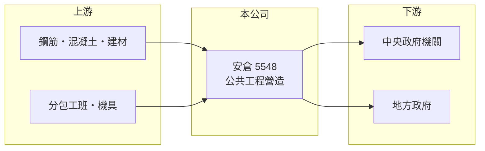

# 5548 安倉

> 上櫃｜[[產業索引-建材營造業|建材營造業]]｜上市（櫃）日期 2024/03/18

# 第一章：企業模式與商業藍圖

> [!info] 撰寫說明
> 精簡版，由 Claude 依公開資料整理，架構比照 [[2330台積電]]，資料截至 2026-10-08。來源：櫃買中心開放資料快照（基本資料、2026 年第二季資產負債與損益）、MoneyDJ 理財網財務比率年表（2021 至 2025 年）與個股基本資料（2025 年營收比重、歷年股利）。公開資料有限，主要工程案、業主機關與[[在手訂單]]金額未查得；年度營收由 2025 年每股營業額與歷年成長率回推，屬推算。#待校對

安倉營造成立於 1975 年 11 月，2024 年 3 月在櫃買中心上櫃，是專做[[公共工程]]的營造廠，2025 年營收全部來自公共工程。這讓它的案源主要取決於政府預算，而不是房市景氣。

- **核心業務：** 安倉參與政府機關的工程招標，得標後負責施工並依進度請款。公共工程的業主是政府單位，付款相對可靠，但多以最低價或最有利標決標，利潤空間有限，靠的是精準估價與工程管理。
- **營收結構：** 依 MoneyDJ 的分類，2025 年公共工程占 100%。業務高度專注，好處是經驗與資格可以累積，缺點是營收完全受公共建設預算與招標節奏影響。
- **營運據點：** 公司登記於台北市中山區松江路，董事長為張立雍；施工地區與主要工程類型（道路、水利、建築等）本次未查得。
- **長期方向：** 2021 至 2025 年營收從約 21.6 億元成長到約 27.5 億元（推算），[[毛利率]]從 7.4% 提高到 11% 以上，負債比率從 67% 降到 49%。上櫃後財務結構改善，有助於取得較大型標案所需的資格與履約保證額度。

# 第二章：護城河深度與競爭優勢

公共工程營造的門檻在於實績、資格與財務能力，安倉的優勢來自長年累積的公共工程經驗。

- **競爭優勢：** 政府大型標案通常要求投標廠商具備同類工程實績、一定的資本額與營造等級，這些條件需要長時間累積，形成一定的進入門檻。安倉近五年每年都有獲利、ROE 維持在 10% 至 17%，顯示其估價與成本控制能力穩定。
- **主要對手：** 公共工程營造廠包括 [[2597潤弘]]、[[2546根基]]、[[5547久舜]]，以及眾多甲級營造廠（推估名單）。政府標案競爭以價格為主，業者間差異化不大。
- **觀察重點：** 觀察[[在手訂單]]金額與新得標案件的規模，以及中央與地方政府的公共建設預算走向。也要留意大型案件的毛利，以及物價調整條款是否足以抵銷原物料上漲。

# 第三章：財務體質與盈利規模

資料日期：2026-10-08，表格是撰寫當時的快照；最新月營收、毛利率、累計 EPS 由自動排程寫在本筆記的屬性欄位（月營收、毛利率、累計EPS 等）。#待校對

安倉的獲利能力穩定但利潤率不高，EPS 長年在 2 元上下，營收穩定成長，是典型的公共工程營造廠財務樣貌。

| 年度 | 營收（推算） | [[毛利率]] | [[營業利益率]] | EPS（元） | [[ROE]] |
|---|---|---|---|---|---|
| 2021 | 約 21.6 億 | 7.38% | 3.13% | 2.15 | 16.77% |
| 2022 | 約 16.9 億 | 9.84% | 4.24% | 1.97 | 14.80% |
| 2023 | 約 20.9 億 | 10.57% | 4.49% | 2.37 | 16.74% |
| 2024 | 約 24.0 億 | 11.59% | 5.31% | 2.55 | 12.61% |
| 2025 | 約 27.5 億 | 11.16% | 4.86% | 2.03 | 10.33% |

- **長期指標：** 近 5 年平均 ROE 約 14.3%（推算），但 2024 年上櫃增資後股本擴大，ROE 從 16% 左右降到 10% 至 13%；2021 至 2025 年營收年複合成長率約 6%（推算）。現金股利（MoneyDJ 列示 111 至 114 年度）依序為 1.25、1.25、1.40、0.99 元，2025 年度[[配息率]]約 49%。
- **[[ROIC]] 與 [[WACC]]：** 2025 年營業利益約 1.34 億元（營收約 27.5 億元 × 營業利益率 4.86%），稅後約 1.07 億元；投入資本以 2026 年第二季股東權益 11.35 億元加上總負債 12.48 億元的一半（約 6.24 億元，假設一半為有息負債）計，約 17.6 億元，ROIC 約 6.1%（推算）。營造業負債多為應付工程款，若只以股東權益計算，ROIC 約 9.4%（推算）。WACC 約 5.9%（推算：無風險利率 1.75%、市場風險溢酬 6%、β 取營建股常見值 1.0，股東權益成本約 7.75%；稅前負債成本 3%、稅率 20%；負債權重約 35%）。ROIC 略高於 WACC，代表公司有在創造價值，但利差不大。
- **財務特色：** 2026 年上半年營收 13.10 億元、毛利率約 8.7%、營業利益率約 3.0%、EPS 0.64 元，利潤率較 2025 年下滑。流動資產約占總資產的 81%，應收工程款與合約資產的回收速度是現金流的關鍵。

# 第四章：總體風險與地緣政治

安倉的風險主要來自政府預算、低價搶標與原物料成本。

- **產業週期：** 公共工程受政府預算與政策影響，景氣低迷時政府常擴大公共建設，反而形成逆週期支撐；但預算排擠或政策轉向時，案源會同步減少。
- **營運風險：** 公共工程多以價格決標，若估價失準或施工期間鋼筋、混凝土、工資大漲，毛利會被壓縮；工期延誤可能被罰款，工安事故則會影響後續投標資格。
- **其他風險：** 營建業長期缺工，移工政策與工資水準直接影響成本；政府機關驗收與付款流程較長，可能讓營運資金壓力在大型案件期間升高。

# 專有名詞解析

## 金融

- **[[配息率]]**：現金股利占每股盈餘的比率，用來衡量公司把多少獲利發給股東。
- **[[ROIC]]**：投入資本報酬率，稅後營業利益除以股東權益加有息負債，衡量本業運用資本的效率。
- **[[WACC]]**：加權平均資金成本，股東與債權人要求報酬率的加權平均，是 ROIC 要超越的門檻。

## 產業

- **[[公共工程]]**：由政府出資發包的道路、捷運、水利、學校等建設工程，是營造業最主要的業務來源之一。
- **[[在手訂單]]**：已簽約但尚未完成交付的訂單金額，營造業用來預估未來數年的營收。

# 核心供應鏈

- 上游：鋼筋、預拌混凝土與建材供應商，分包工班與機具租賃業者（名稱未查得）。
- 下游／客戶：中央與地方政府機關等公共工程業主（名稱未查得）。
- 同業：[[2597潤弘]]、[[2546根基]]、[[5547久舜]]（推估名單）。

## 最新新聞
<!-- news:start（自動產生，請勿手動編輯此範圍） -->
- 2026-10-08 🏛️ 重訊 19:35｜公告本公司接獲臺灣臺北地方法院通知撤銷扣押｜[觀測站](https://mops.twse.com.tw/mops/#/web/t05st01)

完整紀錄：[[5548安倉 新聞]]
<!-- news:end -->

## 相關連結
- [公開資訊觀測站](https://mopsov.twse.com.tw/mops/web/t05st03?step=1&firstin=1&co_id=5548)
- [Goodinfo](https://goodinfo.tw/tw/StockDetail.asp?STOCK_ID=5548)
- [Yahoo 股市](https://tw.stock.yahoo.com/quote/5548)
- [鉅亨網新聞](https://www.cnyes.com/twstock/5548/news)
