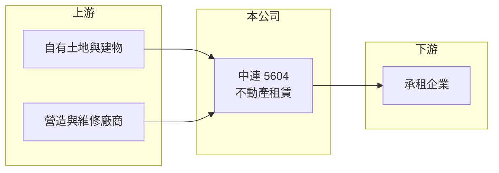

# 5604 中連

> 上櫃｜[[產業索引-其他業|其他業]]｜上市（櫃）日期 1997/05/22

# 第一章：企業模式與商業藍圖

> [!info] 撰寫說明
> 精簡版，由 Claude 依公開資料整理，架構比照 [[2330台積電]]，資料截至 2026-10-07。來源：poorstock 公司資料頁、winvest 營收快訊（搜尋結果標題）。公開資料有限，出租標的與承租客戶未查到。#待校對

中連目前以不動產租賃為主要事業，營收小而穩定。

- **核心業務：** 公司主要經營[[不動產租賃]]，以持有的土地與建物出租收取租金。
- **營收結構：** 營收以租金收入為主，2026 年月營收約在 1,300 萬至 1,400 萬元之間，波動很小。
- **營運據點：** 公司營業地址位於台中市西屯區工業區一路，出租標的明細本次未查到。
- **長期方向：** 租賃收入穩定，成長主要來自租約調漲或新增出租面積（推估）。

# 第二章：護城河深度與競爭優勢

中連的優勢是持有的不動產帶來穩定現金流，但成長性有限。

- **競爭優勢：** 自有資產出租不需大量營運費用，收入可預測性高（推估）。
- **主要對手：** 台中地區的廠辦與商用不動產出租業者，具體對手本次未查到。
- **觀察重點：** 租約續約與調租情形、是否有資產活化或處分，以及單季 EPS 中的[[業外收益]]比重。

# 第三章：財務體質與盈利規模

資料日期：2026-10-07，以下數字是撰寫當時的快照；最新月營收、毛利率、累計 EPS 由自動排程寫在本筆記的屬性欄位（月營收、毛利率、累計EPS 等）。#待校對

中連營收穩定，單季 EPS 多落在 0.3 至 0.9 元之間。

- **營收規模：** 2026 年 7 月營收 1,352.0 萬元（年增 2.37%）、8 月 1,385.5 萬元（年增 4.06%）。
- **獲利：** 2026 年第一季 EPS 0.32 元、第二季 0.63 元；2025 年第一季 0.85 元、第二季 0.43 元、第三季 0.63 元。單季 EPS 波動大於營收，推估有業外收益影響。
- **財務特色：** 股本約 10.88 億元，每股淨值約 17.96 元（2026 年第二季）；[[毛利率]]本次未查到。

# 第四章：總體風險與地緣政治

中連的風險集中在租約與資產價值。

- **產業週期：** 商用與工業不動產租金跟著區域景氣與產業設廠需求變動。
- **營運風險：** 若主要承租戶退租，營收會明顯下降；出租資產集中於特定地區（推估）。
- **其他風險：** 利率上升會壓低不動產價值，房地稅制調整會增加持有成本。

# 專有名詞解析

## 金融

- **[[毛利率]]**：營業毛利占營收的比率，反映產品售價扣除直接成本後的獲利空間。
- **[[業外收益]]**：本業以外的收入，例如利息、處分資產或投資收益，會使淨利與營業利益差距擴大。

## 產業

- **[[不動產租賃]]**：將自有土地、廠房或辦公室出租給他人，收取租金作為營收。

# 核心供應鏈

- 上游：營造與建物維修廠商（推估）
- 下游／客戶：承租企業，名稱未揭露
- 同業：台中地區商用與工業不動產出租業者，名稱未查到

## 最新新聞
<!-- news:start -->
<!-- news:end -->

## 相關連結
- [公開資訊觀測站](https://mopsov.twse.com.tw/mops/web/t05st03?step=1&firstin=1&co_id=5604)
- [Goodinfo](https://goodinfo.tw/tw/StockDetail.asp?STOCK_ID=5604)
- [Yahoo 股市](https://tw.stock.yahoo.com/quote/5604)
- [鉅亨網新聞](https://www.cnyes.com/twstock/5604/news)
