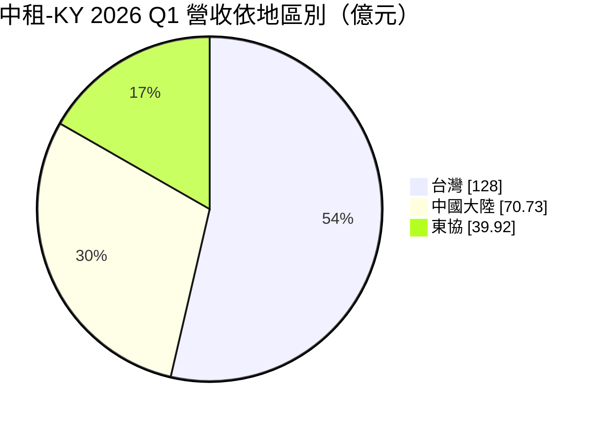
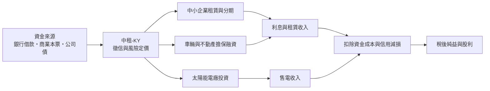
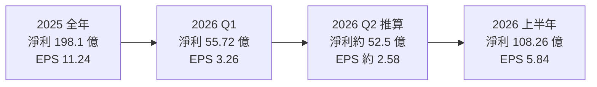
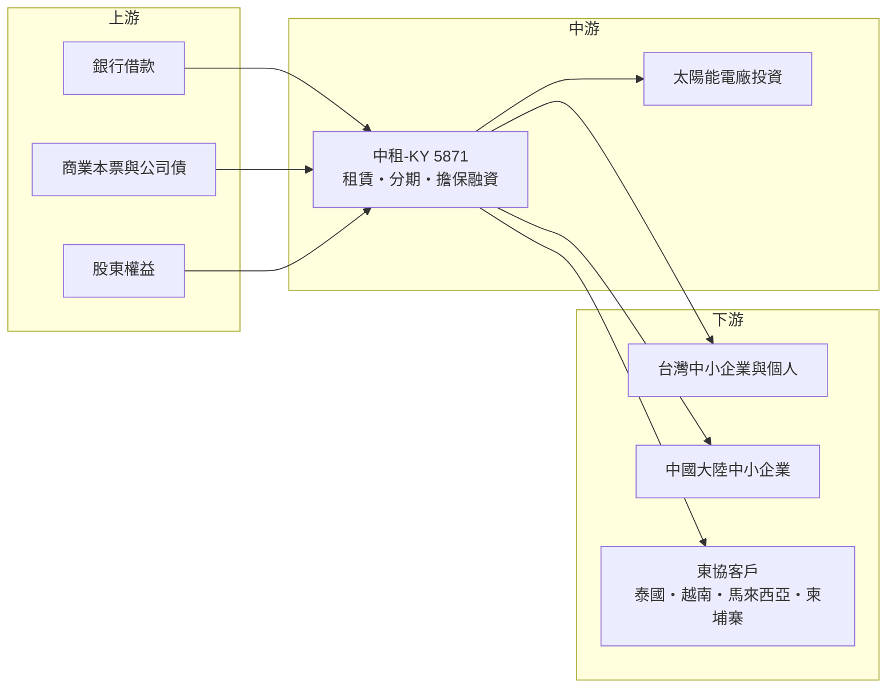

# 5871 中租-KY

> 上市｜[[產業索引-其他業|其他業]]｜上市（櫃）日期 2011/12/13

# 第一章：企業模式與商業藍圖

> [!info] 撰寫說明
> 本文由 Claude 依公開資料整理，架構比照 [[2330台積電]] 的四章研究，資料截至 2026-10-07。財務數字來源：工商時報與旺得富（2025 年全年自結、2026 年第一季法說、2026 年 7 月股利與上半年獲利報導）、自由時報（2026 年上半年獲利）、經濟日報（2026 年上半年 ROE 與地區獲利）、優分析（2025 年第四季法說會摘要）；產業描述為整理性內容，尚未逐條比對原始文件。#待校對

在評估單一個股的長期投資價值時，首要步驟是拆解企業的底層獲利邏輯。本章針對中租控股（股票代號：5871，以下簡稱中租-KY）的商業模式進行定性分析，說明一家以中小企業設備租賃起家的非銀行金融機構，如何在台灣、中國與東協三地建立高利差的放款業務。

## 一、核心定位：服務銀行照顧不到的中小企業

中租集團的前身中租迪和成立於 1977 年，是台灣最早的租賃公司之一；中租控股以開曼群島註冊，2011 年在台灣證交所掛牌，因此名稱帶有「-KY」。董事長為陳鳳龍。

中租-KY 不是銀行，不能吸收存款，資金來自銀行借款、發行商業本票與公司債。它的客群是規模較小、財報不完整、不易取得銀行貸款的中小企業與個人，以[[融資租賃]]、[[分期付款]]與擔保放款的方式提供資金。這個定位帶來兩個商業特徵：

* **高利差：** 客戶信用風險較高、銀行不願承作，中租-KY 因此能收取高於銀行的利率，[[利差]]明顯優於一般銀行放款。
* **高風險管理門檻：** 利差高的代價是違約率也高，公司長年建立的徵信、催收與擔保品處分能力，是這門生意能否賺錢的關鍵。

## 二、業務板塊：三地營運，台灣是獲利主力

以 2026 年第一季各地區營收計算（台灣 128 億元、中國大陸 70.73 億元、東協 39.92 億元），營收結構如下：

* **台灣：** 業務最完整，包括中小企業設備租賃與分期、車輛融資（小車業務餘額約 700 億元）、不動產擔保融資，以及[[太陽能電廠]]投資。截至 2026 年第一季，台灣信用資產約 4,580 億元；太陽能資產總額 742 億元，太陽能營收占台灣營收約 14%。2026 年上半年台灣稅後純益 69.03 億元，占集團過半。
* **中國大陸：** 以中小企業租賃與分期為主，信用資產約人民幣 496.29 億元。2023 年起中國景氣轉弱，公司主動收縮放款，2025 年中國獲利年減 29%；2026 年上半年中國稅後純益 45.5 億元、年增 2%，已開始止跌。
* **東協：** 包括泰國、越南、馬來西亞、柬埔寨等地，信用資產約 1,233 億元。2025 年東協獲利年增約五成，2026 年上半年稅後純益 15.69 億元、年增約 21% 至 25%（不同報導口徑），是成長最快的地區，馬來西亞與柬埔寨表現最好。

## 三、資本轉化邏輯：借短放長的利差生意

* **利差是核心：** 中租-KY 的獲利公式是「放款收益率減資金成本，再扣除呆帳損失與營運費用」。2025 年綜合資金成本由 3.07% 降到 2.86%，降幅 21 個基點，在降息循環中直接擴大利差。
* **信用成本決定盈虧：** 台灣 2025 年[[信用成本]]由 2% 降到 1.6%，2026 年上半年成本費用率由去年同期 30% 降到 28%，是獲利回升的主要原因。
* **太陽能電廠的穩定現金流：** 太陽能電廠有長期售電合約，收入穩定，可抵銷放款業務的景氣波動。

## 四、企業長期藍圖：東協成長、中國修復、利差改善

* **應收帳款目標：** 2026 年台灣與中國大陸個位數成長，東協雙位數成長；馬來西亞、柬埔寨、越南預計維持雙位數高成長。
* **中國業務：** 資產品質趨穩後，逐步恢復承作，但仍以「量利質並重」為原則。
* **綠能：** 持續投資太陽能電廠，讓穩定收益占比提高。
* **股東回報：** 2026 年股利配發率目標 40% 至 50%，董事長表示將往高標努力。

# 第二章：護城河深度與競爭優勢

在長期價值投資中，「護城河」指企業抵禦競爭、維持超額利潤的保護機制。本章分析中租-KY 的護城河構成、主要競爭對手，以及這些優勢在景氣循環中能守住多少。

## 一、中租-KY 護城河的核心組成要素

中租-KY 的護城河屬於「中等護城河」，來自以下三點：

* **1. 數十年累積的徵信資料與風險定價：** 中小企業的財報常不完整，中租-KY 靠長期累積的客戶資料、業務員實地拜訪與擔保品評估，判斷哪些客戶可以借、利率該收多少。這種經驗與資料庫是新進者最難複製的部分。
* **2. 綿密的業務與催收網路：** 在台灣、中國與東協多國都有分支機構，業務員直接接觸中小企業主。催收與擔保品處分能力，讓違約損失能控制在可接受範圍。
* **3. 規模帶來的資金成本優勢：** 作為台灣最大的租賃集團，中租-KY 能以較低的利率在資本市場發債，資金成本優於小型租賃公司。

## 二、主要競爭對手格局

| 對手 | 定位 | 對中租-KY 的威脅 |
|---|---|---|
| [[9941裕融]] | 裕隆集團旗下，以車輛融資起家，也做中小企業與東南亞 | 在車貸與中小企業融資直接競爭 |
| 和潤企業 | 和泰集團旗下，以 TOYOTA 車輛分期為主 | 在汽車分期市場競爭 |
| 台灣各銀行 | 吸收存款，資金成本低 | 在優質中小企業客群以低利率搶客 |
| 中國本土租賃公司與網路金融平台 | 熟悉當地市場 | 在中國以低價或線上方式搶中小企業客戶 |
| 東協當地金融機構 | 本土銀行與消費金融公司 | 在東協市場與中租-KY 爭取客戶 |

## 三、優勢轉化：哪些市場守得住、哪些守不住

* **守得住：** 台灣中小企業設備融資。中租-KY 在這個市場經營最久、規模最大，台灣獲利占集團過半，2026 年上半年仍年增約 3%。
* **守不住或需觀察：** 中國市場。中國景氣下滑時延滯率一度升高，中租-KY 被迫收縮放款，2025 年中國獲利大減。這說明在政策與景氣不由自己掌握的市場，徵信優勢也無法完全抵銷系統性風險。
* **觀察重點：** 中國延滯率能否持續下降、東協能否維持雙位數成長而不犧牲資產品質，以及降息循環能否讓資金成本持續下降。

# 第三章：財務體質與盈利規模

資料日期：2026-10-07。數字取自工商時報、自由時報、經濟日報與優分析整理的公司自結與法說會資料，表格是撰寫當時的快照；最新月營收、毛利率、累計 EPS 由自動排程寫在本筆記的屬性欄位（月營收、毛利率、累計EPS 等）。#待校對

財務報表是檢驗護城河是否真實存在的最終標準。租賃業不適用製造業的毛利率與營業利益率，本章改以稅後淨利與 EPS、ROE 與地區獲利結構、資產品質與資金成本、股利政策四個面向，檢視中租-KY 的獲利品質。

## 一、獲利能力的基石：稅後淨利與 EPS

| 項目 | 2025 全年 | 2026 Q1 | 2026 Q2（推算） | 2026 上半年 |
|---|---|---|---|---|
| 合併營收（新台幣） | 975.7 億 | 約 238.6 億（三地區加總） | 未查得 | 482.94 億 |
| 稅後純益 | 198.1 億 | 55.72 億 | 約 52.5 億 | 108.26 億 |
| 年增率 | -12% | 1% | 未查得 | 3.13% |
| EPS（元） | 11.24 | 3.26 | 約 2.58 | 5.84 |

* 2025 年營收年減 5%、淨利年減 12%，主因是中國業務收縮與信用減損。
* 2026 年上半年營收仍年減 2%，但淨利年增 3%，代表獲利回升來自成本費用率下降（30% 降到 28%）與台灣、中國的信用減損減少，而不是放款規模擴張。
* 第二季數字以上半年減第一季推算。

## 二、[[ROE]] 與地區獲利結構

| 地區 | 2025 全年獲利年增 | 2026 Q1 稅後純益 | 2026 上半年稅後純益 |
|---|---|---|---|
| 台灣 | 0.4% | 33.36 億（年增 10%） | 69.03 億（年增 3%） |
| 中國大陸 | -29% | 25.45 億（年減 7%） | 45.5 億（年增 2%） |
| 東協 | 約 49% 至 54% | 7.85 億（年增 18%） | 15.69 億（年增 21% 至 25%） |

* **ROE：** 2025 年 ROE 由前一年 15% 降到 12%（優分析口徑；經濟日報稱 2025 全年 11%），2026 年第一季為 13%（不含特別股），上半年年化約 12%。[[ROA]] 約 2.1% 至 2.4%。
* 各地區稅後純益加總高於合併數，差額為控股公司費用與內部沖銷，不宜直接相加。

## 三、資產品質與資金成本

* **[[延滯率]]：** 2026 年第一季合併逾期比率 5.1%（台灣 4.1%、中國大陸 7%、東協 4.5%），[[備抵呆帳]]比率 3.1%。經濟日報稱上半年延滯率約 5.1%、高於去年的 4.4%，顯示資產品質尚未全面改善。
* **中國延滯率：** 2025 年由 6.8% 降到 5.1%（法說會口徑），延滯數字連續下降。
* **資金成本：** 2025 年綜合資金成本 2.86%，比前一年下降 21 個基點；董事長陳鳳龍預期在降息循環中利差能維持穩健並有提升空間。

## 四、股利政策

* 2025 年度盈餘分配：普通股現金股利 5.8 元、股票股利 0.2 元（[[股票股利]]），2026 年 7 月 29 日除權息，以當時股價計算現金殖利率近 5%。優分析在 2025 年第四季法說會摘要中寫為現金 6.1 元，與後續報導不同，應以公司公告為準。
* 2026 年配發率目標 40% 至 50%。中租-KY 每年配發少量股票股利，讓股本緩慢擴大，以支應放款成長所需的資本。
* 以 ROE 約 12%、配發率約五成推估，留存盈餘可支撐每年約 6% 的資產成長（推估）。

# 第四章：總體風險與地緣政治

任何企業都無法脫離宏觀環境獨立存在。本章分析中租-KY 未來必須面對的地緣政治、景氣與利率、營運與法規風險。

## 一、地緣政治風險

* **中國曝險：** 中國大陸營收約占三成，台灣與中國關係、中國對台資企業的政策變化，都可能影響中國子公司的經營與資金回流。
* **東協政治與匯率：** 柬埔寨、越南等新興市場的政治穩定度與匯率波動，影響當地放款品質與換算成台幣的獲利。
* **美國關稅：** 台灣與東協中小企業多數做出口生意，美國關稅提高會打擊客戶營運，進而影響還款能力。

## 二、利率與景氣週期

* **景氣與違約率：** 中租-KY 的客群是體質較弱的中小企業，景氣下滑時違約率上升最快，2023 至 2025 年中國業務就是例子。
* **利率方向：** 降息有利於降低資金成本；但如果利率反向上升，資金成本會比放款利率更快調整，壓縮利差。
* **[[長鞭效應]]式的信用循環：** 景氣好時放款擴張、信用標準放寬，景氣反轉時呆帳集中出現，租賃業的獲利波動通常大於景氣本身。

## 三、營運環境的隱性風險

* **資產品質尚未完全恢復：** 2026 年上半年延滯率約 5.1%，仍高於前一年同期，若台灣或東協景氣轉弱，信用成本可能再度上升。
* **資金來源依賴批發市場：** 不能吸收存款，若信用市場緊縮或公司信評遭調降，資金成本會快速上升。
* **太陽能電廠風險：** 電廠面臨天災、設備衰退與躉購費率政策變化。

## 四、法規與科技演進

* **金融監理：** 台灣的租賃業監理相對寬鬆，若主管機關提高對非銀行放款的資本或揭露要求，營運成本會增加。中國與東協各國的利率上限、催收規範也可能收緊。
* **金融科技競爭：** 網路銀行與線上借貸平台以數據徵信搶中小企業客戶，可能壓縮中租-KY 的利差。中租-KY 需要把多年累積的徵信資料數位化，才能維持優勢。
* **能源政策：** 台灣綠能政策與躉購制度變化，影響太陽能投資的報酬率。

# 專有名詞解析

## 金融

- **[[融資租賃]]**：租賃公司買下設備再租給企業使用，企業按期支付租金，期滿可取得設備，實質上是一種放款。
- **[[分期付款]]**：把購買設備或車輛的款項分成多期償還，租賃公司賺取分期利息。
- **[[利差]]**：放款收益率減去資金成本的差距，是租賃與銀行業最主要的獲利來源。
- **[[延滯率]]**：逾期未還款的放款占總放款的比例，數字越高代表資產品質越差。
- **[[信用成本]]**：為預期呆帳提列的損失占放款的比例，直接從獲利中扣除。
- **[[備抵呆帳]]**：預先提列以吸收未來可能發生呆帳損失的準備金。
- **[[ROE]]**：股東權益報酬率，稅後淨利除以股東權益，衡量公司用股東的錢賺錢的效率。
- **[[ROA]]**：資產報酬率，稅後淨利除以總資產，衡量整體資產的獲利效率。
- **[[股票股利]]**：以新發行股票配發給股東的股利，會增加股本，常用於保留資本支應成長。
- **[[長鞭效應]]**：需求或景氣的小幅變動沿鏈條傳遞時被逐級放大，在信用市場表現為放款擴張與呆帳集中出現的循環。

## 產業

- **[[太陽能電廠]]**：以太陽能板發電並出售電力的電廠，通常有長期購電合約，收入穩定。

# 核心供應鏈

## 1. 上游：資金來源
- 銀行聯貸與借款：台灣與外資銀行
- 資本市場：商業本票、公司債、特別股

## 2. 中游：中租-KY 與子公司
- 台灣：中租迪和等租賃與分期子公司、太陽能電廠事業
- 中國大陸與東協：當地租賃子公司

## 3. 下游：主要客群
- 台灣、中國大陸與東協的中小企業、個人車貸與分期客戶

## 4. 同業比較
- 租賃與分期：[[9941裕融]]、和潤企業
- 銀行中小企業放款：各大公股與民營銀行

## 最新新聞
<!-- news:start -->
<!-- news:end -->

## 相關連結
- [公開資訊觀測站](https://mopsov.twse.com.tw/mops/web/t05st03?step=1&firstin=1&co_id=5871)
- [Goodinfo](https://goodinfo.tw/tw/StockDetail.asp?STOCK_ID=5871)
- [Yahoo 股市](https://tw.stock.yahoo.com/quote/5871)
- [鉅亨網新聞](https://www.cnyes.com/twstock/5871/news)
