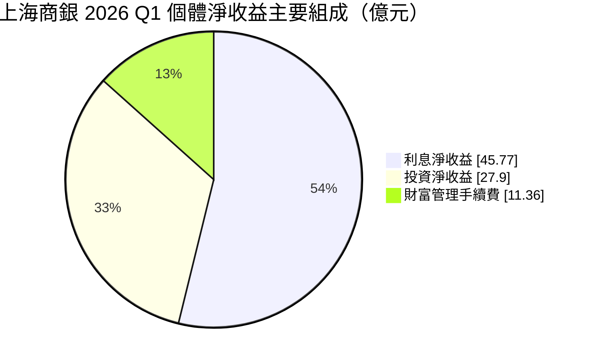
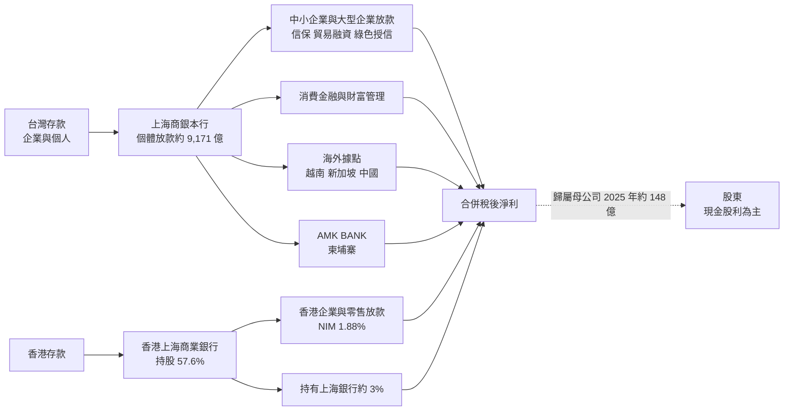
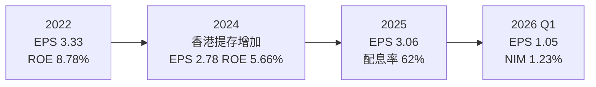
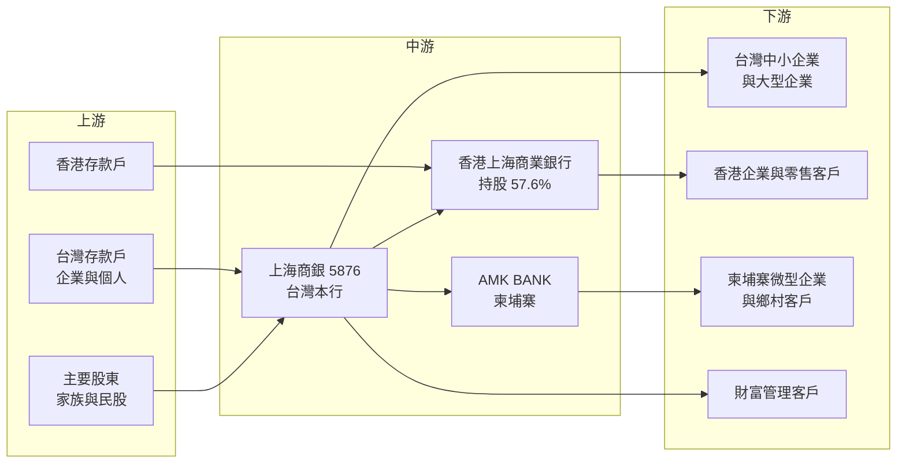

# 5876 上海商銀

> 上市｜[[產業索引-金融保險業|金融保險業]]｜上市（櫃）日期 2018/10/19

# 第一章：企業模式與商業藍圖

> [!info] 撰寫說明
> 本文由 Claude 依公開資料整理，架構比照 [[2330台積電]] 的四章研究，資料截至 2026-10-08。財務數字來源：MoneyDJ 年度財務比率頁、富果研究（上海商銀 2026 年 5 月法說會整理）、聯合報與經濟日報（2025 年前三季與 2026 年股東會報導）、股感（上海商銀個股研究）、中央社與工商時報（AMK 改制報導）、證交所開放資料（基本資料、股利、本益比）；產業描述為整理性內容，尚未逐條比對原始文件。#待校對

在評估單一個股的長期投資價值時，首要步驟是拆解企業的底層獲利邏輯。本章針對上海商業儲蓄銀行（股票代號：5876，以下簡稱上海商銀）的商業模式進行定性分析，說明一家百年民營銀行如何以台灣本行與香港子行的「雙核心」結構獲利，以及為什麼它的股東權益報酬率長期穩定卻不高。

## 一、核心定位：百年歷史、台港雙核心的民營銀行

上海商銀 1915 年由陳光甫在上海創立，是中國近代最早的民營商業銀行之一。1949 年隨政府遷台後，原香港分行脫離本行，以「上海商業銀行」名義在香港獨立註冊；台灣的上海商銀則於 1954 年在台復業（證交所登記成立日期為 1954 年 9 月 9 日），2018 年 10 月才掛牌上市。2026 年董事長為李慶言、總經理為郭進一，實收資本額約 491 億元；遠見雜誌報導以「榮家四代」形容其長期的家族股東傳承。

上海商銀最大的結構特色是：**台灣本行間接持有香港上海商業銀行（以下簡稱香港子行）57.6% 股權**，香港子行又持有中國上海銀行約 3% 股權。依股感整理，2018 年香港子行稅後損益約 109 億元，以合併報表計算約占上海商銀稅後損益的 35%。換言之，上海商銀是一家「台灣銀行加香港銀行」的雙核心銀行，這在台灣上市銀行中相當少見。

其他定位特色包括：

* **企業金融與存匯為主：** 股感整理指出，上海商銀的存款與匯款約占負債 86% 至 88%，消費放款只占放款約兩成，低於多數民營銀行；零售並非傳統核心。2026 年第一季個體放款中企業金融占 59%、消費金融 41%，依客戶別則中小企業 45.39%、大型企業 36.49%、個人 17.69%。
* **非官股、經營穩定：** 上海商銀不是公股銀行，策略較少受政策干預；長期以穩健、保守的授信風格著稱。

## 二、業務板塊：本行與香港子行的獲利結構

報導未揭露上海商銀淨收益各科目的完整金額，以下用 2026 年第一季個體淨收益的主要組成說明（其他項目未列入）：

* **利息淨收益：** 2026 年第一季個體 45.77 億元，是最主要的收入。個體[[NIM]] 1.23%，公司 2026 年目標 1.25%，策略是優化存款結構、調整放款定價並提高外幣放款比重。
* **投資淨收益：** 2026 年第一季個體 27.90 億元、年增 15.57%，來自債券、股票與轉投資，是上海商銀比重偏高的一塊收入。
* **手續費：** 財富管理約占手續費收入 77%，2026 年第一季財富管理手續費 11.36 億元、年增 23.75%，個體保險佣金年增 24.5%。公司 2026 年目標是淨手續費收益成長 15%，但手續費占資產比率長期低於全國平均。
* **香港子行：** 放款利差 2.52%、NIM 1.88%，明顯高於台灣本行，是集團利差的重要來源；2026 年第一季因手續費、外匯收入增加與提存減少而獲利成長。

## 三、資本轉化邏輯：存匯起家，台港兩地放款

* **存款充足、放款保守：** 上海商銀的資金以存款與匯款為主，存放比不高，多餘資金投入金融資產，這也是投資收益占比偏高的原因。好處是流動性充足、風險低，代價是資產報酬率不高。
* **香港子行提供高利差：** 香港市場的放款利差高於台灣，香港子行提高了集團整體的獲利能力，但它只有 57.6% 歸屬上海商銀股東，其餘 42.4% 屬於[[非控制權益]]。這也是合併稅後淨利（2026 年第一季 65.23 億元）明顯高於歸屬母公司淨利（51.09 億元）的原因。
* **股利以現金為主：** 2025 年度配發現金 1.8 元與資本公積轉增資 0.1 元，盈餘分配率約 62%，為近五年新高。

## 四、企業長期藍圖：跨境金融與東南亞

* **AMK 改制商業銀行：** 上海商銀持有的柬埔寨微型金融機構 AMK，2025 年 3 月獲金管會同意申請改制，2026 年 3 月獲柬埔寨主管機關核准，更名 AMK BANK PLC。AMK 有 147 個據點、3,632 名員工、服務超過 80 萬名客戶，改制後可承作企業與貿易融資、個人貸款與行動銀行。這是上海商銀在東南亞最重要的長期布局。
* **跨境金融與高資產財管：** 公司把跨境金融與高資產客戶財富管理列為策略重點，發展耗用資本較低的手續費業務。
* **香港子行改善：** 香港子行計畫提升資金運用效率、提高非利息收入比重，並處理不良資產，逐步把逾放比降到同業水準。2025 年起香港子行陸續認列西環不動產處分利益，屬一次性收益。
* **永續：** 入選 2026 年 S&P Global 永續年鑑全球前 5%。

# 第二章：護城河深度與競爭優勢

在長期價值投資中，「護城河」指企業抵禦競爭、維持超額利潤的保護機制。本章分析上海商銀的護城河構成、主要對手，以及在台港兩地的競爭與景氣中，這些優勢能守住多少。

## 一、上海商銀護城河的核心組成要素

上海商銀屬於「窄護城河」銀行，但在台灣中型銀行中護城河相對穩固，由三個要素組成：

* **1. 香港子行的特許經營價值：** 香港上海商業銀行在香港經營數十年，擁有當地的客戶、品牌與執照，這是台灣同業無法在短期內複製的資產。它提供了比台灣更高的利差，也讓上海商銀能服務台港兩地與跨境的企業客戶。
* **2. 百年品牌與穩健文化：** 長期保守的授信文化與穩定的家族股東結構，讓上海商銀在存款戶與企業客戶心中有高度信任感，存款來源穩定。
* **3. 中小企業與貿易融資專業：** 中小企業占放款四成以上，信保放款與貿易融資經驗深厚，企業客戶轉換銀行的成本高。

## 二、全球主要競爭對手格局

| 對手 | 定位 | 對上海商銀的威脅 |
|---|---|---|
| [[2891中信金]]、[[2884玉山金]]、[[2881富邦金]] | 民營大型金控，香港與東南亞均有布局 | 財富管理、數位平台與海外網路規模更大 |
| [[2886兆豐金]]、[[2892第一金]]、[[2880華南金]] | 公股金控，外匯與企金強 | 在企業放款、貿易融資與外匯業務直接競爭，資金成本低 |
| [[2834臺企銀]]、[[2845遠東銀]] | 中小企業與中型銀行 | 在中小企業放款上競爭 |
| 香港本地與中資銀行（滙豐、中銀香港等） | 香港主要銀行 | 在香港市場的規模與資金成本遠大於香港子行 |

## 三、優勢轉化：哪些市場守得住、哪些守不住

* **守得住：** 台灣中小企業與貿易融資、台港跨境企業客戶，以及以香港子行為核心的高利差業務。這些業務依賴長期關係與香港執照，競爭者不易取代。
* **守不住：** 財富管理與數位消費金融。上海商銀的手續費占資產比率長期低於全國平均，大型金控在產品與數位平台上的優勢明顯；香港市場本身也面臨中國經濟放緩與資金外流的壓力。
* **觀察重點：** 香港子行逾放比能否降回同業水準、AMK BANK 改制後的成長與資產品質、NIM 能否達成 1.25% 目標，以及手續費能否維持兩位數成長。

# 第三章：財務體質與盈利規模

資料日期：2026-10-08。數字取自 MoneyDJ 年度財務比率頁、法說會報導與證交所開放資料，表格是撰寫當時的快照；最新月營收、累計 EPS 由自動排程寫在本筆記的屬性欄位（月營收、累計EPS 等）。#待校對

財務報表是檢驗護城河是否真實存在的最終標準。銀行業不適用毛利率與營業利益率，本章改用營收成長、稅後淨利、[[ROE]]、[[ROA]]、資產品質與資本適足率，檢視上海商銀的獲利品質。

## 一、獲利能力的基石：多年度獲利

| 年度 | 淨收益 | 歸屬母公司稅後淨利 | EPS（元） | [[ROE]] | [[ROA]] | 營收成長率 |
|---|---|---|---|---|---|---|
| 2020 | 未查得 | 未查得 | 3.01 | 8.70% | 0.85% | -7.62% |
| 2021 | 未查得 | 未查得 | 3.19 | 9.01% | 0.88% | 0.90% |
| 2022 | 未查得 | 未查得 | 3.33 | 8.78% | 0.86% | 16.84% |
| 2023 | 未查得 | 未查得 | 3.02 | 7.43% | 0.73% | 10.56% |
| 2024 | 未查得 | 未查得 | 2.78 | 5.66% | 0.59% | 4.24% |
| 2025 | 未查得 | 148.3 億 | 3.06 | 6.24% | 0.69% | 3.70% |
| 2026 Q1 | 個體 88.64 億 | 51.09 億 | 1.05 | 個體稅前 11.23% | 個體稅前 1.44% | 未查得 |

註：EPS、ROE、ROA、營收成長率取自 MoneyDJ 年度財務比率（合併）；營收成長率以營業收入口徑計算（含利息收入毛額），2025 年月營收口徑全年營收約 537.4 億元。2025 年歸屬母公司淨利取自證交所股利資料的本期淨利 148.28 億元。MoneyDJ 的 ROE 推估以含非控制權益的總權益計算，以歸屬母公司權益計算會較高（見下文）。

* **EPS 長期持平：** 2020 至 2025 年 EPS 在 2.78 元至 3.33 元之間，幾乎沒有成長。原因是台灣本行利差有限，加上 2023 至 2024 年香港子行因中國與香港景氣轉弱而增加提存，2024 年稅後淨利年減約 17%（MoneyDJ 稅後淨利成長率）。
* **2025 至 2026 年回升：** 2025 年稅後淨利年增約 17%，2026 年第一季合併稅後淨利年增 10.73%、手續費淨收益年增 13.02%、投資收益年增 59.14%。2026 年全年提存預計比 2025 年減少約一半。
* **[[NIM]]：** 個體 NIM 1.23%（2026 年第一季），香港子行 NIM 1.88%，集團整體利差優於多數台灣本土銀行。
* **營收成長：** 2021 至 2025 年營收成長率在 0.9% 至 16.84% 之間，2022 至 2023 年受升息推動較快，之後放緩。

## 二、[[ROE]] 與 [[ROA]]：資本效率

MoneyDJ 資料顯示 2021 至 2025 年平均 ROE 約 7.4%（推算），ROA 在 0.6% 至 0.9% 之間，高於多數台灣本土銀行，反映香港子行的高利差。若以歸屬母公司權益計算，2026 年股東會揭露每股淨值 42.98 元、實收資本 486 億元，母公司權益約 2,089 億元（推算），以 2025 年母公司淨利 148.3 億元計算 ROE 約 7.1%（推算）。

上海商銀 ROE 不高的根本原因是資本非常充足：保留盈餘達 1,216 億元，資本適足率 16% 以上，大量資本沒有被槓桿運用。這是穩健的代價，也是安全邊際的來源。

## 三、資產品質與資本適足

* **[[逾放比]]：** 個體逾放比 2025 年 9 月底 0.30%、2026 年第一季 0.53%，MoneyDJ 年度資料顯示 2025 年狹義逾放比 0.51%，高於 2020 至 2024 年的 0.12% 至 0.23%。上升主要與香港及海外授信有關（推估），香港子行正在處理不良資產。
* **[[備抵呆帳覆蓋率]]：** 個體 247.32%（2026 年第一季），低於台灣公股銀行動輒五倍以上的水準，是需要持續觀察的指標。
* **[[資本適足率]]：** 個體資本適足率 16.25%、普通股權益第一類資本比率 13.18%（2026 年第一季），在台灣銀行業中屬於偏高水準。
* **提存：** 2026 年第一季提存 5.25 億元，全年目標 20 至 24 億元；柬埔寨 AMK 2026 年提存規劃約 2,200 萬美元，低於 2025 年。
* **股利：** 2025 年度現金 1.8 元加資本公積轉增資 0.1 元，現金[[配息率]]約 59%（推算，1.8 ÷ 3.06），公司稱盈餘分配率約 62%。股感整理顯示 2017 年現金股利 1.8 元、2018 年 2 元，現金股利長期穩定在 2 元上下（2019 至 2024 年明細未查得）。

## 四、ROE 與權益資金成本：價值創造利差

**為什麼金融業不用 ROIC：** [[ROIC]] 以「股東權益加有息負債」為投入資本、以 [[WACC]] 為門檻，但銀行的存款與借款是營業原料，利息支出是營業成本，負債和營運無法分開，ROIC 對銀行沒有意義。因此銀行的價值創造直接以 ROE 對照權益資金成本。

**權益資金成本推算：** 以 [[CAPM]] 估算，假設台灣 10 年期公債殖利率 1.75%、市場風險溢酬 6%、β 取台灣民營銀行常見值 0.7（同業常見值，非來源數字），權益資金成本約為 1.75% ＋ 0.7 × 6% ＝ 5.95%（推算）；考量香港與海外曝險，β 若為 0.8，約 6.55%。

**比較：** 以 MoneyDJ 的 ROE 計算，2025 年 6.24% 只比權益成本高約 0.3 個百分點；以母公司權益推算的 7.1% 則高約 1.2 個百分點。2020 至 2022 年 ROE 約 8.7% 至 9%，利差約 3 個百分點；2024 年 5.66% 則略低於權益成本。結論是：上海商銀長期能賺回資金成本並小幅創造價值，但利差在 2023 年後明顯縮小，關鍵在香港子行的資產品質與提存能否回到正常水準。證交所資料顯示股價淨值比約 1.11 倍，與 ROE 略高於權益成本的判斷一致。

# 第四章：總體風險與地緣政治

任何企業都無法脫離宏觀環境獨立存在。本章分析上海商銀未來必須面對的地緣政治、利率週期與營運風險。

## 一、地緣政治風險

* **香港與中國的雙重曝險：** 香港子行是上海商銀獲利的重要來源，香港經濟與房地產高度受中國影響，2024 年起的提存增加就是中國與香港景氣轉弱的結果。香港子行持有上海銀行股權，也直接暴露在中國金融體系的風險之下。
* **兩岸與美中關係：** 美中對立與兩岸緊張可能影響香港的國際金融中心地位、資金流動與企業信心，進而影響香港子行的放款需求與資產品質。這是上海商銀與其他以台灣為主的銀行最大的差異。
* **東南亞布局：** 柬埔寨 AMK BANK 與越南、新加坡據點分散了地域風險，但新興市場的政治與監理風險也較高。

## 二、利率與景氣週期

* **利率方向：** 台灣本行 NIM 約 1.23%，香港子行 1.88%，兩地利率週期不同。香港利率跟隨美國，美國降息會壓縮香港子行利差；台灣利率則變動較小。
* **景氣與信用成本：** 中小企業放款占比高，加上香港企業與不動產授信，景氣下行時信用成本可能上升。2025 年起逾放比已從極低水準回升，顯示信用循環正在反映。
* **投資收益：** 投資淨收益占個體淨收益約三成，股債市大幅波動時會影響獲利穩定度。

## 三、營運環境的隱性風險

* **非控制權益：** 香港子行的獲利有 42.4% 不屬於上海商銀股東，合併報表數字要扣除非控制權益才是股東實際分到的部分。
* **一次性收益：** 香港子行處分西環不動產的利益分在 2025 與 2026 年認列，屬一次性收益，評估獲利趨勢時應扣除。
* **新興市場微型金融：** AMK 的客戶以柬埔寨鄉村與微型企業為主，景氣衝擊時壞帳率可能快速上升，2025 年已有較高提存。

## 四、法規與科技演進

* **資本規範與股利：** 上海商銀資本充足，未來國際資本規範趨嚴對它的影響小於同業，反而有空間提高配息或進行併購。
* **數位金融：** 上海商銀以企金與存匯為主，零售數位化相對落後於大型金控，公司表示將深化金融科技與 AI 應用，但追趕需要時間與投資。
* **香港監理變化：** 香港金融管理局的資本、流動性與跨境資金規範變化，會直接影響香港子行的營運。

# 專有名詞解析

## 金融

- **[[NIM]]**：淨利息收益率，利息淨收益除以生息資產，衡量銀行整體資產賺取利息的效率。
- **[[非控制權益]]**：合併報表中子公司不屬於母公司的股權部分，相關獲利不歸母公司股東所有。
- **[[逾放比]]**：逾期放款占總放款的比例，數字越低代表放款資產品質越好。
- **[[備抵呆帳覆蓋率]]**：備抵呆帳除以逾期放款，衡量銀行為可能的壞帳預先提列了多少緩衝。
- **[[資本適足率]]**：自有資本除以風險性資產，主管機關用來確保金融機構有足夠資本承擔損失；放款越多需要的資本越多。
- **[[普通股權益比率]]**：普通股權益除以風險性資產，是品質最高的資本指標。
- **[[貿易融資]]**：銀行為進出口交易提供的信用狀、押匯與短期融資服務。
- **[[微型金融]]**：對低收入族群與微型企業提供小額貸款、存款與匯款的金融服務，常見於新興市場。
- **[[配息率]]**：股利占每股盈餘的比例，反映公司把多少獲利分給股東。
- **[[ROE]]**：股東權益報酬率，稅後淨利除以股東權益，衡量公司運用股東資本賺錢的效率。
- **[[ROA]]**：資產報酬率，稅後淨利除以總資產，銀行因槓桿高，ROA 通常低於 1%。
- **[[CAPM]]**：資本資產定價模型，以無風險利率加上 β 乘以市場風險溢酬，推估股東要求的報酬率。
- **[[ROIC]]**：投入資本報酬率，稅後營業利益除以股東權益加有息負債，衡量本業運用資本的效率；不適用於銀行。
- **[[WACC]]**：加權平均資金成本，依股權與負債比重加權的資金成本，是判斷 ROIC 是否創造價值的門檻。

# 核心供應鏈

## 1. 上游：資金來源
- 台灣企業與個人存款、匯款
- 香港子行的當地存款
- 主要股東：長期家族股東與民股

## 2. 中游：上海商銀與子公司
- 台灣本行與海外據點（越南、新加坡、中國）
- 香港上海商業銀行（間接持股 57.6%，另持有中國上海銀行約 3%）
- AMK BANK（柬埔寨，2026 年由微型金融機構改制）

## 3. 下游：主要客群
- 台灣中小企業（信保、貿易融資、綠色授信）與大型企業
- 香港企業與零售客戶
- 柬埔寨鄉村與微型企業客戶
- 高資產與財富管理客戶

## 4. 同業比較
- 民營金控：[[2891中信金]]、[[2884玉山金]]、[[2881富邦金]]
- 公股金控：[[2886兆豐金]]、[[2892第一金]]
- 中型銀行：[[2834臺企銀]]、[[2845遠東銀]]、[[2838聯邦銀]]

## 最新新聞
<!-- news:start（自動產生，請勿手動編輯此範圍） -->
- 2026-10-08 🏛️ 重訊 17:37｜公告本公司115年9月份合併自結損益｜[觀測站](https://mops.twse.com.tw/mops/#/web/t05st01)

完整紀錄：[[5876上海商銀 新聞]]
<!-- news:end -->

## 相關連結
- [公開資訊觀測站](https://mopsov.twse.com.tw/mops/web/t05st03?step=1&firstin=1&co_id=5876)
- [Goodinfo](https://goodinfo.tw/tw/StockDetail.asp?STOCK_ID=5876)
- [Yahoo 股市](https://tw.stock.yahoo.com/quote/5876)
- [鉅亨網新聞](https://www.cnyes.com/twstock/5876/news)
