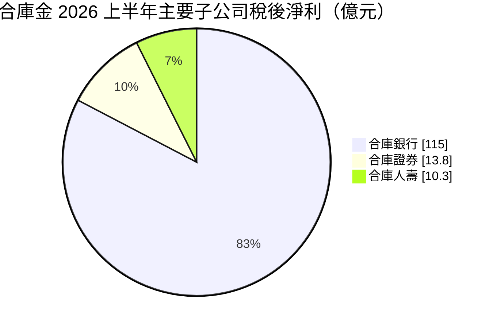
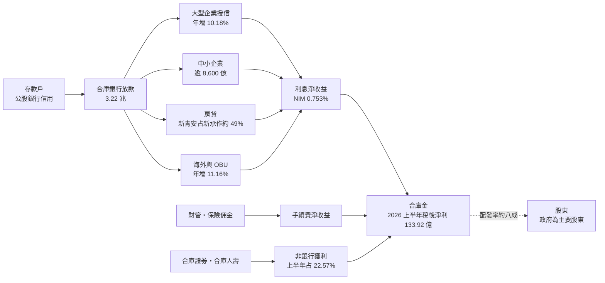
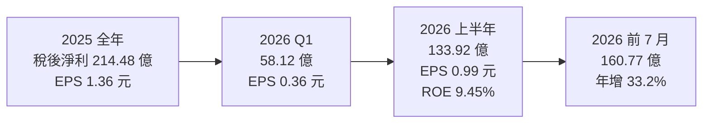
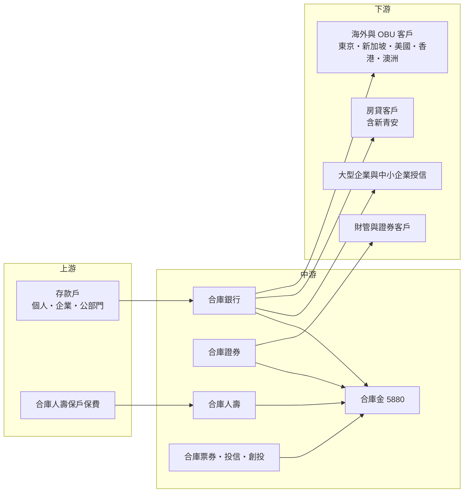

# 5880 合庫金

> 上市｜[[產業索引-金融保險業|金融保險業]]｜上市（櫃）日期 2011/12/01

# 第一章：企業模式與商業藍圖

> [!info] 撰寫說明
> 本文由 Claude 依公開資料整理，架構比照 [[2330台積電]] 的四章研究，資料截至 2026-10-07。財務數字來源：優分析（2025 年第四季法說會、2026 年前 7 月法說會）、富果研究（2026 年第一季法說會整理）、NOWnews（2026 年股東常會）；產業描述為整理性內容，尚未逐條比對原始文件。#待校對

在評估金融股的長期投資價值時，首要步驟是看清楚獲利從哪一家子公司、哪一種業務而來。本章針對合作金庫金融控股（股票代號：5880，以下簡稱合庫金）的商業模式進行定性分析，說明這家以國內存放款規模見長的公股[[金控]]，如何在利差偏低、房貸政策變動的環境中，透過大型企業授信、海外分行與非銀行子公司提升獲利。

## 一、核心定位：存放款規模龐大的公股金控

合庫金控成立於 2011 年，核心子公司為合作金庫商業銀行（合庫銀行），另有合庫證券、合庫人壽、合庫票券、合庫產險代理、合庫投信與合庫創投等子公司。合庫銀行前身是日治時期的信用組合聯合會，長期是國內存放款規模最大的銀行之一，政府為主要股東。

2025 年合併稅後淨利 214.48 億元、年增 8.27%，創歷史新高，EPS 1.36 元，[[ROE]] 7.87%。2026 年上半年稅後淨利 133.92 億元、年增 36.67%，EPS 0.99 元，ROE 9.45%；前 7 月累計 160.77 億元、年增 33.2%。

對投資人而言，合庫金有兩個基本特徵：

* **規模大、利差低：** 2026 年第一季總資產 5.43 兆元、總放款 3.22 兆元，但銀行 [[NIM]] 只有 0.753%，屬於「量大價低」的經營模式。
* **獲利高度集中在銀行：** 2025 年合庫銀行稅後淨利 208.14 億元，幾乎等於金控全年獲利；2026 年上半年非銀行貢獻度提升到 22.57%，才開始改變這個結構。

## 二、業務板塊：銀行為主、證券與壽險跳升

以 2026 年上半年主要子公司稅後淨利來看，獲利結構如下：

圖中三家合計約 139 億元，高於金控合併稅後淨利 133.92 億元，差額來自金控層級費用、其他子公司與合併調整（推估）；票券、投信、創投的個別數字本次未查得。

* **合庫銀行：** 2026 年第一季利息淨收益 89.26 億元、年增 8.29%，手續費淨收益 30.31 億元、年增 15.38%。大型企業放款年增 10.18%，OBU 與海外單位放款年增 11.16%，中小企業放款超過 8,600 億元。前 7 月銀行稅後淨利 142.48 億元、年增 12.58%。
* **合庫證券：** 2026 年上半年稅後淨利 13.79 億元，受惠於台股熱絡，管理層目標證券獲利貢獻 6% 以上。
* **合庫人壽：** 2026 年上半年稅後淨利 10.34 億元，較前一年同期大幅成長；2026 年初 [[CSM]] 餘額約 70 億元，規模在國內壽險業中偏小。
* **財管與保險佣金：** 2026 年第一季財管手續費年增 27.08%，保險佣金收入年增 34.47%，代表[[交叉銷售]]開始發揮效果。

## 三、資本轉化邏輯：大量存款如何變成獲利

* **利差結構：** 2026 年第一季 NIM 0.753%、存放利差 1.109%。公股銀行的存款成本低，但放款以大型企業、中小企業與房貸為主，議價空間小，利差偏低。
* **房貸政策影響：** 2026 年前 4 月新承作房貸約 300 億元、年減 45%，其中[[新青安]]貸款占約 49%，反映央行選擇性信用管制與房市降溫。
* **企業授信轉向：** 管理層把成長重心轉向大型企業與海外放款，以抵銷房貸放緩。

## 四、企業長期藍圖：海外分行、非銀行與高配息

* **海外擴點：** 東京分行 2025 年 10 月開業，新加坡分行預計 2026 年底前開業；2026 年上半年海外放款成長以美國 26.23%、香港 20.80%、澳洲近 20% 最快。
* **非銀行貢獻兩成：** 管理層預估 2026 年全年非銀行貢獻約 20%，證券目標貢獻 6% 以上。
* **高配發率：** 股利配發率約八成，以現金為主，近三年合計股利維持 1 元以上。

# 第二章：護城河深度與競爭優勢

在長期價值投資中，「護城河」指企業抵禦競爭、維持超額利潤的保護機制。金融業產品同質性高，護城河多半來自規模、資金成本與客戶關係。本章分析合庫金的護城河構成、主要競爭對手，以及這些優勢能守住多少。

## 一、護城河的核心組成要素

合庫金的護城河屬於「窄而穩」的類型，主要由四個要素組成：

* **1. 存款基礎與資金成本：** 公股信用與遍布全台的分行網，讓合庫銀行能吸收大量低成本存款，這是民營銀行難以複製的。
* **2. 中小企業與地方客群：** 合庫源自合作金融體系，與各地中小企業、農會與地方政府關係深厚，中小企業放款超過 8,600 億元。
* **3. 系統性重要銀行地位：** 合庫銀行屬於國內[[D-SIB]]（系統性重要銀行）之一，資本適足率與第一類資本比率符合 D-SIB 標準，象徵其在金融體系中的地位。
* **4. 資產品質：** 2026 年第一季[[逾放比]] 0.15%、[[備抵呆帳覆蓋率]] 800.09%，授信風險控制良好。

## 二、全球主要競爭對手格局

| 對手 | 定位 | 對合庫金的威脅 |
|---|---|---|
| [[2886兆豐金]]、[[2892第一金]]、[[2880華南金]] | 同為公股金控 | 在企業授信、政府業務與中小企業客群直接競爭 |
| 臺灣銀行、土地銀行 | 未上市的公營銀行 | 在房貸、政策性放款與公部門存款競爭 |
| [[2891中信金]]、[[2884玉山金]] | 民營銀行型金控 | 財管與手續費能力較強，搶高資產客群 |
| [[2881富邦金]]、[[2882國泰金]] | 壽險型金控 | 在財管、房貸與保險銷售競爭 |

## 三、優勢轉化：哪些守得住、哪些守不住

* **守得住：** 存款規模、中小企業客群與公股信用，這是合庫長期穩定獲利的基礎。2025 年獲利創新高、逾放比維持 0.15%，證明經營穩健。
* **守不住：** 獲利能力。2025 年 ROE 7.87%，在國內金控中偏低，NIM 0.753% 也明顯低於民營銀行。財管與壽險規模小，手續費收入比重仍低。
* **觀察重點：** 非銀行貢獻能否在台股降溫後維持兩成、海外分行能否提升利差，以及房貸政策鬆緊對放款成長的影響。這三點決定合庫能否擺脫「大而不賺」的印象。

# 第三章：財務體質與盈利規模

資料日期：2026-10-07。數字取自公司法說會、股東會與財經媒體報導，表格是撰寫當時的快照；最新月營收、毛利率、累計 EPS 由自動排程寫在本筆記的屬性欄位（月營收、毛利率、累計EPS 等）。#待校對

財務報表是檢驗護城河是否真實存在的最終標準。金控不適用一般產業的毛利率與資本支出概念，本章改用稅後淨利、[[ROE]]、資本與股利、利差與資產品質等金融業指標，檢視合庫金的獲利品質。

## 一、獲利能力的基石：稅後淨利與子公司貢獻

| 項目 | 2025 全年 | 2026 Q1 | 2026 上半年 | 2026 前 7 月 |
|---|---|---|---|---|
| 稅後淨利（新台幣） | 214.48 億 | 58.12 億 | 133.92 億 | 160.77 億 |
| 年增率 | 8.27% | 21.77% | 36.67% | 33.2% |
| EPS（元） | 1.36 | 0.36 | 0.99 | 未查得 |
| [[ROE]] | 7.87% | 8.06% | 9.45% | 未查得 |
| [[ROA]] | 0.41% | 0.43% | 未查得 | 未查得 |
| 合庫銀行稅後淨利 | 208.14 億 | 未查得 | 115.04 億 | 142.48 億 |

* **第二季明顯加速：** 第一季 EPS 0.36 元，上半年 0.99 元，代表第二季單季約 0.63 元（推算），主要來自證券與壽險獲利跳升，非銀行貢獻度從第一季的 3.72% 升到上半年的 22.57%。
* **獲利品質：** 銀行獲利穩定成長約一成；非銀行的跳升與台股熱度相關，可持續性需觀察。
* **2025 年數字口徑：** 合庫銀行 2025 年稅後淨利有 208.14 億元（股東會）與 202.34 億元（法說會）兩種報導口徑。

## 二、ROE：資本效率

合庫金 2025 年 ROE 7.87%，2026 年上半年回升到 9.45%。ROE 偏低的主因是利差薄、手續費比重低，以及公股銀行承擔部分政策性任務。D-SIB 身分要求額外資本緩衝，也壓低了資本效率。

## 三、資本適足與股利政策

* **股利：** 2025 年度每股配發 1.05 元，其中現金股利 0.80 元、股票股利 0.25 元。
* **政策方向：** 配發率約八成，以現金為主，近三年合計股利維持 1 元以上。股票股利會擴大股本，長期稀釋 EPS。
* **資本指標：** 2026 年第一季銀行[[資本適足率]] 15.74%、第一類資本比率 13.71%，集團資本適足率 128.59%。

## 四、利差與資產品質：取代 ROIC 與 WACC 的觀察指標

對銀行型金控而言，類似「投入資本報酬率是否高於資金成本」的概念，反映在利差與信用成本上。

* **利差：** 2026 年第一季 NIM 0.753%、存放利差 1.109%。利差偏低是合庫獲利能力的結構性限制。
* **規模成長：** 總資產 5.43 兆元、年增 5.06%，總放款 3.22 兆元、年增 4.68%。
* **資產品質：** 逾放比 0.15%，備抵呆帳覆蓋率由 2025 年底的 796.24% 升到 800.09%。
* **特定曝險：** 2025 年第四季法說會揭露中東地區曝險約 469 億元。

# 第四章：總體風險與地緣政治

任何金融機構都無法脫離宏觀環境獨立存在。本章分析合庫金未來必須面對的地緣政治、利率週期、營運風險與法規變化。

## 一、地緣政治風險

* **中東與海外曝險：** 法說會揭露中東相關曝險約 469 億元，2026 年中東衝突升溫時，這部分授信的信用風險需持續監控。
* **海外分行擴張：** 東京、新加坡等新據點與美國、香港、澳洲放款快速成長，當地經濟與匯率變化會影響海外獲利。
* **兩岸風險：** 兩岸緊張升高時，企業客戶與台股都會受衝擊。

## 二、產業週期與市場結構風險

* **利率週期：** 降息會壓縮已經偏低的利差；升息則可能提高存款成本。
* **房市與房貸政策：** 前 4 月新承作房貸年減 45%，央行選擇性信用管制與新青安政策變化，會直接影響房貸成長。
* **股市週期：** 上半年非銀行獲利跳升來自台股熱絡，市場降溫時非銀行貢獻可能回落。

## 三、營運環境的隱性風險

* **公股治理：** 經營階層人選與策略受政府影響，可能需要配合政策性放款或公股整併討論。
* **人力與分行成本：** 分行網路龐大，人力成本與數位轉型投入同時存在。
* **壽險規模小：** 合庫人壽 CSM 僅約 70 億元，在國內壽險市場缺乏規模經濟。

## 四、法規與技術演進風險

* **D-SIB 資本要求：** 系統性重要銀行需要額外資本緩衝，限制資本運用彈性。
* **[[IFRS 17]] 與 [[ICS]]：** 合庫人壽同樣面對新制的資本要求。
* **數位競爭：** 純網銀與民營銀行的數位服務競爭，對以分行為主的公股銀行構成壓力。

# 專有名詞解析

## 金融

- **[[金控]]**：金融控股公司，旗下同時持有銀行、保險、證券等子公司，透過集團整合交叉銷售金融商品。
- **[[NIM]]**：淨利差，銀行放款與投資的收益率扣除存款等資金成本後的利差，是銀行獲利能力的核心指標。
- **[[存放利差]]**：放款平均利率減去存款平均利率，反映銀行最基本的存放款業務賺取的價差。
- **[[新青安]]**：政府推出的青年安心成家購屋優惠貸款，提供較高成數、較長年限與利息補貼。
- **[[D-SIB]]**：國內系統性重要銀行，倒閉會衝擊整體金融體系的大型銀行，需額外提列資本緩衝。
- **[[CSM]]**：合約服務邊際，IFRS 17 下壽險新契約預期未來可認列的利潤，用來衡量新保單的獲利價值。
- **[[交叉銷售]]**：把集團內不同子公司的商品賣給同一批客戶，例如向銀行客戶銷售保險與基金。
- **[[逾放比]]**：逾期放款占總放款的比率，數字越低代表銀行資產品質越好。
- **[[備抵呆帳覆蓋率]]**：銀行提列的備抵呆帳除以逾期放款，比率越高代表吸收壞帳損失的緩衝越厚。
- **[[資本適足率]]**：自有資本除以風險性資產的比率，主管機關以此確保金融機構有足夠資本吸收損失。
- **[[ROE]]**：股東權益報酬率，稅後淨利除以股東權益，是衡量金控資本效率的主要指標。
- **[[ROA]]**：資產報酬率，稅後淨利除以總資產，衡量金融機構運用資產創造獲利的效率。
- **[[OBU]]**：國際金融業務分行，在台灣境內以外幣辦理境外客戶存放款與匯兌的帳務單位。
- **[[IFRS 17]]**：國際保險合約會計準則，改以現值方式衡量保險負債，讓壽險獲利認列更貼近保單實際經濟價值。
- **[[ICS]]**：保險資本標準，國際保險監理官協會制定的壽險資本規範，台灣接軌後壽險需準備更多資本。

# 核心供應鏈

## 1. 上游：資金與保費來源
- 個人、企業與公部門存款戶（合庫銀行）
- 合庫人壽保戶保費

## 2. 中游：合庫金與子公司
- 合庫銀行、合庫證券、合庫人壽、合庫票券、合庫投信、合庫創投

## 3. 下游：主要客群
- 大型企業與中小企業授信客戶
- 房貸客戶，含新青安貸款
- 海外分行與 OBU 客戶
- 財富管理與證券經紀客戶

## 4. 同業比較
- 公股金控：[[2886兆豐金]]、[[2892第一金]]、[[2880華南金]]
- 民營銀行型金控：[[2891中信金]]、[[2884玉山金]]
- 壽險型金控：[[2881富邦金]]、[[2882國泰金]]

## 最新新聞
<!-- news:start（自動產生，請勿手動編輯此範圍） -->
- 2026-10-06 🏛️ 重訊 15:23｜補充說明本公司115年5月25日公告發行無擔保主順位普通公司債｜[觀測站](https://mops.twse.com.tw/mops/#/web/t05st01)

完整紀錄：[[5880合庫金 新聞]]
<!-- news:end -->

## 相關連結
- [公開資訊觀測站](https://mopsov.twse.com.tw/mops/web/t05st03?step=1&firstin=1&co_id=5880)
- [Goodinfo](https://goodinfo.tw/tw/StockDetail.asp?STOCK_ID=5880)
- [Yahoo 股市](https://tw.stock.yahoo.com/quote/5880)
- [鉅亨網新聞](https://www.cnyes.com/twstock/5880/news)
