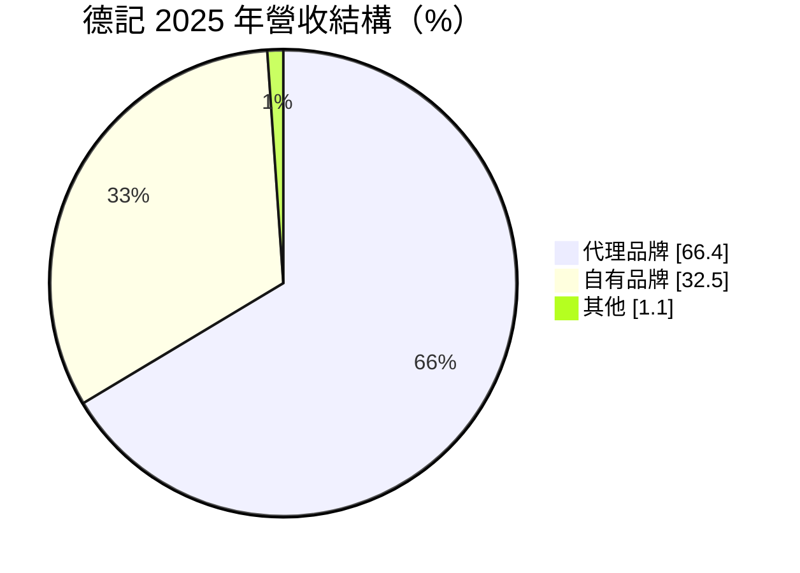
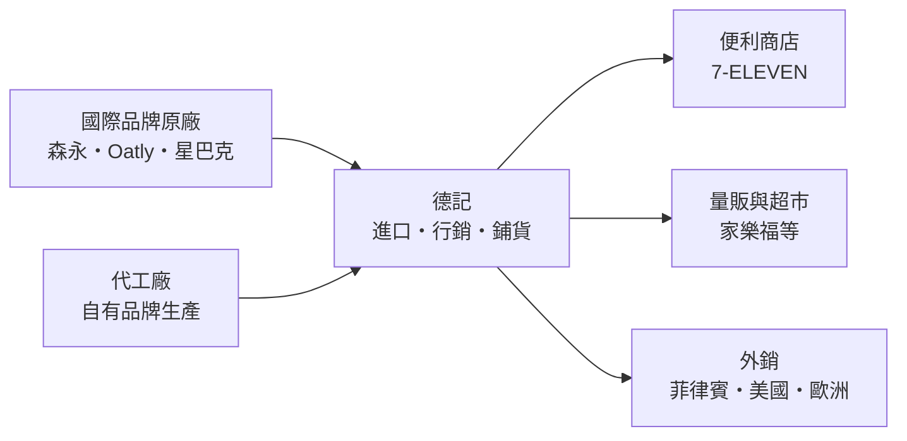
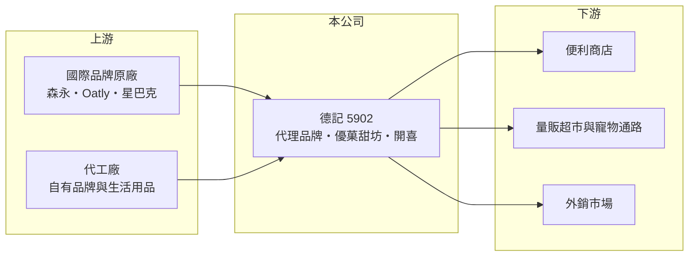

# 5902 德記

> 上櫃｜[[產業索引-居家生活|居家生活]]｜上市（櫃）日期 1998/02/07

# 第一章：企業模式與商業藍圖

> [!info] 撰寫說明
> 本文由 Claude 依公開資料整理，架構比照 [[2330台積電]] 的四章研究，資料截至 2026-10-08。財務數字來源：Goodinfo 年度經營績效頁、富果研究 2026 年 3 月法說會整理；集團關係依法說會「同集團通路」描述推估，尚未逐條比對原始文件。#待校對

在評估單一個股的長期投資價值時，首要步驟是拆解企業的底層獲利邏輯。本章說明德記洋行（股票代號：5902，以下簡稱德記）如何以「代理國際品牌加上自有品牌」的模式，在台灣食品飲料通路中穩定獲利。

## 一、核心定位：代理與自有品牌並行的食品通路商

- **核心業務：** 德記經營飲料、甜品、冰品、酒類、食品與生活用品，商業模式分成兩塊。一塊是[[代理商]]業務，取得森永（MORINAGA）、Oatly、星巴克等國際品牌在台灣的代理權，負責進口、行銷與鋪貨；另一塊是[[自有品牌]]，例如「優菓甜坊」甜品甜湯與自有水果啤酒，以及開喜等飲料產品。代理靠品牌力帶動銷量，自有品牌則讓公司保有自己的資產，不完全受原廠授權左右。
- **營收結構：** 2025 年代理品牌營收 15.17 億元、占 66.4%，自有品牌 7.43 億元、占 32.5%，自有品牌年增 9.9%，成長快於代理。值得注意的是兩者的獲利能力差距：代理品牌的淨利率約 13.8%，自有品牌約 6.2%，代表國際品牌的高知名度讓德記能以較低的行銷成本賣出產品。

## 二、資本轉化邏輯：輕資產的品牌通路

- **營運據點：** 德記以台灣為主要市場，主要通路是便利商店與量販超市，產品也外銷到菲律賓等地。依法說會說法，家樂福與寵物公園是「同集團」通路，推估德記屬於 [[1216統一]] 集團體系，這讓它在集團通路的上架與新品測試上有天然優勢。
- **輕資產特性：** 代理業務不需要自建大型工廠，主要資本投入是存貨、應收帳款與行銷費用。2025 年營業現金流入約 2.16 億元，接近稅後淨利，帳上資金約 7.83 億元，多以定存或附買回管理，財務結構保守。

## 三、長期方向

- **長期方向：** 公司的長期策略有三條線。第一是深化冰品與甜品，例如讓代理冰品「甜點化」、用台灣在地食材開發自有甜湯；第二是開拓外銷，目標市場包括菲律賓、美國與歐洲；第三是從 2026 年起切入生活用品與寵物用品，從中國引進紙巾、收納、清潔與寵物用品，先在 7-ELEVEN 約 500 多家門市試賣；烘焙方面則推廣代理的[[植物奶]]，取代動物性鮮奶油用於素食麵包與蛋糕。這些新品類讓德記從食品代理商逐步轉為多品類的品牌通路平台。

# 第二章：護城河深度與競爭優勢

「護城河」指企業抵禦競爭、維持超額利潤的保護機制。本章分析德記的優勢來源與主要風險點。

## 一、護城河的核心組成

- **競爭優勢：** 德記的第一個優勢是長期代理關係。國際品牌選擇台灣代理商時，看重的是通路覆蓋、冷鏈與行銷能力，一旦合作多年、銷售穩定，原廠通常不會輕易更換。第二個優勢是集團通路，與便利商店、量販店的緊密關係，讓新品能快速取得大量曝光。第三是自有品牌的累積，讓公司在代理權有變動時仍保有一部分自己的營收基礎。
- **主要對手：** 在飲料與冰品市場，德記面對的是 [[1201味全]]、[[1234黑松]] 等本土品牌商，以及其他進口食品代理商。大型通路本身也在發展自有品牌，這是長期壓縮品牌商毛利的力量。

## 二、優勢轉化：守得住／守不住／觀察重點

- **守得住：** 具高知名度的代理品牌與冰品甜品類，消費者認品牌而非通路，德記的淨利率因此能維持在一成以上。
- **守不住：** 一般飲料與食品的價格競爭，以及原廠收回代理自行經營的可能性。代理模式最大的結構性風險，是品牌越成功，原廠越有誘因自己來。
- **觀察重點：** 自有品牌占比能否持續提升且淨利率改善、新的生活與寵物用品能否成為穩定品類，以及主要代理合約是否續約。

# 第三章：財務體質與盈利規模

資料日期：2026-10-08。數字取自 Goodinfo 年度經營績效與富果研究法說會整理，表格是撰寫當時的快照；最新月營收、毛利率、累計 EPS 由自動排程寫在本筆記的屬性欄位（月營收、毛利率、累計EPS 等）。#待校對

財務報表是檢驗護城河是否真實存在的最終標準。本章用六年的數字檢視德記的獲利穩定度與資本效率。

## 一、多年度經營績效

| 年度 | 營收（新台幣） | [[毛利率]] | [[營業利益率]] | EPS（元） | [[ROE]] |
|---|---|---|---|---|---|
| 2020 | 14.8 億 | 23.9% | 10.2% | 1.37 | 15.1% |
| 2021 | 18.0 億 | 23.0% | 10.1% | 1.57 | 14.8% |
| 2022 | 21.9 億 | 22.3% | 10.3% | 1.95 | 16.6% |
| 2023 | 21.1 億 | 22.5% | 9.83% | 1.84 | 14.9% |
| 2024 | 22.2 億 | 23.6% | 10.9% | 2.11 | 16.6% |
| 2025 | 22.9 億 | 24.0% | 11.1% | 2.24 | 16.7% |

- **營收規模：** 2020 至 2025 年營收年複合成長率約 9.1%（推算），成長主要集中在 2021 至 2022 年，之後進入每年個位數的溫和成長。
- **獲利：** 德記最突出的特點是穩定。六年間毛利率都在 22% 至 24%、營業利益率都在 10% 至 11% 之間，EPS 由 1.37 元穩定成長到 2.24 元。這種穩定度在消費品通路業中少見，代表代理品牌組合與通路關係相當牢固。
- **財務特色：** 2021 至 2025 年平均 ROE 約 15.9%（推算），每股淨值從 9.81 元增加到 13.67 元。公司帳上資金充足、幾乎無有息負債，營業現金流與淨利相當，屬於現金流品質良好的公司。Goodinfo 列出的長期平均現金股利約 0.28 元，逐年配息資料未查得。

## 二、[[ROIC]] 與 [[WACC]]

**ROIC 推算：** 2025 年營業利益 2.54 億元，以 20% 稅率計算稅後約 2.03 億元。股東權益約 12.9 億元（每股淨值 13.67 元 × 約 0.946 億股），依 ROA 12.4% 推算總負債約 4.2 億元，多為應付帳款等營業負債，假設有息負債接近零（推估），ROIC 約 15.7%（推算）。若扣除約 7.83 億元的閒置資金，本業實際使用的資本更小，ROIC 會更高。

**WACC 推算：** 假設台灣 10 年期公債 1.75%、市場風險溢酬 6%、β 取民生消費股常見值 0.6（推估），股東權益成本約 5.4%；幾乎全為權益資本，WACC 約 5.4%（推算）。

**結論：** 德記的 ROIC 長期約為 WACC 的三倍，且六年來沒有明顯波動，是穩定創造經濟價值的小型消費股。限制在於規模小、成長溫和，未來價值能否擴大，取決於自有品牌與新品類能否打開新的成長空間。

# 第四章：總體風險與地緣政治

任何企業都無法脫離宏觀環境獨立存在。本章分析德記長期面對的風險。

## 一、產業與結構風險

- **產業週期：** 食品飲料屬民生消費，需求受景氣影響小，但冰品與飲料有明顯的季節性，夏季營收較高。台灣人口老化與少子化，讓整體飲料市場難有大幅成長，成長必須靠新品類與外銷。
- **營運風險：** 代理權集中是最大的長期風險。若主要原廠收回代理、改為直營或更換代理商，代理品牌的高淨利率會直接受影響。通路集中於少數大型連鎖也讓德記在上架費與促銷條件上議價力有限。

## 二、其他風險

- **匯率與原物料：** 代理商品多為進口，新台幣貶值會提高進貨成本；乳品、可可、糖等原料價格上漲也會影響代理與自有品牌的成本。
- **法規與食安：** 食品業須遵守食品安全與標示法規，任何食安事件都可能對品牌造成長期傷害。生活與寵物用品由中國進口，也需留意品質管理與授權範圍限制，例如生活用品授權僅限台灣，無法隨開喜產品進入菲律賓。

# 專有名詞解析

## 金融

- **[[ROIC]]**：投入資本報酬率，稅後營業利益除以股東權益加有息負債，衡量本業運用資本的效率。
- **[[WACC]]**：加權平均資金成本，股東與債權人要求報酬的加權平均，ROIC 高於它才代表創造價值。

## 產業

- **[[代理商]]**：取得國外原廠授權，在特定地區負責銷售、技術支援與售後服務的通路業者。
- **[[自有品牌]]**：公司以自己的品牌名稱銷售產品，毛利較代工高，但需投入行銷與通路成本。
- **[[植物奶]]**：以燕麥、黃豆等植物原料製成、取代動物乳品的飲品，可用於咖啡與烘焙。

# 核心供應鏈

## 1. 上游：品牌原廠與代工
- 代理品牌：森永（MORINAGA）、Oatly、星巴克等
- 自有品牌與生活用品代工廠（中國引進生活與寵物用品）

## 2. 中游：德記與集團
- 推估集團：[[1216統一]]（依法說會同集團通路描述推估）

## 3. 下游：通路
- 便利商店：[[2912統一超]]（7-ELEVEN）
- 量販與寵物通路：家樂福、寵物公園
- 同業：[[1201味全]]、[[1234黑松]]

## 最新新聞
<!-- news:start -->
<!-- news:end -->

## 相關連結
- [公開資訊觀測站](https://mopsov.twse.com.tw/mops/web/t05st03?step=1&firstin=1&co_id=5902)
- [Goodinfo](https://goodinfo.tw/tw/StockDetail.asp?STOCK_ID=5902)
- [Yahoo 股市](https://tw.stock.yahoo.com/quote/5902)
- [鉅亨網新聞](https://www.cnyes.com/twstock/5902/news)
