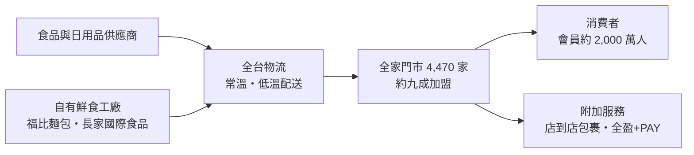
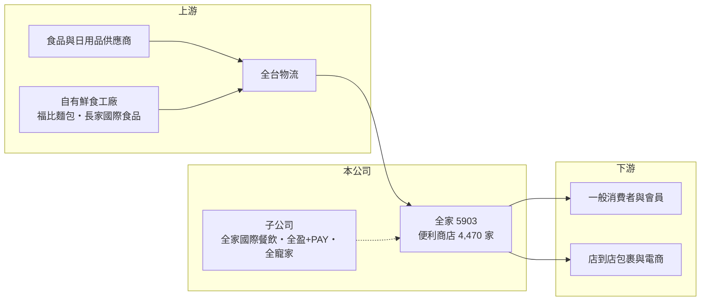

# 5903 全家

> 上櫃｜[[產業索引-居家生活|居家生活]]｜上市（櫃）日期 2002/02/25

# 第一章：企業模式與商業藍圖

> [!info] 撰寫說明
> 本文由 Claude 依公開資料整理，架構比照 [[2330台積電]] 的四章研究，資料截至 2026-10-08。財務數字來源：Goodinfo 年度經營績效頁、富果研究 2025 年度法說會整理（2026 年 3 月）、優分析與工商時報報導標題；產業描述為整理性內容，尚未逐條比對原始文件。#待校對

在評估單一個股的長期投資價值時，首要步驟是拆解企業的底層獲利邏輯。本章說明全家便利商店（股票代號：5903，以下簡稱全家）如何以加盟網絡、鮮食與會員系統，經營台灣第二大的便利商店連鎖。

## 一、核心定位：台灣第二大便利商店連鎖

- **核心業務：** 全家在台灣經營 FamilyMart 便利商店，2025 年底總店數 4,470 家，市占率約 32.2%，僅次於 [[2912統一超]] 的 7-ELEVEN。門市約九成採[[加盟]]經營，由加盟主出資與經營門市，總部負責品牌、商品開發、物流與資訊系統，並依門市毛利收取分成。這種模式讓全家可以用較低的資本支出擴大門市網絡。
- **營收結構：** 公司未揭露品類營收比重，但[[鮮食]]與咖啡是便利商店最重要的差異化品類。全家的鮮食戰略品牌包括 Let's Café、Uno Pasta、「健康志向」系列與烘焙系列，並自建麵包廠、與長榮空廚合資義大利麵廠，掌握關鍵鮮食的生產。會員約 2,000 萬人、每日活躍交易會員超過 110 萬，是全家經營精準行銷的基礎。
- **營運據點：** 全家目前以台灣為唯一主要市場。2024 年處分中國大陸地區股權，認列一次性利益，公司表示對中國市場再進入採謹慎態度，暫無計畫。

## 二、資本轉化邏輯：薄利多店、靠規模攤提後勤

- **薄利結構：** 全家的毛利率長期約 36%，但營業利益率只有約 2%，因為電費、人事、租金與折舊吃掉了大部分毛利。這代表全家的獲利來自龐大的營收規模，而不是高單價，每家店多賣一點、後勤成本多攤提一點，對整體獲利影響很大。
- **集團生態系：** 全家旗下有全台物流、日翊文化行銷、全家國際餐飲（2024 年上櫃）、福比麵包廠、長家國際食品、全盈+PAY 電子支付與全寵家等子公司，2025 年轉投資利益約 4.3 億元。物流與鮮食工廠讓全家掌握供應鏈，支付與寵物則是新事業布局。

## 三、長期方向

- **長期方向：** 全家 2026 年的核心目標是「利益極大化」，每年淨增 100 至 120 家店，並要求新店當年即獲利。長期策略稱為「3N」：新事業（全盈支付尋求外部資本與 IPO、全寵家）、新店型（FamiSuper 超市店，一家服務附近 7 至 8 家門市）、新地區（目前保守）。另外推動 AI 自動訂貨與店到店包裹延伸宅配，目標是在人力成本上升的環境下提高單店效率。

# 第二章：護城河深度與競爭優勢

「護城河」指企業抵禦競爭、維持超額利潤的保護機制。本章分析全家在雙強寡占市場中的競爭位置。

## 一、護城河的核心組成

- **競爭優勢：** 第一是密集的門市網絡。台灣便利商店市場由 7-ELEVEN 與全家兩強主導，好地段有限，先占的門市數本身就是新進者難以複製的門檻。第二是供應鏈與鮮食能力，自有物流與鮮食工廠讓全家能每天多次配送短保存期的商品，這是小型連鎖做不到的。第三是會員與數據，2,000 萬會員的消費資料讓商品開發與促銷更精準。
- **主要對手：** [[2912統一超]] 是門市數與營收都領先的龍頭，萊爾富與 OK 超商規模較小；美廉社（[[2945三商家購]]）與 OK 超商合併後，形成新的社區型零售對手。超市、量販店、外送平台也在搶食同一群消費者的日常採買。

## 二、優勢轉化：守得住／守不住／觀察重點

- **守得住：** 雙強寡占的市場結構與加盟主網絡，讓全家的市占率長期穩定並緩步提升；鮮食與咖啡等差異化商品，可以支撐約 36% 的毛利率。
- **守不住：** 費用端的上漲壓力。電費、基本工資與租金上升直接壓縮營業利益率，從 2020 年的 3.3% 降到 2025 年的 1.7%，代表規模擴大並沒有帶來利潤率提升。
- **觀察重點：** [[同店銷售成長]]能否維持公司設定的 5% 至 8%、AI 與自動化能否降低人力成本，以及全盈支付等新事業何時轉虧為盈。

# 第三章：財務體質與盈利規模

資料日期：2026-10-08。數字取自 Goodinfo 年度經營績效與富果研究法說會整理，表格是撰寫當時的快照；最新月營收、毛利率、累計 EPS 由自動排程寫在本筆記的屬性欄位（月營收、毛利率、累計EPS 等）。#待校對

財務報表是檢驗護城河是否真實存在的最終標準。本章用六年的數字檢視全家的規模成長、利潤率壓力與資本效率。

## 一、多年度經營績效

| 年度 | 營收（新台幣） | [[毛利率]] | [[營業利益率]] | EPS（元） | [[ROE]] |
|---|---|---|---|---|---|
| 2020 | 854 億 | 36.4% | 3.31% | 9.54 | 33.7% |
| 2021 | 837 億 | 36.1% | 1.99% | 6.02 | 20.2% |
| 2022 | 907 億 | 36.3% | 1.85% | 8.25 | 27.1% |
| 2023 | 996 億 | 36.5% | 2.02% | 7.22 | 21.6% |
| 2024 | 1,051 億 | 36.5% | 1.96% | 17.04 | 39.1% |
| 2025 | 1,100 億 | 36.4% | 1.69% | 7.60 | 16.2% |

- **營收規模：** 2020 至 2025 年營收年複合成長率約 5.2%（推算），2025 年營收 1,100.4 億元創新高，成長來自展店與同店銷售。
- **獲利：** 毛利率六年都在 36% 至 36.5%，非常穩定，但營業利益率緩步下滑，反映營運成本上升。2024 年 EPS 17.04 元包含處分中國大陸股權的一次性利益，不能視為常態；排除這一年，EPS 大致落在 6 至 9.5 元。
- **財務特色：** 2021 至 2025 年平均 ROE 約 24.8%（推算，含 2024 年一次性利益；排除該年約 21.3%）。高 ROE 一部分來自加盟模式的輕資本，一部分來自財務槓桿：ROA 只有 2% 至 5%，代表資產負債表中有大量應付帳款與門市[[租賃負債]]。2025 年度預計配發現金股利 6.5 元，[[配息率]]約 85.5%，Goodinfo 統計長期平均現金股利約 3.78 元，配息政策穩定且偏高。

## 二、[[ROIC]] 與 [[WACC]]

**ROIC 推算：** 2025 年營業利益 18.55 億元，稅後（20%）約 14.84 億元。股東權益約 94.2 億元（每股淨值 42.11 元 × 約 2.237 億股）。依 ROA 2.23% 推算總資產約 760 億元，負債多為應付帳款與租賃負債，銀行借款金額未查得。只以股東權益計算，ROIC 約 15.8%（推算）；若把門市租賃負債視為類債務納入投入資本，ROIC 會明顯下降（推估約個位數）。

**WACC 推算：** 假設台灣 10 年期公債 1.75%、市場風險溢酬 6%、β 取民生零售股常見值 0.5（推估），股東權益成本約 4.75%；考量租賃負債的稅後成本約 2%，WACC 約 4% 至 4.75%（推算）。

**結論：** 不論採哪種口徑，全家的 ROIC 都高於 WACC，屬於穩定創造價值的公司，且高配息率讓股東直接分享現金流。長期的關鍵是能否阻止營業利益率繼續下滑，否則營收成長會被成本上升抵銷。

# 第四章：總體風險與地緣政治

任何企業都無法脫離宏觀環境獨立存在。本章分析全家長期面對的風險。

## 一、產業與結構風險

- **產業週期：** 便利商店屬民生必需消費，景氣循環影響小，但台灣的門市密度已是全球最高之一，展店空間逐漸飽和。人口老化與少子化，讓未來成長必須靠提高單店營收與新服務，而不是單純增加店數。
- **營運風險：** 電費、基本工資、租金與折舊持續上漲，是壓縮利潤率最直接的力量。加盟主招募與留任也是長期挑戰，人力短缺會影響門市營運品質。新事業如全盈支付、全寵家仍在虧損，若長期無法獲利會拖累整體報酬。

## 二、其他風險

- **競爭與法規：** 美廉社與 OK 超商合併、外送平台與電商的擴張，都在改變小額零售的競爭格局。食品安全、勞動法規、電價政策與環保法規（如一次性塑膠減量）都會影響營運成本。
- **新店型與科技投資：** 科技店與自助結帳因投資回報考量尚未大規模導入，AI 與自動化能否真正降低成本仍待驗證。

# 專有名詞解析

## 金融

- **[[租賃負債]]**：承租場地或設備依會計準則認列的未來租金現值負債。
- **[[配息率]]**：現金股利占每股盈餘的比例，反映公司把多少獲利分給股東。
- **[[ROIC]]**：投入資本報酬率，稅後營業利益除以股東權益加有息負債，衡量本業運用資本的效率。

## 產業

- **[[加盟]]**：由加盟主出資經營門市、總部提供品牌與供應鏈並收取分潤的經營模式，可降低總部資本支出。
- **[[同店銷售成長]]**：排除新開與關閉門市後，既有門市營收的年成長率，用來衡量零售業的內生成長，英文常寫 SSSG。
- **[[鮮食]]**：便利商店販售的便當、飯糰、麵包、沙拉等短保存期即食商品，是超商最重要的差異化品類。

# 核心供應鏈

## 1. 上游：商品與物流
- 食品飲料供應商：如 [[1216統一]]、[[1201味全]]、[[1234黑松]] 等品牌商（產業參考）
- 自有鮮食生產：福比麵包廠、長家國際食品（與長榮空廚合資）
- 物流：全台物流（子公司）

## 2. 中游：全家與子公司
- 全家國際餐飲、日翊文化行銷、全盈+PAY、全寵家

## 3. 下游與同業
- 同業：[[2912統一超]]、[[2945三商家購]]（美廉社）、萊爾富、OK 超商

## 最新新聞
<!-- news:start -->
<!-- news:end -->

## 相關連結
- [公開資訊觀測站](https://mopsov.twse.com.tw/mops/web/t05st03?step=1&firstin=1&co_id=5903)
- [Goodinfo](https://goodinfo.tw/tw/StockDetail.asp?STOCK_ID=5903)
- [Yahoo 股市](https://tw.stock.yahoo.com/quote/5903)
- [鉅亨網新聞](https://www.cnyes.com/twstock/5903/news)
