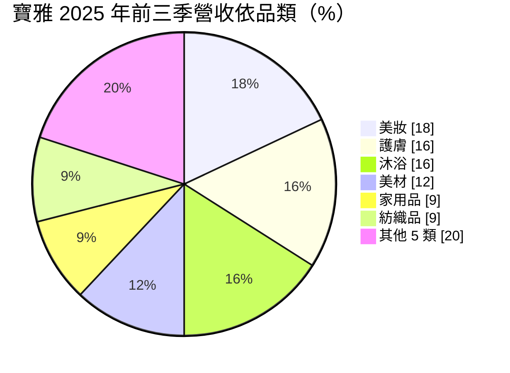
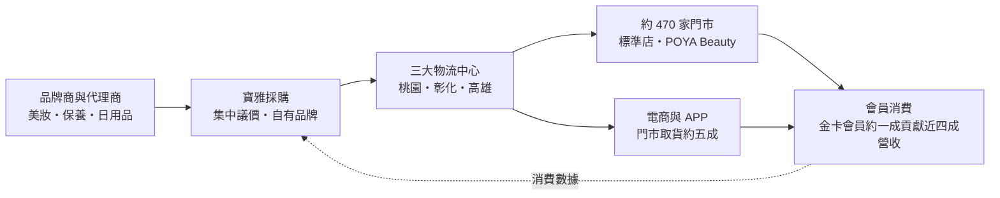
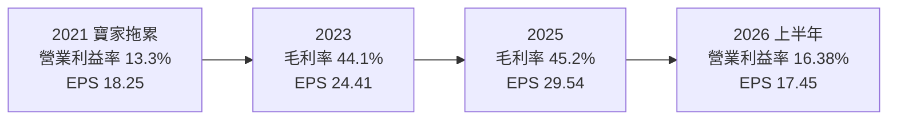
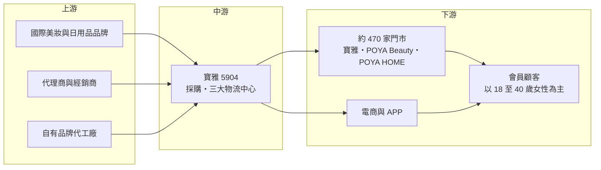

# 5904 寶雅

> 上櫃｜[[產業索引-居家生活|居家生活]]｜上市（櫃）日期 2002/09/06

# 第一章：企業模式與商業藍圖

> [!info] 撰寫說明
> 本文由 Claude 依公開資料整理，架構比照 [[2330台積電]] 的四章研究，資料截至 2026-10-08。財務數字來源：Goodinfo 年度經營績效頁、富果研究 2025 年 12 月法說會整理、旺得富 2026 年 2 月與 7 月報導、數位時代（商業周刊）2026 年 8 月報導、櫃買中心開放資料（2026 年第二季綜合損益與資產負債、基本資料、本益比殖利率）；產業描述為整理性內容，尚未逐條比對原始文件。#待校對

在評估單一個股的長期投資價值時，首要步驟是拆解企業的底層獲利邏輯。本章針對寶雅國際（股票代號：5904，以下簡稱寶雅）的商業模式進行定性分析，說明一家從台南起家的生活百貨，如何成為台灣美妝與日用品零售的龍頭，以及它靠什麼在電商與藥妝連鎖的夾擊下持續成長。

## 一、核心定位：以女性客群為核心的美妝生活百貨

寶雅成立於 1997 年，2002 年在櫃買中心掛牌，總部位於台南。依數位時代 2026 年 8 月的報導，寶雅的顧客約九成為女性、年齡多在 18 至 40 歲。它的商品從彩妝、保養、沐浴到家用品、紡織品與美材（美甲、美髮工具）都有，一間標準店的品項以萬計，定位是「女性一站購足」的生活百貨，而不是以藥品為主的藥妝店。

寶雅的商業模式是典型的[[連鎖零售]]：向品牌商與代理商大量採購，透過全台門市與物流網路銷售，賺取進銷價差，同時向品牌商收取上架、促銷等通路費用。獲利的關鍵在於三件事：門市數量與[[坪效]]、採購議價力，以及費用控制。2025 年底全台店數約 470 家，2025 年營收 253.19 億元、稅後淨利 31.44 億元，皆創歷史新高（旺得富報導）。

## 二、商品與店型板塊

依富果研究整理的法說會資料，2025 年前三季的主要品類比重如下（公司共 11 大品類，其餘 5 類未逐一揭露）：

* **美妝、護膚與沐浴：** 合計約五成，是寶雅的核心。美妝與保養品的單價高、回購頻率高，也是社群行銷與新品話題最多的品類，2025 年美材、美妝、沐浴三類都有雙位數成長。
* **家用品與紡織品：** 提供來店的生活需求，增加客單價，但毛利與成長性較美妝類低。
* **店型：** 傳統寶雅街邊店約 300 至 400 坪；美妝店型 POYA Beauty 約 100 坪，聚焦保養、彩妝與醫美品項，較容易進駐百貨、購物中心與車站。依數位時代報導，美妝店型占總店數比重由前一年的 34% 升到近五成。
* **寶家／POYA HOME：** 寶雅曾在疫情前以「寶家」品牌開設五金賣場，鎖定男性客群，但五金消費頻率低、男性較少加入會員，近兩年多家寶家封館出清，品牌轉型為居家生活用品店。這是寶雅少見的策略修正，說明它的核心優勢在女性美妝客群，而非所有零售品類。

## 三、資本轉化邏輯：展店、改裝、物流與會員

寶雅把獲利再投入四個方向：

* **展店與改裝：** 每年淨展店約 50 家，並針對開店 3 至 6 年的門市改裝，多數轉為美妝店型，2025 年完成 26 家改裝。新店需要裝修、設備與租金押金，改裝則讓舊店維持新鮮感。長期展店目標由過去市場認為的約 400 家上限，上調到 800 家以上。
* **物流中心：** 北部桃園、中部彰化、南部高雄三大物流中心，中部物流中心於 2024 年導入，三大倉合計可支援約 720 家門市。物流中心先於門市擴張而建，代表寶雅為未來幾年的展店預留了配送能力。
* **會員與數據：** 寶雅約 20 年前就建置 POS 系統累積顧客資料，金卡會員約占會員數一成，卻貢獻近四成營收。會員資料讓寶雅能精準選品、發券與規劃店型。
* **[[自有品牌]]與電商：** 自有品牌如 POYA PURE+、POYA Chic、POYA COZY，2025 年前三季占營收約 3.2%；電商營收前三季年增近五成，占整體約 2.2%，且門市取貨比例約五成，電商主要扮演把顧客帶回門市的角色。

## 四、企業長期藍圖：從 400 家到 800 家

寶雅的長期策略是「新店加改裝」雙引擎：以標準店、美妝店型、店中店與家居店等多種店型，把門市推進到 800 家以上，並提高自有品牌比重、推動 APP 與自助結帳等數位化。2026 年 8 月，寶雅把股票面額由 10 元改為 1 元（一股拆十股），流通股數由約 1.06 億股增為約 10.64 億股，公司表示股東權益不受影響，目的是提高股票流通性。治理方面，2026 年 5 月董事改選後，8 席董事中有 6 席為獨立董事（數位時代報導）。

# 第二章：護城河深度與競爭優勢

在長期價值投資中，「護城河」指企業抵禦競爭、維持超額利潤的保護機制。本章分析寶雅在台灣零售市場的護城河構成、主要競爭對手，以及這些優勢在電商與藥妝連鎖競爭下能守住多少。

## 一、寶雅護城河的核心組成要素

* **1. 規模與採購議價力：** 寶雅是台灣門市數最多的美妝生活百貨，對品牌商而言是不可忽視的通路。規模帶來兩個好處：一是進貨價格與通路費用的議價力，二是新品牌願意優先在寶雅上架，讓寶雅持續擁有話題商品。Goodinfo 資料顯示，寶雅毛利率由 2016 年的 41.1% 穩定提升到 2025 年的 45.2%，反映議價力與商品組合的改善。
* **2. 選品寬度與「逛」的體驗：** 一間標準店的品項遠多於藥妝店與便利商店，對喜歡比較與嘗鮮的女性顧客有吸引力。這種「可以逛很久」的體驗是電商難以完全取代的，也是寶雅能維持高來客數的原因。
* **3. 會員數據與在地化密度：** 二十年的 POS 與會員資料，加上全台約 470 家門市的密度，讓寶雅能依各地顧客偏好調整商品與店型。門市越密，物流成本越低、品牌曝光越高，形成正向循環。
* **4. 管理紀律：** 從寶家撤退的決策顯示經營層願意承認錯誤、把資源收回核心事業；改裝計畫每年固定執行，避免門市老化。

## 二、全球主要競爭對手格局

| 對手 | 定位 | 對寶雅的威脅 |
|---|---|---|
| 屈臣氏 | 國際藥妝連鎖，門市密度高 | 在保養、彩妝與個人護理直接競爭 |
| 康是美（[[2912統一超]] 集團） | 藥妝連鎖，2025 年底引進韓國 Olive Young 自有品牌 | 以韓系美妝搶年輕女性客群 |
| [[6469大樹]] 等藥局連鎖 | 藥品與保健品為主，兼賣美妝 | 在保健、母嬰與部分個人護理品類競爭 |
| 蝦皮、[[8454富邦媒]] 等電商 | 線上價格透明、品項多 | 標準品比價壓力，削弱門市價格優勢 |
| 小北百貨等生活百貨 | 日用品與五金 | 在家用品品類競爭，寶家撤退後重疊減少 |

## 三、優勢轉化：哪些市場守得住、哪些守不住

* **守得住：** 需要試用、比較與即時購買的美妝、美材與保養品，以及重視會員福利的高頻顧客。2025 年寶雅營收年增 7.2%，同期台灣綜合商品零售僅成長約 3%、百貨業不到 1.5%（數位時代報導），顯示它仍在搶占市占率。
* **守不住：** 價格透明的標準品，例如大包裝衛生紙、洗衣精等，消費者容易在電商或量販店比價購買。這類品類能帶來人流，但難以提高毛利。
* **觀察重點：** 第一，[[同店銷售]]能否維持正成長，展店是否開始侵蝕舊店；第二，POYA Beauty 小店型的坪效能否持續高於標準店；第三，往 800 家邁進的過程中，費用率能否維持穩定，而不是被租金與人力成本推高。

# 第三章：財務體質與盈利規模

資料日期：2026-10-08。數字取自 Goodinfo 年度經營績效、富果研究法說會整理與櫃買中心開放資料，表格是撰寫當時的快照；最新月營收、毛利率、累計 EPS 由自動排程寫在本筆記的屬性欄位（月營收、毛利率、累計EPS 等）。#待校對

財務報表是檢驗護城河是否真實存在的最終標準。本章用十年來的三率、ROE 與資本報酬，檢視寶雅的獲利品質與穩定度。

## 一、獲利能力的基石：三率

| 年度 | 營收（新台幣） | [[毛利率]] | [[營業利益率]] | EPS（元） | [[ROE]] |
|---|---|---|---|---|---|
| 2016 | 124 億 | 41.1% | 11.0% | 12.13 | 39.8% |
| 2019 | 158 億 | 43.2% | 15.4% | 19.31 | 44.6% |
| 2020 | 175 億 | 43.2% | 15.1% | 21.60 | 45.8% |
| 2021 | 175 億 | 43.9% | 13.3% | 18.25 | 37.5% |
| 2022 | 195 億 | 43.2% | 13.6% | 20.26 | 37.4% |
| 2023 | 221 億 | 44.1% | 14.5% | 24.41 | 40.8% |
| 2024 | 236 億 | 45.1% | 14.6% | 26.74 | 41.6% |
| 2025 | 253 億 | 45.2% | 15.3% | 29.54 | 41.2% |
| 2026 上半年 | 140.27 億 | 45.04% | 16.38% | 17.45 | 不適用（半年） |

寶雅的財務數字最大的特色是穩定。2016 至 2025 年營收從 124 億元成長到 253 億元，十年翻倍，除了 2021 年疫情與寶家擴張期間營收持平、淨利衰退外，幾乎每年成長。毛利率由 41% 緩步升到 45%，營業利益率維持在 11% 至 16% 之間，推銷費用率約 26%。2021 年是唯一的明顯低點，當年 EPS 從 21.60 元降到 18.25 元，是 9 年來首度衰退，主要與疫情和寶家展店有關；之後隨寶家收縮、美妝店型擴張，獲利重回成長。2026 年上半年 EPS 17.45 元是以拆股前的股數計算。

2020 至 2025 年營收年複合成長率約 7.6%（推算），2021 至 2025 年五年平均 ROE 約 39.7%（推算）。對一家零售商而言，這是非常高且穩定的報酬率。

## 二、[[ROE]]：資本效率

寶雅的 ROE 長期維持在 37% 至 46%，原因有三：零售業的資產周轉率高；寶雅以租賃門市為主，不需大量買地建店；以及每年把八成以上的盈餘以現金股利發放，股東權益不會持續膨脹。需要注意的是，依櫃買中心資料，2026 年第二季底負債總計 271.80 億元、權益總計 72.52 億元，負債比約 79%，這個高負債比主要來自 [[IFRS 16]] 規定入帳的門市[[租賃負債]]，而不是銀行借款。也就是說，寶雅的高 ROE 部分來自租賃形成的財務槓桿，評估時應把租賃視為一種長期固定承諾。

## 三、資本支出、自由現金流與股利

* **資本支出：** 2025 年約 11 億多元，用於新店與改裝，公司預計 2026 年維持相近水準（富果研究法說會整理）。以約 31 億元的稅後淨利計算，資本支出約占三分之一。
* **[[自由現金流]]：** 逐年數字未查得。零售業先收現金、後付貨款，營業現金流通常高於淨利；扣除約 11 億元資本支出後，自由現金流應能支應八成以上的配息（推估）。
* **股利：** 2025 年度配發現金股利 25.5 元，以 EPS 29.54 元計算，[[配發率]]約 86%，公司承諾現金股利發放率維持在 85% 以上。Goodinfo 統計歷年加權平均現金股利約 13.69 元。拆股後每股股利會同步調整為十分之一。

## 四、[[ROIC]] 與 [[WACC]]：價值創造利差

**ROIC 推算：** 2025 年營業利益約 38.7 億元（營收 253 億元 × 營業利益率 15.3%），以 20% 稅率計算稅後營業利益約 31.0 億元。2025 年底股東權益以每股淨值 76.17 元乘以約 1.064 億股（拆股前），約 81.1 億元。若不計租賃負債、只計銀行借款（未查得，假設約 5 億元，推估），投入資本約 86 億元，ROIC 約 36%（推算）。若把非流動負債中約 149 億元（大部分推估為租賃負債）視為有息負債，投入資本約 230 億元，ROIC 約 13.5%（推算）。

**WACC 推算：** 假設台灣 10 年期公債殖利率 1.75%、市場風險溢酬 6%、β 取民生零售股常見值 0.6（假設），股東權益成本約 5.35%。若只計少量借款，WACC 約 5.2%（推算）；若把租賃負債以稅前 2% 的借款成本納入資本結構（權益約 35%、負債約 65%），WACC 約 2.9%（推算）。

**結論：** 無論用哪一種口徑，寶雅的 ROIC 都明顯高於 WACC，差距約 8 至 30 個百分點，代表它長期穩定創造經濟價值。這種利差來自規模、選品與會員數據構成的護城河，也是寶雅能一邊展店、一邊發放八成以上盈餘的原因。長期要觀察的是：門市數接近飽和後，新店的報酬率是否下降，使 ROIC 逐步收斂。

# 第四章：總體風險與地緣政治

任何企業都無法脫離宏觀環境獨立存在。本章分析寶雅長期必須面對的地緣政治、產業週期、營運與法規風險。

## 一、地緣政治與總體經濟

寶雅是純內需零售商，營收全部來自台灣，地緣政治的直接影響主要在商品進口成本：美妝、日用品有大量來自日本、韓國、歐美與中國的進口品，匯率、關稅與國際運費變化會影響進貨成本。台灣的人口結構是更長期的問題：少子化與高齡化會讓 18 至 40 歲女性這個核心客群逐漸縮小，寶雅需要靠提高客單價與吸引新客群來抵銷。

## 二、產業週期與市場結構

寶雅販賣的是民生必需品與平價美妝，景氣敏感度低，屬於防禦型產業。但零售市場的結構正在改變：電商滲透率持續提高，韓國美妝品牌透過康是美等通路進入台灣，藥局連鎖也在擴大美妝品項。寶雅的優勢在實體體驗與選品，如果年輕消費者的購物習慣進一步轉向線上與社群電商，門市的來客數可能受到壓力。

## 三、營運環境的隱性風險

* **人力與租金成本：** 零售業是勞力密集產業，最低工資調升直接推高費用，公司以調整人力結構與導入自助結帳因應。店租則隨商圈與購物中心租金上漲。
* **展店侵蝕：** 門市數從 470 家邁向 800 家的過程中，新店可能與舊店搶同一批顧客，同店銷售成長可能放緩。
* **租賃承諾：** 大量長期租約讓寶雅的固定成本高，若某些商圈沒落，提前解約或閉店會產生損失。
* **新店型失敗的可能：** 寶家的經驗顯示，跨出核心客群的店型可能失敗，未來新嘗試的家居店型與店中店也需要時間驗證。

## 四、科技或法規演進

化粧品法規趨嚴，例如台灣化粧品衛生安全管理法要求產品登錄與安全資料，會增加品牌商與通路的合規成本，但也有利於規模大、管理完善的通路。零售數位化方面，自助結帳、APP 會員與 AI 選品可以提高效率，寶雅擁有長期累積的 POS 數據，是推動數位化的基礎；但若數位能力落後於電商平台，就可能失去年輕客群。

# 專有名詞解析

## 金融

- **[[IFRS 16]]**：國際財務報導準則第 16 號，規定承租人把長期租約認列為使用權資產與租賃負債。
- **[[租賃負債]]**：依 IFRS 16 把未來應付租金折現後列在資產負債表上的負債，連鎖零售業的金額通常很大。
- **[[配發率]]**：現金股利占每股盈餘的比例，代表公司把多少獲利以現金還給股東。
- **[[自由現金流]]**：營業活動現金流減去資本支出，代表企業可自由用於配息、還債或併購的現金。
- **[[ROIC]]**：投入資本報酬率，稅後營業利益除以股東權益加有息負債，衡量本業運用資本的效率。
- **[[WACC]]**：加權平均資金成本，股東與債權人要求報酬的加權平均，ROIC 高於它才代表創造價值。

## 產業

- **[[連鎖零售]]**：以統一品牌、集中採購與物流經營多家門市的零售模式，規模越大議價力越強。
- **[[坪效]]**：每坪賣場面積創造的營收，是衡量零售門市經營效率的核心指標。
- **[[同店銷售]]**：只比較營運滿一定期間的既有門市營收變化，排除新店貢獻，用來判斷本業成長是否健康。
- **[[自有品牌]]**：通路商自行開發或委外生產、以自家品牌銷售的商品，毛利通常高於代銷品牌。

# 核心供應鏈

## 1. 上游：商品來源
- 國際與本土美妝、保養、日用品品牌商與代理商（名單未查得）
- 自有品牌 POYA PURE+、POYA Chic、POYA COZY 的代工廠（名單未查得）

## 2. 中游：寶雅
- 三大物流中心：桃園、彰化、高雄
- 會員點數合作：[[5903全家]]、kkday、亞洲萬里通

## 3. 下游與競爭通路
- 藥妝連鎖：屈臣氏、康是美（[[2912統一超]] 集團）
- 藥局連鎖：[[6469大樹]]
- 電商：蝦皮、[[8454富邦媒]]

## 最新新聞
<!-- news:start -->
<!-- news:end -->

## 相關連結
- [公開資訊觀測站](https://mopsov.twse.com.tw/mops/web/t05st03?step=1&firstin=1&co_id=5904)
- [Goodinfo](https://goodinfo.tw/tw/StockDetail.asp?STOCK_ID=5904)
- [Yahoo 股市](https://tw.stock.yahoo.com/quote/5904)
- [鉅亨網新聞](https://www.cnyes.com/twstock/5904/news)
