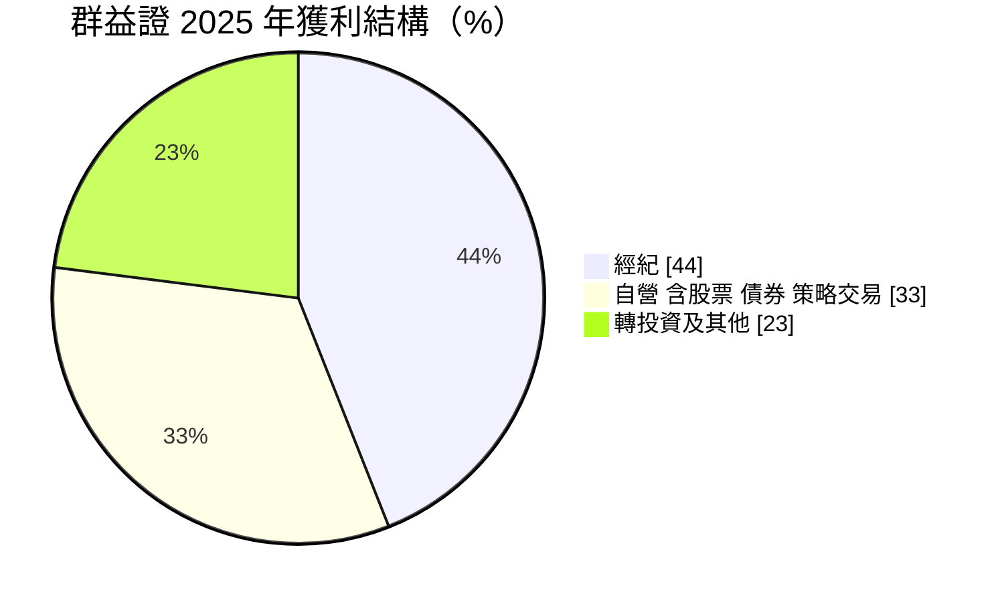
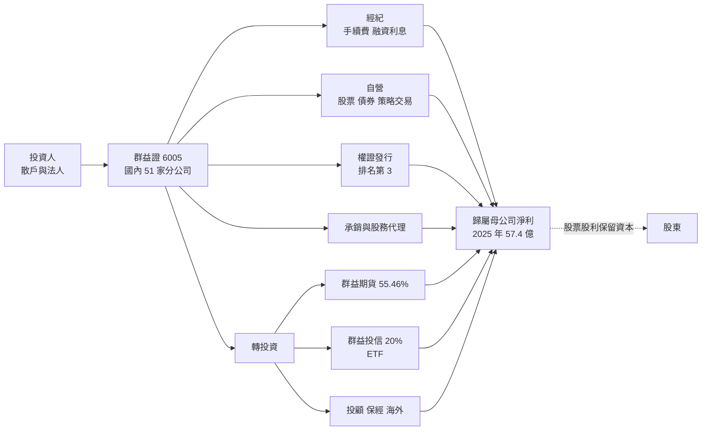
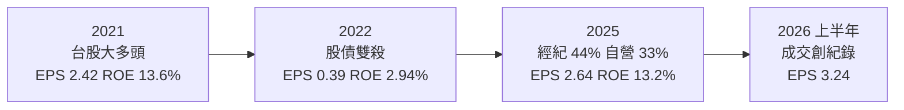
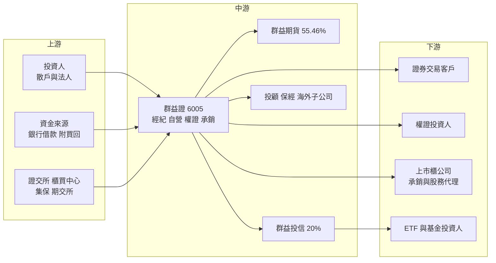

# 6005 群益證

> 上市｜[[產業索引-金融保險業|金融保險業]]｜上市（櫃）日期 2005/11/21

# 第一章：企業模式與商業藍圖

> [!info] 撰寫說明
> 本文由 Claude 依公開資料整理，架構比照 [[2330台積電]] 的四章研究，資料截至 2026-10-08。財務數字來源：Goodinfo 年度經營績效頁、富果研究（群益證 2026 年 3 月法說會整理）、理財周刊（群益證個股研究）、nStock（公司概況與 2026 年營收）、證交所開放資料（基本資料、股利、每月營收、本益比）；產業描述為整理性內容，尚未逐條比對原始文件。#待校對

在評估單一個股的長期投資價值時，首要步驟是拆解企業的底層獲利邏輯。本章針對群益金鼎證券（股票代號：6005，以下簡稱群益證）的商業模式進行定性分析，說明一家不屬於金控的獨立券商，如何以經紀、自營與權證為本業，並透過期貨、投信等轉投資形成「類金控」的獲利結構。

## 一、核心定位：獨立綜合券商，具「類金控」結構

群益證成立於 1988 年 6 月，2005 年 11 月上市，與金鼎證券合併後更名為群益金鼎證券（合併年份以年報為準）。2026 年董事長為周秀真、總經理為楊杰斌，實收資本額約 245.5 億元；2025 年底總資產 3,574 億元、股東權益 502 億元。截至 2026 年 6 月底，國內除總公司外設有 51 家分公司與國際證券業務分公司，海外在香港、上海與成都設有據點。

群益證在台灣券商中的位置可以用三個數字理解（2025 年）：

* **經紀市占率 3.71%，排名第 9：** 屬於中大型券商，但與 [[2885元大金]] 旗下元大證券等龍頭仍有明顯差距。
* **融資餘額市占率 4.99%，排名第 8：** 融資利息是經紀業務之外重要的穩定收入。
* **權證發行檔數與金額排名第 3、股務代理家數 391 家排名第 3：** 在權證與股務代理兩個專業領域，群益證是前段班。理財周刊指出，群益證在 2016 年後大幅改革內控、調整自營與權證部門管理方式，逐漸被市場視為較守規則的權證發行商。

**類金控結構：** 群益證不是金控，卻透過子公司與轉投資涵蓋證券、期貨、投信、投顧與保險經紀。依理財周刊整理，群益證持有群益期貨（[[6024群益期]]）55.46%、群益證券投資顧問 100%、群益保險經紀人 100%，並持有群益證券投資信託 20%。期貨與投顧等子公司納入合併報表，群益投信則依持股比例認列收益。2025 年群益期貨獲利 13.3 億元、群益投信獲利 25.4 億元，都是群益證本業以外的重要支撐。

## 二、業務板塊：獲利結構

* **經紀業務（44%）：** 投資人買賣股票的手續費與融資利息，是最核心的收入，和台股成交量高度連動。2026 年前兩個月受台股日均量近兆元帶動，經紀、融資與自營業務同步成長。
* **自營業務（33%）：** 公司以自有資金操作股票、債券、權證避險與策略交易。這部分在多頭時貢獻大，在空頭時可能虧損，是獲利波動的主要來源。2026 年前兩個月自營及策略交易占比升至 41%，超過經紀的 37%。
* **轉投資及其他（23%）：** 期貨、投信、投顧、保險經紀與海外子公司。群益投信旗下 ETF（如 00919、00937B）規模擴大，讓群益證間接受益於 ETF 浪潮。

## 三、資本轉化邏輯：成交量與資本運用

* **成交量是第一驅動力：** 經紀手續費與融資利息直接取決於台股成交量與融資餘額。2026 年 1 至 8 月營收 242.97 億元、年增 99.72%，公司說明主因是自營操作獲利增加與成交量增加，充分說明券商獲利對市場熱度的槓桿。
* **資本決定自營與權證規模：** 自營、權證與融資業務都需要資本支撐，群益證的資本適足率近五季維持在 270% 上下（富果整理），高於法規要求，提供擴大業務的空間。
* **股利政策兼顧資本需求：** 章程規定依資本預算計畫，可分派股票股利保留所需資金。2025 年度配發現金 0.4 元與股票 1.31 元，股票比重明顯提高，推估是為了在台股熱絡、業務擴張時補充資本（推估）。

## 四、企業長期藍圖：財富管理加 AI 雙引擎

* **財富管理：** 群益證把 2026 年定為「AI 元年」，提出以財富管理為核心、AI 為驅動力的雙引擎策略，包括業務差異化、深耕高資產客群與布局亞洲資產管理中心。券商從「交易通道」轉型為「財富管理平台」，是降低對成交量依賴的長期方向。
* **AI 應用：** 導入智能投顧、建立制度化的 AI 交易與選股策略，並推動集團一站式金融服務。
* **集團綜效與人才：** 整合期貨、投信、投顧與保經資源，並建立接班梯隊與薪酬優化。
* **信用評等：** 惠譽給予長期發行人違約評等 BBB-、國內長期評等 A(twn)，展望穩定，有助於控制資金成本。

# 第二章：護城河深度與競爭優勢

在長期價值投資中，「護城河」指企業抵禦競爭、維持超額利潤的保護機制。本章分析群益證的護城河構成、國內主要對手，以及在券商同質化競爭中，這些優勢能守住多少。

## 一、群益證護城河的核心組成要素

證券經紀本身同質性高、手續費折讓普遍，券商很難有寬護城河。群益證屬於「窄護城河」，由三個要素組成：

* **1. 專業領域的領先地位：** 權證發行排名第 3、股務代理排名第 3，這兩項業務需要長期累積的避險能力、系統與客戶關係。權證發行商的報價品質與信譽，會直接影響投資人選擇。
* **2. 集團化的產品線：** 期貨、投信、投顧與保經讓群益證能提供較完整的投資服務，特別是群益投信的 ETF 規模成長，把集團與台灣散戶最熱門的投資工具連在一起。
* **3. 獨立券商的彈性：** 不屬於銀行型金控，決策較快、專注證券本業，在自營與權證等需要靈活決策的業務上具優勢。

## 二、全球主要競爭對手格局

| 對手 | 定位 | 對群益證的威脅 |
|---|---|---|
| [[2885元大金]]（元大證券） | 國內經紀與 ETF 龍頭 | 經紀市占、ETF 規模與通路遠大於群益證 |
| [[2883凱基金]]（凱基證券）、[[2881富邦金]]（富邦證券） | 金控旗下大型券商 | 可結合銀行通路與財管客戶，交叉銷售能力強 |
| [[2855統一證]] | 獨立大型券商 | 在經紀、自營與承銷上直接競爭 |
| 數位券商與網路下單平台 | 低手續費、年輕客群 | 壓縮手續費率，搶走新開戶的年輕投資人 |

## 三、優勢轉化：哪些市場守得住、哪些守不住

* **守得住：** 權證發行、股務代理與融資業務，以及透過群益投信參與 ETF 成長。這些業務有專業門檻或規模效應，群益證已在前段班。
* **守不住：** 一般經紀手續費率。數位下單普及後，手續費折讓成為常態，沒有銀行通路的獨立券商在吸引新客戶上較吃力。自營獲利則取決於市場，不是可以穩定守住的優勢。
* **觀察重點：** 經紀市占率能否維持在 3.5% 以上、財富管理收入比重是否提升、群益投信 ETF 規模的成長，以及自營部位在市場回檔時的風險控管。

# 第三章：財務體質與盈利規模

資料日期：2026-10-08。數字取自 Goodinfo 年度經營績效頁、法說會整理、nStock 與證交所開放資料，表格是撰寫當時的快照；最新月營收、累計 EPS 由自動排程寫在本筆記的屬性欄位（月營收、累計EPS 等）。#待校對

財務報表是檢驗護城河是否真實存在的最終標準。證券業不適用一般產業的毛利率分析，本章改用營收、稅後淨利、[[ROE]]、[[ROA]]、資本適足率與股利，檢視群益證的獲利品質。

## 一、獲利能力的基石：營收與淨利的週期

| 年度 | 營收（新台幣） | 歸屬母公司稅後淨利 | EPS（元） | [[ROE]] | [[ROA]] |
|---|---|---|---|---|---|
| 2020 | 97.2 億 | 35.7 億 | 1.64 | 10.3% | 2.59% |
| 2021 | 133 億 | 52.5 億 | 2.42 | 13.6% | 2.98% |
| 2022 | 82.2 億 | 8.4 億 | 0.39 | 2.94% | 0.60% |
| 2023 | 127 億 | 41.3 億 | 1.90 | 11.1% | 2.08% |
| 2024 | 171 億 | 48.8 億 | 2.25 | 12.1% | 1.94% |
| 2025 | 192 億 | 57.4 億 | 2.64 | 13.2% | 1.90% |
| 2026 上半年 | 未查得 | 未查得 | 3.24 | 第二季單季 9.71% | 第二季單季 1.16% |

註：年度數字取自 Goodinfo 合併報表；證交所股利資料的 2025 年本期淨利為 57.36 億元。2026 年上半年 EPS 與第二季 ROE、ROA 取自 nStock；2026 年 1 至 8 月營收 242.97 億元取自證交所每月營收資料。

* **強烈的市場週期：** 2021 年 EPS 2.42 元，2022 年股債雙殺時驟降到 0.39 元，2023 年又回升到 1.90 元。券商獲利對股市的敏感度遠高於銀行，這是投資群益證必須接受的特性。
* **長期成長：** 2020 至 2025 年營收從 97.2 億元增至 192 億元，年複合成長率約 14.6%（推算）；稅後淨利從 35.7 億元增至 57.4 億元，年複合成長率約 10%（推算）。2023 至 2025 年連續三年成長並創新高，反映台股成交量與 ETF 投資人口擴大的長期趨勢。
* **2026 年的高峰：** 上半年 EPS 3.24 元，已超過 2025 年全年；1 至 8 月營收年增近一倍。這是市場極度熱絡下的高點，不宜外推為常態。
* **淨利率：** 2026 年第二季稅後淨利率 44.15%（nStock），券商的費用結構以人事與系統為主，成交量增加時多數收入直接轉為利潤，具有很強的營運槓桿。

## 二、[[ROE]] 與 [[ROA]]：資本效率

2021 至 2025 年平均 ROE 約 10.6%（推算），在台灣金融股中屬於較高水準；但年度差異極大，從 2.94% 到 13.6% 都出現過。ROA 約 2% 上下，遠高於銀行，因為券商的槓桿遠低於銀行。

群益證能維持兩位數 ROE 的原因有三：自營與權證業務的資本運用效率高、轉投資的期貨與投信獲利好，以及長期維持低槓桿下仍有穩定的融資利息收入。

## 三、資本適足、信評與股利

* **資本適足率：** 近五季維持在 270% 上下（富果整理），遠高於法規門檻，代表仍有空間擴大自營與融資業務。
* **信用評等：** 惠譽 BBB-、A(twn)，展望穩定。
* **股利：** 2025 年度配發現金 0.4 元與股票 1.31 元，合計 1.71 元，[[配息率]]（含股票）約 65%（推算，1.71 ÷ 2.64）。nStock 資料顯示 2024 年度配發現金股利 1.5 元。理財周刊統計近六年平均殖利率約 6.84%，股利政策大致穩定，但現金與股票的比例會依資本需求調整。章程規定現金股利不低於股利總額的 10%。

## 四、ROE 與權益資金成本：價值創造利差

**為什麼金融業不用 ROIC：** [[ROIC]] 把有息負債視為投入資本、以 [[WACC]] 為門檻。但券商的融資資金、附買回負債與客戶保證金都是營業本身的一部分，利息支出屬於營業成本，負債與營運無法拆開。因此證券業和銀行一樣，直接比較 ROE 與權益資金成本。

**權益資金成本推算：** 以 [[CAPM]] 估算，假設台灣 10 年期公債殖利率 1.75%、市場風險溢酬 6%，β 考量券商獲利與股市高度連動，取證券業常見值 1.1（同業常見值，非來源數字），權益資金成本約為 1.75% ＋ 1.1 × 6% ＝ 8.35%（推算）；β 若為 1.0 至 1.2，權益成本約 7.75% 至 8.95%。

**比較：** 2025 年 ROE 13.2%，高於推算的權益成本約 4.9 個百分點；2021 至 2025 年平均 ROE 約 10.6%，也高於權益成本約 2 個百分點。但 2022 年 ROE 2.94% 遠低於權益成本，說明價值創造集中在多頭年份。結論是：群益證在完整的市場週期中，平均能為股東創造超額報酬，屬於「週期性的價值創造者」。證交所資料顯示其股價淨值比約 1.37 倍，與 ROE 長期高於權益成本的判斷一致。

# 第四章：總體風險與地緣政治

任何企業都無法脫離宏觀環境獨立存在。本章分析群益證未來必須面對的地緣政治、市場週期與營運風險。

## 一、地緣政治風險

* **台股的地緣溢價：** 兩岸緊張或國際衝突升溫時，外資撤出與成交量萎縮會同時打擊經紀與自營業務。管理層在 2026 年法說會也把地緣政治與戰爭列為主要風險。
* **中國與香港據點：** 群益證在香港、上海與成都設有據點，兩岸與美中關係變化可能影響海外業務的發展空間。

## 二、市場週期與結構

* **成交量週期：** 理財周刊指出，2000 年網路泡沫後、2008 年金融海嘯與 2018 年貿易戰期間，群益證等券商獲利都明顯受挫；2022 年 EPS 只有 0.39 元也是一例。台股成交量是群益證最大的外部變數。
* **自營部位風險：** 自營業務在多頭時放大獲利，但在急跌時可能造成大額評價損失。2026 年自營占比升至四成以上，獲利對市場的敏感度更高。
* **利率：** 債券自營部位與融資利息都受利率影響，利率急升時債券部位會出現損失。

## 三、營運環境的隱性風險

* **手續費率競爭：** 數位下單與低手續費競爭持續壓縮經紀收入的單價，必須靠成交量與財管收入彌補。
* **股本膨脹：** 2025 年度配發 1.31 元股票股利，股本將擴大約 13%，若獲利成長放緩，EPS 會被稀釋。
* **資訊系統與資安：** 券商高度依賴交易系統，系統當機或資安事件會直接造成客戶損失與監理處分。
* **產業整併：** 台灣金融業整併頻繁，獨立券商可能成為金控併購的對象，股權結構與經營策略可能因此改變（推估）。

## 四、法規與科技演進

* **ETF 與被動投資：** 被動投資興起使散戶交易轉向 ETF，個股交易頻率可能下降，但群益投信的 ETF 業務可部分對沖這個趨勢。
* **AI 與智能投顧：** AI 選股與智能投顧可能改變財富管理的服務模式，群益證已把 AI 列為策略核心，能否轉化為收入仍待觀察。
* **監理規範：** 權證、當沖與融資相關法規的調整，會直接影響群益證幾項核心業務的規模與獲利。

# 專有名詞解析

## 金融

- **[[經紀業務]]**：券商替投資人買賣股票並收取手續費的業務，收入與市場成交量高度相關。
- **[[自營業務]]**：券商以自有資金投資股票、債券與衍生性商品，獲利隨市場波動。
- **[[權證]]**：由券商發行、賦予持有人在特定期間以約定價格買賣標的股票權利的商品，發行商需動態避險。
- **[[融資融券]]**：券商借錢給投資人買股票（融資）或借股票給投資人賣出（融券），券商可賺取利息與費用。
- **[[股務代理]]**：替上市櫃公司處理股東名簿、股東會、配息配股等股務作業的業務。
- **[[ETF]]**：指數股票型基金，追蹤特定指數並在交易所掛牌交易，投資人可像買股票一樣買賣。
- **[[智能投顧]]**：以演算法依投資人風險屬性自動配置投資組合的服務。
- **[[股票股利]]**：公司以發放新股代替現金分配盈餘，可把資金留在公司內部，但會使股本擴大、稀釋每股盈餘。
- **[[配息率]]**：股利占每股盈餘的比例，反映公司把多少獲利分給股東。
- **[[ROE]]**：股東權益報酬率，稅後淨利除以股東權益，衡量公司運用股東資本賺錢的效率。
- **[[ROA]]**：資產報酬率，稅後淨利除以總資產，衡量整體資產的獲利能力。
- **[[CAPM]]**：資本資產定價模型，以無風險利率加上 β 乘以市場風險溢酬，推估股東要求的報酬率。
- **[[ROIC]]**：投入資本報酬率，稅後營業利益除以股東權益加有息負債，衡量本業運用資本的效率；不適用於金融業。
- **[[WACC]]**：加權平均資金成本，依股權與負債比重加權的資金成本，是判斷 ROIC 是否創造價值的門檻。

# 核心供應鏈

## 1. 上游：資金與交易基礎設施
- 散戶與法人投資人的委託交易與保證金
- 銀行借款、附買回交易等營運資金
- 證交所、櫃買中心、集保結算所、期交所等交易基礎設施

## 2. 中游：群益證與子公司
- 群益證本身：經紀、自營、權證、承銷、股務代理
- [[6024群益期]]（持股 55.46%）
- 群益投信（持股 20%）、群益投顧（100%）、群益保險經紀人（100%）
- 海外據點：香港、上海、成都

## 3. 下游：主要客群
- 證券與期貨交易客戶
- 權證投資人
- 上市櫃公司（承銷、股務代理）
- 群益投信 ETF 與基金投資人

## 4. 同業比較
- 金控旗下券商：[[2885元大金]]、[[2883凱基金]]、[[2881富邦金]]
- 獨立券商：[[2855統一證]]

## 最新新聞
<!-- news:start（自動產生，請勿手動編輯此範圍） -->
- 2026-10-07 🏛️ 重訊 14:01｜公告本公司115年9月份合併自結損益｜[觀測站](https://mops.twse.com.tw/mops/#/web/t05st01)

完整紀錄：[[6005群益證 新聞]]
<!-- news:end -->

## 相關連結
- [公開資訊觀測站](https://mopsov.twse.com.tw/mops/web/t05st03?step=1&firstin=1&co_id=6005)
- [Goodinfo](https://goodinfo.tw/tw/StockDetail.asp?STOCK_ID=6005)
- [Yahoo 股市](https://tw.stock.yahoo.com/quote/6005)
- [鉅亨網新聞](https://www.cnyes.com/twstock/6005/news)
