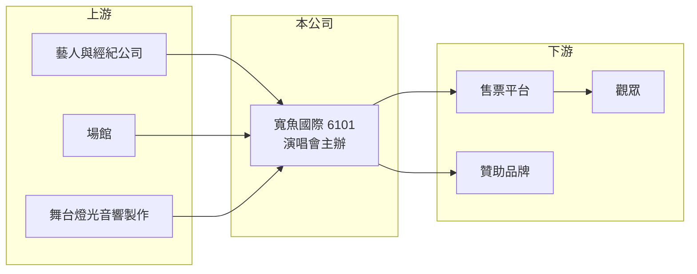

# 6101 寬魚國際

> 上櫃｜[[產業索引-文化創意業|文化創意業]]｜上市（櫃）日期 2001/03/29

# 第一章：企業模式與商業藍圖

> [!info] 撰寫說明
> 精簡版，由 Claude 依公開資料整理，架構比照 [[2330台積電]] 的四章研究，資料截至 2026-10-08。來源：Goodinfo 年度經營績效頁、櫃買中心開放資料（2026 年第二季綜合損益與資產負債、基本資料、每月營收、本益比殖利率）、財經媒體標題。公開資料有限，公司轉型前的原有業務與目前的業務別比重未查得，產業描述為整理性內容。#待校對

寬魚國際（股票代號：6101，以下簡稱寬魚）是一家轉型進入演唱會產業的上櫃公司。本章說明它的業務性質、營收在 2023 年前後的結構性變化，以及演唱會主辦這門生意的獲利邏輯。

## 一、核心定位：轉型中的演唱會業者

依櫃買中心基本資料，寬魚成立於 1989 年，2001 年 3 月上櫃，董事長為邱漢中，實收資本額約 11.66 億元，產業分類為文化創意業。公司 2026 年 8 月的月營收公告說明，營收年減「係因去年同期有數場演唱會的收入認列之故」，財經媒體也把寬魚與 [[8446華研]] 並列為搶攻巡演商機的文創股，反映疫後[[演唱會經濟]]的熱度，顯示演唱會已是公司目前的主要收入來源。

從 Goodinfo 的年度資料可以看到明顯的轉折：2020 至 2022 年營收只有 0.19 億至 0.61 億元，2023 年跳升到約 6.72 億元，2025 年再到約 10 億元。這代表公司在 2023 年前後完成業務轉型，營收規模擴大十倍以上（推估，轉型細節未查得）。

## 二、演唱會主辦的商業模式

* **買下演出權、承擔票房風險：** [[演出主辦]]商向藝人或經紀公司支付演出費，租用場館並負擔舞台與宣傳成本，再以票房回收。票賣得好就有利潤，賣不好則由主辦商承擔虧損。
* **營收認列集中在演出月份：** 票款在演出前就收到，但要等演出完成才認列營收，因此月營收與季營收會隨檔期劇烈波動。
* **毛利率偏低：** 寬魚 2023 至 2025 年的[[毛利率]]只有 5.7% 至 18.4%，明顯低於有自有售票系統的 [[6596寬宏藝術]]（約 27% 至 38%）。這可能代表寬魚的收入多為總額認列的票房，而藝人演出費等成本占比很高（推估）。

## 三、資本轉化邏輯

依櫃買中心資料，2026 年第二季底寬魚總資產約 19.94 億元，其中流動資產約 14.99 億元，權益約 13.65 億元。資產以現金與預付款等流動資產為主，符合演出業者「先付訂金、後收票房」的資金週轉型態（推估）。

## 四、企業長期藍圖

寬魚的長期發展取決於能否把轉型初期的成果延續成穩定的檔期來源。演唱會主辦是靠人脈與執行紀錄累積信用的產業，若能持續取得具票房號召力的藝人巡演，並提高每場演出的利潤率，營收規模與獲利才會穩定。2026 年上半年營收約 9.88 億元、EPS 1.25 元，已超過過去任何一個完整年度的獲利水準，但這是否能成為常態，仍需更多年度驗證。

# 第二章：護城河深度與競爭優勢

在長期價值投資中，「護城河」指企業抵禦競爭、維持超額利潤的保護機制。寬魚在演唱會產業屬於新進者，本章評估它目前具備的優勢與面臨的競爭。

## 一、寬魚的競爭條件

* **1. 藝人與檔期資源：** 演出主辦的核心能力是取得藝人巡演的台灣場次。寬魚在短短數年內把營收做到 10 億元規模，代表它已經建立一定的藝人與經紀公司人脈，但這些關係是否穩固，公開資料不足以判斷。
* **2. 資本實力：** 寬魚股本約 11.66 億元、權益約 13.65 億元，對演出主辦而言資本相對充足，可以同時籌備多個檔期並承擔單一節目的損失。
* **3. 缺少自有售票系統（推估）：** 與寬宏相比，寬魚未見自有售票系統的公開資訊，較難賺取售票佣金或掌握購票者資料，利潤率因此較低。

整體而言，寬魚目前看不到明確的護城河，比較接近「以資本和人脈承接檔期」的經營型態。

## 二、主要競爭對手格局

| 對手 | 定位 | 對寬魚的威脅 |
|---|---|---|
| [[6596寬宏藝術]] | 大型演唱會主辦並擁有自有售票系統 | 在華語一線藝人與場館檔期上直接競爭 |
| 相信音樂、[[8446華研]] | 唱片經紀公司，可自辦旗下藝人巡演 | 一線藝人演出可能由經紀公司自辦 |
| 國際演唱會公司 | 掌握歐美與韓國藝人亞洲巡演 | 可能直接在台辦演出 |
| [[6625必應]] | 演唱會硬體統包 | 屬上游合作夥伴 |

## 三、優勢轉化：哪些守得住、哪些守不住

* **守得住：** 已建立合作的藝人與經紀公司關係，以及充足資本帶來的接案彈性。
* **守不住：** 利潤率。演出費與場館成本由藝人與場館方主導，主辦商之間又競爭激烈，寬魚的毛利率長期偏低。
* **觀察重點：** 第一，年度營收能否維持在轉型後的規模；第二，毛利率能否提升到同業水準；第三，是否發展售票、周邊商品等附加收入。

# 第三章：財務體質與盈利規模

資料日期：2026-10-08，表格是撰寫當時的快照；最新月營收、毛利率、累計 EPS 由自動排程寫在本筆記的屬性欄位（月營收、毛利率、累計EPS 等）。#待校對

財務報表是檢驗護城河是否真實存在的最終標準。寬魚的財務數字以 2023 年為分水嶺，轉型前後不能直接比較。

## 一、多年度經營績效

| 年度 | 營收（新台幣） | [[毛利率]] | [[營業利益率]] | EPS（元） | [[ROE]] |
|---|---|---|---|---|---|
| 2019 | 2.85 億 | 30.7% | 4.3% | 0.04 | 0.38% |
| 2020 | 0.61 億 | 33.3% | -53% | -0.98 | -9.09% |
| 2021 | 0.19 億 | 26.5% | -316% | -0.63 | -6.45% |
| 2022 | 0.56 億 | 3.08% | -104% | -0.35 | -3.71% |
| 2023 | 6.72 億 | 18.4% | 7.55% | 0.55 | 5.7% |
| 2024 | 6.99 億 | 11.1% | 0.71% | 0.28 | 2.8% |
| 2025 | 10.0 億 | 5.74% | -0.31% | -0.19 | -1.88% |
| 2026 上半年 | 9.88 億 | 15.4% | 10.5% | 1.25 | 不適用（半年） |

資料來源：2019 至 2025 年為 Goodinfo 年度經營績效，2026 上半年為櫃買中心開放資料。

* **營收與毛利率背離：** 2023 至 2025 年營收持續成長，但毛利率從 18.4% 降到 5.74%，營業利益也從正轉負，代表營收擴張並沒有帶來利潤，可能是承接的檔期成本偏高或票房不如預期（推估）。
* **2026 年上半年改善：** 毛利率回升到 15.4%、營業利益率 10.5%，營業外收入約 0.41 億元，EPS 1.25 元。
* **長期指標：** 2021 至 2025 年平均 ROE 約 -0.7%（推算），轉型前長期虧損；2020 至 2025 年營收年複合成長率約 75%（推算），主要反映轉型帶來的規模跳升，並非原業務成長。

## 二、股利與現金流

依櫃買中心本益比殖利率資料，寬魚最近一次現金股利為 0 元。Goodinfo 統計歷年平均現金股利約 0.04 元，公司長期幾乎不配發現金股利。現金流量表未查得，[[自由現金流]]狀況不明。

## 三、[[ROIC]] 與 [[WACC]]

**ROIC 推算：** 2023 至 2025 年營業利益分別約 0.51 億、0.05 億與 -0.03 億元，平均約 0.18 億元，稅後約 0.14 億元。依櫃買中心資料，2026 年第二季底權益約 13.65 億元，非流動負債約 3.19 億元，假設其中約 3 億元為有息負債（推估），投入資本約 16.65 億元，近三年平均 ROIC 不到 1%（推算）。若以 2026 年上半年營業利益 1.03 億元年化，ROIC 約 9.9%（推算，演出收入有季節性，年化僅供參考）。

**WACC 推算：** 假設台灣 10 年期公債殖利率 1.75%、市場風險溢酬 6%、β 取文創同業常見值 1.0（假設），權益成本約 7.75%；負債成本假設 2.5%，稅後 2.0%，以權益約 82%、負債約 18% 計算，WACC 約 6.7%（推算）。

**結論：** 寬魚過去多年的 ROIC 明顯低於 WACC，尚未證明能長期創造價值。2026 年上半年的獲利若能延續，ROIC 才有機會超過資金成本。

# 第四章：總體風險與地緣政治

任何企業都無法脫離宏觀環境獨立存在。本章分析寬魚長期必須面對的產業週期、營運與其他風險。

## 一、產業週期

* **檔期與藝人週期：** 主辦商營收由少數大型檔期決定，藝人發片與巡演通常兩到三年一輪，一年沒有大型檔期，營收就可能大幅下滑。
* **突發停演：** 疫情、天災或公共安全事件可能讓演出取消，主辦商已支付的訂金與製作費可能無法回收。

## 二、營運風險

* **低利潤率：** 寬魚的毛利率長期低於同業，票房只要略低於預期就可能虧損。
* **轉型歷史短：** 公司在 2023 年前後才大規模經營演唱會業務，經營紀錄不到五年，長期執行能力仍待驗證。
* **資訊揭露有限：** 公開資料中查不到詳細的業務別營收與主辦節目清單，投資人較難判斷營收品質。

## 三、其他風險

* **匯率：** 若承接海外藝人演出，演出費多以外幣計價，新台幣貶值會提高成本。
* **法規：** 黃牛票與實名制規範趨嚴，主辦商需投入更多售票管理成本。

# 專有名詞解析

## 金融

- **[[ROIC]]**：投入資本報酬率，稅後營業利益除以股東權益與有息負債的合計，衡量本業對所有資金提供者的報酬。
- **[[WACC]]**：加權平均資金成本，依股東權益與負債的比重加權計算的資金成本，ROIC 高於它才代表創造價值。

## 產業

- **[[演唱會經濟]]**：大型演唱會帶動門票、交通、住宿與周邊消費，也帶動舞台設備與技術服務需求。
- **[[演出主辦]]**：向藝人買下演出權、租用場館並負責宣傳與售票的業者，承擔票房盈虧風險。

# 核心供應鏈

## 1. 上游
- 藝人與經紀公司：[[8446華研]]等唱片經紀公司
- 舞台與硬體統包：[[6625必應]]
- 大型場館

## 2. 本公司
- 寬魚國際：演唱會主辦

## 3. 下游
- 觀眾、售票平台、贊助品牌

## 4. 同業
- [[6596寬宏藝術]]、相信音樂

## 最新新聞
<!-- news:start -->
<!-- news:end -->

## 相關連結
- [公開資訊觀測站](https://mopsov.twse.com.tw/mops/web/t05st03?step=1&firstin=1&co_id=6101)
- [Goodinfo](https://goodinfo.tw/tw/StockDetail.asp?STOCK_ID=6101)
- [Yahoo 股市](https://tw.stock.yahoo.com/quote/6101)
- [鉅亨網新聞](https://www.cnyes.com/twstock/6101/news)
