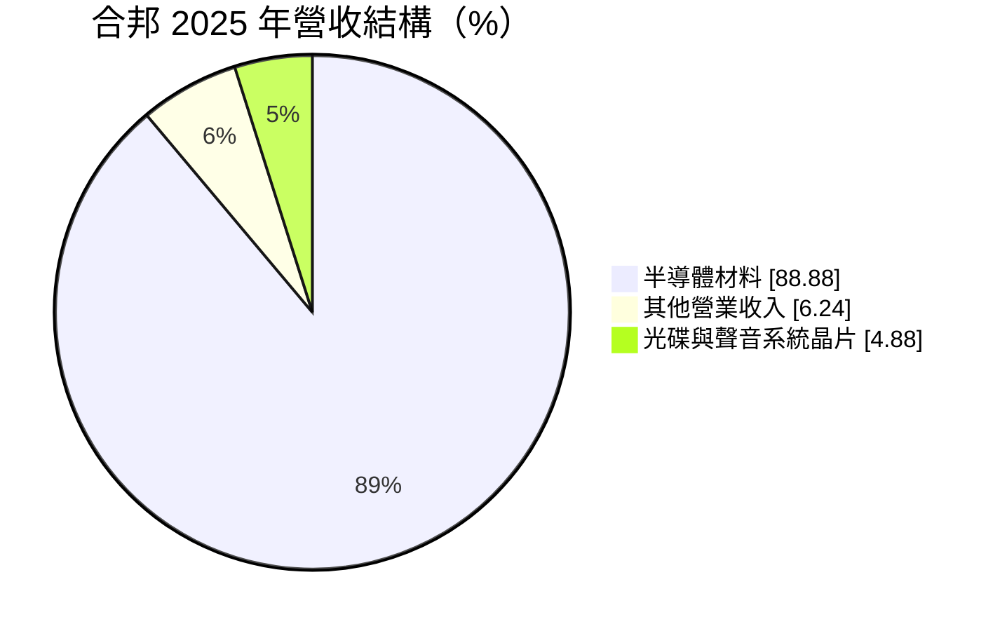
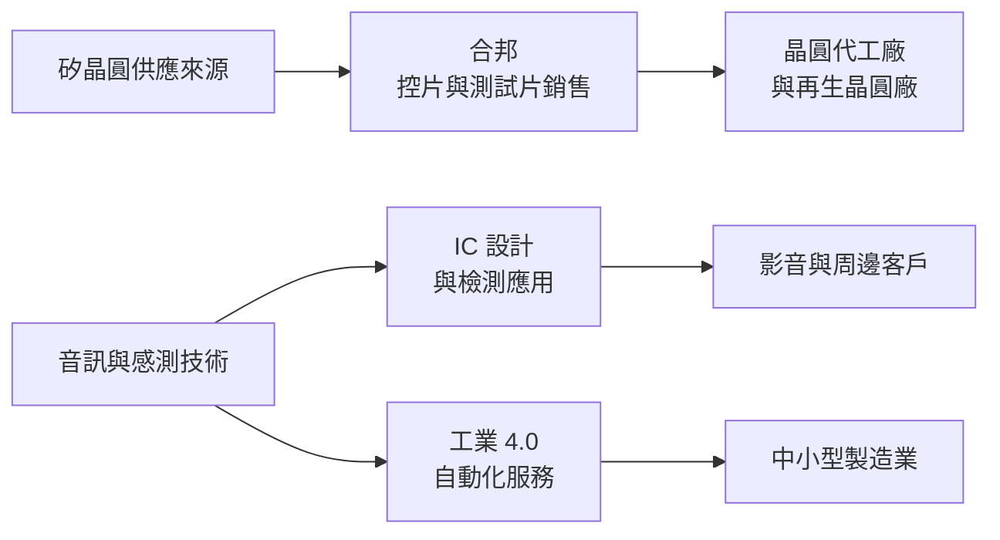
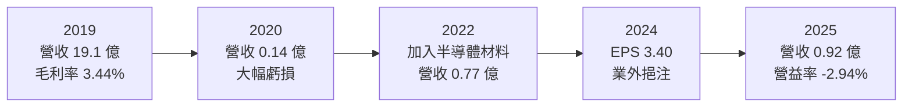
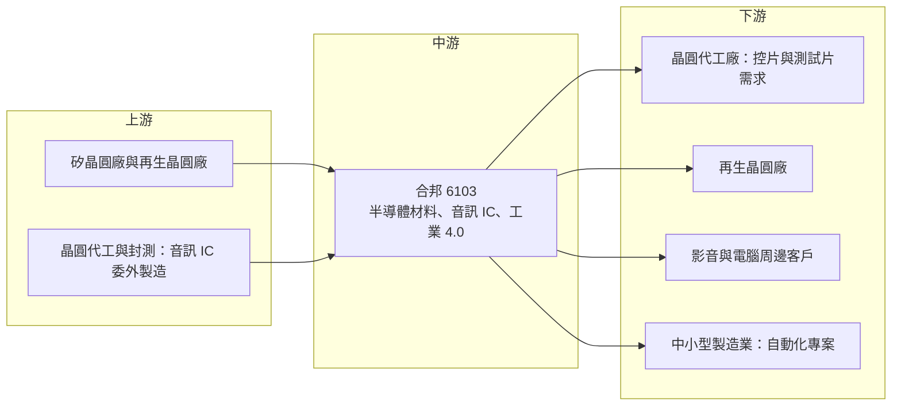

# 6103 合邦

> 上櫃｜[[產業索引-半導體業|半導體業]]｜上市（櫃）日期 2001/05/07

# 第一章：企業模式與商業藍圖

> [!info] 撰寫說明
> 本文由 Claude 依公開資料整理，架構比照 [[2330台積電]] 的四章研究，資料截至 2026-10-08。財務數字來源：Goodinfo 台灣股市資訊網年度經營績效與基本資料頁、富邦 MoneyDJ 個股基本資料（2025 年營收比重、2026 年第二季財務比率、β 值、股利紀錄）、富果研究法說會整理、科技新報公司資料庫、nStock 公司資料；產業描述為整理性內容，尚未逐條比對原始文件。#待校對

在評估單一個股的長期投資價值時，首要步驟是拆解企業的底層獲利邏輯。本章針對合邦電子股份有限公司（股票代號：6103，以下簡稱合邦）的商業模式進行定性分析。合邦是新竹科學園區一家規模非常小的公司，起家於光碟機與音訊晶片設計，之後跨入工業 4.0 服務，2022 年再加入半導體材料銷售，如今材料已占營收近九成。它是一個典型的「原本業萎縮後尋找新事業」的案例，投資人需要以轉型公司的角度看待。

## 一、核心定位：從音訊 IC 設計轉向半導體材料的小型公司

合邦於 1996 年 1 月經科學工業園區管理局核准設立，同年 3 月開始營業，2001 年 5 月在櫃買中心掛牌，董事長為柯拔希。公司最初的定位是類比前端（[[AFE]]）與光碟控制晶片（CDIC）供應商，產品用於 CD 播放機、MP3 與 MP4 播放器等影音產品，並延伸到電腦周邊、電源管理 [[IP]]、CD 馬達驅動 IC 與 LED 照明驅動 IC。

光碟與隨身影音產品在智慧型手機普及後快速萎縮，合邦的晶片本業跟著失去成長空間。公司因此分兩步轉型：2017 年起，利用光電整合、音訊訊號分析與 [[SoC]] 的經驗跨入[[工業4.0]]智慧製造服務；2022 年再加入半導體材料業務，形成三大事業。目前合邦的實收資本額約 1.36 億元、發行約 1,360 萬股（含私募約 341.5 萬股），2026 年第二季負債比例僅約 2.82%（富邦 MoneyDJ），是一家資本極小、幾乎無負債的公司。

## 二、終端應用與產品板塊

依富邦 MoneyDJ 資料，2025 年合邦營收結構如下：

* **半導體材料（約 89%）：** 向晶圓代工廠與[[再生晶圓]]廠供應矽[[控片]]與測試片。晶圓廠每天需要大量控片來監控機台狀態與製程參數，這是晶圓廠的消耗性材料，需求隨晶圓廠產能與製程複雜度增加。公司認為製程推進到 7 奈米、5 奈米，以及 5G 與 [[HPC]] 成長，會提高控片需求與規格要求。
* **IC 設計（約 5%）：** 以音訊 IC 為核心，並把音訊專利應用到表面平整度檢測與其他感測訊號處理。這是合邦的原始本業，目前營收占比已很小。
* **工業 4.0 智慧製造（含於其他）：** 提供自動化與智慧升級服務，取得經濟部工業局 AU 級自動化技術服務機構資格，聚焦有線與無線 [[IoT]] 量測與感測應用，並規劃 AI 與大數據分析。

## 三、資本轉化邏輯：輕資產的材料銷售與技術服務

合邦的半導體材料業務屬於銷售與供應鏈服務性質：公司扮演材料取得與交付的角色，協助客戶管理材料成本，並不需要建立自己的長晶或拋光工廠。這種模式資本需求低，但附加價值也有限，毛利率主要取決於採購與銷售的價差。依富邦 MoneyDJ，2026 年第二季營業毛利率僅約 6.23%，反映材料銷售的低毛利特性。

IC 設計與工業 4.0 則屬技術服務，毛利率較高但營收規模很小。合邦以三條事業線分散單一市場的風險，但每一條都尚未形成足以支撐公司固定費用的規模。

## 四、企業長期藍圖

依法說會整理，合邦的策略包括：IC 業務擴大客戶群、增加設計導入，並降低對單一市場（特別是美國）的依賴；材料業務深化供應鏈關係，協助客戶管理材料成本；工業 4.0 則持續推動自動化，並投入 AI 與大數據研發。公司強調自身的優勢是「從 IC 設計到系統軟體」的跨領域能力，加上政府認可的自動化顧問資格，可以服務中小企業。

長期來看，合邦能否成功轉型，取決於半導體材料業務能否擴大規模並提高附加價值，例如從單純銷售延伸到檢測或加工服務。若材料業務始終停留在低毛利的貿易性質，公司很難靠它建立長期獲利能力。

# 第二章：護城河深度與競爭優勢

本章分析合邦的護城河構成、主要競爭對手，以及現有優勢能否支撐長期轉型。

## 一、護城河的核心組成要素

合邦目前沒有明顯的護城河。各項業務規模都很小，在各自市場中都是邊緣參與者。可以列出的相對優勢如下：

* **1. 科學園區內的地緣與客戶關係：** 公司位於新竹科學園區，鄰近晶圓代工與再生晶圓廠，有利於提供即時的材料供應與服務。材料供應講求交期與品質穩定，在地供應商有一定的便利優勢。
* **2. 跨領域的技術經驗：** 音訊訊號處理、光電整合與系統軟體的經驗，讓合邦能把 IC 技術延伸到檢測與自動化應用。這種跨領域能力在小型專案中有價值，但難以形成規模化優勢。
* **3. 幾乎無負債的資產負債表：** 負債比例不到 3%，即使營運虧損，也不會面臨財務危機，給予公司較長的轉型時間。

## 二、主要競爭對手格局

| 業務 | 主要競爭者 | 合邦的處境 |
|---|---|---|
| 控片與測試片 | [[6488環球晶]]、[[3532台勝科]]、[[6182合晶]] 等矽晶圓廠，及 [[8028昇陽半導體]]、[[1560中砂]] 等再生晶圓廠 | 合邦以銷售與服務角色參與，規模與技術遠小於這些廠商 |
| 音訊 IC | [[2379瑞昱]] 等大型 IC 設計公司、中國音訊晶片廠 | 光碟與隨身影音市場萎縮，只剩利基應用 |
| 工業 4.0 服務 | 國內系統整合商與自動化設備商 | 案件規模小，屬中小企業顧問與導入服務 |

## 三、優勢轉化：守得住、守不住與觀察重點

* **守得住：** 既有材料客戶的穩定供應關係。只要晶圓廠產能維持高檔，控片的消耗量就有基本需求。
* **守不住：** 音訊 IC 本業與材料業務的毛利率。前者市場萎縮，後者屬低附加價值的銷售業務，價格由上游供應商與下游大客戶決定。
* **觀察重點：** 第一，材料業務營收能否持續成長並提高毛利率；第二，工業 4.0 與 AI 研發能否從專案轉為可重複銷售的產品；第三，公司是否有進一步的資本運作或轉型動作，例如私募引進策略夥伴。

# 第三章：財務體質與盈利規模

資料日期：2026-10-08。數字取自 Goodinfo 年度經營績效頁與富邦 MoneyDJ 個股基本資料，表格是撰寫當時的快照；最新月營收、毛利率、累計 EPS 由自動排程寫在本筆記的屬性欄位（月營收、毛利率、累計EPS 等）。#待校對

財務報表是檢驗護城河是否真實存在的最終標準。本章用十年的三率、[[ROE]] 與資本報酬，檢視合邦在本業萎縮與轉型期間的財務狀況。

## 一、獲利能力的基石：三率

| 年度 | 營收（新台幣） | [[毛利率]] | [[營業利益率]] | EPS（元） | [[ROE]] |
|---|---|---|---|---|---|
| 2016 | 13.6 億 | 3.70% | 1.75% | 0.10 | 8.33% |
| 2017 | 18.8 億 | 3.98% | 2.19% | 0.53 | 33.3% |
| 2018 | 20.0 億 | 3.53% | 1.70% | 0.27 | 13.4% |
| 2019 | 19.1 億 | 3.44% | 1.42% | 0.18 | 8.06% |
| 2020 | 0.14 億 | 25.6% | -942% | -2.72 | -117% |
| 2021 | 0.24 億 | 19.0% | -51.1% | -0.04 | -2.83% |
| 2022 | 0.77 億 | 7.68% | -14.0% | -0.79 | -8.19% |
| 2023 | 0.48 億 | 9.58% | -23.9% | -0.53 | -5.94% |
| 2024 | 0.55 億 | 16.9% | -10.7% | 3.40 | 32.6% |
| 2025 | 0.92 億 | 14.0% | -2.94% | -0.56 | -4.74% |

這張表需要謹慎解讀。依 Goodinfo 數字，2016 至 2019 年合邦營收在 13.6 億至 20 億元之間，但毛利率只有 3.4% 至 4%，這種結構不像 IC 設計公司，推估當時合併報表包含毛利很低的代理或貿易性業務（推估，原因未查得）。2020 年營收驟降到 0.14 億元並出現大額虧損，推估是該部分業務停止或移出合併範圍（推估）。Goodinfo 頁面本身的單位與數值也有前後不一致之處，引用 2016 至 2020 年數字前應以公開資訊觀測站原始財報核對。

2021 年以後的數字較能代表現在的合邦：營收在 0.24 億至 0.92 億元之間，2022 年加入半導體材料後營收逐步增加，2025 年達 0.92 億元，但營業利益率仍為負。2024 年營業利益率 -10.7%，EPS 卻有 3.40 元，代表當年有大額[[業外收益]]，來源未查得，屬一次性成分較高的收益，不能視為本業獲利能力。

* **[[毛利率]]：** 材料業務比重提高後，毛利率由 2024 年的 16.9% 降到 2025 年的 14.0%，2026 年第二季更降到約 6.23%（富邦 MoneyDJ），顯示營收成長是以較低毛利的材料銷售換來的。
* **[[營業利益率]]：** 營收規模不足以覆蓋上市公司的固定費用，即使營收成長，營業利益仍未轉正。

## 二、[[ROE]]：資本效率

2021 至 2025 年平均 ROE 約 2.2%（推算），但主要由 2024 年業外收益帶來的 32.6% 撐起，其餘四年均為負值。十年平均約 -4.3%（推算）。以本業衡量，合邦近五年沒有為股東創造報酬。2026 年第二季每股淨值約 11.01 元（富邦 MoneyDJ），以約 1,360 萬股計算，權益約 1.5 億元。

## 三、資本支出與自由現金流

合邦屬輕資產公司，材料業務以採購銷售為主，IC 設計與工業 4.0 也不需要大型廠房，資本支出很低，具體金額未查得。由於營業利益長期為負，營業現金流推估多為小幅負值或接近零（推估），[[自由現金流]]難以長期為正。

股利方面，依富邦 MoneyDJ，民國 113 年曾配發 0.19 元現金股利（推估與 2024 年業外收益有關），其餘近年均未配息。合邦不屬於可期待穩定股利的公司。

## 四、[[ROIC]] 與 [[WACC]]：價值創造利差

**ROIC 推算：** 2025 年營業虧損約 0.027 億元（0.92 億 × -2.94%），投入資本以權益約 1.5 億元計算（負債比例不到 3%，有息負債視為不重大），ROIC 約 -1.8%（推算）。2023 年營業虧損約 0.115 億元（0.48 億 × -23.9%），ROIC 約 -7.7%（推算）。

**WACC 推算：** 權益成本以 CAPM 估計，假設台灣 10 年期公債殖利率 1.75%、市場風險溢酬 6%。富邦 MoneyDJ 所列 β 為 0.34，但合邦市值小、交易稀少，低 β 主要反映股價與大盤連動低，而非經營風險低；因此改用小型股常見的 β 1.0，權益成本約 7.75%。有息負債不重大，WACC 約 7.75%（推算）。

**結論：** 合邦近年本業的 ROIC 持續為負，明顯低於約 7.75% 的資金成本，代表本業沒有創造經濟價值。公司目前靠著低負債的資產負債表維持營運，轉型能否成功，取決於材料業務能否擴大到足以覆蓋固定費用，並找到比單純銷售更高附加價值的經營方式（推算）。

# 第四章：總體風險與地緣政治

任何企業都無法脫離宏觀環境獨立存在。本章分析合邦未來必須面對的地緣政治、產業週期與營運風險。

## 一、地緣政治風險

* **美國市場的關稅衝擊：** 法說會提到，2023 年上半年 IC 營收受到影響美國客戶的關稅政策與匯損衝擊，公司因此積極開拓非美國客戶。美中貿易摩擦持續，音訊 IC 的出口市場仍有不確定性。
* **晶圓廠在地化：** 台灣晶圓廠在海外建廠，控片需求有一部分會轉移到海外，在地型的材料供應商若無法跟隨，可能失去部分需求。
* **台灣集中風險：** 材料客戶集中在台灣科學園區，兩岸情勢會同時影響合邦與其客戶。

## 二、產業週期與市場結構風險

* **晶圓廠產能利用率：** 控片消耗量與晶圓廠的[[產能利用率]]連動，半導體景氣下行時，晶圓廠會降低控片使用量或延長重複使用次數，材料營收會跟著下滑。
* **矽晶圓價格週期：** 矽晶圓價格有明顯週期，材料銷售的價差會隨上游報價變動。
* **消費性影音市場萎縮：** 音訊 IC 的終端市場長期縮小，難以恢復。

## 三、營運環境的隱性風險

* **規模過小：** 營收不到 1 億元，任何一個大客戶的流失都會對營收產生重大影響。
* **獲利依賴業外：** 2024 年的獲利主要來自業外，若沒有類似收益，公司難以維持獲利。
* **資料一致性：** 早年財務資料的口徑變動大，投資人在比較長期趨勢時需要特別小心，並以原始財報為準。

## 四、科技或法規演進風險

晶圓製程持續微縮，控片與測試片的規格要求會越來越高，供應商需要具備更高的品質管理與檢測能力。若合邦只扮演銷售角色，未來可能被要求直接向矽晶圓廠或再生晶圓廠採購的客戶繞過。另一方面，工業 4.0 與 AI 應用變化快速，小型服務商若無法持續投入研發，很容易被大型系統整合商取代。合邦的長期挑戰是找到一項真正具有技術門檻、且能放大規模的核心事業。

# 專有名詞解析

## 半導體

- **[[控片]]**：晶圓廠用來監控機台狀態與製程參數的晶圓，不做成產品，用過後可回收再生使用。
- **[[再生晶圓]]**：晶圓廠用過的測試片與控片經去膜、研磨、拋光後重新使用，可降低晶圓廠的材料成本。
- **[[SoC]]**：系統單晶片，把處理器、記憶體控制與周邊功能整合在一顆晶片上。
- **[[IP]]**：矽智財，可授權給其他晶片設計公司重複使用的電路設計模組。
- **[[AFE]]**：類比前端，負責接收並轉換感測器或光碟讀取頭送出的類比訊號，再交給數位電路處理。

## 應用

- **[[IoT]]**：物聯網，讓感測器與設備透過網路連線並交換資料的應用。
- **[[HPC]]**：高效能運算，指 AI 訓練、資料中心伺服器等需要大量運算能力的應用。

## 金融

- **[[業外收益]]**：本業以外的收益，例如投資收益或處分利益，通常不具持續性。
- **[[產能利用率]]**：實際投片量占總產能的比例，晶圓廠的材料消耗與毛利率都與此數字高度相關。

## 產業

- **[[工業4.0]]**：以感測、聯網與資料分析把工廠自動化與智慧化的製造升級趨勢。

# 核心供應鏈

## 1. 上游：材料來源與委外製造
- 矽晶圓與再生晶圓來源：[[6488環球晶]]、[[3532台勝科]]、[[6182合晶]]、[[8028昇陽半導體]]（同產業主要廠商，合邦實際供應來源未揭露）
- 音訊 IC 的晶圓代工與封測：未揭露

## 2. 中游：合邦本身
- 半導體材料銷售、音訊 IC 設計、工業 4.0 自動化服務
- 轉投資：United Holding Business Ltd.（100% 持股，帳面金額很小）

## 3. 下游：主要客戶群
- 晶圓代工廠與再生晶圓廠（名單未揭露）
- 影音、電腦周邊產品客戶（以非美國客戶為拓展方向）
- 中小型製造業的自動化與智慧化專案

## 4. 同業與競爭者
- 材料：[[8028昇陽半導體]]、[[1560中砂]]
- 音訊 IC：[[2379瑞昱]]

## 最新新聞
<!-- news:start -->
<!-- news:end -->

## 相關連結
- [公開資訊觀測站](https://mopsov.twse.com.tw/mops/web/t05st03?step=1&firstin=1&co_id=6103)
- [Goodinfo](https://goodinfo.tw/tw/StockDetail.asp?STOCK_ID=6103)
- [Yahoo 股市](https://tw.stock.yahoo.com/quote/6103)
- [鉅亨網新聞](https://www.cnyes.com/twstock/6103/news)
