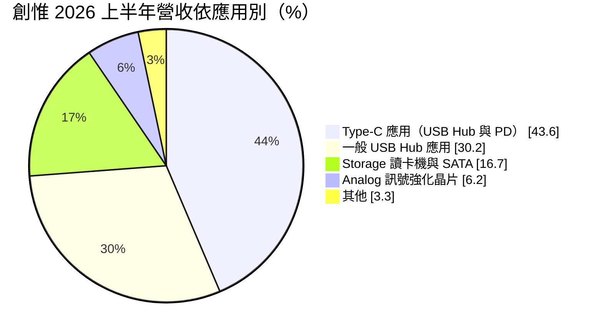
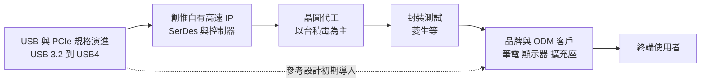
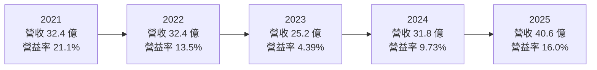
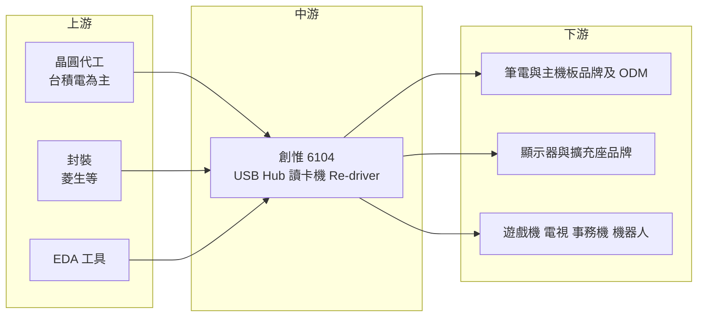

# 6104 創惟

> 上櫃｜[[產業索引-半導體業|半導體業]]｜上市（櫃）日期 2001/05/22

# 第一章：企業模式與商業藍圖

> [!info] 撰寫說明
> 本文由 Claude 依公開資料整理，架構比照 [[2330台積電]] 的四章研究，資料截至 2026-10-08。財務數字來源：Goodinfo 經營績效與股利政策頁、創惟 2026 年 8 月法說會簡報、富果研究 2025 年 8 月法說會整理、CMoney 2021 年研究報告、櫃買中心 OpenAPI 2026 年第二季資產負債資料；產業描述為整理性內容，尚未逐條比對原始文件。#待校對

在評估單一個股的長期投資價值時，首要步驟是拆解企業的底層獲利邏輯。本章針對創惟科技（股票代號：6104，以下簡稱創惟）的商業模式進行定性分析，說明一家專做 USB 集線器與讀卡機控制晶片的中型 IC 設計公司，如何靠自有的高速傳輸技術，在 PC 介面規格每隔幾年就換代的市場裡維持四成五以上的毛利率。

## 一、核心定位：USB 與高速傳輸介面的控制晶片專家

創惟成立於 1997 年，2001 年在櫃買中心掛牌，是一家 [[Fabless]] IC 設計公司，專攻電腦與周邊裝置之間的資料傳輸介面。它最主要的產品是 [[USB Hub]] 控制晶片，也就是把一個 USB 連接埠擴充成多個埠的晶片；其次是讀卡機控制晶片，以及強化訊號品質的 [[Re-driver]] 類比晶片。

這類晶片的技術核心在 [[SerDes]]，也就是把平行資料轉成高速序列訊號、再還原回來的電路。依 CMoney 2021 年研究報告，創惟的 IP 皆為自行研發，長期開發 USB、PCI Express、SATA 等高速介面控制晶片，核心競爭力就在高速 SerDes 技術。介面規格從 USB 2.0、USB 3.x 一路演進到 [[USB4]]，每一代的傳輸速度大約翻倍，訊號完整性與耗電控制都更難，擁有自有 IP 的公司可以較快推出新一代產品，不必等待外部 IP 授權。

創惟的客戶多是全球主要的筆電、顯示器、擴充座與周邊品牌。CMoney 報告提到 USB 集線器控制晶片客戶包括微軟、三星、索尼，儲存相關控制晶片客戶包括蘋果、希捷、金士頓；公司在 2026 年法說會簡報中也強調全球主要品牌客戶多為長期客戶。這種客戶結構讓創惟的產品品質要求很高，但也使它能分到國際品牌每一代新平台的長期訂單。

## 二、終端應用／產品板塊：Type-C 是最大引擎

依創惟 2026 年 8 月法說會簡報，2026 年上半年的應用別營收比重如下：

* **[[USB Type-C]] Hub 與 [[USB PD]]：** Type-C 是目前筆電、手機與周邊的主流接頭，一個接頭同時負責資料傳輸、影像輸出與充電。Type-C 擴充座、多功能轉接器與顯示器內建的 Hub，都需要 Hub 控制晶片與 PD（Power Delivery，快充協定）控制晶片。這是創惟最大的營收來源，2025 年上半年占比曾達 47.7%。
* **一般 USB Hub：** 主機板、顯示器、電視、遊戲機、事務機等嵌入式系統，常因主晶片 USB 埠數不足而加裝 Hub 晶片。這塊市場成熟但穩定，是創惟的基本盤。
* **Storage：** 包括 SD 讀卡機、智慧卡讀卡機與 SATA 控制晶片。CMoney 報告提到 2021 年下半年創惟打入美系大廠新款筆電的 SD 讀卡槽，顯示讀卡機晶片仍有高階筆電的需求。
* **Analog：** USB 與 [[PCIe]] 的 Re-driver 與 Repeater，負責在長距離傳輸時放大與修整訊號。USB4 與 PCIe 速度越快，訊號衰減越嚴重，主機板上需要的訊號強化晶片越多，這是創惟有機會擴大的品類。
* **影像處理：** 包括 USB 攝影機控制器與魚眼影像處理器，2026 年簡報提到針對機器人與自動搬運車的 180 度與 360 度影像去扭曲方案。

## 三、資本轉化邏輯（營運模式）：自有 IP、規格換代驅動

創惟的獲利邏輯有三個層次：

* **規格換代創造需求：** USB 規格大約每三到五年升級一次，每次升級都需要新的控制晶片。對創惟而言，每一代新規格都是重新分配市占的機會，也是提高單價的時機。新一代產品推出初期競爭者少、毛利率高；隨著規格普及，價格逐步下滑。
* **早期導入參考設計：** 公司在法說會簡報中強調，會在參考設計或產品概念初期就導入客戶。一旦被寫進主晶片廠或品牌廠的參考設計，就會跟著該平台出貨數年。
* **輕資產與晶圓代工合作：** 依富果整理的資料與 CMoney 報告，創惟的晶圓代工主要由 [[2330台積電]] 提供，封裝則有 [[2369菱生]] 等夥伴。公司不需要投入工廠，資本主要投在研發人力與光罩上。

## 四、企業長期藍圖：USB4、訊號強化與影像應用

* **USB4 產品線：** USB4 傳輸速度可達 40Gbps 以上，並整合 PCIe 與 DisplayPort 通道。依 2026 年簡報，USB4 Re-driver 已量產，USB4 Hub 預計 2026 年第四季提供工程樣品。USB4 Hub 是技術門檻最高的產品之一，若能如期推出，將決定創惟在下一個五年的市場地位。
* **[[eUSB2]] 新介面：** 新一代處理器採用低電壓的 eUSB2 介面，需要 Repeater 轉換成傳統 USB 2.0 訊號。創惟的 eUSB2 Repeater 已量產，eUSB2 Hub 處於設計導入階段，這是規格演進帶來的新增晶片需求。
* **影像與機器人應用：** 魚眼影像去扭曲方案瞄準機器人、自動搬運車與視訊會議設備，屬於創惟從 PC 介面延伸到邊緣影像處理的嘗試，規模仍小。

# 第二章：護城河深度與競爭優勢

在長期價值投資中，「護城河」指企業抵禦競爭、維持超額利潤的保護機制。本章分析創惟的護城河構成、國內外主要競爭對手，以及這些優勢在規格快速換代的介面晶片市場中能守住多少。

## 一、護城河的核心組成要素

創惟屬於「窄護城河」，優勢集中在技術累積與客戶關係：

* **1. 自有高速傳輸 IP：** 高速 SerDes 與 USB 控制器是需要多年累積的類比與數位混合技術。自有 IP 讓創惟能較快推出新規格產品，也不用支付外部授權費，這是它長期維持 45% 以上毛利率的根本原因。
* **2. 品牌客戶的認證與長期關係：** 國際品牌對介面晶片的相容性要求嚴格，同一顆 Hub 晶片要和各種裝置、作業系統、充電器互通。通過認證的晶片很少被輕易更換，因為更換就要重新做大量相容性測試。
* **3. 產品線的互補性：** Hub、PD、讀卡機與 Re-driver 常出現在同一台擴充座或筆電中。創惟能提供多顆晶片，降低客戶的整合工作，提高在單一產品中的晶片數量。
* **4. 規格演進經驗：** 創惟經歷 USB 1.1 到 USB4 的每一代轉換，熟悉規格制定組織的節奏與認證流程。這種經驗讓公司在新規格出現時，能較快判斷投入時機。

## 二、全球主要競爭對手格局

| 對手 | 定位 | 對創惟的威脅 |
|---|---|---|
| [[2379瑞昱]] | 大型 IC 設計公司，產品線廣，涵蓋 USB 與 PC 周邊 | 可用整合方案與規模搶占 Hub 與讀卡機市場 |
| [[6756威鋒電子]] | USB Hub 與 USB4 控制晶片，威盛集團成員 | 在 Type-C Hub 與 USB4 世代直接競爭 |
| [[5269祥碩]] | 高速傳輸介面晶片，與 AMD 關係深 | 在 USB4 與 PCIe 主控晶片具技術優勢 |
| 德州儀器、微芯、Diodes 等外商 | 類比訊號強化、Hub 與 PD 晶片 | 在 Re-driver、PD 與車用市場具品牌與規模 |
| [[5351鈺創]]、[[6233旺玖]]、[[8054安國]] | 台灣介面與周邊控制晶片 | 在部分 Hub、讀卡機與周邊品項重疊 |

## 三、優勢轉化：哪些市場守得住、哪些守不住

* **守得住：** 國際品牌擴充座、顯示器與筆電的 Type-C Hub 與一般 Hub。這些客戶重視相容性、品質與長期供貨，創惟累積多年的認證與合作紀錄，是新進者短期難以複製的。
* **守不住：** 規格成熟、進入門檻降低的舊世代產品。當 USB 3.x Hub 普及後，中國同業與大型 IC 公司可用低價或整合方案競爭，創惟在這些品項的價格會逐年下滑。2026 年上半年毛利率從前一年同期的 52.1% 降到 45.0%，也提醒投資人：高毛利並非永久不變。
* **觀察重點：** 第一，USB4 Hub 能否如期推出並取得品牌客戶採用，這是下一代成長的關鍵；第二，Re-driver 與 eUSB2 等訊號類晶片能否成為新的支柱；第三，毛利率能否在 45% 以上止穩。

# 第三章：財務體質與盈利規模

資料日期：2026-10-08。數字取自 Goodinfo 年度經營績效與股利政策頁、創惟 2026 年 8 月法說會簡報、櫃買中心 OpenAPI 2026 年第二季資產負債資料，表格是撰寫當時的快照；最新月營收、毛利率、累計 EPS 由自動排程寫在本筆記的屬性欄位（月營收、毛利率、累計EPS 等）。#待校對

財務報表是檢驗護城河是否真實存在的最終標準。本章用五年的三率、[[ROE]]、股利與資本報酬，檢視創惟的獲利品質。

## 一、獲利能力的基石：三率

| 年度 | 營收（新台幣） | [[毛利率]] | [[營業利益率]] | EPS（元） | [[ROE]] |
|---|---|---|---|---|---|
| 2021 | 32.4 億 | 50.6% | 21.1% | 6.41 | 33.3% |
| 2022 | 32.4 億 | 46.6% | 13.5% | 4.60 | 21.7% |
| 2023 | 25.2 億 | 42.3% | 4.39% | 1.07 | 5.11% |
| 2024 | 31.8 億 | 44.4% | 9.73% | 3.37 | 15.9% |
| 2025 | 40.6 億 | 47.3% | 16.0% | 5.62 | 23.8% |

創惟的毛利率是這五年最穩定的指標：即使在 2023 年 PC 庫存調整的谷底，毛利率仍有 42.3%，顯示產品定價能力並未因景氣而崩潰。真正波動的是營業利益率，從 21.1% 降到 4.39% 再回升到 16.0%。原因是 IC 設計公司的研發費用相對固定，營收下滑時費用率上升，營收回升時營業槓桿放大獲利。2025 年營收創下 40.6 億元新高，EPS 回到 5.62 元。

依 Goodinfo 長期數字，創惟營收從 2016 年的 17.6 億元成長到 2025 年的 40.6 億元，九年年複合成長率約 9.7%（推算）；2016 至 2020 年毛利率在 45.7% 至 50.5% 之間，營業利益率約 12% 至 15%。這說明創惟的成長主要來自 Type-C 普及帶來的產品升級，而且毛利率長期維持在 45% 上下的水準。

## 二、[[ROE]]：資本效率

2021 至 2025 年平均 ROE 約 20.0%（推算），2023 年谷底仍維持正值 5.11%。創惟的 ROE 主要由營業利益率驅動，財務槓桿不高。依櫃買中心 2026 年第二季資料，總資產約 33.4 億元、權益約 21.6 億元、負債約 11.8 億元，負債比約 35%；負債中有息借款的金額未查得，推估以應付帳款與應付股利等營運性負債為主。

## 三、資本支出與自由現金流

Fabless 模式下，創惟的資本支出主要是研發設備、測試設備與光罩（具體金額未查得），遠低於營業現金流，[[自由現金流]]長期應為正（推估）。

股利是最直接的資本配置指標。依 Goodinfo，2021 至 2025 年度現金股利分別為 4.5、2.5、1.8、2.997、4.5 元；對照 EPS，配息率約為 70%、54%、168%、89%、80%（推算）。2023 年在 EPS 僅 1.07 元時仍配發 1.8 元，代表公司願意動用累積盈餘維持股利。過去十年（2016 至 2025 年度）每年都配發現金股利，金額在 1.3 至 4.5 元之間，創惟屬於股利連續、配息率偏高的 IC 設計公司。

## 四、[[ROIC]] 與 [[WACC]]：價值創造利差

**ROIC 推算：** 2025 年營業利益約 6.5 億元（40.6 億 × 16.0%），以 20% 稅率計算，稅後營業利益約 5.2 億元。投入資本以權益約 21.6 億元計算（有息負債假設不重大），ROIC 約 24%（推算）。對照 2023 年谷底，營業利益約 1.1 億元（25.2 億 × 4.39%），稅後約 0.89 億元，以淨利 0.97 億元與 ROE 5.11% 回推權益約 19 億元，ROIC 約 4.7%（推算）。

**WACC 推算：** 股東權益成本用 CAPM 估計，假設台灣 10 年期公債殖利率 1.75%、市場風險溢酬 6%、β 取 IC 設計同業常見值 1.2（創惟營收集中在 PC 周邊，景氣敏感度略高），權益成本約 8.95%。有息負債不重大，WACC 約 9.0%（推算）。

**結論：** 在正常與景氣偏強的年份，創惟的 ROIC 約在 15% 至 30% 之間，遠高於約 9% 的 WACC，代表它長期在創造經濟價值；只有在 2023 年這類庫存調整的谷底，ROIC 才會短暫低於 WACC。長期投資人應關注的是谷底的深度與持續時間：只要毛利率維持在 45% 上下、營收規模持續擴大，創惟在一個完整週期內的平均 ROIC 應能維持在資金成本之上。

# 第四章：總體風險與地緣政治

任何企業都無法脫離宏觀環境獨立存在。本章分析創惟未來必須面對的地緣政治、產業週期、營運與技術風險。

## 一、地緣政治

* **晶圓代工集中在台灣：** 創惟的晶圓主要由台積電生產，客戶的組裝廠則集中在中國與東南亞。兩岸關係若惡化，供應端與客戶端都可能同時受影響。
* **美中關稅與供應鏈遷移：** 擴充座、顯示器等周邊產品多在中國組裝，美國關稅促使品牌把生產移到越南、泰國等地。客戶遷廠期間，訂單節奏可能變得不穩定。
* **中國介面晶片的本土化：** 中國周邊品牌在政策推動下可能改用本土 USB 控制晶片，壓縮創惟在中國中低階市場的空間。

## 二、產業週期與市場結構

* **PC 與周邊的景氣循環：** 創惟的應用集中在筆電、主機板、顯示器與擴充座，與 PC 出貨高度相關。PC 換機潮與庫存調整大約三到四年一輪，2023 年的營收下滑就是例子。
* **[[長鞭效應]]：** 周邊產品的通路長、品牌多，終端需求小幅轉弱時，經銷與 ODM 會一起砍庫存，傳到晶片端的訂單降幅更大。
* **規格換代的時間差：** 新規格晶片推出後，要等到品牌廠導入、消費者換機才會放量。若 USB4 普及速度慢於預期，新產品的研發投入回收期會拉長。

## 三、營運環境的隱性風險

* **匯率：** 產品多以美元報價，新台幣升值會產生匯兌損失並壓縮毛利率。2025 年第二季就曾因匯兌損失影響獲利。
* **晶圓成本上升：** 台積電成熟製程報價調整時，創惟的晶圓成本跟著上升，若無法轉嫁，毛利率會受壓。
* **規模與研發資源：** 創惟年營收約 40 億元，相較瑞昱等大型 IC 設計公司規模小，同時開發 USB4、PCIe、影像等多條產品線，研發資源需要謹慎分配。

## 四、科技或法規演進

* **主晶片整合 USB 功能：** 處理器與晶片組持續整合更多 USB 與 Thunderbolt 埠，可能減少主機板上外加 Hub 的需求。這種「被整合」的風險在介面晶片產業長期存在。
* **歐盟統一充電口法規：** 歐盟要求電子產品統一採用 USB-C 接頭，長期有利於 Type-C 相關晶片的需求，但也吸引更多競爭者投入。
* **新介面標準：** 若未來無線傳輸或新的光學介面取代部分有線連接，USB Hub 的需求可能減少。創惟需要持續追蹤規格組織的演進方向。

# 專有名詞解析

## 半導體

- **[[Fabless]]**：只做晶片設計、把製造委外給晶圓代工廠的商業模式。
- **[[USB Hub]]**：USB 集線器控制晶片，把一個 USB 連接埠擴充成多個埠，用於擴充座、顯示器與主機板。
- **[[USB Type-C]]**：正反面皆可插的 USB 接頭規格，同時支援資料傳輸、影像輸出與充電，已成為主流介面。
- **[[USB PD]]**：USB Power Delivery 快充協定，讓裝置透過 Type-C 協商充電電壓與電流，需要專用控制晶片。
- **[[USB4]]**：新一代 USB 規格，傳輸速度可達 40Gbps 以上，並整合 PCIe 與 DisplayPort 通道。
- **[[Re-driver]]**：訊號強化晶片，在高速傳輸路徑中放大與修整衰減的訊號，讓資料能傳得更遠、更穩定。
- **[[SerDes]]**：序列器與解序列器，把平行資料轉成高速序列訊號再還原，是 USB、PCIe 等高速介面的核心電路。
- **[[PCIe]]**：PCI Express 高速匯流排標準，連接處理器與顯示卡、固態硬碟等元件。
- **[[eUSB2]]**：嵌入式 USB 2.0 規格，用低電壓訊號配合新製程處理器，需要 Repeater 轉換成一般 USB 2.0。

## 金融

- **[[ROE]]**：股東權益報酬率，稅後淨利除以股東權益，衡量公司用股東的錢賺錢的效率。
- **[[ROIC]]**：投入資本報酬率，稅後營業利益除以股東權益加有息負債，衡量本業運用全部資本的效率。
- **[[WACC]]**：加權平均資金成本，股東與債權人要求報酬率的加權平均，ROIC 高於它才算創造價值。
- **[[自由現金流]]**：營業活動現金流減去資本支出，代表企業可自由用於配息、還債或併購的現金。
- **[[長鞭效應]]**：終端需求的小幅變動，沿供應鏈往上游傳遞時被逐級放大，造成上游庫存與訂單劇烈波動。

# 核心供應鏈

## 1. 上游：晶圓代工、封裝與設計工具
- 晶圓代工：[[2330台積電]]（主要），另有 [[2303聯電]]、格羅方德等（依 2021 年 CMoney 報告）
- 封裝：[[2369菱生]]
- 設計工具：[[SNPS新思科技]]、[[CDNS益華電腦]]

## 2. 中游：同業競爭
- 台灣介面晶片：[[2379瑞昱]]、[[6756威鋒電子]]、[[5269祥碩]]、[[5351鈺創]]、[[6233旺玖]]、[[8054安國]]
- 外商：德州儀器、微芯、Diodes

## 3. 下游：主要客戶
- 周邊與消費電子品牌：[[MSFT微軟]]、[[005930三星電子]]、[[SONY索尼]]（依 2021 年 CMoney 報告）
- 儲存與筆電：[[AAPL蘋果]]、希捷、金士頓（依 2021 年 CMoney 報告）
- 筆電與主機板品牌：[[2357華碩]]、[[2353宏碁]]（屬典型客戶群，個別客戶未經公司證實）

延伸閱讀：[[台積電供應鏈]]

## 最新新聞
<!-- news:start -->
<!-- news:end -->

## 相關連結
- [公開資訊觀測站](https://mopsov.twse.com.tw/mops/web/t05st03?step=1&firstin=1&co_id=6104)
- [Goodinfo](https://goodinfo.tw/tw/StockDetail.asp?STOCK_ID=6104)
- [Yahoo 股市](https://tw.stock.yahoo.com/quote/6104)
- [鉅亨網新聞](https://www.cnyes.com/twstock/6104/news)
