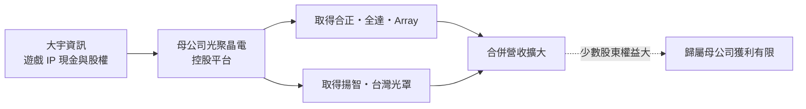
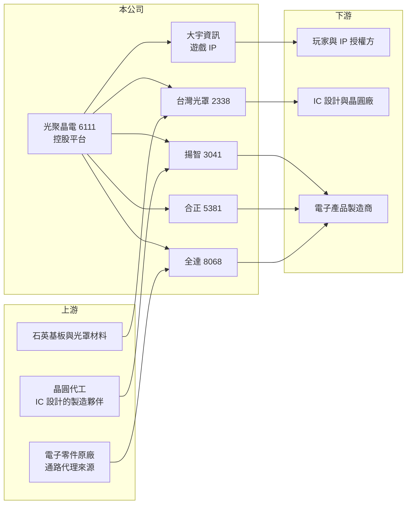

# 6111 光聚晶電

> 上櫃｜[[產業索引-文化創意業|文化創意業]]｜上市（櫃）日期 2026/03/12

# 第一章：企業模式與商業藍圖

> [!info] 撰寫說明
> 精簡版，由 Claude 依公開資料整理，架構比照 [[2330台積電]] 的四章研究，資料截至 2026-10-08。來源：Goodinfo 基本資料（含重要子公司）與年度經營績效頁、櫃買中心開放資料（2026 年第二季綜合損益與資產負債、基本資料、每月營收、本益比殖利率）、科技新報與優分析等財經媒體標題。各子公司營收比重未查得，產業描述為整理性內容。#待校對

光聚晶電聯合（股票代號：6111，英文 Star Fusion Group，以下簡稱光聚晶電）的前身是以《仙劍奇俠傳》《軒轅劍》聞名的遊戲公司大宇資訊。本章說明它如何從單一遊戲公司，透過一連串併購轉型為橫跨遊戲與半導體電子的控股集團。

## 一、核心定位：由遊戲公司轉為多角化控股集團

依 Goodinfo 基本資料，公司成立於 1998 年，2001 年上櫃，董事長為凃俊光，總經理為陳瑤恬，資本額約 10.85 億元。登記的主要業務仍是「遊戲軟體研發、代理及銷售，線上遊戲經營服務及授權」，櫃買中心的產業分類也仍是文化創意業，但合併營收的主體已經轉為電子與半導體子公司。

依科技新報 2025 年 11 月與 12 月的報導標題，大宇資在 2025 年宣布把母公司更名為「光聚晶電聯合」，並把「大宇資訊」完整保留成子公司、專注遊戲事業；2025 年 12 月 23 日股東臨時會通過更名，董事長凃俊光提出 2026 年營收挑戰百億元的目標。

## 二、事業板塊：遊戲加四類電子事業

依 Goodinfo 列出的重要子公司（括號內為登錄年份），集團由以下事業組成：

* **遊戲：** 大宇資訊擁有《仙劍奇俠傳》《軒轅劍》《大富翁》等經典[[遊戲IP]]，以自製、授權與合作開發獲利。遊戲 IP 授權的毛利率高，但營收規模已經遠小於電子事業。
* **[[PCB]]：** [[5381合正]]（2022），從事電子零件製造、壓合、加工與研發。
* **電子通路：** [[8068全達]]（2023），經營電子零件代理與通路。
* **網路安全：** Array Inc.（2023），研發網路連線安全與流量加速系統。
* **半導體：** [[3041揚智]]（2025），從事晶片設計；[[2338光罩]]（2025），從事[[光罩]]的研究、製造與銷售。

依櫃買中心 2026 年 8 月月營收公告，累計營收年增約 115%，公司說明主要是「新增子公司光罩營收」。

## 三、資本轉化邏輯：以小控大的併購模式

光聚晶電的併購有一個明顯特徵：母公司持有子公司的股權比例不高，但取得實質控制權而合併其營收。依櫃買中心資料，2026 年第二季底權益總計約 103.35 億元，其中歸屬母公司業主的權益只有約 18.28 億元，其餘約 85 億元屬於[[非控制權益]]。這代表集團營收看起來很大，但真正歸屬光聚晶電股東的獲利與淨值只是一小部分。

## 四、企業長期藍圖

集團的長期方向是把遊戲 IP、晶片設計、光罩、PCB 與電子通路整合成一個橫跨內容與硬體的集團，並以更名宣示重心轉向半導體電子。這種多角化策略能否成功，取決於各子公司能否在集團內產生實際的合作效益（例如通路幫晶片找客戶、光罩服務 IC 設計），而不只是財務上的合併。科技新報 2026 年 3 月另有一篇以「策略藍圖」為題的報導，具體內容未查得。

# 第二章：護城河深度與競爭優勢

在長期價值投資中，「護城河」指企業抵禦競爭、維持超額利潤的保護機制。光聚晶電是多個事業的集合，本章分別評估各事業的競爭位置，以及集團整體的優勢與弱點。

## 一、各事業的護城河

* **1. 遊戲 IP：** 《仙劍奇俠傳》系列在華語市場有數十年的品牌累積，可以授權改編成影視、手機遊戲與周邊，這是集團最具獨特性的資產。但 IP 的價值要靠持續推出新作維持，近年大宇的新作頻率與市場反應是關鍵。
* **2. 光罩：** 光罩是晶圓製造每一層電路都必須使用的關鍵耗材，客戶導入後不易更換供應商，具有轉換成本。台灣光罩是國內歷史悠久的光罩廠，在成熟製程客戶中有一定基礎。
* **3. IC 設計、PCB 與電子通路：** 揚智、合正與全達各自面對激烈競爭，規模不大，較難稱得上具備護城河。

## 二、主要競爭對手格局

| 事業 | 主要對手 | 競爭情況 |
|---|---|---|
| 遊戲 | [[3293鈊象]]、[[5478智冠]]、[[3546宇峻]]、中國大型遊戲公司 | 中國遊戲公司資源遠大於台灣廠商 |
| 光罩 | 晶圓廠自有光罩廠、Photronics、日本 DNP 與 Toppan | 先進製程光罩多由晶圓廠自製或國際大廠供應 |
| IC 設計 | 聯發科、瑞昱等大型 IC 設計公司與中國同業 | 揚智規模小，需在利基市場求生 |
| PCB | 國內眾多 PCB 廠 | 產業成熟、價格競爭激烈 |

## 三、優勢轉化：哪些守得住、哪些守不住

* **守得住：** 經典遊戲 IP 的長期授權價值，以及光罩事業的客戶黏著度。
* **守不住：** 集團整體獲利。2022 至 2025 年營收從約 22.5 億元成長到約 74.6 億元，但營業利益率連續四年為負，2025 年 EPS 為 -4.63 元，規模擴大沒有轉化成獲利。
* **觀察重點：** 第一，併入光罩後能否轉為穩定獲利（優分析標題指出 2026 年第二季轉盈、EPS 0.58 元）；第二，非控制權益占比是否因增持股權而下降；第三，集團內部是否出現實際的業務合作。

# 第三章：財務體質與盈利規模

資料日期：2026-10-08，表格是撰寫當時的快照；最新月營收、毛利率、累計 EPS 由自動排程寫在本筆記的屬性欄位（月營收、毛利率、累計EPS 等）。#待校對

財務報表是檢驗護城河是否真實存在的最終標準。光聚晶電的財務數字因為連續併購而每年口徑不同，閱讀時要特別注意。

## 一、多年度經營績效

| 年度 | 營收（新台幣） | [[毛利率]] | [[營業利益率]] | EPS（元） | [[ROE]] |
|---|---|---|---|---|---|
| 2019 | 5.66 億 | 83.9% | -38.5% | 6.77 | 50.1% |
| 2020 | 5.45 億 | 83.5% | 25.3% | 0.91 | 6.72% |
| 2021 | 5.59 億 | 70.3% | 2.29% | 11.32 | 48.7% |
| 2022 | 22.5 億 | 39.6% | -5.67% | 7.41 | 20.3% |
| 2023 | 32.6 億 | 33.3% | -8.8% | -3.39 | -12.1% |
| 2024 | 51.0 億 | 34.5% | -2.71% | 0.77 | 7.07% |
| 2025 | 74.6 億 | 24.0% | -13.2% | -4.63 | -23.1% |
| 2026 上半年 | 61.57 億 | 27.6% | -2.4% | 0.39 | 不適用（半年） |

資料來源：2019 至 2025 年為 Goodinfo 年度經營績效，2026 上半年為櫃買中心開放資料。

* **三個階段：** 2021 年以前是純遊戲公司，毛利率 70% 至 84%；2022 年起併入合正，毛利率降到 40% 以下；2025 年起併入揚智與光罩，營收再跳升。
* **業外主導獲利：** 2019、2021 與 2022 年營業利益率很低甚至為負，EPS 卻很高，代表獲利主要來自處分投資等業外收益（推估）。2026 年上半年營業虧損約 1.47 億元，但營業外收入約 2.71 億元，稅前仍為正。
* **長期指標：** 2021 至 2025 年平均 ROE 約 8.2%（推算），但波動極大且多來自業外；2020 至 2025 年營收年複合成長率約 69%（推算），全部來自併購。

## 二、資產負債與股利

依櫃買中心資料，2026 年第二季底總資產約 312.57 億元、負債約 209.22 億元，負債比約 67%，其中流動負債約 132.76 億元、非流動負債約 76.46 億元。與遊戲公司時期幾乎無負債相比，財務結構已經完全不同。最近一次現金股利為 0 元（櫃買中心資料），Goodinfo 統計歷年平均現金股利約 0.18 元。

## 三、[[ROIC]] 與 [[WACC]]

**ROIC 推算：** 2025 年營業虧損約 9.85 億元（74.6 億元 × -13.2%），2021 至 2025 年營業利益合計為負，ROIC 為負值（推算）。投入資本以權益總計約 103.35 億元，加上假設有息負債約占總負債一半、約 105 億元（推估，細項未查得），合計約 208 億元，2025 年 ROIC 約 -3.8%（推算）。

**WACC 推算：** 假設台灣 10 年期公債殖利率 1.75%、市場風險溢酬 6%，β 因業務含半導體取 1.2（假設），權益成本約 8.95%；負債成本假設 2.5%，稅後 2.0%，以權益與負債約各半計算，WACC 約 5.5%（推算）。

**結論：** 目前集團本業的 ROIC 低於 WACC，併購帶來的是營收規模而不是價值創造。未來若光罩與 IC 設計事業能轉為穩定獲利，ROIC 才可能回到資金成本以上。

# 第四章：總體風險與地緣政治

任何企業都無法脫離宏觀環境獨立存在。本章分析光聚晶電長期必須面對的產業、整合與財務風險。

## 一、產業週期

* **半導體與電子週期：** 併入光罩、揚智、合正與全達後，集團營收主要受半導體與消費電子景氣影響，庫存調整時各事業可能同時受衝擊。
* **遊戲市場：** 遊戲產品成敗難以預測，經典 IP 的新作若市場反應不佳，IP 價值會逐漸下降。

## 二、營運與整合風險

* **併購整合：** 短時間內併入多家不同產業的公司，管理、文化與資訊系統的整合難度很高，綜效是否實現仍待觀察。
* **非控制權益比重高：** 歸屬母公司權益只占權益總計約 18%，集團營收與獲利大部分屬於子公司其他股東，母公司股東的實際受益有限。
* **財務槓桿：** 負債比約 67%，景氣下行時利息與償債壓力會上升。

## 三、其他風險

* **地緣政治與出口管制：** 光罩與 IC 設計事業受美中科技管制、供應鏈重組影響。
* **治理與資訊揭露：** 頻繁的併購與更名，讓投資人較難追蹤各事業的真實獲利，需留意關係人交易與資訊透明度。

# 專有名詞解析

## 半導體

- **[[光罩]]**：刻有電路圖形的石英玻璃板，晶圓廠在微影製程中用它把電路投影到晶圓上，每一層電路需要一片。

## 金融

- **[[非控制權益]]**：子公司權益中不屬於母公司的部分，比例越高，合併營收中真正歸屬母公司股東的利益越少。
- **[[ROIC]]**：投入資本報酬率，稅後營業利益除以股東權益與有息負債的合計，衡量本業對所有資金提供者的報酬。
- **[[WACC]]**：加權平均資金成本，依股東權益與負債的比重加權計算的資金成本，ROIC 高於它才代表創造價值。

## 產業

- **[[遊戲IP]]**：遊戲的智慧財產，包括角色、世界觀與名稱，可改編成續作、手機遊戲或授權給其他廠商使用。
- **[[PCB]]**：印刷電路板，承載並連接電子零件的基板，幾乎所有電子產品都需要。

# 核心供應鏈

## 1. 集團子公司
- 遊戲：大宇資訊（仙劍奇俠傳、軒轅劍、大富翁）
- 半導體：[[2338光罩]]、[[3041揚智]]
- PCB：[[5381合正]]
- 電子通路：[[8068全達]]
- 網路安全：Array Inc.

## 2. 下游
- 遊戲玩家、IP 授權合作方
- IC 設計公司與晶圓廠（光罩客戶）
- 電子產品製造商

## 3. 同業
- 遊戲：[[3293鈊象]]、[[5478智冠]]、[[3546宇峻]]
- 光罩：Photronics、日本 DNP、Toppan

## 最新新聞
<!-- news:start -->
<!-- news:end -->

## 相關連結
- [公開資訊觀測站](https://mopsov.twse.com.tw/mops/web/t05st03?step=1&firstin=1&co_id=6111)
- [Goodinfo](https://goodinfo.tw/tw/StockDetail.asp?STOCK_ID=6111)
- [Yahoo 股市](https://tw.stock.yahoo.com/quote/6111)
- [鉅亨網新聞](https://www.cnyes.com/twstock/6111/news)
