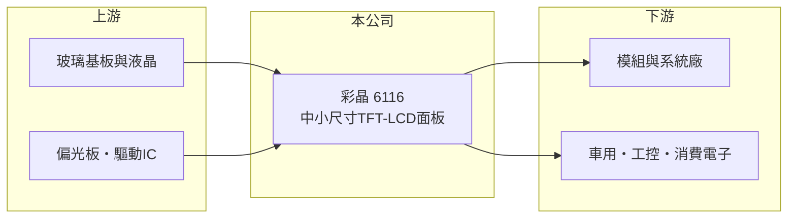

# 6116 彩晶

> 上市｜[[產業索引-光電業|光電業]]｜上市（櫃）日期 2004/09/06

# 第一章：企業模式與商業藍圖

> [!info] 撰寫說明
> 精簡版，由 Claude 依公開資料整理，架構比照 [[2330台積電]]，資料截至 2026-10-07。來源：nstock.tw 彩晶公司概況。各產品營收比重本次未查到。#待校對

彩晶是中小尺寸 TFT-LCD 面板廠，本業處於虧損，靠業外維持小幅獲利。

- **核心業務：** 彩晶製造與銷售[[TFT-LCD]]面板、平面顯示器及監視器與相關零組件。
- **營收結構：** 本次未查到各應用比重；產品以車用、工控、消費性等中小尺寸面板為主（推估）。
- **營運據點：** 生產據點位於台灣（推估），細節本次未查到。
- **長期方向：** 面板主業競爭激烈，公司持續調整產品組合，並透過轉投資與資產運用挹注獲利（推估）。

# 第二章：護城河深度與競爭優勢

彩晶在面板產業規模較小，護城河有限。

- **競爭優勢：** 專注中小尺寸利基面板，型號多、客製需求高，能避開大尺寸的價格戰（推估）。
- **主要對手：** [[3481群創]]、[[2409友達]]，以及中國大陸面板廠。
- **觀察重點：** 第二季毛利率為負，需觀察面板報價與稼動率能否讓毛利率回到正數。

# 第三章：財務體質與盈利規模

資料日期：2026-10-07，以下數字是撰寫當時的快照；最新月營收、毛利率、累計 EPS 由自動排程寫在本筆記的屬性欄位（月營收、毛利率、累計EPS 等）。#待校對

彩晶本業虧損，2026 年第二季靠業外勉強獲利。

- **營收規模：** 2025 年全年營收 114.37 億元；2026 年 1 至 8 月累計 78.91 億元，年增 2.93%；8 月營收 9.34 億元，年增 8%。
- **獲利：** 2025 年全年 EPS -0.75 元；2026 年第二季 EPS 0.04 元，[[毛利率]] -5.55%，[[營業利益率]] -19.44%，淨利率 4.46%，代表獲利來自[[業外收益]]。
- **財務特色：** 資本額約 285.87 億元，市值約 442 億元；股本大，獲利攤薄後 EPS 偏低，近五年平均現金股利 0.2 元。

# 第四章：總體風險與地緣政治

彩晶的風險集中在面板景氣與本業虧損。

- **產業週期：** 面板產業供需循環明顯，中國大陸新產能開出時報價容易下跌。
- **營運風險：** 毛利率為負代表售價不足以支應生產成本，若業外收益減少，將直接反映為虧損。
- **其他風險：** 匯率、關稅與地緣政治，以及中國大陸同業的價格競爭。

# 專有名詞解析

## 金融

- **[[業外收益]]**：本業以外的收入，例如投資、處分資產或匯兌利益，持續性通常較低。
- **[[營業利益率]]**：營業利益占營收的比例，反映本業扣除營運費用後的獲利能力。

## 產業

- **[[TFT-LCD]]**：以薄膜電晶體驅動液晶的顯示面板，是筆電、車用與工控顯示的主流技術。

# 核心供應鏈

- 上游：玻璃基板、液晶、偏光板、彩色濾光片與驅動IC供應商
- 下游／客戶：顯示模組廠、車用、工控與消費性電子品牌（推估）
- 同業：[[3481群創]]、[[2409友達]]、中國大陸面板廠

## 最新新聞
<!-- news:start -->
<!-- news:end -->

## 相關連結
- [公開資訊觀測站](https://mopsov.twse.com.tw/mops/web/t05st03?step=1&firstin=1&co_id=6116)
- [Goodinfo](https://goodinfo.tw/tw/StockDetail.asp?STOCK_ID=6116)
- [Yahoo 股市](https://tw.stock.yahoo.com/quote/6116)
- [鉅亨網新聞](https://www.cnyes.com/twstock/6116/news)
