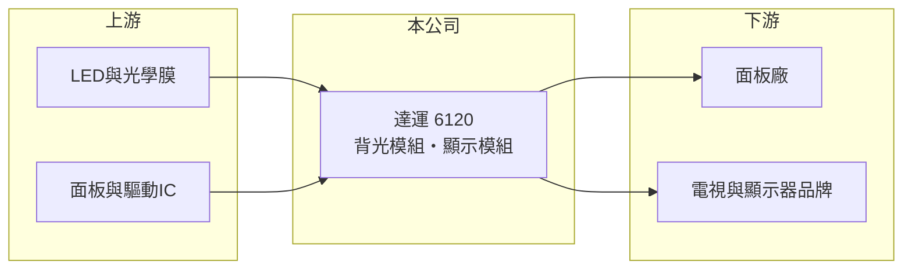

# 6120 達運

> 上市｜[[產業索引-光電業|光電業]]｜上市（櫃）日期 2006/09/13

# 第一章：企業模式與商業藍圖

> [!info] 撰寫說明
> 精簡版，由 Claude 依公開資料整理，架構比照 [[2330台積電]]，資料截至 2026-10-07。來源：nstock.tw 達運公司概況。各產品營收比重與客戶本次未查到。#待校對

達運是背光模組與液晶顯示模組廠，2026 年第二季本業仍虧損，但業外帶動獲利。

- **核心業務：** 達運生產液晶顯示器模組、[[背光模組]]、液晶電視及相關零組件。
- **營收結構：** 本次未查到各產品比重。
- **營運據點：** 總部位於新竹湖口，子公司蘇州輔宇光電位於中國大陸。
- **長期方向：** 面板相關本業成長有限，公司嘗試發展其他事業以降低對背光模組的依賴（推估）。

# 第二章：護城河深度與競爭優勢

達運的優勢在於集團供應鏈關係與大量生產經驗。

- **競爭優勢：** 屬於 [[2409友達]] 集團（推估），與面板廠合作關係緊密，背光與模組量產經驗豐富。
- **主要對手：** [[5371中光電]] 等背光模組廠，以及中國大陸背光與模組廠。
- **觀察重點：** 第二季毛利率僅 4.06%，需觀察本業能否回到正的營業利益。

# 第三章：財務體質與盈利規模

資料日期：2026-10-07，以下數字是撰寫當時的快照；最新月營收、毛利率、累計 EPS 由自動排程寫在本筆記的屬性欄位（月營收、毛利率、累計EPS 等）。#待校對

達運營收小幅衰退，本業微利不足，第二季獲利主要來自業外。

- **營收規模：** 2025 年全年營收 171.06 億元；2026 年 1 至 8 月累計 110.95 億元，年減 4.69%；8 月營收 13.38 億元，年減 3.09%。
- **獲利：** 2025 年全年 EPS -0.19 元；2026 年第二季 EPS 1.57 元，[[毛利率]] 4.06%，[[營業利益率]] -5%，淨利率 22.34%，代表有大額[[業外收益]]。
- **財務特色：** 資本額約 59.9 億元，市值約 91 億元；2025 年配發現金股利 0.25 元。

# 第四章：總體風險與地緣政治

達運的風險在於本業毛利過低與業外收益不可持續。

- **產業週期：** 背光與顯示模組需求跟著面板、電視與筆電出貨循環。
- **營運風險：** 毛利率僅個位數，價格或成本小幅變動就會造成本業虧損；第二季的業外收益若屬一次性，後續 EPS 可能大幅回落。
- **其他風險：** 中國大陸據點的地緣政治與關稅風險、人民幣匯率與原物料價格。

# 專有名詞解析

## 金融

- **[[業外收益]]**：本業以外的收入，例如投資、處分資產或匯兌利益，持續性通常較低。
- **[[營業利益率]]**：營業利益占營收的比例，反映本業扣除營運費用後的獲利能力。

## 產業

- **[[背光模組]]**：液晶面板背後的光源組件，包含光源、導光板與光學膜，決定亮度與均勻度。

# 核心供應鏈

- 上游：LED、光學膜、導光板、面板與驅動IC供應商
- 下游／客戶：[[2409友達]] 等面板廠、電視與顯示器品牌（推估）
- 同業：[[5371中光電]]、中國大陸背光與模組廠

## 最新新聞
<!-- news:start -->
<!-- news:end -->

## 相關連結
- [公開資訊觀測站](https://mopsov.twse.com.tw/mops/web/t05st03?step=1&firstin=1&co_id=6120)
- [Goodinfo](https://goodinfo.tw/tw/StockDetail.asp?STOCK_ID=6120)
- [Yahoo 股市](https://tw.stock.yahoo.com/quote/6120)
- [鉅亨網新聞](https://www.cnyes.com/twstock/6120/news)
