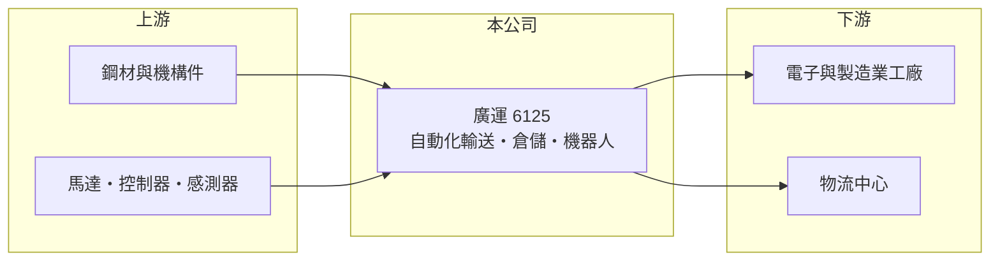

# 6125 廣運

> 上櫃｜[[產業索引-光電業|光電業]]｜上市（櫃）日期 2002/01/23

# 第一章：企業模式與商業藍圖

> [!info] 撰寫說明
> 精簡版，由 Claude 依公開資料整理，架構比照 [[2330台積電]]，資料截至 2026-10-07。來源：nstock.tw 廣運公司概況。各產品營收比重與客戶本次未查到。#待校對

廣運是自動化輸送、倉儲與機器人設備的系統整合商。

- **核心業務：** 廣運設計加工製造工業機械與鋼鐵角架，並提供聯製生產線、應用機器人、自動輸送機、[[自動倉儲]]、[[AMR]]（無人搬運車）與機械手臂等設備。
- **營收結構：** 本次未查到各產品比重；營收以自動化設備專案為主（推估）。
- **營運據點：** 營運據點本次未查到。
- **長期方向：** 隨工廠與物流中心自動化需求，擴大機器人與智慧倉儲整合業務（推估）。

# 第二章：護城河深度與競爭優勢

廣運的競爭力在於自動化系統的整合經驗。

- **競爭優勢：** 可從輸送、倉儲到機器人提供整線規劃，客戶產線導入後較少更換整合商（推估）。
- **主要對手：** 國內外自動化設備與物流系統整合商，nstock 列出東元、大同、士電等同產業公司。
- **觀察重點：** 2026 年營收成長能否轉化為獲利，以及第二季營業虧損是否改善。

# 第三章：財務體質與盈利規模

資料日期：2026-10-07，以下數字是撰寫當時的快照；最新月營收、毛利率、累計 EPS 由自動排程寫在本筆記的屬性欄位（月營收、毛利率、累計EPS 等）。#待校對

廣運 2026 年營收明顯成長，但本業仍未轉為獲利。

- **營收規模：** 2025 年全年營收 33.36 億元；2026 年 1 至 8 月累計 25.63 億元，年增 26.94%；8 月營收 3.39 億元，年減 1.49%。
- **獲利：** 2025 年全年 EPS 0.1 元；2026 年第二季 EPS -0.01 元，上半年累計 0.15 元；第二季[[毛利率]] 20.66%，[[營業利益率]] -9.96%。
- **財務特色：** 資本額約 25.9 億元，市值約 130 億元；2025 年配發現金股利 0.5 元，近五年平均 1.23 元。

# 第四章：總體風險與地緣政治

廣運的風險在於專案型營收與費用偏高。

- **產業週期：** 自動化設備需求跟著製造業與物流業的資本支出循環。
- **營運風險：** 專案認列時點與成本控制影響大，營業費用偏高時本業容易虧損。
- **其他風險：** 鋼材等原物料價格、匯率，以及海外專案的地緣政治風險。

# 專有名詞解析

## 金融

- **[[營業利益率]]**：營業利益占營收的比例，反映本業扣除營運費用後的獲利能力。

## 產業

- **[[自動倉儲]]**：以電腦控制的立體貨架與搬運設備自動存取貨物，節省人力與空間。
- **[[AMR]]**：自主移動機器人，可自行規劃路徑在工廠或倉庫搬運物料。

# 核心供應鏈

- 上游：鋼材、機構件、馬達、控制器與感測器供應商
- 下游／客戶：電子與製造業工廠、物流中心（推估）
- 同業：國內外自動化與物流系統整合商

## 最新新聞
<!-- news:start -->
<!-- news:end -->

## 相關連結
- [公開資訊觀測站](https://mopsov.twse.com.tw/mops/web/t05st03?step=1&firstin=1&co_id=6125)
- [Goodinfo](https://goodinfo.tw/tw/StockDetail.asp?STOCK_ID=6125)
- [Yahoo 股市](https://tw.stock.yahoo.com/quote/6125)
- [鉅亨網新聞](https://www.cnyes.com/twstock/6125/news)
