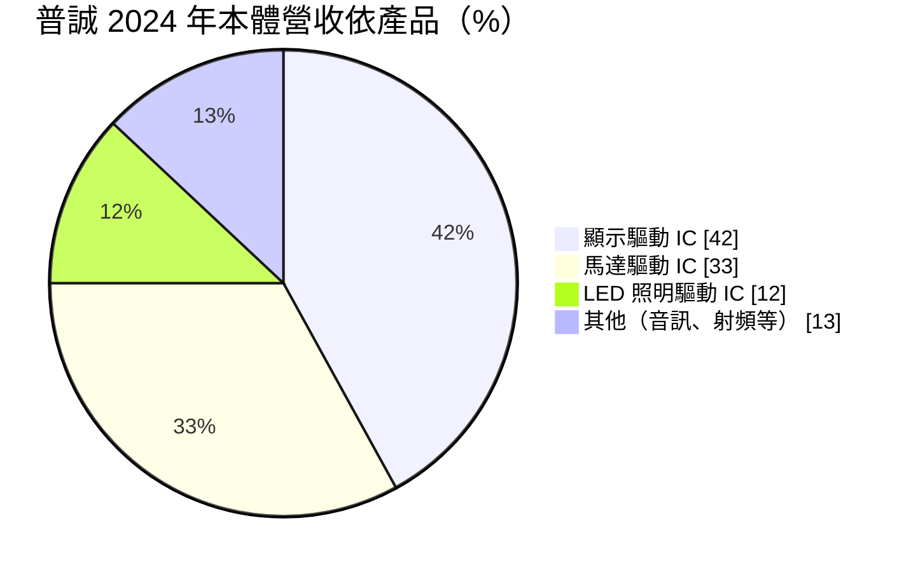
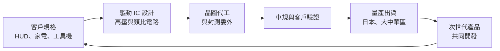
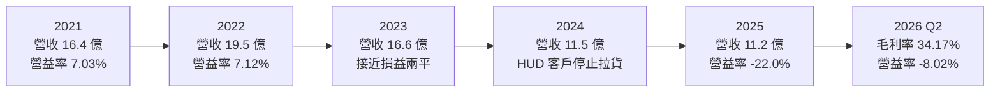
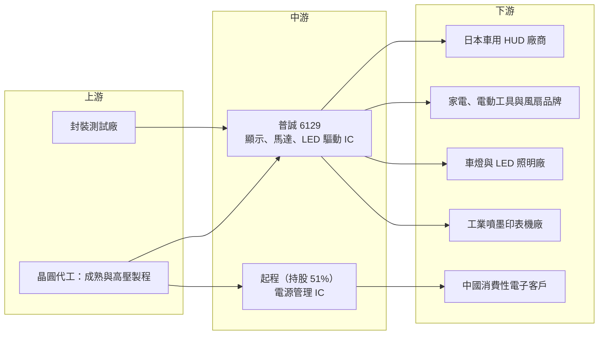

# 6129 普誠

> 上櫃｜[[產業索引-半導體業|半導體業]]｜上市（櫃）日期 2001/12/25

# 第一章：企業模式與商業藍圖

> [!info] 撰寫說明
> 本文由 Claude 依公開資料整理，架構比照 [[2330台積電]] 的四章研究，資料截至 2026-10-08。財務數字來源：Goodinfo 台灣股市資訊網年度經營績效、股利政策與基本資料頁、富邦 MoneyDJ 個股基本資料（2025 年營收比重、2026 年第二季財務比率、β 值）、富果研究 2025 年 4 月法說會整理（2024 年產品與地區結構、子公司起程）；產業描述為整理性內容，尚未逐條比對原始文件。#待校對

在評估單一個股的長期投資價值時，首要步驟是拆解企業的底層獲利邏輯。本章針對普誠科技股份有限公司（股票代號：6129，以下簡稱普誠）的商業模式進行定性分析。普誠是一家老牌的消費性與利基型 IC 設計公司，產品橫跨顯示驅動、馬達驅動與 LED 照明驅動，近年最受矚目的應用是日本車廠抬頭顯示器（HUD）使用的顯示驅動晶片。也正因為對單一應用與單一客戶的依賴，普誠在 2024 至 2025 年經歷了明顯的營收衰退與虧損。

## 一、核心定位：多產品線的利基型類比與驅動 IC 設計公司

普誠成立於 1986 年 5 月，2001 年 12 月在櫃買中心掛牌，總部位於新北市新店區，董事長為姜長安，總經理為李國維，股本約 16.06 億元。依富邦 MoneyDJ，2025 年積體電路占營收 99.48%，屬於純 [[Fabless]] IC 設計公司：普誠負責設計與銷售，晶圓製造與封裝測試委外。

普誠的產品不追求先進製程，而是集中在需要高壓或類比電路設計能力的驅動晶片。這類晶片負責「推動」面板、馬達或 LED，必須承受較高電壓與電流，設計重點在穩定性與可靠度。這種利基讓普誠能避開與大型 IC 設計公司在數位晶片上的正面競爭，但也意味著每一條產品線的市場規模都不大。

普誠另持有子公司起程 51% 股權，起程專注[[電源管理IC]]，產品全數銷往中國市場（部分終端產品再外銷），2024 年營收 3.76 億元、年增 19%（富果法說整理）。起程的存在讓普誠的合併營收有一部分直接連動中國消費性電子需求。

## 二、終端應用與產品板塊

依富果整理的 2025 年 4 月法說會資料，2024 年普誠本體（不含起程）的營收結構如下：

* **顯示驅動 IC（[[DDI]]，42%）：** 包含 TFT LCD、一般 LCD 驅動與噴墨印字頭驅動 IC，以及部分 LED IC。其中最重要的是車用 [[HUD]] 抬頭顯示器的 TFT 顯示驅動 IC，主要客戶為日本 HUD 廠商。噴墨印字頭驅動 IC 已量產出貨給工業用印表機，民生用產品則在認證中。
* **[[馬達驅動IC]]（33%）：** 主要用於消費性產品，例如園林工具、風扇、智能馬桶與白色家電，車用比重少量。電動工具與家電的變頻化、無刷化，是馬達驅動晶片的長期需求來源。
* **LED 照明驅動 IC（12%）：** 包含車載 LED 照明，並由車外照明擴展到車內氛圍燈。
* **其他（13%）：** 音訊 IC、射頻 IC 等。

地區方面，日本市場占比由 66% 降到 27%，大中華區占 59%，其他地區（台灣、東南亞、歐洲）占 14%；普誠並未直接銷售到美國。

## 三、資本轉化邏輯：Fabless 驅動晶片與車用認證

普誠的獲利模式是「先投入研發與驗證，再靠長生命週期產品回收」。車用 HUD 驅動晶片需要經過長時間的[[車規驗證]]，一旦導入某款車型，通常可以持續出貨數年；家電與電動工具的馬達驅動晶片生命週期也相對長。這種模式的優點是客戶黏著度高，缺點是單一大客戶的庫存調整會直接衝擊營收。

普誠對存貨採取保守的跌價政策：IC 九個月、晶片六個月無異動即全數認列[[存貨跌價損失]]。這使得營收下滑時，存貨損失會提早反映在毛利率上，財報看起來會比實際營運更差，但也代表帳上存貨的品質較有保障。

## 四、企業長期藍圖

依 2025 年法說會，普誠的長期方向包括：

* **車用產品深化：** 與客戶共同開發下一代 HUD 產品，並擴大車載 LED 與整合型馬達驅動 IC。車用是普誠少數具備認證門檻的市場，也是長期成長的主要來源。
* **推出 [[MCU]] 與整合方案：** 規劃 MCU 產品線，並開發整合 IC、MCU 與 [[LIN／CAN bus]] 通訊介面的 [[MCP]] 方案，目標是提高單一方案的售價與競爭門檻。從「賣單顆驅動晶片」走向「賣整合控制方案」，是小型 IC 設計公司提升附加價值的常見路線。
* **降低單一客戶依賴：** 2024 年日本 HUD 客戶的庫存調整暴露了集中度風險，公司以擴大家電、工業與車載 LED 等應用分散風險。

# 第二章：護城河深度與競爭優勢

本章分析普誠的護城河構成、全球主要競爭對手，以及這些優勢能否擋住大型類比晶片廠與中國同業。

## 一、護城河的核心組成要素

普誠屬於「窄護城河」企業，優勢集中在特定利基：

* **1. 車用 HUD 驅動晶片的認證地位：** 日本 HUD 廠商對供應商的品質要求極高，普誠能長期供應，代表通過了嚴格的車規與品質管理審核。這類關係建立不易，競爭者短期內難以取代。
* **2. 高壓與類比驅動電路的設計經驗：** 顯示驅動、馬達驅動與 LED 驅動都需要處理高電壓與大電流，類比電路設計的經驗累積需要時間，是普誠多年經營的技術基礎。
* **3. 多元的利基產品組合：** 從噴墨印字頭驅動到智能馬桶馬達驅動，普誠在許多小型市場都有產品。單一市場雖小，但組合起來能分散部分景氣風險。

## 二、全球主要競爭對手格局

| 對手 | 定位 | 對普誠的威脅 |
|---|---|---|
| Rohm、東芝、德州儀器 | 日美大型類比與驅動晶片廠 | 在車用與馬達驅動晶片有品牌與完整產品線優勢 |
| [[3034聯詠]]、[[4961天鈺]]、奇景光電 | 台灣顯示驅動 IC 大廠 | 在車用顯示驅動有規模優勢，可能切入 HUD 領域 |
| [[6138茂達]]、[[8081致新]] | 台灣電源管理與馬達驅動 IC 公司 | 在馬達驅動與電源管理直接競爭 |
| [[3588通嘉]] | 台灣 LED 驅動與電源 IC 公司 | 在 LED 照明驅動重疊 |
| 中國類比與電源管理 IC 廠 | 政策扶植、價格低 | 壓低消費性馬達與電源管理晶片價格，影響起程 |

## 三、優勢轉化：守得住、守不住與觀察重點

* **守得住：** 已導入日本車廠 HUD 的顯示驅動晶片，以及需要客製化的工業噴墨與車載 LED 應用。這些市場驗證門檻高、客戶不常更換供應商。
* **守不住：** 消費性馬達驅動與一般 LED 照明驅動。這些產品面臨中國同業的強烈價格競爭，毛利率由 2021 年的 38.8% 降到 2024 年的 29.8%，部分反映了這種壓力。
* **觀察重點：** 第一，日本 HUD 客戶拉貨是否全面恢復（公司預估全面恢復可能要到 2026 年後）；第二，MCU 與 MCP 整合方案能否量產並帶來新客戶；第三，起程在中國電源管理市場能否維持成長並貢獻獲利。

# 第三章：財務體質與盈利規模

資料日期：2026-10-08。數字取自 Goodinfo 年度經營績效與股利政策頁、富邦 MoneyDJ 個股基本資料、富果研究法說會整理，表格是撰寫當時的快照；最新月營收、毛利率、累計 EPS 由自動排程寫在本筆記的屬性欄位（月營收、毛利率、累計EPS 等）。#待校對

財務報表是檢驗護城河是否真實存在的最終標準。本章用十年的三率、[[ROE]]、股利與資本報酬，檢視普誠在疫情高峰與客戶庫存調整之間的獲利品質。

## 一、獲利能力的基石：三率

| 年度 | 營收（新台幣） | [[毛利率]] | [[營業利益率]] | EPS（元） | [[ROE]] |
|---|---|---|---|---|---|
| 2016 | 12.9 億 | 38.0% | -3.00% | 0.01 | 0.13% |
| 2017 | 11.1 億 | 38.9% | -4.82% | -0.24 | -2.20% |
| 2018 | 9.12 億 | 37.4% | -9.84% | -0.51 | -4.69% |
| 2019 | 11.1 億 | 36.6% | -6.08% | -0.20 | -1.73% |
| 2020 | 11.0 億 | 34.4% | -5.16% | -0.42 | -3.12% |
| 2021 | 16.4 億 | 38.8% | 7.03% | 0.63 | 8.27% |
| 2022 | 19.5 億 | 35.6% | 7.12% | 0.93 | 7.98% |
| 2023 | 16.6 億 | 33.8% | -0.02% | 0.33 | 2.68% |
| 2024 | 11.5 億 | 29.8% | -22.6% | -1.00 | -7.97% |
| 2025 | 11.2 億 | 32.4% | -22.0% | -1.09 | -10.1% |

這張表顯示普誠十年中只有 2021 與 2022 兩年本業明顯獲利。2016 至 2020 年營收在 9 億至 13 億元之間，毛利率雖有 34% 至 39%，但營業利益率持續為負，代表研發與管理費用高於毛利。2021 至 2022 年受惠於疫情後的晶片短缺、車用 HUD 出貨增加，營收跳升到 19.5 億元，營業利益率轉正到 7% 左右。

2024 年日本 HUD 客戶自第二季起暫停拉貨，普誠本體營收年減 43% 至 7.7 億元，合併營收降到 11.5 億元，營業利益率惡化到 -22.6%；2025 年營收持平，仍大幅虧損。2026 年第二季單季毛利率回升到 34.17%、營業利益率改善到 -8.02%（富邦 MoneyDJ），虧損有收斂跡象。2016 至 2025 年營收年複合成長率約 -1.6%（推算）。

* **[[毛利率]]：** 長期在 30% 至 39% 之間，屬於 IC 設計業偏低的水準，反映驅動晶片市場的價格競爭與保守的存貨跌價政策。
* **[[營業利益率]]：** 對營收規模極度敏感。以普誠的費用結構，營收大約要維持在 16 億元以上才能損益兩平（推估，依 2021 至 2023 年數字判斷），這是典型的[[營運槓桿]]。

## 二、[[ROE]]：資本效率

2021 至 2025 年平均 ROE 約 0.2%（推算），十年平均約 -1.1%（推算）。普誠十年中僅 2021、2022 年 ROE 接近 8%，其餘年度多為負值或接近零，長期沒有為股東創造足夠報酬。2024 年合併權益中歸屬母公司的部分約 18.66 億元，2026 年第二季每股淨值約 9.10 元（富邦 MoneyDJ），已低於 10 元面額，反映連續虧損對淨值的侵蝕。

## 三、資本支出與自由現金流

普誠屬輕資產 Fabless 公司，資本支出很低，具體金額未查得。2024 年合併資產 23.6 億元、負債 3.03 億元，負債比例約 13%，2026 年第二季約 24%（富邦 MoneyDJ），財務結構仍保守。營收下滑時存貨周轉天數偏高，營業現金流承壓，[[自由現金流]]在 2024 至 2025 年推估為負（推估）。

股利方面，依 Goodinfo，普誠 2016 至 2025 年度只有 2022 年度配發 0.65 元、2023 年度配發 0.25 元現金股利，其餘年度均未配息。以 EPS 計算，兩年配息率約為 70% 與 76%（推算）。普誠不屬於穩定配息的公司，股利完全取決於當年能否獲利。

## 四、[[ROIC]] 與 [[WACC]]：價值創造利差

**ROIC 推算：** 2025 年營業虧損約 2.46 億元（11.2 億 × -22.0%），以稅後淨損 1.98 億元與 ROE -10.1% 回推含非控制權益的平均權益約 19.6 億元，有息負債假設不重大，ROIC 約 -12.6%（推算）。對照 2022 年，營業利益約 1.39 億元（19.5 億 × 7.12%），稅後約 1.11 億元，以淨利 1.68 億元與 ROE 7.98% 回推權益約 21 億元，ROIC 約 5.3%（推算）。

**WACC 推算：** 權益成本以 CAPM 估計，假設台灣 10 年期公債殖利率 1.75%、市場風險溢酬 6%、β 取富邦 MoneyDJ 所列 0.90，權益成本約 7.15%。有息負債不重大，WACC 約 7.15%（推算）。

**結論：** 即使在 2022 年的獲利高峰，普誠的 ROIC 約 5.3%，仍低於約 7.15% 的資金成本；2024 至 2025 年則大幅低於 WACC。這代表普誠在過去十年幾乎沒有一年真正創造經濟價值（推算）。要扭轉這個狀況，普誠需要讓營收穩定在損益兩平點以上，並透過 MCU 與整合方案提高毛利率，否則研發投入難以轉化為股東報酬。

# 第四章：總體風險與地緣政治

任何企業都無法脫離宏觀環境獨立存在。本章分析普誠未來必須面對的地緣政治、產業週期與營運風險。

## 一、地緣政治風險

* **對中國市場的依賴：** 大中華區占普誠本體營收 59%，子公司起程的產品更是 100% 銷往中國。中國推動晶片國產化與本土供應鏈，普誠與起程在中國的消費性與電源管理市場會持續面臨替代壓力。
* **美國關稅的間接影響：** 普誠未直接銷售到美國，但起程客戶的部分終端產品外銷海外，美國對中國產品的關稅會壓抑需求。公司在法說會上表示關稅影響尚難量化。
* **日本車市與匯率：** 日本 HUD 客戶是重要營收來源，日圓匯率與日本車廠的全球銷售都會影響訂單。

## 二、產業週期與市場結構風險

* **客戶庫存調整：** 2024 年日本 HUD 客戶暫停拉貨，使普誠本體營收年減 43%，這是典型的[[長鞭效應]]。車用晶片在缺貨期間被過度備貨，之後需要很長時間去化。
* **消費性產品景氣：** 馬達驅動與 LED 照明主要用於家電、工具與照明產品，受消費景氣影響大。
* **價格競爭：** 中國同業在馬達驅動、LED 驅動與電源管理晶片大量投入，價格長期向下。

## 三、營運環境的隱性風險

* **客戶集中：** 單一日本 HUD 客戶的拉貨變化就能讓營收劇烈波動，集中度風險已實際發生過。
* **存貨跌價：** 保守的存貨跌價政策會在營收下滑時放大虧損，若新產品導入延遲，存貨損失可能持續。
* **子公司治理：** 起程持股 51%，營運完全在中國市場，資訊透明度與資金調度都受當地法規影響。

## 四、科技或法規演進風險

車用 HUD 正從傳統 TFT 投影走向擴增實境（AR-HUD）與更大尺寸的顯示方案，若新一代 HUD 改用不同的顯示技術或驅動架構，普誠需要同步升級產品，否則可能失去既有客戶。馬達驅動方面，家電與電動工具走向無刷馬達與智慧控制，整合 MCU 與驅動的方案會成為主流，這也是普誠發展 MCP 的原因。普誠若能在這波整合趨勢中推出具競爭力的產品，仍有機會守住利基；反之，單純的驅動晶片會被整合方案取代。

# 專有名詞解析

## 半導體

- **[[Fabless]]**：無晶圓廠的 IC 設計公司，只負責設計晶片，製造委託晶圓代工廠。
- **[[DDI]]**：顯示驅動 IC，負責控制面板每個像素的電壓，需要高壓製程。
- **[[馬達驅動IC]]**：控制馬達轉速、方向與電流的晶片，用於風扇、家電、電動工具與汽車。
- **[[電源管理IC]]**：負責電壓轉換、穩壓與電池充放電管理的晶片，幾乎所有電子產品都需要。
- **[[MCU]]**：微控制器，把處理器、記憶體與周邊介面整合在一顆晶片上，用於家電、工業與汽車的控制。
- **[[MCP]]**：多晶片封裝，把多顆不同功能的晶片封裝成一顆元件，可縮小體積並簡化客戶設計。

## 應用

- **[[HUD]]**：抬頭顯示器，把車速、導航等資訊投影到駕駛前方的擋風玻璃或透明板上。
- **[[LIN／CAN bus]]**：汽車內部的通訊匯流排標準，讓車上各電子控制單元互相傳遞訊號。
- **[[車規驗證]]**：車用晶片須通過 AEC-Q 系列可靠度測試與車廠認證，流程常需 2 至 3 年，因此轉換成本高。

## 金融

- **[[存貨跌價損失]]**：存貨價值低於成本時認列的損失，會直接降低毛利率。
- **[[營運槓桿]]**：固定成本占比高時，營收小幅變動會造成營業利益大幅變動的現象。
- **[[長鞭效應]]**：終端需求的小幅變動，沿供應鏈往上游傳遞時被逐級放大，造成上游庫存與訂單劇烈波動。

# 核心供應鏈

## 1. 上游：晶圓代工與封裝測試
- 晶圓代工與封測夥伴：公司未揭露（推估為台灣成熟與高壓製程代工廠）

## 2. 中游：普誠本身與子公司
- 起程（持股 51%）：電源管理 IC，產品全數銷往中國

## 3. 下游：主要客戶群
- 日本車用 HUD 廠商（客戶名稱未揭露）
- 家電、園林工具、風扇、智能馬桶等消費性產品製造商
- 車載 LED 照明與工業噴墨印表機客戶

## 4. 同業與競爭者
- 台灣：[[3034聯詠]]、[[4961天鈺]]、[[6138茂達]]、[[8081致新]]、[[3588通嘉]]
- 國際：Rohm、東芝、德州儀器、奇景光電

## 最新新聞
<!-- news:start -->
<!-- news:end -->

## 相關連結
- [公開資訊觀測站](https://mopsov.twse.com.tw/mops/web/t05st03?step=1&firstin=1&co_id=6129)
- [Goodinfo](https://goodinfo.tw/tw/StockDetail.asp?STOCK_ID=6129)
- [Yahoo 股市](https://tw.stock.yahoo.com/quote/6129)
- [鉅亨網新聞](https://www.cnyes.com/twstock/6129/news)
