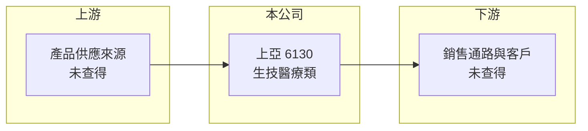

# 6130 上亞科技

> 上櫃｜[[產業索引-生技醫療業|生技醫療業]]｜上市（櫃）日期 2002/03/26

# 第一章：企業模式與商業藍圖

> [!info] 撰寫說明
> 本文由 Claude 依公開資料整理，架構比照 [[2330台積電]] 的四章研究，資料截至 2026-10-08。財務數字來源：Goodinfo 年度經營績效表、櫃買中心開放資料（基本資料、2026 年第二季財報、每月營收、本益比殖利率）；公司沿革取自 nStock 公司資料頁。公開資料有限，目前主要產品、銷售通路與市場皆未查得，本文以財務與沿革為主。#待校對

上亞科技是一家歷經多次轉型與更名的小型上櫃公司，目前被歸類在生技醫療業，但公開資料對其現行產品著墨很少。本章依可查得的沿革與財務資料，說明上亞科技（股票代號：6130，以下簡稱上亞）的商業模式輪廓。

## 一、核心定位：多次轉型的小型公司

上亞成立於 1994 年，2002 年在櫃買中心掛牌，總部位於台北市內湖區，董事長為蔡文杰，總經理為蔡中和，實收資本額約 4.93 億元。依 nStock 整理的公司沿革：

* **電子 IC 起家：** 公司原始營業項目為無線通訊、衛星定位（GPS）與可攜式產品 IC 的研發與銷售，屬於電子零組件領域。
* **轉向生醫：** 2010 年更名為「基因國際生醫」，新增中西藥批發、醫療器材與美容瘦身等業務；2017 年更名為「星寶國際」；2023 年 7 月再更名為「上亞科技」。頻繁更名代表公司的主要業務多次調整，現行產品組合未查得。
* **營收規模小：** 2025 年營收約 1.55 億元，2026 年上半年約 0.89 億元，屬於營收規模很小的公司。

## 二、資本轉化邏輯：營收規模不足以支撐費用

* **毛利有、但費用更高：** 2023 至 2025 年[[毛利率]]約 30% 至 35%，但營業費用超過毛利，營業利益率從 2023 年的負 3.4% 擴大到 2025 年的負 48.4%。
* **財務槓桿低：** 2026 年第二季底總資產約 7.4 億元，負債約 1.5 億元，權益約 5.9 億元，負債比率約 20%。

## 三、長期方向

公開資料未揭露上亞的中長期策略。對長期投資人而言，首先要釐清的是公司目前的主力產品、客戶與通路，以及多次轉型後是否已找到能持續獲利的事業。2026 年 1 至 8 月累計營收年增約 21%，但本業仍在虧損。

# 第二章：護城河深度與競爭優勢

護城河是企業抵禦競爭、長期維持超額利潤的機制。以上亞目前可查得的資料，尚無法辨識明確的護城河。

## 一、上亞的競爭條件

* **1. 尚未形成規模：** 年營收約 1.5 億至 2.3 億元，難以取得採購、品牌或通路上的規模優勢。
* **2. 業務穩定度低：** 公司在 2010 年、2017 年與 2023 年三度更名，主要業務多次調整，客戶與產品尚未形成長期累積。
* **3. 財務負擔輕：** 負債比率約 20%，短期內沒有沉重的償債壓力，這是公司仍有時間調整業務的條件。

## 二、比較對象

| 比較對象 | 定位 | 說明 |
|---|---|---|
| [[4126太醫]] | 醫療器材與耗材 | 同屬生技醫療類小型公司 |
| [[4127天良]] | 保健品電視購物 | 消費型生技產品銷售 |

由於上亞的實際產品未查得，以上僅為同產業類別的參考，不代表直接競爭關係。

## 三、優勢轉化：守得住與守不住的地方

* **守得住：** 毛利率維持在 30% 以上，代表產品本身仍有一定加價空間。
* **守不住：** 2023 至 2025 年連續營業虧損，且虧損幅度擴大，本業尚未證明能持續獲利。
* **觀察重點：** 公司揭露的主要產品與通路、營收成長能否轉為營業利益，以及是否再有業務轉型或增資。

# 第三章：財務體質與盈利規模

資料日期：2026-10-08，表格是撰寫當時的快照；最新月營收、毛利率、累計 EPS 由自動排程寫在本筆記的屬性欄位（月營收、毛利率、累計EPS 等）。#待校對

財務報表是檢驗護城河是否真實存在的最終標準。本章用五年的三率、ROE 與資本報酬，檢視上亞的財務狀況。

## 一、多年度財務表現

| 年度 | 營收（新台幣） | [[毛利率]] | [[營業利益率]] | EPS（元） | [[ROE]] |
|---|---|---|---|---|---|
| 2021 | 1.04 億 | 51.7% | 1.63% | 1.06 | 7.33% |
| 2022 | 0.85 億 | 47.9% | -28.0% | 0.03 | 0.21% |
| 2023 | 2.31 億 | 33.0% | -3.35% | -1.81 | -14.2% |
| 2024 | 1.95 億 | 35.4% | -18.1% | -0.75 | -4.30% |
| 2025 | 1.55 億 | 30.0% | -48.4% | -1.72 | -13.2% |

資料來源：Goodinfo 年度經營績效（合併報表）。2026 年上半年（櫃買中心資料）營收約 0.89 億元、毛利率約 38.9%、營業利益率約負 9.6%、EPS 負 0.03 元。

* **獲利依賴業外：** 2021 與 2022 年 EPS 為正，主要靠業外收益（各約 0.3 億元），本業幾乎沒有獲利；2023 年業外損失約 1.0 億元，使虧損擴大。
* **長期指標：** 2021 至 2025 年平均 ROE 約負 4.8%（推算）。營收在 0.85 億至 2.31 億元之間大幅波動，年複合成長率不具參考意義。依櫃買中心資料，目前未配發現金股利。官方基本資料的實收資本額約 4.93 億元，高於第二季財報的股本約 4.63 億元，推估第二季後有增資（待校對）。

## 二、[[ROIC]] 與 [[WACC]]：價值創造利差

**ROIC 推算：** 2025 年營業虧損約 0.75 億元，虧損年度不計稅盾。官方資料揭露負債總計約 1.5 億元，假設一半為有息負債約 0.7 億元（推估），加上權益約 5.9 億元，投入資本約 6.6 億元，ROIC 約負 11.3%（推算）。

**WACC 推算：** 台灣 10 年期公債殖利率取 1.75%、市場風險溢酬 6%、β 取小型股常見值 1.1（未查得公司實際 β），股東權益成本約 8.35%。負債成本假設 3.0%，稅後約 2.4%，權益約占投入資本 89%，WACC 約 7.7%（推算）。

**結論：** ROIC 為負，低於 WACC 約 19 個百分點，代表目前的業務仍在消耗股東資本。上亞要創造價值，必須先讓本業轉虧為盈。

# 第四章：總體風險與地緣政治

任何企業都無法脫離宏觀環境獨立存在。本章分析上亞長期必須面對的經營與財務風險。

## 一、經營風險

* **業務方向不明確：** 多次更名與轉型，代表公司尚未找到穩定的核心事業；投資人難以從公開資料判斷其長期競爭力。
* **規模不足：** 營收規模小，營業費用的固定成本占比高，營收稍有下滑就會擴大虧損。

## 二、財務風險

* **連續虧損：** 2023 至 2025 年連續三年虧損，每股淨值從 2022 年約 17.4 元降到 2025 年約 12.3 元，持續侵蝕股東權益。
* **增資稀釋：** 若虧損延續，公司可能需要[[現金增資]]補充營運資金，稀釋既有股東。

## 三、其他風險

* **資訊揭露有限：** 公開資料缺乏產品、客戶與策略說明，投資判斷的不確定性高；建議以公開資訊觀測站的年報與重大訊息為準。

# 專有名詞解析

## 金融

- **[[現金增資]]**：公司發行新股向股東或投資人募集現金，可充實資本，但會稀釋既有股東持股。
- **[[ROIC]]**：投入資本報酬率，稅後營業利益除以股東權益加有息負債，衡量本業運用資本的效率。
- **[[WACC]]**：加權平均資金成本，股東與債權人要求報酬率的加權平均，是 ROIC 要超越的門檻。

# 核心供應鏈

## 1. 上游
- 產品與原料供應來源未查得

## 2. 中游：上亞與同產業類別公司
- 生技醫療類小型公司：[[4126太醫]]、[[4127天良]]（產業類別參考，非直接競爭）

## 3. 下游
- 銷售通路與客戶未查得

## 最新新聞
<!-- news:start（自動產生，請勿手動編輯此範圍） -->
- 2026-10-08 🏛️ 重訊 15:13｜公告本公司董事會通過預計處分有價證券。｜[觀測站](https://mops.twse.com.tw/mops/#/web/t05st01)

完整紀錄：[[6130上亞科技 新聞]]
<!-- news:end -->

## 相關連結
- [公開資訊觀測站](https://mopsov.twse.com.tw/mops/web/t05st03?step=1&firstin=1&co_id=6130)
- [Goodinfo](https://goodinfo.tw/tw/StockDetail.asp?STOCK_ID=6130)
- [Yahoo 股市](https://tw.stock.yahoo.com/quote/6130)
- [鉅亨網新聞](https://www.cnyes.com/twstock/6130/news)
