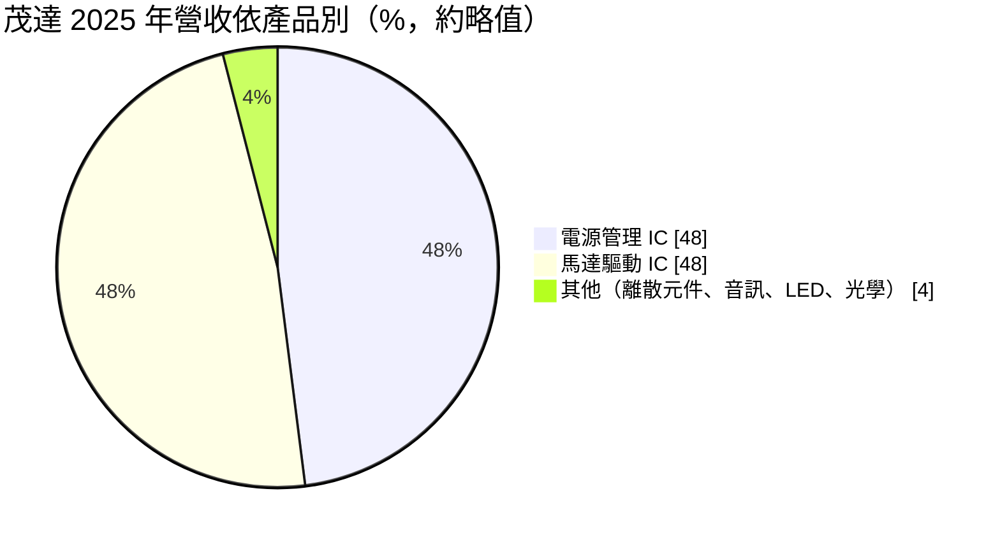
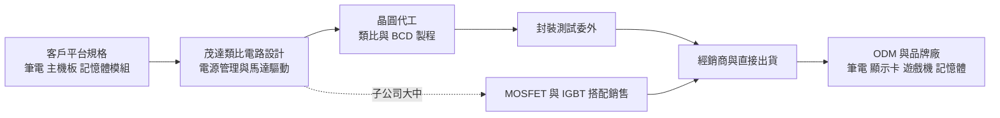
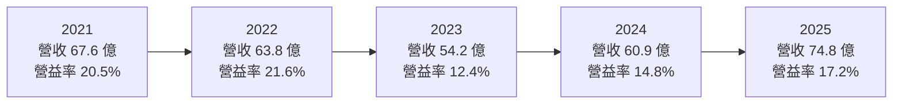
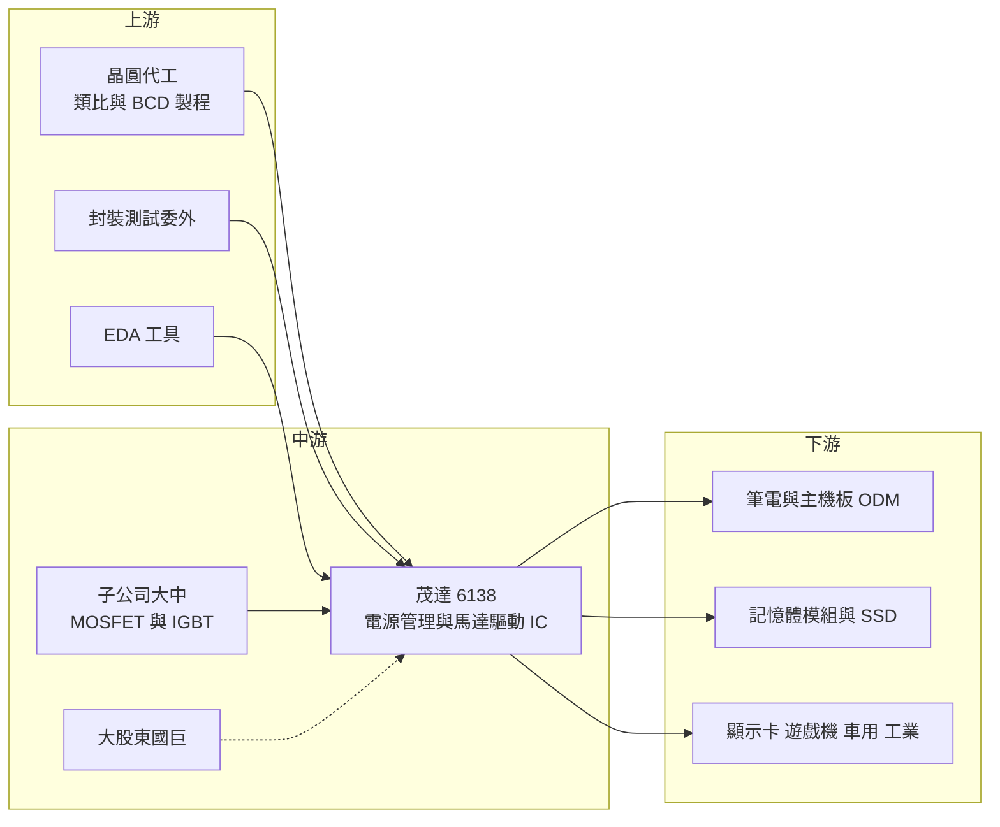

# 6138 茂達

> 上櫃｜[[產業索引-半導體業|半導體業]]｜上市（櫃）日期 2002/01/18

# 第一章：企業模式與商業藍圖

> [!info] 撰寫說明
> 本文由 Claude 依公開資料整理，架構比照 [[2330台積電]] 的四章研究，資料截至 2026-10-08。財務數字來源：Goodinfo 經營績效與股利政策頁、富果研究 2025 年 11 月法說會整理、優分析轉載之櫃買業績發表會報導、中央社 2025 年 9 月國巨公開收購報導、櫃買中心 OpenAPI 2026 年第二季資產負債資料；產業描述為整理性內容，尚未逐條比對原始文件。#待校對

在評估單一個股的長期投資價值時，首要步驟是拆解企業的底層獲利邏輯。本章針對茂達電子（股票代號：6138，以下簡稱茂達）的商業模式進行定性分析，說明一家以筆電電源與散熱風扇驅動晶片起家的類比 IC 設計公司，如何在高度分散的電源管理市場中維持三成以上的毛利率，以及它正把產品延伸到哪些新市場。

## 一、核心定位：PC 生態系裡的類比電源與馬達驅動專家

茂達成立於 1997 年，是一家沒有自有晶圓廠的 [[Fabless]] 類比 IC 設計公司。它的產品分成兩大支柱：第一是電源管理 IC（Power），負責把電池或變壓器的電壓轉換成主機板、CPU、記憶體、面板所需的各種穩定電壓；第二是馬達驅動 IC（Motor），主要用來控制筆電、桌機與顯示卡上的散熱風扇轉速。依富果整理的 2025 年 11 月法說會內容，這兩大產品線各占營收約 48%，其餘是子公司提供的離散功率元件、音訊、LED 驅動與光學晶片。

理解茂達，要先理解類比 IC 和數位 IC 的差別。數位晶片（如 CPU、手機處理器）的競爭靠先進製程與龐大研發團隊，贏家通吃；類比電源晶片則是品項極多、單價低、客製化程度高的市場。一台筆電上可能用到十幾顆不同規格的電源 IC，每一顆都要配合主機板設計反覆調校。這種市場不容易出現單一壟斷者，卻很適合長期深耕特定客戶群、熟悉 PC 平台規格的公司。茂達的定位就是 PC 與周邊供應鏈裡「最懂台灣 ODM 設計流程」的類比晶片供應商之一。

股權結構在 2025 年出現重要變化。依中央社 2025 年 9 月報導，被動元件龍頭 [[2327國巨]] 以每股 229.8 元公開收購茂達股權，最高目標為 28.5%，應賣股數已超過最低門檻約 5%。這是一次未經茂達經營層事先同意的收購，茂達當時曾公開表示遺憾。國巨高層其後表示屬財務性投資、不介入經營，並可能協助茂達接觸一線客戶高層爭取客製化晶片機會；國巨最終取得的持股比例本文未查得。這個事件的長期意義在於，茂達從一家股權分散的獨立 IC 設計公司，變成被動元件集團的重要轉投資，未來在資本配置與產品整合上可能出現新的選項。

## 二、終端應用／產品板塊：電源與風扇各占半壁江山

依富果整理的 2025 年 11 月法說會資料，茂達營收結構如下（2025 年，概略值）：

* **電源管理 IC：** 這是茂達最早的本業，主要用於筆電與主機板的核心電源、記憶體電源、面板電源與交換式電源。2025 年前三季電源產品線中，筆電約占 11%、主機板約 11%、LCD、交換式電源與記憶體各約 6%。近年最受關注的是 [[DDR5]] 記憶體模組上的 [[PMIC]]：DDR5 規格把電源管理晶片從主機板移到記憶體模組上，每一條模組都需要一顆，等於創造了一個新的出貨單位。依優分析轉載的報導，DDR5 PMIC 在 2025 年約占茂達營收 8%，新一代 DDR5 方案預計 2026 年底到 2027 年初量產。
* **馬達驅動 IC：** 茂達長期是筆電散熱風扇驅動晶片的主要供應商。這塊業務的成長來自一個結構性趨勢：筆電處理器與顯示晶片功耗提高，越來越多機種從單風扇改成雙風扇甚至三、四風扇。依法說會資料，2025 年雙風扇以上機種占比約 30% 至 35%，每多一顆風扇就多一顆驅動 IC，風扇 IC 營收比重因此從約 42% 至 45% 提升到 48%。公司也把無刷直流馬達（[[BLDC]]）驅動延伸到車用、工業與伺服器散熱。
* **其他：** 子公司 [[6435大中]] 提供 [[MOSFET]]、[[IGBT]] 等離散功率元件，可以和茂達的控制 IC 搭配成完整的電源方案，降低客戶的採購與設計工作。

## 三、資本轉化邏輯（營運模式）：輕資產設計、重客戶關係

茂達的營運模式有三個重點，決定了它的獲利特性：

* **輕資產、高毛利：** 茂達不擁有晶圓廠，晶圓製造與封裝測試都委外，公司主要的投入是工程師與光罩。這讓它能維持 35% 上下的毛利率，同時資本支出很低，大部分營業利益可以轉成現金。類比電源 IC 多使用 [[BCD]] 等成熟製程，不需要追逐最先進節點，晶圓成本相對穩定。
* **設計導入（[[Design-in]]）的黏著度：** 一顆電源或風扇驅動 IC 要先在客戶的參考設計或主機板上通過驗證，才會進入量產。一旦被設計進某個平台，通常會跟著這個平台出貨兩到三年。法說會資料提到一線 PC 客戶多有長約，這是茂達營收比單純消費性 IC 穩定的原因。
* **美元計價與匯率曝險：** 茂達的銷售與成本大多以美元計價，新台幣快速升值時，以台幣計算的毛利率會被壓縮。2025 年就曾因新台幣短期大幅升值使毛利率受壓，說明匯率是這類出口型 IC 設計公司長期必須承受的外部變數。

## 四、企業長期藍圖：從 PC 走向記憶體、伺服器、車用與客製化晶片

茂達的長期策略可以濃縮成一句話：把在 PC 平台累積的類比電源與馬達控制能力，複製到成長更快、驗證門檻更高的市場。

* **記憶體與儲存：** 除了 DDR5 PMIC，依優分析報導，茂達與美國品牌大廠合作 SSD 相關的 [[ASIC]] 專案，採 12 吋製程並已小量生產。記憶體與儲存是 AI 伺服器擴張的直接受惠者，茂達若能在模組端站穩，就能分到資料中心成長的一部分。
* **伺服器與網通：** 公司已有第一代伺服器產品，新一代預計 2026 年底小量試產；也與美國客戶共同開發 Wi-Fi 7 與 Wi-Fi 8 相關 IC。伺服器電源規格嚴格，打入後的單價與黏著度都高於 PC。
* **車用與工業：** 2025 年第三季起車用與工控產品開始小量出貨。這些市場驗證期長，但一旦導入，生命週期往往長達 5 至 10 年，可降低茂達對 PC 景氣的依賴。
* **客製化晶片：** 法說會提到研發資源約八成投入客製化與 ASIC，和系統單晶片廠與終端品牌早期合作。這代表茂達正從「賣標準品」轉向「替大客戶量身設計」，若成功，客戶轉換成本會更高。

# 第二章：護城河深度與競爭優勢

在長期價值投資中，「護城河」指企業抵禦競爭、維持超額利潤的保護機制。本章分析茂達的護城河構成、國內外主要競爭對手，以及這些優勢在類比 IC 這個高度分散又容易陷入價格戰的市場中能守住多少。

## 一、護城河的核心組成要素

茂達的護城河屬於「窄護城河」，不是靠專利壟斷，而是靠長期累積的客戶關係與應用知識。可以拆成四個要素：

* **1. PC 平台的設計導入關係：** 筆電與主機板的電源設計必須配合英特爾、AMD 等處理器平台每一代的規格更新，ODM 工程師習慣找熟悉的供應商一起調校。茂達二十多年來一直在這個生態系裡，熟悉台灣 ODM 的開發節奏，這種「一起把板子調好」的關係很難被新進者快速取代。
* **2. 風扇驅動的應用知識：** 散熱風扇驅動看似簡單，但要兼顧靜音、轉速精準、低功耗與可靠度，需要大量實際機種的經驗。筆電走向多風扇設計，讓既有的主要供應商最先受惠，因為品牌廠傾向沿用已驗證過的方案。
* **3. 產品組合的廣度：** 電源管理加上馬達驅動，再加上子公司的功率元件，茂達可以對同一個客戶提供多顆晶片。對 ODM 而言，供應商數量越少，管理成本越低，這提高了茂達在客戶採購清單上的位置。
* **4. 輕資產帶來的財務彈性：** 不需要自建工廠，景氣下行時固定成本壓力相對低，能持續投入研發與高配息，這在長期競爭中是一種耐力優勢。

## 二、全球主要競爭對手格局

| 對手 | 定位 | 對茂達的威脅 |
|---|---|---|
| 德州儀器（TI）、亞德諾（ADI）、英飛凌 | 全球類比與電源 IC 龍頭，產品線最完整，自有晶圓廠 | 在伺服器、車用等高階市場具規模與品牌優勢 |
| 芯源系統（MPS） | 高效能電源模組與多相電源，切入 AI 伺服器與 GPU 電源 | 在高階核心電源與伺服器市場直接競爭 |
| [[6719力智]]、[[6415矽力-KY]]、[[3588通嘉]] | 台灣與兩岸電源管理 IC 設計公司 | 在 PC 與消費性電源晶片報價上競爭 |
| 中國類比 IC 設計公司 | 政策扶植、以價格切入消費與 PC 市場 | 壓低標準品報價，侵蝕中低階市占 |
| 日系馬達驅動 IC 廠商（如羅姆） | 馬達控制與功率元件經驗豐富 | 在車用與工業馬達驅動形成競爭 |

## 三、優勢轉化：哪些市場守得住、哪些守不住

* **守得住：** 筆電散熱風扇驅動與 PC 平台電源，是茂達最有把握的領域。這些市場重視交期、應用支援與長期合作，客戶不會為了些微價差冒險換掉已驗證的方案；多風扇趨勢又讓這塊市場的總量持續擴大。
* **守不住：** 一般用途、規格標準化的電源晶片，最容易受到中國同業的低價競爭。這類產品沒有太多客製化空間，價格往往是唯一的比較基準，茂達若過度依賴，毛利率會被逐步侵蝕。
* **觀察重點：** 第一，DDR5 新一代 PMIC 能否如期量產並在記憶體模組廠取得穩定份額；第二，伺服器、車用與工業產品能否在 3 至 5 年內成為有意義的營收來源，降低對 PC 景氣的依賴；第三，國巨入股後雙方是否在被動元件與電源晶片上出現實質的產品或通路整合。這三點決定茂達能否從 PC 供應鏈公司升級為多元市場的類比 IC 公司。

# 第三章：財務體質與盈利規模

資料日期：2026-10-08。數字取自 Goodinfo 年度經營績效與股利政策頁、櫃買中心 OpenAPI 2026 年第二季資產負債資料，表格是撰寫當時的快照；最新月營收、毛利率、累計 EPS 由自動排程寫在本筆記的屬性欄位（月營收、毛利率、累計EPS 等）。#待校對

財務報表是檢驗護城河是否真實存在的最終標準。本章用五年的三率、[[ROE]]、股利與資本報酬，檢視茂達在 PC 景氣循環中的獲利品質。

## 一、獲利能力的基石：三率

| 年度 | 營收（新台幣） | [[毛利率]] | [[營業利益率]] | EPS（元） | [[ROE]] |
|---|---|---|---|---|---|
| 2021 | 67.6 億 | 37.5% | 20.5% | 12.9 | 36.6% |
| 2022 | 63.8 億 | 41.1% | 21.6% | 13.3 | 31.6% |
| 2023 | 54.2 億 | 32.3% | 12.4% | 7.00 | 14.5% |
| 2024 | 60.9 億 | 35.5% | 14.8% | 9.89 | 19.7% |
| 2025 | 74.8 億 | 36.0% | 17.2% | 13.04 | 24.2% |

五年數字呈現典型的 PC 景氣循環。2021 至 2022 年疫情帶動筆電需求與晶片缺貨漲價，毛利率一度升到 41.1%；2023 年 PC 庫存調整，營收降到 54.2 億元，毛利率回落到 32.3%，營業利益率砍半到 12.4%。值得注意的是，即使在 2023 年的谷底，茂達仍維持兩位數的營業利益率與 7 元的 EPS，顯示它的獲利底部相當扎實。2024 至 2025 年隨多風扇筆電與 DDR5 PMIC 放量，營收創下 74.8 億元的新高。

把時間拉長，依 Goodinfo 數字，茂達營收從 2016 年的 37.4 億元成長到 2025 年的 74.8 億元，九年約翻倍，年複合成長率約 8.0%（推算）；同期毛利率從約 30% 提升到 36%，營業利益率從 9.4% 提升到 17.2%。這說明茂達的成長不只是跟著 PC 景氣起伏，產品組合也確實往高附加價值移動。

## 二、[[ROE]]：資本效率

2021 至 2025 年的平均 ROE 約 25.3%（推算），谷底年份 2023 年仍有 14.5%。以一家幾乎不靠財務槓桿的 IC 設計公司而言，這是相當高的資本效率。高 ROE 的來源是高營業利益率加上輕資產：公司不需要把大量資金鎖在廠房設備上，賺到的錢多數以現金股利發回股東，使股東權益不會無限膨脹，ROE 因此維持在高檔。

需要注意的是，依櫃買中心 2026 年第二季資料，茂達合併權益總計約 47.7 億元，其中歸屬母公司業主約 37.6 億元，兩者差距來自子公司大中等非控制權益。分析時應以歸屬母公司的獲利與權益計算 ROE，Goodinfo 的 ROE 即以此為基礎。

## 三、資本支出與自由現金流

[[Fabless]] 模式下，茂達的資本支出主要是研發設備、光罩與辦公空間，金額遠小於營業現金流（具體金額未查得）。因此在正常年度，[[自由現金流]]應長期為正（推估）。

股利是觀察茂達資本配置最直接的指標。依 Goodinfo，2021 至 2025 年度現金股利分別為 9.02、9、5.97、8.601、10.95 元，對照同年 EPS，配息率約為 70%、68%、85%、87%、84%（推算）。茂達的股利政策有兩個特色：一是每年都配發現金、從未中斷，二是配息率近年提高到八成以上。這代表經營層把大部分盈餘還給股東，只保留少部分支應研發與營運資金，屬於典型成熟期 IC 設計公司的資本配置方式。

## 四、[[ROIC]] 與 [[WACC]]：價值創造利差

**ROIC 推算：** 2025 年營業利益約 12.9 億元（74.8 億 × 17.2%），以 20% 稅率計算，稅後營業利益約 10.3 億元。投入資本以 2026 年第二季的合併權益總計約 47.7 億元計算；茂達的負債約 27.8 億元，多為應付帳款等營運性負債，有息負債金額未查得，這裡假設不重大。ROIC 約 21.6%（推算）。以同樣方法看 2023 年谷底，營業利益約 6.7 億元（54.2 億 × 12.4%），稅後約 5.4 億元，若投入資本以約 40 億元估計，ROIC 仍約 13%（推算）。

**WACC 推算：** 股東權益成本用 CAPM 估計，假設台灣 10 年期公債殖利率 1.75%、市場風險溢酬 6%、β 取 IC 設計同業常見值 1.1，權益成本約 8.35%。由於有息負債不重大，WACC 約 8.4%（推算）。

**結論：** 茂達的 ROIC 即使在景氣谷底也高於 WACC，在景氣正常或偏強的年份更高出兩倍以上，代表它長期在創造經濟價值。這和第二章描述的護城河一致：客戶黏著度與應用知識讓茂達能在週期底部維持合理獲利。未來要觀察的是，若國巨入股後茂達進行較大的併購或投資，投入資本擴大是否會稀釋這個利差。

# 第四章：總體風險與地緣政治

任何企業都無法脫離宏觀環境獨立存在。本章分析茂達未來必須面對的地緣政治、產業週期、營運與技術風險。

## 一、地緣政治

* **供應鏈集中於台灣與亞洲：** 茂達的晶圓代工、封裝測試與主要客戶（台灣 ODM）都集中在台灣與中國。兩岸關係若出現重大變化，生產與出貨都可能中斷。這是所有台灣 IC 設計公司共同的系統性風險，無法靠單一公司化解。
* **美國關稅與「非中國製造」要求：** 美國對中國製電子產品課徵關稅，促使筆電組裝往東南亞與其他地區分散。茂達本身不直接受關稅衝擊，但客戶若遷廠，供應鏈與交貨流程需要跟著調整，短期可能影響出貨節奏。
* **中國本土化替代：** 中國推動晶片自主，鼓勵當地品牌與 ODM 優先採用本土類比 IC。茂達在中國市場的標準品可能逐步被替代。

## 二、產業週期與市場結構

* **PC 景氣循環：** 茂達仍有相當比重來自筆電、主機板與顯示卡，PC 需求的週期大約三到四年一輪。2023 年的營收下滑就是例子，未來同樣的循環仍會發生。
* **[[長鞭效應]]與庫存調整：** 終端需求小幅轉弱時，ODM、經銷商與 IC 供應商會依序砍庫存，訂單減少的幅度往往大於終端銷售的降幅。電源與風扇 IC 單價低、品項多，經銷商庫存變化對茂達營收影響明顯。
* **記憶體週期：** DDR5 PMIC 的出貨取決於 DRAM 模組的生產節奏。法說會提到 DRAM 漲價時，模組廠拉貨反而轉保守，說明這條新產品線會把記憶體的價格週期帶進茂達的營收。

## 三、營運環境的隱性風險

* **股權結構變化：** 國巨在 2025 年以非合意方式公開收購茂達股權，雖然表態不介入經營，但大股東結構改變可能影響未來董事會組成、經營團隊穩定與資本配置方向。這類治理變化通常不會立即反映在財報上，卻會在長期決策中顯現。
* **匯率：** 營收與成本多以美元計價，新台幣升值會壓縮帳面毛利率與產生匯兌損失。
* **人才競爭：** 類比 IC 設計工程師培養期長，台灣大型 IC 設計公司與外商都在爭取同一批人才，薪資成本會持續上升。

## 四、科技或法規演進

* **電源架構的世代轉換：** AI 伺服器與高效能筆電的電源需求快速提高，48V 供電、多相電源、整合式電源模組等新架構陸續出現。若茂達跟不上新規格，可能在高階市場被國際大廠拉開差距。
* **製程與整合趨勢：** 處理器廠有時會把部分電源功能整合進晶片或模組，減少外部電源 IC 的需求。這種「被整合」的風險在類比 IC 產業長期存在。
* **車規與功能安全認證：** 車用市場需要通過[[車規驗證]]，包括 AEC-Q100 與 ISO 26262 等認證，投入時間長、成本高。若車用產品放量不如預期，前期投入的研發費用會壓低獲利。

# 專有名詞解析

## 半導體

- **[[Fabless]]**：只做晶片設計、把製造委外給晶圓代工廠的商業模式，茂達、聯發科都屬於此類。
- **[[PMIC]]**：電源管理積體電路，把一種電壓轉換成多種穩定電壓供給處理器、記憶體等元件使用。
- **[[BCD]]**：Bipolar-CMOS-DMOS 製程，把類比、數位與高功率元件整合在同一晶片，主要用於電源管理 IC。
- **[[ASIC]]**：特定應用積體電路，為單一客戶或單一用途量身設計的晶片，客戶轉換成本高。
- **[[BLDC]]**：無刷直流馬達，用電子電路取代碳刷換向，壽命長、效率高，散熱風扇與家電大量採用，需要專用驅動 IC。
- **[[MOSFET]]**：金屬氧化物半導體場效電晶體，最常見的功率開關元件，電源轉換電路中負責快速開關電流。
- **[[IGBT]]**：絕緣閘雙極電晶體，適合高電壓、大電流的功率開關元件，常用於工業馬達與電動車。

## 應用

- **[[DDR5]]**：第五代雙倍資料率記憶體規格，把電源管理晶片移到記憶體模組上，讓每條模組都需要一顆 PMIC。
- **[[車規驗證]]**：車用晶片須通過 AEC-Q100 等可靠度測試與車廠認證，流程常需 2 至 3 年，因此轉換成本高。

## 金融

- **[[ROE]]**：股東權益報酬率，稅後淨利除以股東權益，衡量公司用股東的錢賺錢的效率。
- **[[ROIC]]**：投入資本報酬率，稅後營業利益除以股東權益加有息負債，衡量本業運用全部資本的效率。
- **[[WACC]]**：加權平均資金成本，股東與債權人要求報酬率的加權平均，ROIC 高於它才算創造價值。
- **[[自由現金流]]**：營業活動現金流減去資本支出，代表企業可自由用於配息、還債或併購的現金。
- **[[長鞭效應]]**：終端需求的小幅變動，沿供應鏈往上游傳遞時被逐級放大，造成上游庫存與訂單劇烈波動。

## 產業

- **[[Design-in]]**：晶片在客戶產品開發初期就被選入設計並通過驗證，之後會隨該產品量產出貨數年。

# 核心供應鏈

## 1. 上游：晶圓代工、封測與設計工具
- 茂達的晶圓代工與封測夥伴未在本次查得的公開資料中具名；類比電源 IC 常見的代工來源為 [[2303聯電]]、[[5347世界先進]]、[[6770力積電]] 等成熟製程廠（推估，待校對）。
- 晶片設計工具：[[SNPS新思科技]]、[[CDNS益華電腦]]

## 2. 中游：茂達本身與集團關係
- 子公司離散功率元件：[[6435大中]]
- 2025 年公開收購入股的大股東：[[2327國巨]]
- 同業競爭：[[6719力智]]、[[6415矽力-KY]]、[[3588通嘉]]

## 3. 下游：主要應用客戶
- 筆電與主機板 ODM：[[2382廣達]]、[[2324仁寶]]、[[3231緯創]]、[[4938和碩]]（屬典型客戶群，個別客戶未經公司證實）
- 筆電與主機板品牌：[[2357華碩]]、[[2353宏碁]]、[[2376技嘉]]、[[2377微星]]（屬典型客戶群，個別客戶未經公司證實）
- 記憶體模組：[[3260威剛]]、[[2451創見]]（屬典型客戶群，個別客戶未經公司證實）

## 最新新聞
<!-- news:start -->
<!-- news:end -->

## 相關連結
- [公開資訊觀測站](https://mopsov.twse.com.tw/mops/web/t05st03?step=1&firstin=1&co_id=6138)
- [Goodinfo](https://goodinfo.tw/tw/StockDetail.asp?STOCK_ID=6138)
- [Yahoo 股市](https://tw.stock.yahoo.com/quote/6138)
- [鉅亨網新聞](https://www.cnyes.com/twstock/6138/news)
