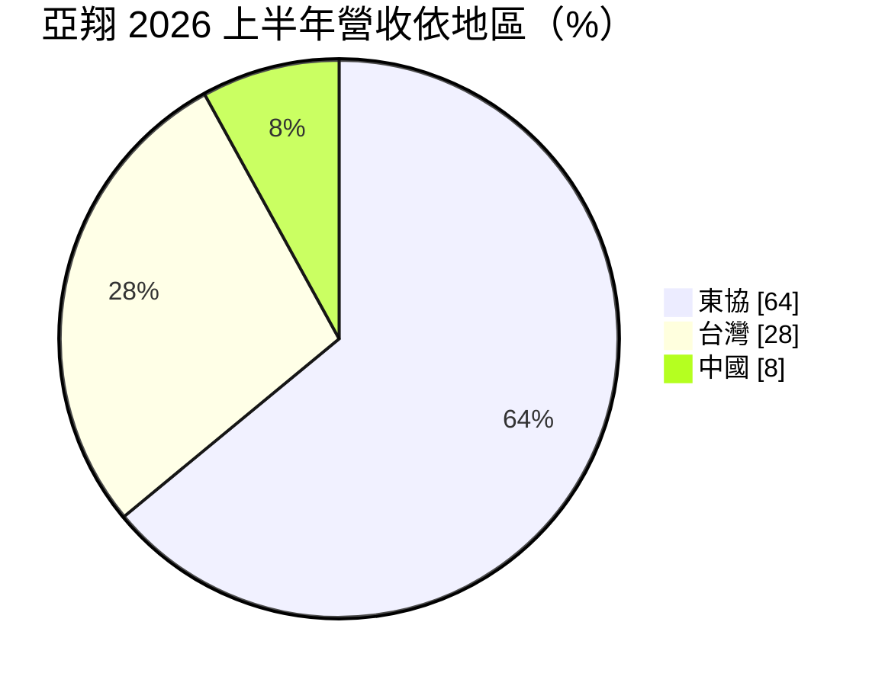
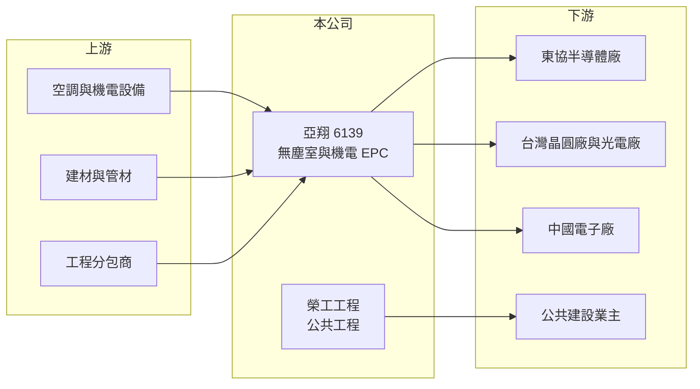

# 6139 亞翔

> 上市｜[[產業索引-其他電子業|其他電子業]]｜上市（櫃）日期 2003/08/25

# 第一章：企業模式與商業藍圖

> [!info] 撰寫說明
> 精簡版，由 Claude 依公開資料整理，架構比照 [[2330台積電]]，資料截至 2026-10-07。來源：富果研究亞翔 2026 年 7 月法說會整理、winvest 營收快訊。#待校對

亞翔是以半導體[[無塵室]]與機電 [[EPC]] 為主的工程集團，2026 年東協半導體擴產讓營收與獲利大幅躍升。

- **核心業務：** 集團分四塊：亞翔工程（半導體、光電、生技的無塵室與機電統包）、榮工工程（捷運、鐵路、機場等公共工程）、亞翔集成（中國與東協 EPC）、成都翔生（土地整理與城鎮開發）。
- **營收結構：** 2026 年上半年依地區為東協 64%、台灣 28%、中國 8%；依產業半導體占 82%。
- **營運據點：** 台灣、中國蘇州與成都，以及新加坡、馬來西亞等東協市場（東協據點明細推估）。
- **長期方向：** 公司表示受半導體客戶 AI 擴產帶動，未來三年營運「一年比一年好」。

# 第二章：護城河深度與競爭優勢

亞翔的競爭力來自大型半導體廠的統包實績與跨國執行能力。

- **競爭優勢：** 截至 2026 年 6 月底[[在手訂單]]約 4,400 億元，其中東協 76%、半導體 81%，大型專案實績形成接單門檻。
- **主要對手：** [[5536聖暉]]、[[2404漢唐]]、[[6196帆宣]]，以及國際工程公司。
- **觀察重點：** 上半年新簽約 3,037 億元，觀察在手訂單轉為營收的速度與海外專案毛利率能否維持。

# 第三章：財務體質與盈利規模

資料日期：2026-10-07，以下數字是撰寫當時的快照；最新月營收、毛利率、累計 EPS 由自動排程寫在本筆記的屬性欄位（月營收、毛利率、累計EPS 等）。#待校對

亞翔 2026 年進入營收與毛利率同步擴張的階段。

- **營收規模：** 2026 年第一季營收 203.46 億元，年增 68%；7 月單月營收 109.29 億元，年增 62.28%。
- **獲利：** 2026 年第一季[[毛利率]] 18.7%、稅後淨利 29.84 億元（年增 183%）、EPS 9.45 元。
- **財務特色：** 在手訂單約為 2026 年第一季營收的二十倍以上，營收能見度高；管理層預期毛利率可維持第一季水準。

# 第四章：總體風險與地緣政治

亞翔的風險在於訂單集中與大型海外工程的執行。

- **產業週期：** 半導體占在手訂單八成以上，客戶若放緩擴產，新簽約會明顯減少。
- **營運風險：** 東協大型專案金額高，若遇到缺工、材料漲價或工期延誤，可能侵蝕毛利。
- **其他風險：** 海外工程面臨匯率與當地法規風險；中國業務受當地景氣與政策影響。

# 專有名詞解析

## 金融

- **[[在手訂單]]**：已簽約但尚未認列為營收的工程金額，代表未來數年的營收能見度。
- **[[毛利率]]**：毛利除以營收，反映產品或服務扣除直接成本後的獲利空間。

## 產業

- **[[無塵室]]**：控制空氣中微粒、溫濕度與壓力的密閉空間，半導體製程必須在高等級無塵室中進行。
- **[[EPC]]**：設計（Engineering）、採購（Procurement）、施工（Construction）一次承包的工程模式。

# 核心供應鏈

- 上游：空調、機電設備與建材供應商，工程分包商（推估）
- 下游／客戶：東協與台灣的半導體廠、光電與生技廠，公共建設業主
- 同業：[[5536聖暉]]、[[2404漢唐]]、[[6196帆宣]]

## 供應鏈關係
- 供應給 [[2330台積電]]：高科技廠機電空調工程（台積電供應鏈 › 上游：台灣建廠、無塵室與廠務系統）

## 最新新聞
<!-- news:start（自動產生，請勿手動編輯此範圍） -->
- 2026-10-07 📰 媒體 07:50｜亞翔(6139) 個股概覽 ／ 個股 - 股市｜[CMoney](https://news.google.com/rss/articles/CBMiU0FVX3lxTE1FUXZjc0N2UC1IV2xPUGFaTFJ6LUV6WmpDWEJ0WUMtZHpqamVGTGpIZTFyQTR1YWFPcm1RbVJIT3V3bS1BTGhFcExRRTRweUNSZV9J?oc=5)
- 2026-10-06 📰 媒體 17:00｜美光點名台廠「隨軍出海」 帆宣進 Boise、亞翔中鼎赴新加坡｜[經濟日報](https://news.google.com/rss/articles/CBMiWkFVX3lxTFBwbWg2bURhTjhwZ09JZjFwMUEtbkNPakNUSVNfdzJGVUxkaWRJVUF1clI0OE92WVBpSWJBYi0xUVpjdGR4Vl9MRlF4cWlUYVBtX0dDZktVTWRKd9IBX0FVX3lxTE9QRkROWTlwNWxRLVBLekN3djUydG1ZNDlfVzRHZXk2dU9rNVZmamVkOGNvbjcyZUUxelRzZTBOSkNXdERvdl9JTzZMNkhVaGtWTk9NNS1IeFNhQmZRdWV3?oc=5)
- 2026-10-05 📰 媒體 10:23｜建廠需求燒 亞翔、漢唐訂單滿手 ［工商時報］｜[富聯網](https://news.google.com/rss/articles/CBMihgFBVV95cUxPT3B1bFBvM0FLVFlIdmJ5bUZ1Uk9iQ1lXU1Ata2N6WmRJcnBTWWtLend6ZW5lRnZkT1NzaXR2QTM0cmNQM1N6QlQ3eFJzY1FMMHVtRkhVWEpidG01eVNBTTZFbG9BQ2hUYzZpWVhNVHZxc0oxRWFvV3NrcnVMMllnUFVRSVQyUQ?oc=5)
- 2026-10-05 📰 媒體 09:05｜半導體建廠潮一路燒到2029！這「無塵室大廠」狂抱6300億大單 亞翔Q2獲利暴增478％｜[FTNN](https://news.google.com/rss/articles/CBMiS0FVX3lxTFAyQzRPRy1veDFsdTM5RWd0NFN5MWtZNUQySEEwNnJyaVJCallIdGdSWXVnaVhJU0FCOTJUUDFFd0dpM0N3SWpoRU5kQQ?oc=5)
- 2026-10-05 📰 媒體 03:00｜建廠需求燒亞翔、漢唐訂單滿手- 日報｜[工商時報](https://news.google.com/rss/articles/CBMiX0FVX3lxTE9mQUlWLWdCS2RUZkxqeTQ2S3NnQVhiZEMxVDJPSk5WaWFVVmRKX0had1V3N2huZUs3ZDBubkZJT3htcnEtTDhOdExpdWtXYmxVUUM1RlRTbU5fRmtEa2Z3?oc=5)

完整紀錄：[[6139亞翔 新聞]]
<!-- news:end -->

## 相關連結
- [公開資訊觀測站](https://mopsov.twse.com.tw/mops/web/t05st03?step=1&firstin=1&co_id=6139)
- [Goodinfo](https://goodinfo.tw/tw/StockDetail.asp?STOCK_ID=6139)
- [Yahoo 股市](https://tw.stock.yahoo.com/quote/6139)
- [鉅亨網新聞](https://www.cnyes.com/twstock/6139/news)
