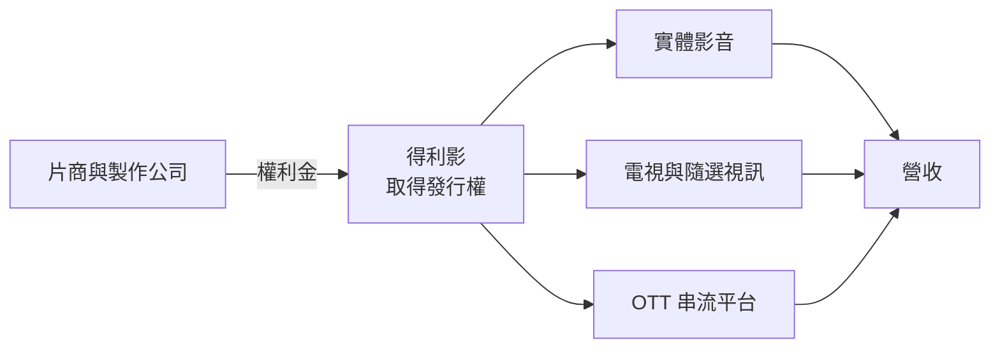
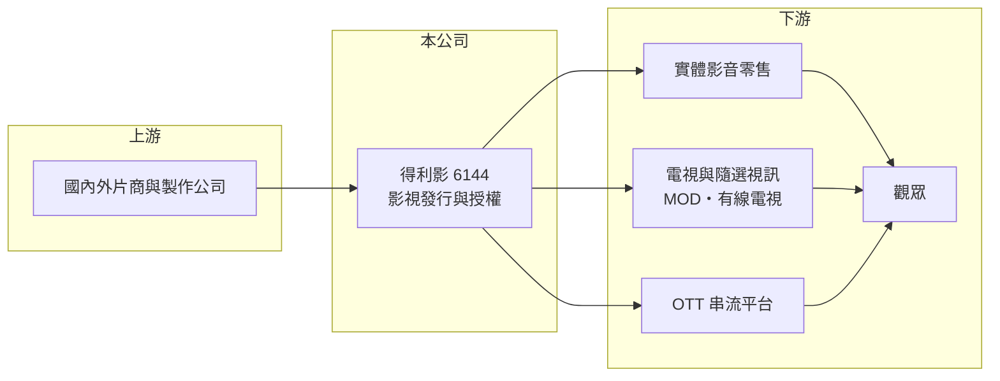

# 6144 得利影

> 上櫃｜[[產業索引-文化創意業|文化創意業]]｜上市（櫃）日期 2002/01/23

# 第一章：企業模式與商業藍圖

> [!info] 撰寫說明
> 精簡版，由 Claude 依公開資料整理，架構比照 [[2330台積電]] 的四章研究，資料截至 2026-10-08。來源：Goodinfo 年度經營績效頁、nStock 公司頁、櫃買中心開放資料（2026 年第二季綜合損益與資產負債、基本資料、每月營收、本益比殖利率）。公開資料有限，本次未查得公司的業務說明、代理片商與營收結構，業務描述依公司名稱與產業常識整理，均屬推估，需對照年報校對。#待校對

得利影視（股票代號：6144，以下簡稱得利影）是一家規模很小的影視發行公司。本章說明影視發行商的商業模式，以及實體影音市場萎縮後，這類公司面臨的結構性挑戰。

## 一、核心定位：影視作品的發行與授權

依櫃買中心資料，得利影成立於 1995 年，2002 年 1 月上櫃，董事長為吳昭弘，實收資本額約 3.83 億元，產業分類為文化創意業。得利影的業務推估以電影等影視作品的發行為主：向片商或製作公司取得作品在台灣的發行權，再透過實體影音商品（DVD、藍光）、電視頻道、隨選視訊與串流平台等通路銷售或授權（推估，業務細節未查得）。

[[影視發行]]商的經濟邏輯類似「版權中間商」：先支付權利金取得作品版權，再把同一部作品切成不同的播映窗口（實體、電視、隨選、串流）分別授權，回收的總金額高於權利金就是利潤。

## 二、收入來源（推估）

公司未在本次查得的資料中揭露營收比重（未查得）。依影視發行產業的一般結構，收入可能包括：

* **實體影音商品：** DVD 與藍光光碟的銷售。這個市場在串流普及後大幅萎縮。
* **版權授權：** 把作品授權給電視台、隨選視訊與 [[OTT]] 串流平台，收取授權金。
* **其他發行收入：** 例如院線或活動相關收入（推估）。

依 Goodinfo 資料，得利影的[[毛利率]]長期在 32% 至 43% 之間，營收從 2019 年約 3.17 億元降到 2025 年約 1.73 億元，與實體影音市場萎縮的趨勢一致。

## 三、資本轉化邏輯

依櫃買中心資料，2026 年第二季底總資產約 3.67 億元，其中流動資產約 2.54 億元，負債只有約 0.53 億元，權益約 3.14 億元，保留盈餘約 -0.74 億元，代表過去多年的累積虧損已侵蝕部分資本。公司幾乎沒有負債，財務上不會有立即的償債壓力，但本業持續虧損。

## 四、企業長期藍圖

影視發行商在串流時代的生存方向，多半是轉向版權授權給串流平台，或投入自製內容與 IP 經營。得利影近年營收持續縮小，本業連續多年營業虧損，公開資料中未查得公司明確的轉型計畫。長期而言，公司能否找到新的收入來源取代萎縮中的實體影音市場，是最主要的課題。

# 第二章：護城河深度與競爭優勢

在長期價值投資中，「護城河」指企業抵禦競爭、維持超額利潤的保護機制。本章評估影視發行商在串流時代的競爭位置。

## 一、得利影的競爭條件

* **1. 片商關係與片庫（推估）：** 長年經營的發行商通常累積一定的片庫與片商合作關係，片庫中的作品可以重複授權給不同通路。
* **2. 通路經驗：** 熟悉台灣的實體零售、電視與隨選視訊通路，可以協助海外片商在台灣發行。
* **3. 財務保守：** 幾乎沒有負債，使公司能在虧損期間維持營運。

整體而言，在串流平台直接向全球片商購買版權、甚至自製內容的趨勢下，傳統發行商的中間角色被大幅削弱，看不到明確的護城河。

## 二、主要競爭對手格局

| 對手 | 定位 | 對得利影的威脅 |
|---|---|---|
| Netflix、Disney+ 等國際串流平台 | 直接向片商取得全球版權或自製內容 | 繞過在地發行商 |
| CATCHPLAY 等在地串流與發行商 | 取得電影版權並自營串流平台 | 在版權取得上競爭 |
| 其他在地電影發行公司 | 院線與家用市場發行 | 爭取片源 |
| [[2412中華電]] MOD、有線電視隨選服務 | 電信與有線電視業者的影音平台 | 屬客戶，也有議價力 |

## 三、優勢轉化：哪些守得住、哪些守不住

* **守得住：** 已有的片庫授權收入與財務穩健度。
* **守不住：** 實體影音市場。依 Goodinfo 資料，營收從 2019 年約 3.17 億元降到 2025 年約 1.73 億元，2021 至 2025 年營業利益率都在 -5% 至 -16% 之間。
* **觀察重點：** 營收能否止跌、營業虧損能否收斂，以及公司是否提出新的事業方向。

# 第三章：財務體質與盈利規模

資料日期：2026-10-08，表格是撰寫當時的快照；最新月營收、毛利率、累計 EPS 由自動排程寫在本筆記的屬性欄位（月營收、毛利率、累計EPS 等）。#待校對

財務報表是檢驗護城河是否真實存在的最終標準。得利影的數字顯示營收長期萎縮、本業連年虧損的狀態。

## 一、多年度經營績效

| 年度 | 營收（新台幣） | [[毛利率]] | [[營業利益率]] | EPS（元） | [[ROE]] |
|---|---|---|---|---|---|
| 2019 | 3.17 億 | 37.5% | -9.15% | -1.03 | -21.2% |
| 2020 | 2.45 億 | 42.7% | -2.52% | 0.06 | 0.63% |
| 2021 | 2.04 億 | 32.3% | -15.2% | -0.78 | -8.07% |
| 2022 | 2.25 億 | 38.7% | -5.55% | -0.19 | -2.07% |
| 2023 | 1.91 億 | 37.7% | -11.2% | -0.48 | -5.33% |
| 2024 | 1.86 億 | 36.0% | -15.2% | -0.57 | -6.75% |
| 2025 | 1.73 億 | 40.3% | -12.1% | -0.36 | -4.48% |
| 2026 上半年 | 0.76 億 | 40.4% | -18.4% | 0.10 | 不適用（半年） |

資料來源：2019 至 2025 年為 Goodinfo 年度經營績效，2026 上半年為櫃買中心開放資料。

* **本業虧損：** 七個完整年度的營業利益率全部為負，代表營收規模已不足以支撐營業費用。
* **2026 年上半年：** 營業虧損約 0.14 億元，但營業外收入約 0.18 億元，稅前小幅獲利，EPS 0.10 元，獲利來自業外而非本業。
* **長期指標：** 2021 至 2025 年平均 ROE 約 -5.3%（推算）；2020 至 2025 年營收年複合成長率約 -6.7%（推算）。

## 二、股利與資產

依櫃買中心本益比殖利率資料，最近一次現金股利為 0 元；Goodinfo 統計歷年平均現金股利約 0.01 元，公司長期不配息。保留盈餘為負，在彌補虧損前也無法配發盈餘。每股參考淨值約 8.21 元（櫃買中心資料）。

## 三、[[ROIC]] 與 [[WACC]]

**ROIC 推算：** 2025 年營業虧損約 0.21 億元（1.73 億元 × -12.1%），2021 至 2025 年平均營業虧損約 0.23 億元；投入資本以權益約 3.14 億元計（有息負債推估極低，以 0 計），ROIC 約 -5% 至 -6%（推算）。

**WACC 推算：** 假設台灣 10 年期公債殖利率 1.75%、市場風險溢酬 6%、β 取文創同業常見值 1.0（假設），權益成本約 7.75%；公司幾乎無借款，WACC 約 7.75%（推算）。

**結論：** 得利影的 ROIC 長期為負，明顯低於 WACC，本業持續消耗股東資本。除非營收結構轉型成功，否則目前的模式無法為股東創造價值。

# 第四章：總體風險與地緣政治

任何企業都無法脫離宏觀環境獨立存在。本章分析得利影長期必須面對的產業結構與營運風險。

## 一、產業結構

* **實體影音消失：** 串流平台普及後，DVD 與藍光光碟市場大幅萎縮，零售通路也隨之減少，這是不可逆的結構變化。
* **串流平台直接取得版權：** 國際串流平台傾向直接向片商購買全球或區域版權，在地發行商的中間角色被壓縮。

## 二、營運風險

* **規模過小：** 年營收不到 2 億元，固定費用占比高，營收再下滑就會擴大虧損。
* **片源取得：** 若主要片商改變發行策略或改與其他公司合作，片源可能中斷（推估）。
* **業外收入依賴：** 近期獲利來自業外收入，不具持續性。

## 三、其他風險

* **盜版與法規：** 盜版與非法串流持續侵蝕正版影音市場，著作權執法的力道影響版權價值。
* **資訊揭露有限：** 公開資料不足以判斷公司的片庫價值與轉型計畫，投資人需仔細閱讀年報。

# 專有名詞解析

## 金融

- **[[ROIC]]**：投入資本報酬率，稅後營業利益除以股東權益與有息負債的合計，衡量本業對所有資金提供者的報酬。
- **[[WACC]]**：加權平均資金成本，依股東權益與負債的比重加權計算的資金成本，ROIC 高於它才代表創造價值。

## 產業

- **[[OTT]]**：透過網際網路直接提供影音或通訊服務的業者，例如串流平台與通訊軟體，會替代傳統電視與語音。
- **[[影視發行]]**：取得電影或影集在特定地區的發行權，再透過院線、實體影音、電視與串流等窗口銷售或授權。

# 核心供應鏈

## 1. 上游
- 國內外片商與製作公司（實際合作對象未查得）

## 2. 本公司
- 得利影：影視作品發行與版權授權（推估）

## 3. 下游
- 實體影音零售通路
- 電視與隨選視訊：[[2412中華電]] MOD、有線電視業者
- OTT 串流平台

## 4. 同業
- CATCHPLAY 等在地發行與串流業者

## 最新新聞
<!-- news:start -->
<!-- news:end -->

## 相關連結
- [公開資訊觀測站](https://mopsov.twse.com.tw/mops/web/t05st03?step=1&firstin=1&co_id=6144)
- [Goodinfo](https://goodinfo.tw/tw/StockDetail.asp?STOCK_ID=6144)
- [Yahoo 股市](https://tw.stock.yahoo.com/quote/6144)
- [鉅亨網新聞](https://www.cnyes.com/twstock/6144/news)
