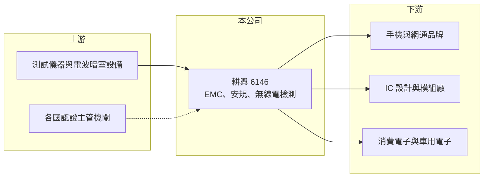

# 6146 耕興

> 上櫃｜[[產業索引-其他電子業|其他電子業]]｜上市（櫃）日期 2002/01/23

# 第一章：企業模式與商業藍圖

> [!info] 撰寫說明
> 精簡版，由 Claude 依公開資料整理，架構比照 [[2330台積電]]，資料截至 2026-10-07。來源：nStock 耕興公司簡介與財務摘要、優分析股利報導。實驗室據點與客戶描述為整理性內容。#待校對

耕興是台灣主要的第三方檢測實驗室，替電子與通訊產品做[[電磁相容]]、安規與無線電認證測試。

- **核心業務：** 提供電子、電器、通訊、無線電產品的電磁相容認證與[[安規驗證]]檢測服務，並銷售防磁零組件。
- **營收結構：** 本次未查到各測試項目的營收比重，推估以手機、網通與消費電子的無線通訊認證為主。
- **營運據點：** 1997 年成立，2002 年上櫃；主要實驗室在台灣，海外據點明細本次未查到。
- **長期方向：** 新一代無線規格（如 [[Wi-Fi 7]]、5G 後續版本）與車用電子、低軌衛星終端都會帶來新的測試需求（推估）。

# 第二章：護城河深度與競爭優勢

耕興的護城河是實驗室認可資格與客戶長期委託關係。

- **競爭優勢：** 各國主管機關與標準組織的實驗室認可需要長時間累積，客戶產品開發時程緊，傾向固定委託熟悉的實驗室。
- **主要對手：** 台灣檢驗科技（SGS）、UL、TÜV、DEKRA 等國際驗證機構，以及國內其他檢測實驗室。
- **觀察重點：** 新手機與網通規格推出的時程，以及客戶研發案量是否持續成長。

# 第三章：財務體質與盈利規模

資料日期：2026-10-07，以下數字是撰寫當時的快照；最新月營收、毛利率、累計 EPS 由自動排程寫在本筆記的屬性欄位（月營收、毛利率、累計EPS 等）。#待校對

耕興屬於高毛利、高配息的服務業財務結構。

- **營收規模：** 2026 年 9 月營收 4.17 億元，年增 10.9%；1 至 9 月累計 36.81 億元，年增 9.66%；2025 年全年 44.95 億元。
- **獲利：** 2026 年第二季 EPS 3.07 元，年增 20.39%；[[毛利率]] 46.63%、[[營業利益率]] 31.35%。2025 年全年 EPS 10.77 元。
- **財務特色：** 2025 年度配發現金股利 12 元，近五年平均現金股利 10.52 元、平均[[殖利率]] 4.89%。

# 第四章：總體風險與地緣政治

耕興的風險在於客戶研發週期與產業集中。

- **產業週期：** 測試需求跟隨新產品開發數量，消費電子與手機景氣轉弱時，品牌送測案量會減少。
- **營運風險：** 實驗室需要持續投資昂貴的測試設備與場地，新規格推出時資本支出增加，折舊會壓低利潤率。
- **其他風險：** 各國認證法規變動、客戶研發轉移到其他國家，以及新台幣升值都會影響營收與毛利。

# 專有名詞解析

## 金融

- **[[殖利率]]**：每年現金股利除以股價，用來衡量配息報酬。

## 產業

- **[[電磁相容]]**：EMC，要求電子產品不干擾其他設備，也不被外界電磁波干擾，是上市前必經的測試項目。
- **[[安規驗證]]**：依各國電氣安全、電磁相容與無線電法規測試產品，取得認證後才能上市銷售。
- **[[Wi-Fi 7]]**：IEEE 802.11be 無線區域網路標準，支援更寬頻道與多頻段同時傳輸，速度高於 Wi-Fi 6。

# 核心供應鏈

- 上游：測試儀器、電波暗室設備供應商，各國認證主管機關與標準組織（推估）
- 下游／客戶：手機與網通品牌、IC 設計與無線模組廠、消費與車用電子廠（推估）
- 同業：台灣檢驗科技（SGS）、UL、TÜV、DEKRA

## 最新新聞
<!-- news:start -->
<!-- news:end -->

## 相關連結
- [公開資訊觀測站](https://mopsov.twse.com.tw/mops/web/t05st03?step=1&firstin=1&co_id=6146)
- [Goodinfo](https://goodinfo.tw/tw/StockDetail.asp?STOCK_ID=6146)
- [Yahoo 股市](https://tw.stock.yahoo.com/quote/6146)
- [鉅亨網新聞](https://www.cnyes.com/twstock/6146/news)
