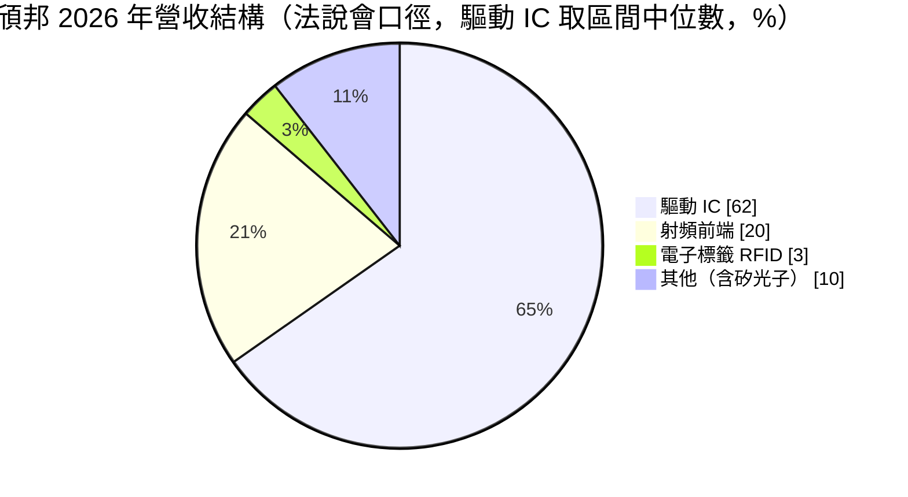
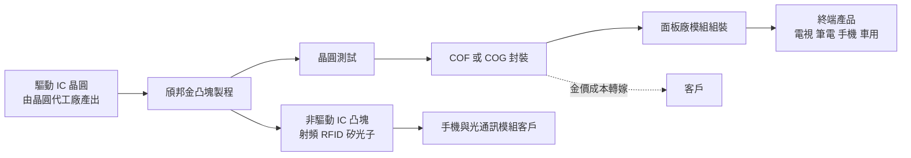
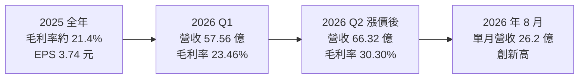
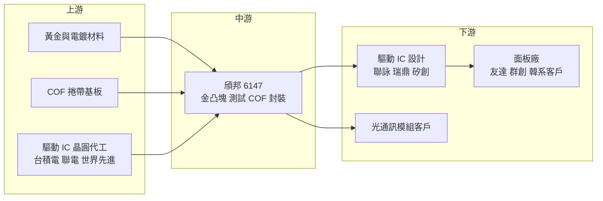

# 6147 頎邦

> 上櫃｜[[產業索引-半導體業|半導體業]]｜上市（櫃）日期 2002/01/31

# 第一章：企業模式與商業藍圖

> [!info] 撰寫說明
> 本文由 Claude 依公開資料整理，架構比照 [[2330台積電]] 的四章研究，資料截至 2026-10-07。財務數字來源：頎邦 2025 年財報公告與 2026 年第二季財報報導（旺得富／中時新聞網）、理財周刊、nstock 公司概況、富果研究 2026 年 3 月法說整理、方格子 2026 年 6 月法說會筆記、工商時報、winvest 營收快訊；產業描述為整理性內容，尚未逐條比對原始文件。#待校對

在評估單一個股的長期投資價值時，首要步驟是拆解企業的底層獲利邏輯。本章針對頎邦科技（股票代號：6147，以下簡稱頎邦）的商業模式進行定性分析，說明它如何從顯示驅動 IC 的封測龍頭，把核心的凸塊技術延伸到射頻與 AI 光通訊領域。

## 一、核心定位：全球顯示驅動 IC 封測的龍頭

頎邦成立於 1997 年 7 月 2 日，總部位於新竹科學園區，主要營業項目為驅動 IC 與非驅動 IC 的封裝及測試服務。頎邦是全球顯示器驅動 IC（[[DDI]]）封測的主要業者之一，核心技術是[[金凸塊]]（Gold Bump）：在驅動 IC 晶圓的接腳上長出金凸塊，再以 [[COF]]（薄膜覆晶）或 COG（玻璃覆晶）方式接合到軟性基板或面板玻璃上。

驅動 IC 負責控制面板每一個畫素的明暗，接腳數量多、間距極細，金凸塊製程的精度與[[良率]]就是進入門檻。頎邦的商業定位有兩個重點：

* **一條龍封測服務：** 從凸塊、晶圓測試到捲帶覆晶封裝都在頎邦完成，驅動 IC 設計公司不必把晶圓在多家廠商之間轉運，可以減少良率損失與交期。
* **凸塊技術的橫向延伸：** 近年把凸塊技術應用到[[射頻前端]]、電子標籤（RFID）與[[矽光子]]等非驅動 IC 領域，降低對面板景氣的依賴。

## 二、終端應用板塊：驅動 IC 為主、非驅動 IC 為成長來源

依方格子整理的 2026 年 6 月法說會內容，驅動 IC 約占營收 60% 至 65%，下圖以區間中位數約 62% 估算：

* **驅動 IC：** 包括大尺寸面板（電視、顯示器、筆電）與中小尺寸（手機、平板、車用）驅動 IC，以及 [[OLED]] 驅動 IC。高階 OLED 驅動 IC 的凸塊間距更細，是頎邦較具議價力的產品。
* **射頻前端：** 約 20%，為手機射頻元件提供凸塊與封裝服務，跟隨手機出貨與射頻規格升級。
* **電子標籤：** 約 3%，用於物流與零售的 RFID 晶片。
* **其他：** 約 10%，包括矽光子等新興應用。富果研究整理指出，矽光子約占 2026 年全年營收 2%，公司預期驅動 IC 營收持平，非驅動 IC 是主要成長動能。

依旺得富報導，2026 年第二季受惠於調漲報價與 OLED 驅動 IC 需求強勁，[[毛利率]]重回 30% 以上，是晶片荒時期之後首見。

## 三、資本轉化邏輯：凸塊加測試加封裝的加工服務

* **加工服務的收費邏輯：** 頎邦向客戶收取凸塊、測試與封裝的加工費，黃金成本依富果研究整理可百分之百轉嫁給客戶，因此金價上漲主要影響營收規模與營運資金，而非直接侵蝕毛利。
* **產能與折舊：** 產能主要在台灣新竹與南部科學園區，2025 年折舊約 33 億元。封測屬資本密集產業，[[產能利用率]]與報價決定毛利率。依方格子整理，公司優先擴充 12 吋產能，把驅動 IC 逐步遷移到 12 吋，釋出 8 吋產能服務矽光子客戶。
* **海外據點：** 富果研究整理指出，2026 至 2027 年總資本支出預計維持在約 55 億元，並投入馬來西亞檳城廠區，作為台灣以外的產能據點。

## 四、企業長期藍圖：從面板驅動 IC 走向 AI 光通訊封裝

* **矽光子與光收發模組：** 依方格子整理，頎邦已取得十家以上新客戶、三十多個開案，五到六款產品（[[TIA]]、PD 光偵測元件）已認證量產，Driver 與 Modulator 預計 2026 年底或 2027 年量產。公司以金凸塊技術解決 200G 傳輸下的訊號衰減問題。
* **漲價與成本轉嫁：** 2026 年第二季全面調漲報價以抵銷通膨成本，是頎邦近年少見的主動漲價。
* **海外布局：** 投資馬來西亞檳城，回應客戶分散供應鏈的需求。
* **測試切割一站式服務：** 公司表示 2027 年起折舊將重新增加，用於建置測試與切割的一站式服務。

# 第二章：護城河深度與競爭優勢

在長期價值投資中，「護城河」指企業抵禦競爭、維持超額利潤的保護機制。本章分析頎邦的護城河構成、國內外主要競爭對手，以及這些優勢在中國產能擴張下能守住多少。

## 一、頎邦護城河的核心組成要素

頎邦的護城河屬於「中等」，由四個要素組成：

* **1. 金凸塊技術與規模：** 驅動 IC 的金凸塊需要極細間距與高均勻度，頎邦長年在這個領域累積規模與良率，是全球少數能大量供應高階 OLED 驅動 IC 凸塊與 COF 的業者。
* **2. 一條龍服務的轉換成本：** 凸塊、晶圓測試到 COF／COG 封裝都在同一家完成，驅動 IC 設計公司一旦導入，更換封測廠需要重新驗證整條流程。
* **3. 客戶關係：** 台灣主要驅動 IC 設計公司與韓國客戶都是長期夥伴。工商時報引述外資看法，韓國客戶委外需求擴大是 2026 年下半年毛利率回升的動能之一。
* **4. 技術延伸能力：** 凸塊技術延伸到射頻前端與矽光子，讓頎邦不完全依賴面板景氣。

## 二、全球主要競爭對手格局

| 對手 | 定位 | 對頎邦的威脅 |
|---|---|---|
| [[8150南茂]] | 台灣第二大驅動 IC 封測，兼營記憶體封測 | 在金凸塊與 COF 直接競爭，客戶可分散下單 |
| 頎中科技、匯成股份 | 中國驅動 IC 封測廠，受本地面板供應鏈支持 | 低價擴產，侵蝕中國本地客戶市占 |
| LB Semicon 等韓國業者 | 服務韓國面板與驅動 IC 客戶 | 與頎邦爭取韓國客戶委外訂單 |
| [[3711日月光投控]]、[[2330台積電]] | 先進封裝與矽光子封裝 | 在矽光子與 [[CPO]] 封裝可能主導高階市場 |

## 三、優勢轉化：哪些市場守得住、哪些守不住

* **守得住：** 高階 OLED 驅動 IC、細間距 COF 與非中國供應鏈需求。2026 年第二季能成功漲價，就是這些產品具議價力的例證。
* **守不住：** 大尺寸面板驅動 IC 屬成熟產品，中國業者的低價產能持續擴充，頎邦在中國本地客戶的市占會被侵蝕。
* **觀察重點：** 漲價效果能否延續到下半年、矽光子產品從認證到放量的速度，以及檳城新廠的投產進度。理財周刊提醒，2026 年 5 月股價大漲後本益比一度超過 62 倍，市場已提前反映矽光子題材，評價對矽光子進度相當敏感。

# 第三章：財務體質與盈利規模

資料日期：2026-10-07。數字取自頎邦財報公告的媒體整理（旺得富、理財周刊、nstock），表格是撰寫當時的快照；最新月營收、毛利率、累計 EPS 由自動排程寫在本筆記的屬性欄位（月營收、毛利率、累計EPS 等）。#待校對

財務報表是檢驗護城河是否真實存在的最終標準。本章用三率、ROE、現金流與資本報酬，檢視頎邦在漲價與產品轉型下的獲利品質。

## 一、獲利能力的基石：三率

| 項目 | 2025 全年 | 2026 Q1 | 2026 Q2 |
|---|---|---|---|
| 營收（新台幣） | 214.54 億 | 57.56 億 | 66.32 億 |
| [[毛利率]] | 約 21.4% | 23.46% | 30.30% |
| [[營業利益率]] | 約 11.2% | 13.69% | 19.27% |
| EPS（元） | 3.74 | 0.59 | 1.28 |

* **毛利率：** 2025 全年毛利率由公告的營業毛利 45.91 億元除以營收換算，約 21.4%。2026 年第二季漲價後跳升到 30.30%，顯示報價對毛利率的槓桿非常大。
* **營業利益率：** 2025 年營業利益 24.00 億元，營業利益率約 11.2%；2026 年第二季升到 19.27%，費用相對固定，營收成長大多轉為利潤。
* **淨利率與業外：** 2025 年稅前淨利 32.56 億元高於營業利益，稅後淨利 27.55 億元，代表有一定比重的業外收益（如轉投資收益）。
* **成長動能：** 2026 年第二季營收季增 15.22%、年增 23.43%，稅後淨利 9.5 億元，年增 131.55%，EPS 1.28 元為七季新高。上半年營收 123.88 億元、年增 17.8%，EPS 1.87 元（2025 年同期 1.46 元）。2026 年 7 月營收 25.23 億元、年增 39.18%（winvest），8 月 26.2 億元創單月新高（nstock）。

## 二、[[ROE]]：資本效率

頎邦屬資本密集型封測業，每年折舊約 30 億元以上，毛利率對稼動率與報價相當敏感。ROE 具體數值本次未查得；推估隨毛利率回升，2026 年 ROE 會較 2025 年改善。頎邦向來以高配息著稱，依 nstock 整理，近五年平均現金股利約 4.36 元，平均殖利率約 6%；2025 年度現金股利約 3.75 元（待以公告確認）。

## 三、資本支出與自由現金流

* **[[CapEx]]：** 2026 至 2027 年總資本支出預計約 55 億元，部分投入馬來西亞檳城。相對於每年約 30 億元的折舊，資本支出規模溫和。
* **[[自由現金流]]：** 營業現金流足以支應資本支出與高配息（推估）。公司表示 2027 年起折舊將因測試切割一站式服務而重新增加，需要靠矽光子與漲價抵銷。

## 四、[[ROIC]] 與 [[WACC]]：價值創造利差

封測業的投入資本主要是廠房與機台。2025 年營業利益率約一成，ROIC 與資金成本之間的利差有限；2026 年第二季營業利益率接近兩成，推估利差明顯擴大（具體數值未查得）。關鍵在於漲價能否持續，以及檳城新廠與一站式服務的新增折舊能否被矽光子等高附加價值產品吸收。

# 第四章：總體風險與地緣政治

任何企業都無法脫離宏觀環境獨立存在。本章分析頎邦未來必須面對的地緣政治、產業週期、營運與技術風險。

## 一、地緣政治風險

* **中國供應鏈替代：** 中國面板廠全球市占高，並推動驅動 IC 與封測國產化，中國客戶的訂單可能逐步轉向中國本土封測廠。
* **台灣集中與海外布局：** 主要產能在台灣，馬來西亞檳城廠可以部分分散地緣政治風險，也符合國際客戶「台灣加一」的要求。
* **美國關稅：** 終端電子產品的關稅政策可能影響面板與手機需求，進而影響驅動 IC 封測訂單。

## 二、產業週期與市場結構風險

* **面板景氣：** 驅動 IC 占營收六成以上，電視、筆電、手機面板的出貨與庫存調整直接影響訂單；面板庫存調整會沿供應鏈放大，形成[[長鞭效應]]。
* **消費性電子需求：** 射頻前端與手機驅動 IC 都連動手機出貨。
* **漲價可持續性：** 方格子整理指出，漲價目前由面板廠吸收、尚未傳導到終端，若終端需求轉弱，面板廠可能要求降價。

## 三、營運環境的隱性風險

* **金價波動：** 金凸塊需要大量黃金，雖然公司表示金價成本可以全數轉嫁，但金價大幅上漲仍可能影響客戶下單意願與營運資金。
* **客戶集中：** 驅動 IC 設計公司數量有限，少數大客戶占比高。
* **新業務執行：** 矽光子仍屬小比重業務，若客戶產品延後量產，投入的研發與產能難以回收。

## 四、科技演進風險

面板技術從 LCD 轉向 OLED、Micro LED，驅動 IC 封裝方式也會跟著改變（例如 COP、更細間距）；若驅動 IC 改採更先進的封裝或整合到其他晶片中，金凸塊需求可能下降。矽光子領域技術路線多元（[[LPO]]、CPO 等），頎邦需要持續跟上客戶的設計變化。

# 專有名詞解析

## 半導體

- **[[DDI]]**：顯示驅動 IC，負責控制面板每個像素的電壓，需要高壓製程，聯詠、奇景為主要設計公司。
- **[[金凸塊]]**：在晶片接腳上電鍍長出的微小金質凸點，用來把晶片直接接合到基板或玻璃上，是驅動 IC 封裝的核心製程。
- **[[COF]]**：薄膜覆晶封裝，把驅動 IC 接合在可彎折的軟性薄膜上，再連接面板，可縮小面板邊框。
- **[[射頻前端]]**：手機中負責收發無線訊號的元件組合，包括功率放大器、濾波器與天線開關。
- **[[矽光子]]**：在矽晶片上製作光學元件，以光取代電傳輸資料，可降低 AI 資料中心的傳輸耗電。
- **[[TIA]]**：轉阻放大器，把光偵測器收到的微弱電流轉成電壓訊號，是光收發模組接收端的關鍵晶片。
- **[[CPO]]**：共同封裝光學，把光引擎與交換器或運算晶片封裝在一起，縮短電訊號路徑以降低功耗。
- **[[LPO]]**：線性驅動可插拔光學，光模組拿掉 DSP 晶片、由主晶片直接驅動，以降低功耗與成本。
- **[[良率]]**：合格產品占總產出的比例，直接決定封測與晶圓廠的成本與獲利。

## 應用

- **[[OLED]]**：有機發光二極體面板，每個像素自行發光，驅動 IC 規格比 LCD 更複雜，接腳更細。

## 金融

- **[[產能利用率]]**：實際投產量占總產能的比例，封測與晶圓廠的毛利率高度取決於此數字。
- **[[自由現金流]]**：營業活動現金流減去資本支出，代表企業可自由用於配息、還債或併購的現金。
- **[[長鞭效應]]**：終端需求的小幅變動，沿供應鏈往上游傳遞時被逐級放大，造成上游庫存與訂單劇烈波動。

# 核心供應鏈

## 1. 上游：材料與晶圓來源
- 黃金與電鍍材料、COF 捲帶基板
- 驅動 IC 晶圓代工：[[2330台積電]]、[[2303聯電]]、[[5347世界先進]]

## 2. 中游：頎邦本身
- 金凸塊、晶圓測試、COF／COG 封裝、射頻凸塊與矽光子封裝

## 3. 下游：驅動 IC 設計與面板客戶
- 驅動 IC 設計：[[3034聯詠]]、[[3592瑞鼎]]、[[8016矽創]]、奇景光電（推估）
- 韓國驅動 IC 與面板客戶
- 面板廠：[[2409友達]]、[[3481群創]]
- 光通訊模組客戶：矽光子 TIA、PD、Driver 元件

## 4. 同業
- [[8150南茂]]、頎中科技、匯成股份

延伸閱讀：[[台積電供應鏈]]

## 最新新聞
<!-- news:start（自動產生，請勿手動編輯此範圍） -->
- 2026-10-08 📰 媒體 17:24｜營收速報 - 頎邦(6147)9月營收24.39億元年增率高達27.95％｜[鉅亨網](https://news.cnyes.com/news/id/6625031)
- 2026-10-07 📰 媒體 12:10｜鉅亨速報 - Factset 最新調查：頎邦(6147-TW)目標價調升至270元，幅度約3.85%｜[鉅亨網](https://news.cnyes.com/news/id/6623548)

完整紀錄：[[6147頎邦 新聞]]
<!-- news:end -->

## 相關連結
- [公開資訊觀測站](https://mopsov.twse.com.tw/mops/web/t05st03?step=1&firstin=1&co_id=6147)
- [Goodinfo](https://goodinfo.tw/tw/StockDetail.asp?STOCK_ID=6147)
- [Yahoo 股市](https://tw.stock.yahoo.com/quote/6147)
- [鉅亨網新聞](https://www.cnyes.com/twstock/6147/news)
