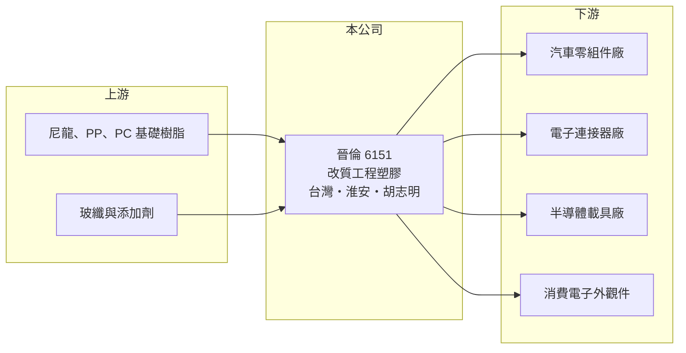

# 6151 晉倫

> 上櫃｜[[產業索引-其他電子業|其他電子業]]｜上市（櫃）日期 2002/02/25

# 第一章：企業模式與商業藍圖

> [!info] 撰寫說明
> 精簡版，由 Claude 依公開資料整理，架構比照 [[2330台積電]]，資料截至 2026-10-07。來源：富果研究晉倫法說會整理（內容含 2022 至 2023 年數據）、winvest 營收快訊。2026 年獲利資料本次未查到。#待校對

晉倫是[[改質塑膠]]廠，把基礎塑膠調配成具特定性能的[[工程塑膠]]，供應汽車、電子與半導體零組件。

- **核心業務：** 專注五大基材：尼龍（PA）、聚丙烯（PP）、聚碳酸酯（PC／PC-ABS）、高性能尼龍（HPPA）與特殊功能性工程塑膠。
- **營收結構：** 本次未查到各基材或應用的營收比重；應用涵蓋汽車零組件、電子連接器、半導體載具與消費電子外觀件。
- **營運據點：** 台灣大園廠年產能 20,000 噸、中國江蘇淮安廠 15,000 噸、越南胡志明廠 5,000 噸。
- **長期方向：** 公司以半導體與新能源車為成長動能，推動[[以塑代鋼]]的輕量化應用，半導體應用在 2023 年下半年開始小量試產。

# 第二章：護城河深度與競爭優勢

晉倫的優勢在配方開發能力與客戶認證，規模則小於大型石化廠。

- **競爭優勢：** 改質塑膠需依客戶零件規格調配配方，車用與半導體載具材料一旦通過認證，客戶不易更換。
- **主要對手：** 國內外改質塑膠與工程塑膠廠，如 [[1717長興]] 等石化相關業者，以及杜邦、巴斯夫等國際化工廠。
- **觀察重點：** 半導體載具材料認證後的放量進度，以及越南廠能否承接客戶的供應鏈移轉需求。

# 第三章：財務體質與盈利規模

資料日期：2026-10-07，以下數字是撰寫當時的快照；最新月營收、毛利率、累計 EPS 由自動排程寫在本筆記的屬性欄位（月營收、毛利率、累計EPS 等）。#待校對

晉倫營收規模不大，2026 年月營收維持雙位數年增。

- **營收規模：** 2026 年 8 月營收 1.56 億元，年增 18.59%；6 月營收 1.65 億元，年增 16.04%。2022 年全年營收 16.6 億元。
- **獲利：** 2022 年全年[[毛利率]] 20.04%、EPS 1.48 元；2023 年前三季毛利率 21.27%、營業淨利率 8.06%。2026 年 EPS 本次未查到。
- **財務特色：** 2022 年度配發現金股利 1.5 元；2023 年前三季銷量 14,637 噸，營收與原料價格連動。

# 第四章：總體風險與地緣政治

晉倫的風險主要在原料價格與下游景氣。

- **產業週期：** 塑膠原料價格跟隨油價與石化供需變動，報價急跌時可能壓縮利差並產生存貨損失。
- **營運風險：** 新應用（半導體、新能源車）的認證期長，放量時程不確定。
- **其他風險：** 中國淮安廠受當地需求與政策影響；越南與中國據點都有匯率風險。

# 專有名詞解析

## 金融

- **[[毛利率]]**：毛利除以營收，反映產品或服務扣除直接成本後的獲利空間。

## 產業

- **[[改質塑膠]]**：在基礎塑膠中加入玻纖、阻燃劑等添加物，調整強度、耐熱或阻燃等性能後再供應下游。
- **[[工程塑膠]]**：耐熱、強度與尺寸穩定性高於一般塑膠的材料，例如尼龍、PC，可用於結構零件。
- **[[以塑代鋼]]**：以工程塑膠取代金屬零件，達到減重、降低成本與簡化加工的目的，常見於汽車輕量化。

# 核心供應鏈

- 上游：尼龍、PP、PC 等基礎樹脂廠，如 [[1303南亞]]、[[1301台塑]]，以及玻纖與添加劑供應商（推估）
- 下游／客戶：汽車零組件、電子連接器、半導體載具與消費電子外觀件廠
- 同業：國內外改質塑膠廠、杜邦、巴斯夫等國際化工廠

## 最新新聞
<!-- news:start -->
<!-- news:end -->

## 相關連結
- [公開資訊觀測站](https://mopsov.twse.com.tw/mops/web/t05st03?step=1&firstin=1&co_id=6151)
- [Goodinfo](https://goodinfo.tw/tw/StockDetail.asp?STOCK_ID=6151)
- [Yahoo 股市](https://tw.stock.yahoo.com/quote/6151)
- [鉅亨網新聞](https://www.cnyes.com/twstock/6151/news)
