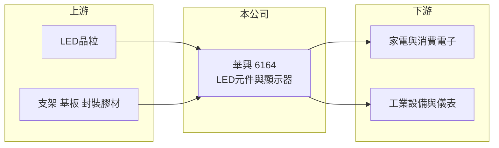

# 6164 華興

> 上市｜[[產業索引-光電業|光電業]]｜上市（櫃）日期 2008/10/21

# 第一章：企業模式與商業藍圖

> [!info] 撰寫說明
> 精簡版，由 Claude 依公開資料整理，架構比照 [[2330台積電]]，資料截至 2026-10-07。來源：nstock 公司資料頁、winvest 營收快訊。公開資料有限，營收比重未查得。#待校對

華興是規模不大的 LED 元件廠，本章說明它賣什麼、怎麼賺錢。

- **核心業務：** 公司登記業務為各型尺寸發光二極體顯示器的研發、製造、加工與買賣，屬於 [[LED封裝]] 與 LED 顯示元件的中游廠商。
- **營收結構：** 本次未查到產品別營收比重；依業務內容推估以 LED 指示燈、數字顯示器與 SMD 元件為主。
- **營運據點：** 公司登記地址在新北市新店區，生產據點分布本次未查證。
- **長期方向：** 一般 LED 元件價格競爭激烈，公司能否往 [[Mini LED]] 或利基型顯示應用移動，是長期觀察方向（推估）。

# 第二章：護城河深度與競爭優勢

華興的規模小，護城河主要來自客製化與長期客戶關係，而不是成本。

- **競爭優勢：** 從業多年的小型 LED 顯示器與元件產品線，能接少量多樣的工業與消費性訂單（推估）。
- **主要對手：** 台灣同業 [[2393億光]]、[[6168宏齊]]、[[6226光鼎]]、[[3031佰鴻]]，以及大量中國 LED 封裝廠。
- **觀察重點：** 2026 年 9 月營收創近五年單月新高，需觀察是一次性訂單還是新產品放量。

# 第三章：財務體質與盈利規模

資料日期：2026-10-07，以下數字是撰寫當時的快照；最新月營收、毛利率、累計 EPS 由自動排程寫在本筆記的屬性欄位（月營收、毛利率、累計EPS 等）。#待校對

華興營收規模約 7 億元，獲利微薄但 2026 年有轉好跡象。

- **營收規模：** 2025 年全年營收 7.32 億元；2026 年 1 至 9 月累計 5.9 億元，年增 2.51%；9 月單月 0.71 億元，年增 47.13%。
- **獲利：** 2026 年第二季 EPS 0.11 元，[[毛利率]] 33.17%，[[營業利益率]] 3.82%，淨利率 4.17%。
- **財務特色：** 毛利率三成以上但營業利益率僅個位數，代表營業費用占比高，營收放大才有明顯的獲利槓桿。

# 第四章：總體風險與地緣政治

華興面對的是成熟且價格競爭激烈的 LED 產業。

- **產業週期：** LED 元件需求跟隨消費電子、家電與工業設備景氣波動，庫存調整時訂單起伏大。
- **營運風險：** 規模小、議價力有限，上游 [[LED晶粒]] 漲價或客戶轉單都會直接影響獲利。
- **其他風險：** 中國廠商低價競爭，以及匯率變動對外銷報價的影響。

# 專有名詞解析

## 半導體

- **[[LED封裝]]**：把 LED 晶粒固定在支架或基板上並封上螢光膠與透鏡，做成可焊接使用的元件。
- **[[LED晶粒]]**：在藍寶石或其他基板上長出發光層後切割而成的發光晶片，是 LED 元件的核心。

## 產業

- **[[Mini LED]]**：晶粒尺寸約 100 至 200 微米的 LED，用在高階背光與小間距顯示屏。

# 核心供應鏈

- 上游：LED 晶粒廠（如 [[3714富采]]）、支架與封裝材料供應商
- 下游／客戶：家電、消費電子、工業設備與儀表廠商（推估）
- 同業：[[2393億光]]、[[6168宏齊]]、[[6226光鼎]]、[[3031佰鴻]]

## 最新新聞
<!-- news:start -->
<!-- news:end -->

## 相關連結
- [公開資訊觀測站](https://mopsov.twse.com.tw/mops/web/t05st03?step=1&firstin=1&co_id=6164)
- [Goodinfo](https://goodinfo.tw/tw/StockDetail.asp?STOCK_ID=6164)
- [Yahoo 股市](https://tw.stock.yahoo.com/quote/6164)
- [鉅亨網新聞](https://www.cnyes.com/twstock/6164/news)
