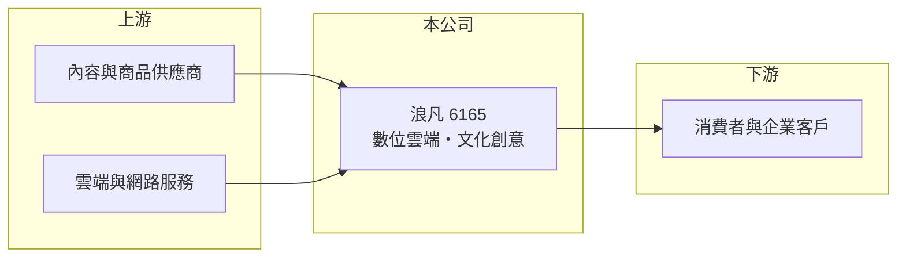

# 6165 浪凡

> 上市｜[[產業索引-數位雲端|數位雲端]]｜上市（櫃）日期 2003/08/04

# 第一章：企業模式與商業藍圖

> [!info] 撰寫說明
> 精簡版，由 Claude 依公開資料整理，架構比照 [[2330台積電]]，資料截至 2026-10-08。來源：證交所開放資料（基本資料、營益分析、資產負債、綜合損益、股利、本益比殖利率）、Goodinfo 年度經營績效、nStock 公司簡介。公開資料有限，具體產品、營收比重、主要客戶與轉型過程未查得，業務描述請優先校對。#待校對

本章說明浪凡（6165）的經營模式。由於公開資料有限，以下以財務結構推論為主。

- **核心業務：** 浪凡網路科技成立於 1973 年，2003 年上市，證交所產業分類為數位雲端。依 nStock 整理的公司登記營業項目，除了精密機械零件的裝配加工與買賣，也包括文化創意業務，推估公司前身是製造業，之後轉型為網路與文創相關服務（轉型年份與內容未查得）。董事長為蔡焜煌、總經理王亦衡。
- **營收結構：** 營收由 2020 年的 8.45 億元跳升到 2021 年的 27.2 億元，之後維持在 27 至 32 億元，推估 2021 年前後業務或合併範圍有重大變動。各產品或服務的營收比重未查得。
- **獲利結構：** [[毛利率]]長期在 24% 至 30%，2025 年營業利益率由前幾年的 0.5% 至 4% 跳升到 11%，2026 年上半年仍有 11.7%。這表示公司在營收規模沒有大幅擴張的情況下，費用控制或產品組合明顯改善。
- **長期方向：** 對這類規模中等、業務轉換過的公司，長期觀察重點在於 2025 年的高利潤率能否延續，以及公司是否揭露更清楚的業務組成，讓投資人判斷獲利來源的穩定度。

# 第二章：護城河深度與競爭優勢

本章分析浪凡的競爭條件。由於業務細節未查得，以下以可觀察的財務特徵為主。

- **競爭優勢：** 2025 年 [[ROE]] 達 20.7%，2026 年上半年稅後純益率 8.3%，顯示目前的業務具有一定獲利能力。不過 2022 至 2024 年 ROE 只有 2% 至 7%，獲利波動很大，代表優勢尚未經過完整景氣循環的考驗。
- **主要對手：** 具體同業未查得，需依實際業務（網路服務、文創或其他）再確認。
- **觀察重點：** 第一是營業利益率能否維持在 10% 以上。第二是高配息能否持續，2025 年度現金股利超過當年淨利，若獲利回落，股利勢必調整。第三是公司對主要業務與客戶的揭露是否更完整。

# 第三章：財務體質與盈利規模

資料日期：2026-10-08，表格是撰寫當時的快照；最新月營收、毛利率、累計 EPS 由自動排程寫在本筆記的屬性欄位（月營收、毛利率、累計EPS 等）。#待校對

本章用多年度數字檢視浪凡的獲利能力與資本效率。

| 年度 | 營收（新台幣） | [[毛利率]] | [[營業利益率]] | EPS（元） | [[ROE]] |
|---|---|---|---|---|---|
| 2021 | 27.2 億 | 26.0% | 4.3% | 2.60 | 21.4% |
| 2022 | 30.1 億 | 28.0% | 3.1% | 0.62 | 4.56% |
| 2023 | 27.1 億 | 24.9% | 0.55% | 0.26 | 1.88% |
| 2024 | 28.5 億 | 23.7% | 1.44% | 1.04 | 6.73% |
| 2025 | 32.2 億 | 29.5% | 11.0% | 4.02 | 20.7% |

- **營收規模：** 2020 至 2025 年營收年複合成長率約 30.7%，但主要來自 2021 年的跳升，2021 年後的內生成長只有每年個位數。依證交所資料，2026 年上半年營收約 17.2 億元、EPS 1.91 元。
- **獲利：** 近五年平均 ROE 約 11.1%，但分布極不平均，2025 年的表現是近年高點。2021 年營業利益率只有 4.3% 卻有 21.4% 的 ROE，推估當年有業外收益。
- **財務特色：** 2026 年第二季歸屬母公司權益約 13.0 億元，每股淨值 17.65 元；流動負債約 12.3 億元、非流動負債約 5.0 億元。實收資本額約 7.8 億元。依證交所股利資料，2025 年度稅後淨利約 3.08 億元，董事會決議每股配發現金股利 5 元、總額約 3.68 億元，高於當年淨利，動用了部分累積盈餘，配息率超過 100%。
- **[[ROIC]] 與 [[WACC]]：** 2025 年營業利益約 3.54 億元（32.2 億 × 11%），稅後約 2.83 億元；投入資本以股東權益 13.0 億元加上以非流動負債 5.0 億元近似的有息負債，約 18.0 億元，ROIC 約 15.7%（推算）。WACC 以 CAPM 推估：無風險利率 1.75%、市場風險溢酬 6%、β 用常見值 1.0，股東權益成本約 7.75%；負債成本 2.5%、稅後約 2.0%；股權權重約 72%，WACC 約 6.1%（推算）。2025 年 ROIC 明顯高於 WACC，但 2022 至 2024 年的 ROIC 推估低於 WACC，長期是否創造價值取決於高利潤率能否延續。

# 第四章：總體風險與地緣政治

本章整理浪凡長期必須面對的風險。

- **產業週期：** 數位服務與文創活動的需求和消費景氣相關，景氣轉弱時企業與消費者都會先削減非必要支出。公司營收在 2022 至 2024 年停滯，顯示需求面並不穩定。
- **營運風險：** 獲利率在短期內大幅變動，代表少數產品或專案可能影響全年表現。公開揭露的業務資訊有限，投資人較難從外部判斷獲利品質，資訊不對稱本身就是風險。
- **其他風險：** 高配息政策若遇到獲利回落，股利可能大幅下修。公司經歷過業務轉換，經營層與大股東的策略方向是長期觀察重點。

# 專有名詞解析

## 金融

- **[[ROIC]]**：投入資本報酬率，稅後營業利益除以投入資本，衡量本業運用資金創造報酬的能力。
- **[[WACC]]**：加權平均資金成本，股東與債權人要求報酬率的加權平均，ROIC 高於 WACC 才代表創造價值。
- **[[殖利率]]**：每股現金股利除以股價，代表以現價買進可得到的現金回報率。

# 核心供應鏈

- 上游：內容、商品與雲端網路服務供應商（實際對象未查得）。
- 下游／客戶：消費者與企業客戶（實際客戶結構未查得）。
- 同業：未查得，需依實際業務確認。

## 最新新聞
<!-- news:start（自動產生，請勿手動編輯此範圍） -->
- 2026-10-08 🏛️ 重訊 14:37｜公告本公司股票上市時所出具之承諾事項暨其後續執行情形｜[觀測站](https://mops.twse.com.tw/mops/#/web/t05st01)

完整紀錄：[[6165浪凡 新聞]]
<!-- news:end -->

## 相關連結
- [公開資訊觀測站](https://mopsov.twse.com.tw/mops/web/t05st03?step=1&firstin=1&co_id=6165)
- [Goodinfo](https://goodinfo.tw/tw/StockDetail.asp?STOCK_ID=6165)
- [Yahoo 股市](https://tw.stock.yahoo.com/quote/6165)
- [鉅亨網新聞](https://www.cnyes.com/twstock/6165/news)
