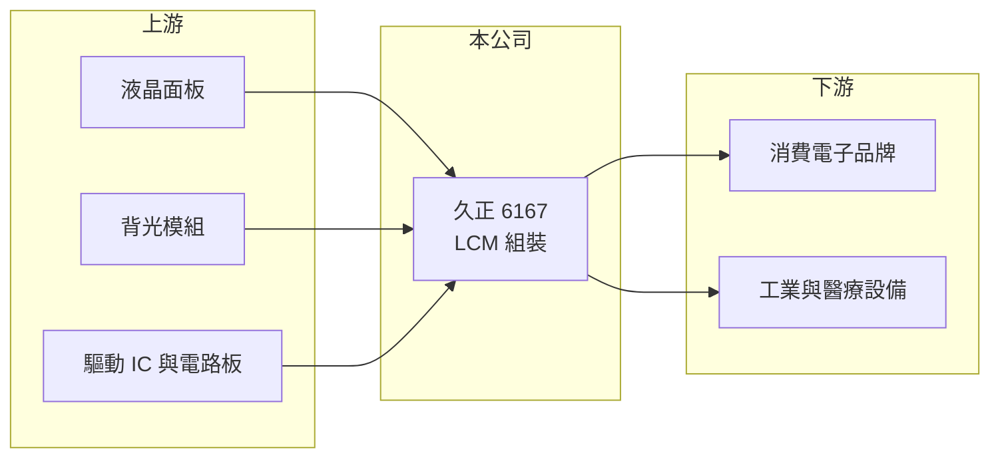

# 6167 久正

> 上櫃｜[[產業索引-光電業|光電業]]｜上市（櫃）日期 2002/03/26

# 第一章：企業模式與商業藍圖

> [!info] 撰寫說明
> 精簡版，由 Claude 依公開資料整理，架構比照 [[2330台積電]]，資料截至 2026-10-07。來源：nstock 公司資料頁、winvest 營收快訊。公開資料有限，營收比重未查得。#待校對

久正是液晶顯示模組的組裝廠，本章說明它在面板供應鏈中的角色。

- **核心業務：** 公司從事各種液晶顯示模組（[[LCM]]）的製造加工與買賣，把面板、[[背光模組]]、驅動電路組成可直接裝進終端產品的顯示器。
- **營收結構：** 本次未查到產品別營收比重；依業務內容推估以中小尺寸、工業與消費性用途為主。
- **營運據點：** 生產據點分布本次未查證。
- **長期方向：** 一般 LCM 毛利低，公司需要往 [[工業顯示器]] 等客製化、少量多樣的應用移動才能改善獲利（推估）。

# 第二章：護城河深度與競爭優勢

LCM 組裝門檻不高，久正的競爭力主要在客製化服務與客戶關係。

- **競爭優勢：** 掛牌 24 年，累積中小尺寸顯示模組的設計與量產經驗（推估）。
- **主要對手：** [[8105凌巨]] 等台灣中小尺寸顯示廠，以及大量中國 LCM 廠。
- **觀察重點：** 毛利率能否從個位數回升，以及營業虧損何時收斂。

# 第三章：財務體質與盈利規模

資料日期：2026-10-07，以下數字是撰寫當時的快照；最新月營收、毛利率、累計 EPS 由自動排程寫在本筆記的屬性欄位（月營收、毛利率、累計EPS 等）。#待校對

久正營收約 12 億元，但 2026 年上半年毛利率極低並呈虧損。

- **營收規模：** 2025 年全年營收 12.12 億元；2026 年 1 至 8 月累計 7.91 億元，年增 0.69%；7、8 月單月營收分別年減 15.69% 與 12.58%。
- **獲利：** 2026 年第二季 EPS -0.1 元，[[毛利率]] 3.62%，[[營業利益率]] -14.14%，[[ROE]] -0.87%。
- **財務特色：** 2025 年度未配發股利，2024 年度現金股利 0.2 元；資本額 14.6 億元，市值與資本額接近。

# 第四章：總體風險與地緣政治

久正的風險集中在面板價格與本業毛利過低。

- **產業週期：** 面板報價與終端需求波動會直接影響 LCM 的成本與訂單。
- **營運風險：** 毛利率僅個位數，費用無法被毛利覆蓋，若營收無法放大，虧損可能延續。
- **其他風險：** 中國同業低價競爭、匯率變動，以及上游面板供應吃緊時的料源取得。

# 專有名詞解析

## 應用

- **[[LCM]]**：液晶顯示模組，把液晶面板、背光、驅動 IC 與電路板組裝在一起的顯示器半成品。

## 產業

- **[[背光模組]]**：液晶面板本身不發光，背光模組以 LED 光源與導光板、光學膜提供均勻光線。
- **[[工業顯示器]]**：用於工控、醫療、車載等場合的顯示器，強調耐用、長期供貨與客製化。

# 核心供應鏈

- 上游：面板廠 [[3481群創]]、[[2409友達]]、[[6116彩晶]]；背光模組廠如 [[6246臺龍]]
- 下游／客戶：消費電子、工業與醫療設備廠商（推估）
- 同業：[[8105凌巨]]、中國 LCM 廠

## 最新新聞
<!-- news:start（自動產生，請勿手動編輯此範圍） -->
- 2026-10-08 🏛️ 重訊 15:01｜公告本公司受邀參加永豐金證券舉辦之線上法人說明會。｜[觀測站](https://mops.twse.com.tw/mops/#/web/t05st01)

完整紀錄：[[6167久正 新聞]]
<!-- news:end -->

## 相關連結
- [公開資訊觀測站](https://mopsov.twse.com.tw/mops/web/t05st03?step=1&firstin=1&co_id=6167)
- [Goodinfo](https://goodinfo.tw/tw/StockDetail.asp?STOCK_ID=6167)
- [Yahoo 股市](https://tw.stock.yahoo.com/quote/6167)
- [鉅亨網新聞](https://www.cnyes.com/twstock/6167/news)
